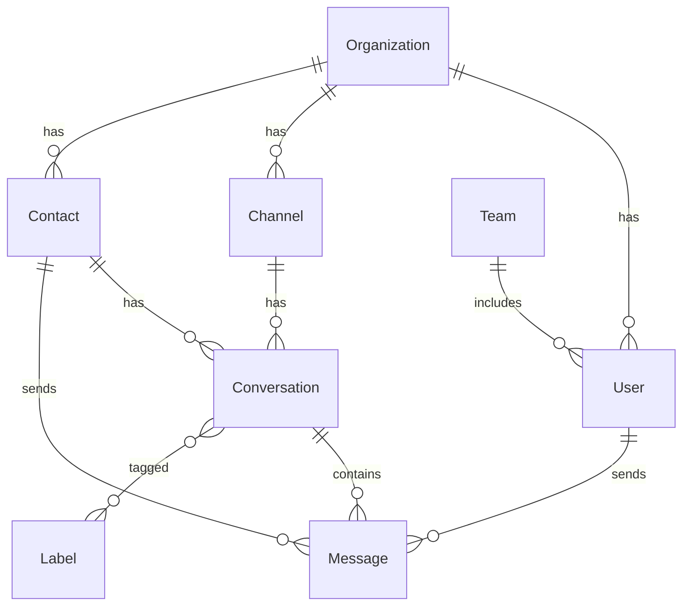

# Chatwoot to Strapi + Next.js Migration Roadmap

## 📋 Executive Summary

This document outlines the comprehensive plan to migrate Chatwoot (Ruby on Rails) to a modern tech stack using **Strapi v5.17+** (Headless CMS) + **Next.js 15.3+** (App Router).

**Total Duration:** 6 weeks  
**Team Size:** 1 business founder 

## 🎯 Migration Goals

1. **Maintain Feature Parity** - All Chatwoot features must be available
2. **Improve Performance** - Leverage modern JS ecosystem benefits
3. **Better Developer Experience** - TypeScript, modern tooling
4. **Scalability** - Microservices-ready architecture
5. **Real-time First** - Enhanced WebSocket implementation

## 🏗️ Architecture Overview

```
┌─────────────────────────────────────────────────────────────┐
│                        Frontend (Next.js)                    │
│  ┌─────────────┐  ┌──────────────┐  ┌─────────────────┐   │
│  │  Dashboard  │  │ Chat Widget  │  │  Public Pages   │   │
│  └─────────────┘  └──────────────┘  └─────────────────┘   │
└─────────────────────────────────────────────────────────────┘
                               │
                               │ REST API + WebSocket
                               │
┌─────────────────────────────────────────────────────────────┐
│                      Backend (Strapi)                        │
│  ┌─────────────┐  ┌──────────────┐  ┌─────────────────┐   │
│  │Content Types│  │  Services    │  │   Plugins       │   │
│  └─────────────┘  └──────────────┘  └─────────────────┘   │
└─────────────────────────────────────────────────────────────┘
                               │
                               │
┌─────────────────────────────────────────────────────────────┐
│                    Infrastructure                            │
│  ┌─────────────┐  ┌──────────────┐  ┌─────────────────┐   │
│  │ PostgreSQL  │  │    Redis     │  │   S3/Storage    │   │
│  └─────────────┘  └──────────────┘  └─────────────────┘   │
└─────────────────────────────────────────────────────────────┘
```

## 📅 Timeline & Phases

### Phase 1: Foundation & Architecture (1 weeks)

#### Week 1: Environment Setup
- [ ] Setup development environment with Docker
- [ ] Initialize Strapi project with TypeScript
- [ ] Initialize Next.js 15 project with App Router
- [ ] Configure monorepo structure (optional)
- [ ] Setup CI/CD pipeline basics

#### Week 2: Architecture Design
- [ ] Design database schema mapping
- [ ] Plan API structure and endpoints
- [ ] Design component architecture
- [ ] Setup authentication strategy
- [ ] Create technical documentation

### Phase 2: Core Data Models & APIs (1 weeks)

#### Week 3-4: Strapi Content Types
- [ ] Create core content types:
  - [ ] Organization (Account)
  - [ ] User (extend Strapi user)
  - [ ] Contact
  - [ ] Conversation
  - [ ] Message
  - [ ] Channel (Inbox)
  - [ ] Team
  - [ ] Label
  - [ ] CustomAttribute
- [ ] Setup relationships between models
- [ ] Configure permissions and roles

#### Week 5: Custom Controllers & Services
- [ ] Implement conversation filtering service
- [ ] Create message builder service
- [ ] Build notification service
- [ ] Implement automation engine basics
- [ ] Create webhook service

### Phase 3: Real-time Infrastructure (1 weeks)

#### Week 6: WebSocket Implementation
- [ ] Setup Socket.io server in Strapi
- [ ] Implement authentication middleware
- [ ] Create room management for conversations
- [ ] Build presence tracking system
- [ ] Implement typing indicators

#### Week 7: Event System
- [ ] Design event architecture
- [ ] Implement event emitters for:
  - [ ] Message created/updated
  - [ ] Conversation status changed
  - [ ] User presence updates
  - [ ] Typing status
- [ ] Create event handlers
- [ ] Build notification dispatcher

### Phase 4: Frontend Implementation (1 weeks)

#### Week 8: Core Layout & Navigation
- [ ] Implement dashboard layout
- [ ] Create sidebar navigation
- [ ] Build header with user menu
- [ ] Setup routing structure
- [ ] Implement authentication flow

#### Week 9: Conversation Management
- [ ] Build conversation list component
- [ ] Implement filtering and search
- [ ] Create conversation item component
- [ ] Add status management
- [ ] Implement bulk actions

#### Week 10: Messaging Interface
- [ ] Create message thread component
- [ ] Build message composer
- [ ] Implement rich text editor
- [ ] Add file upload support
- [ ] Create emoji picker

#### Week 11: Advanced Features
- [ ] Implement canned responses
- [ ] Build automation UI
- [ ] Create team management
- [ ] Add label management
- [ ] Implement keyboard shortcuts

### Phase 5: Feature Parity & Migration (1 weeks)

#### Week 12: Additional Features
- [ ] Multi-channel support
- [ ] Email continuity
- [ ] Contact management
- [ ] Reports and analytics
- [ ] Integrations framework

#### Week 13: Data Migration
- [ ] Create migration scripts
- [ ] Build data transformation layer
- [ ] Implement incremental migration
- [ ] Create rollback procedures
- [ ] Test migration with real data

#### Week 14: Integration & Polish
- [ ] Third-party integrations
- [ ] Performance optimization
- [ ] Security hardening
- [ ] Documentation completion
- [ ] User training materials

### Phase 6: Testing & Deployment (1 weeks)

#### Week 15: Testing
- [ ] Unit tests for all services
- [ ] Integration tests for APIs
- [ ] E2E tests for critical flows
- [ ] Performance testing
- [ ] Security audit

#### Week 16: Deployment
- [ ] Production environment setup
- [ ] Deploy to staging
- [ ] User acceptance testing
- [ ] Production deployment
- [ ] Monitoring setup

## 🛠️ Technical Stack

### Backend (Strapi)
```json
{
  "core": {
    "framework": "Strapi v5",
    "language": "TypeScript",
    "database": "PostgreSQL",
    "cache": "Redis",
    "realtime": "Socket.io"
  },
  "plugins": [
    "users-permissions",
    "email",
    "upload",
    "i18n"
  ],
  "custom-plugins": [
    "conversation-manager",
    "automation-engine",
    "webhook-dispatcher"
  ]
}
```

### Frontend (Next.js)
```json
{
  "core": {
    "framework": "Next.js 15",
    "language": "TypeScript",
    "styling": "Tailwind CSS",
    "components": "shadcn/ui"
  },
  "state": {
    "client": "Zustand",
    "server": "React Query/SWR"
  },
  "libraries": [
    "socket.io-client",
    "react-hook-form",
    "zod",
    "date-fns",
    "react-markdown"
  ]
}
```

## 📊 Database Schema Mapping

### Core Models Migration

| Chatwoot Model | Strapi Content Type | Notes |
|----------------|-------------------|--------|
| accounts | organizations | Extended with features |
| users | users | Extend default Strapi user |
| contacts | contacts | Add avatar support |
| conversations | conversations | Include SLA fields |
| messages | messages | Polymorphic sender |
| inboxes | channels | Multi-channel support |
| teams | teams | With user relations |
| labels | labels | Many-to-many with conversations |

### Key Relationships



## 🔌 API Design

### RESTful Endpoints

```typescript
// Conversation APIs
GET    /api/conversations
GET    /api/conversations/:id
POST   /api/conversations
PUT    /api/conversations/:id
DELETE /api/conversations/:id

// Special endpoints
POST   /api/conversations/filter
POST   /api/conversations/:id/toggle-status
POST   /api/conversations/:id/messages
GET    /api/conversations/:id/messages

// WebSocket events
conversation.created
conversation.updated
conversation.status_changed
message.created
message.updated
typing.start
typing.stop
presence.update
```

## 🚀 Deployment Strategy

### Development
```yaml
# docker-compose.dev.yml
services:
  strapi:
    build: ./backend
    environment:
      NODE_ENV: development
    volumes:
      - ./backend:/app
    ports:
      - "1337:1337"
  
  nextjs:
    build: ./frontend
    environment:
      NODE_ENV: development
    volumes:
      - ./frontend:/app
    ports:
      - "3000:3000"
```

### Production
```yaml
# kubernetes/deployment.yml
apiVersion: apps/v1
kind: Deployment
metadata:
  name: crove-backend
spec:
  replicas: 3
  selector:
    matchLabels:
      app: strapi
  template:
    spec:
      containers:
      - name: strapi
        image: crove/backend:latest
        resources:
          requests:
            memory: "512Mi"
            cpu: "500m"
          limits:
            memory: "1Gi"
            cpu: "1000m"
```

## 📈 Success Metrics

### Performance Targets
- **API Response Time**: < 200ms (p95)
- **WebSocket Latency**: < 100ms
- **First Contentful Paint**: < 1.5s
- **Time to Interactive**: < 3s

### Feature Completion
- [ ] 100% feature parity with Chatwoot
- [ ] All automated tests passing
- [ ] Security audit completed
- [ ] Performance benchmarks met

## 🔄 Migration Checklist

### Pre-Migration
- [ ] Backup existing data
- [ ] Document current integrations
- [ ] List all custom features
- [ ] Identify high-risk areas
- [ ] Create rollback plan

### During Migration
- [ ] Run parallel systems
- [ ] Incremental data sync
- [ ] User acceptance testing
- [ ] Performance monitoring
- [ ] Bug tracking

### Post-Migration
- [ ] Data verification
- [ ] Performance validation
- [ ] User training
- [ ] Documentation update
- [ ] Decommission old system

## 📚 Resources & Documentation

### Internal Documentation
- API Documentation (Swagger/OpenAPI)
- Component Storybook
- Development Guidelines
- Deployment Procedures

### External Resources
- [Strapi Documentation](https://docs.strapi.io)
- [Next.js Documentation](https://nextjs.org/docs)
- [Socket.io Guide](https://socket.io/docs)
- [PostgreSQL Best Practices](https://wiki.postgresql.org/wiki/Main_Page)

## 🎯 Risk Management

### Technical Risks
1. **Data Migration Complexity**
   - Mitigation: Incremental migration with verification
   
2. **Real-time Performance**
   - Mitigation: Load testing and optimization

3. **Feature Gaps**
   - Mitigation: Detailed feature mapping early

### Business Risks
1. **User Adoption**
   - Mitigation: Gradual rollout with training

2. **Downtime**
   - Mitigation: Blue-green deployment

3. **Data Loss**
   - Mitigation: Comprehensive backup strategy

## 🏁 Conclusion

This roadmap provides a structured approach to migrating from Chatwoot to a modern Strapi + Next.js stack. The 14-week timeline is aggressive but achievable with a dedicated team. Success depends on:

1. Clear communication
2. Incremental progress
3. Comprehensive testing
4. User feedback integration
5. Performance monitoring

**Next Steps:**
1. Review and approve roadmap
2. Assemble development team
3. Setup development environment
4. Begin Phase 1 implementation

---

*Document Version: 1.0*  
*Last Updated: January 2025*  
*Author: Crove Development Team* 