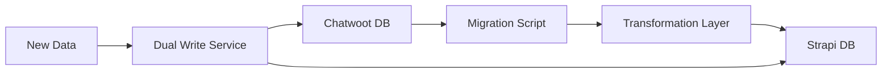

# Data Migration Guide: Chatwoot to Strapi

## Overview

This guide provides detailed instructions for migrating data from Chatwoot (Rails/PostgreSQL) to Strapi.

## Migration Strategy

### Approach: Incremental Migration with Dual Write



## Pre-Migration Checklist

- [ ] Full backup of Chatwoot database
- [ ] Document all custom fields and attributes
- [ ] List all active integrations
- [ ] Analyze data volume and estimate migration time
- [ ] Setup staging environment for testing
- [ ] Create rollback plan

## Data Mapping

### 1. Account/Organization Migration

**Chatwoot `accounts` → Strapi `organizations`**

```sql
-- Chatwoot schema
CREATE TABLE accounts (
  id SERIAL PRIMARY KEY,
  name VARCHAR(255),
  locale VARCHAR(10),
  timezone VARCHAR(50),
  feature_flags JSONB,
  custom_attributes JSONB,
  created_at TIMESTAMP,
  updated_at TIMESTAMP
);
```

```typescript
// Strapi migration script
async function migrateAccounts() {
  const accounts = await chatwootDB.query(`
    SELECT * FROM accounts 
    WHERE active = true
    ORDER BY id
  `);

  for (const account of accounts) {
    await strapiDB.organization.create({
      data: {
        legacyId: account.id,
        name: account.name,
        locale: account.locale || 'en',
        timezone: account.timezone || 'UTC',
        features: account.feature_flags || {},
        customAttributes: account.custom_attributes || {},
        createdAt: account.created_at,
        updatedAt: account.updated_at
      }
    });
  }
}
```

### 2. User Migration

**Chatwoot `users` → Strapi `users`**

```typescript
async function migrateUsers() {
  const users = await chatwootDB.query(`
    SELECT u.*, 
           au.role as account_role,
           au.account_id
    FROM users u
    LEFT JOIN account_users au ON u.id = au.user_id
    WHERE u.type = 'User'
    ORDER BY u.id
  `);

  const userMap = new Map();

  for (const user of users) {
    // Check if user already migrated
    if (userMap.has(user.id)) {
      continue;
    }

    const strapiUser = await strapiDB.user.create({
      data: {
        legacyId: user.id,
        email: user.email,
        username: user.email.split('@')[0],
        password: user.encrypted_password, // Needs conversion
        confirmed: true,
        blocked: false,
        provider: 'local',
        firstName: user.name?.split(' ')[0],
        lastName: user.name?.split(' ').slice(1).join(' '),
        displayName: user.display_name || user.name,
        avatarUrl: user.avatar_url,
        role: mapRole(user.account_role),
        organizationId: user.account_id,
        customAttributes: user.custom_attributes || {},
        createdAt: user.created_at,
        updatedAt: user.updated_at
      }
    });

    userMap.set(user.id, strapiUser.id);
  }

  return userMap;
}

function mapRole(chatwootRole) {
  const roleMap = {
    'administrator': 'super_admin',
    'agent': 'agent',
    'supervisor': 'team_lead'
  };
  return roleMap[chatwootRole] || 'agent';
}
```

### 3. Contact Migration

**Chatwoot `contacts` → Strapi `contacts`**

```typescript
async function migrateContacts(batchSize = 1000) {
  let offset = 0;
  const contactMap = new Map();

  while (true) {
    const contacts = await chatwootDB.query(`
      SELECT c.*,
             ci.source_id,
             ci.inbox_id
      FROM contacts c
      LEFT JOIN contact_inboxes ci ON c.id = ci.contact_id
      ORDER BY c.id
      LIMIT ${batchSize} OFFSET ${offset}
    `);

    if (contacts.length === 0) break;

    for (const contact of contacts) {
      const strapiContact = await strapiDB.contact.create({
        data: {
          legacyId: contact.id,
          name: contact.name,
          email: contact.email,
          phoneNumber: contact.phone_number,
          identifier: contact.identifier,
          avatarUrl: contact.avatar_url,
          customAttributes: contact.custom_attributes || {},
          additionalAttributes: contact.additional_attributes || {},
          lastActivityAt: contact.last_activity_at,
          organizationId: contact.account_id,
          createdAt: contact.created_at,
          updatedAt: contact.updated_at
        }
      });

      contactMap.set(contact.id, strapiContact.id);
    }

    offset += batchSize;
    console.log(`Migrated ${offset} contacts...`);
  }

  return contactMap;
}
```

### 4. Conversation Migration

**Chatwoot `conversations` → Strapi `conversations`**

```typescript
async function migrateConversations(userMap, contactMap) {
  const conversations = await chatwootDB.query(`
    SELECT c.*,
           ci.source_id,
           array_agg(DISTINCT ct.tag_id) as tag_ids
    FROM conversations c
    LEFT JOIN contact_inboxes ci ON c.contact_inbox_id = ci.id
    LEFT JOIN conversation_tags ct ON c.id = ct.conversation_id
    GROUP BY c.id, ci.source_id
    ORDER BY c.created_at DESC
  `);

  const conversationMap = new Map();

  for (const conv of conversations) {
    const strapiConv = await strapiDB.conversation.create({
      data: {
        legacyId: conv.id,
        status: mapStatus(conv.status),
        priority: mapPriority(conv.priority),
        channelId: conv.inbox_id,
        contactId: contactMap.get(conv.contact_id),
        assigneeId: userMap.get(conv.assignee_id),
        teamId: conv.team_id,
        customAttributes: conv.custom_attributes || {},
        additionalAttributes: conv.additional_attributes || {},
        snoozedUntil: conv.snoozed_until,
        lastActivityAt: conv.last_activity_at,
        agentLastSeenAt: conv.agent_last_seen_at,
        contactLastSeenAt: conv.contact_last_seen_at,
        firstReplyCreatedAt: conv.first_reply_created_at,
        organizationId: conv.account_id,
        createdAt: conv.created_at,
        updatedAt: conv.updated_at
      }
    });

    conversationMap.set(conv.id, strapiConv.id);

    // Migrate labels
    if (conv.tag_ids?.length > 0) {
      await migrateConversationLabels(strapiConv.id, conv.tag_ids);
    }
  }

  return conversationMap;
}

function mapStatus(status) {
  const statusMap = {
    0: 'open',
    1: 'resolved', 
    2: 'pending',
    3: 'snoozed',
    4: 'abandoned'
  };
  return statusMap[status] || 'open';
}

function mapPriority(priority) {
  const priorityMap = {
    0: 'low',
    1: 'medium',
    2: 'high',
    3: 'urgent'
  };
  return priorityMap[priority] || 'none';
}
```

### 5. Message Migration

**Chatwoot `messages` → Strapi `messages`**

```typescript
async function migrateMessages(conversationMap, userMap, contactMap) {
  // Process in batches to handle large volumes
  const batchSize = 5000;
  let offset = 0;

  while (true) {
    const messages = await chatwootDB.query(`
      SELECT m.*,
             a.blobs as attachment_blobs
      FROM messages m
      LEFT JOIN LATERAL (
        SELECT json_agg(
          json_build_object(
            'id', a.id,
            'file_type', a.file_type,
            'blob_id', ab.id,
            'key', ab.key,
            'filename', ab.filename,
            'content_type', ab.content_type,
            'byte_size', ab.byte_size
          )
        ) as blobs
        FROM attachments a
        JOIN active_storage_attachments asa ON a.id = asa.record_id
        JOIN active_storage_blobs ab ON asa.blob_id = ab.id
        WHERE a.message_id = m.id
      ) a ON true
      ORDER BY m.created_at
      LIMIT ${batchSize} OFFSET ${offset}
    `);

    if (messages.length === 0) break;

    const messageData = messages.map(msg => ({
      legacyId: msg.id,
      content: msg.content,
      messageType: mapMessageType(msg.message_type),
      contentType: mapContentType(msg.content_type),
      contentAttributes: msg.content_attributes || {},
      private: msg.private,
      status: mapMessageStatus(msg.status),
      conversationId: conversationMap.get(msg.conversation_id),
      senderId: getSenderId(msg, userMap, contactMap),
      senderType: msg.sender_type,
      sourceId: msg.source_id,
      externalSourceIds: msg.external_source_ids || {},
      additionalAttributes: msg.additional_attributes || {},
      processedContent: msg.processed_message_content,
      sentiment: msg.sentiment,
      createdAt: msg.created_at,
      updatedAt: msg.updated_at
    }));

    // Bulk insert messages
    await strapiDB.message.createMany({
      data: messageData
    });

    // Migrate attachments separately
    for (const msg of messages) {
      if (msg.attachment_blobs) {
        await migrateAttachments(msg.id, msg.attachment_blobs);
      }
    }

    offset += batchSize;
    console.log(`Migrated ${offset} messages...`);
  }
}

function mapMessageType(type) {
  const typeMap = {
    0: 'incoming',
    1: 'outgoing',
    2: 'activity',
    3: 'template'
  };
  return typeMap[type] || 'text';
}

function mapContentType(type) {
  const contentMap = {
    0: 'text',
    1: 'input_text',
    2: 'input_textarea',
    3: 'input_email',
    4: 'input_select',
    5: 'cards',
    6: 'form',
    7: 'article',
    8: 'incoming_email',
    9: 'input_csat',
    10: 'integrations',
    11: 'sticker'
  };
  return contentMap[type] || 'text';
}

function getSenderId(message, userMap, contactMap) {
  if (message.sender_type === 'User') {
    return userMap.get(message.sender_id);
  } else if (message.sender_type === 'Contact') {
    return contactMap.get(message.sender_id);
  }
  return null;
}
```

### 6. Attachment Migration

```typescript
async function migrateAttachments(messageId, attachmentBlobs) {
  for (const blob of attachmentBlobs) {
    // Download file from ActiveStorage
    const fileData = await downloadFromActiveStorage(blob.key);
    
    // Upload to Strapi/S3
    const uploadedFile = await strapiUploadService.upload({
      data: fileData,
      filename: blob.filename,
      contentType: blob.content_type,
      size: blob.byte_size
    });

    // Create attachment record
    await strapiDB.attachment.create({
      data: {
        legacyId: blob.id,
        messageId: messageId,
        fileType: blob.file_type,
        fileUrl: uploadedFile.url,
        fileName: blob.filename,
        fileSize: blob.byte_size,
        contentType: blob.content_type
      }
    });
  }
}
```

## Migration Scripts

### Main Migration Runner

```typescript
// scripts/migrate.ts
import { PrismaClient as ChatwootDB } from '@prisma/client';
import { StrapiSDK } from './strapi-sdk';
import { logger } from './logger';

async function runMigration() {
  const chatwootDB = new ChatwootDB();
  const strapiDB = new StrapiSDK();
  
  try {
    logger.info('Starting migration...');
    
    // Phase 1: Core entities
    logger.info('Migrating accounts...');
    await migrateAccounts();
    
    logger.info('Migrating users...');
    const userMap = await migrateUsers();
    
    logger.info('Migrating contacts...');
    const contactMap = await migrateContacts();
    
    // Phase 2: Conversations and messages
    logger.info('Migrating conversations...');
    const conversationMap = await migrateConversations(userMap, contactMap);
    
    logger.info('Migrating messages...');
    await migrateMessages(conversationMap, userMap, contactMap);
    
    // Phase 3: Supporting data
    logger.info('Migrating teams...');
    await migrateTeams();
    
    logger.info('Migrating labels...');
    await migrateLabels();
    
    logger.info('Migrating automations...');
    await migrateAutomations();
    
    logger.info('Migration completed successfully!');
    
  } catch (error) {
    logger.error('Migration failed:', error);
    throw error;
  } finally {
    await chatwootDB.$disconnect();
  }
}

// Run with error handling
runMigration().catch(console.error);
```

### Validation Script

```typescript
// scripts/validate-migration.ts
async function validateMigration() {
  const validations = [
    {
      name: 'User count',
      query: async () => {
        const chatwootCount = await chatwootDB.user.count();
        const strapiCount = await strapiDB.user.count();
        return { chatwoot: chatwootCount, strapi: strapiCount };
      }
    },
    {
      name: 'Contact count',
      query: async () => {
        const chatwootCount = await chatwootDB.contact.count();
        const strapiCount = await strapiDB.contact.count();
        return { chatwoot: chatwootCount, strapi: strapiCount };
      }
    },
    {
      name: 'Conversation count',
      query: async () => {
        const chatwootCount = await chatwootDB.conversation.count();
        const strapiCount = await strapiDB.conversation.count();
        return { chatwoot: chatwootCount, strapi: strapiCount };
      }
    },
    {
      name: 'Message count',
      query: async () => {
        const chatwootCount = await chatwootDB.message.count();
        const strapiCount = await strapiDB.message.count();
        return { chatwoot: chatwootCount, strapi: strapiCount };
      }
    }
  ];

  for (const validation of validations) {
    const result = await validation.query();
    const match = result.chatwoot === result.strapi;
    
    console.log(`${validation.name}: ${match ? '✅' : '❌'}`);
    console.log(`  Chatwoot: ${result.chatwoot}`);
    console.log(`  Strapi: ${result.strapi}`);
    
    if (!match) {
      console.log(`  Difference: ${Math.abs(result.chatwoot - result.strapi)}`);
    }
  }
}
```

## Post-Migration Tasks

### 1. Data Verification

```sql
-- Verify conversation counts by status
SELECT status, COUNT(*) 
FROM conversations 
GROUP BY status;

-- Check for orphaned messages
SELECT COUNT(*) 
FROM messages m
LEFT JOIN conversations c ON m.conversation_id = c.id
WHERE c.id IS NULL;

-- Validate user assignments
SELECT COUNT(DISTINCT assignee_id) 
FROM conversations 
WHERE assignee_id IS NOT NULL;
```

### 2. Performance Testing

```typescript
// Load test script
async function loadTest() {
  const metrics = {
    conversationListLoad: [],
    messageLoad: [],
    messageCreate: []
  };

  // Test conversation list performance
  for (let i = 0; i < 100; i++) {
    const start = Date.now();
    await api.get('/conversations?page=1&limit=25');
    metrics.conversationListLoad.push(Date.now() - start);
  }

  // Test message loading
  const conversationIds = await getRandomConversationIds(50);
  for (const id of conversationIds) {
    const start = Date.now();
    await api.get(`/conversations/${id}/messages`);
    metrics.messageLoad.push(Date.now() - start);
  }

  // Report metrics
  console.log('Performance Metrics:');
  console.log(`Conversation List: ${average(metrics.conversationListLoad)}ms avg`);
  console.log(`Message Load: ${average(metrics.messageLoad)}ms avg`);
}
```

### 3. Rollback Plan

```typescript
// Rollback script
async function rollback(timestamp: Date) {
  // Delete all data created after migration start
  await strapiDB.$transaction([
    strapiDB.message.deleteMany({
      where: { createdAt: { gte: timestamp } }
    }),
    strapiDB.conversation.deleteMany({
      where: { createdAt: { gte: timestamp } }
    }),
    strapiDB.contact.deleteMany({
      where: { createdAt: { gte: timestamp } }
    }),
    strapiDB.user.deleteMany({
      where: { createdAt: { gte: timestamp } }
    })
  ]);

  // Restore from backup
  await restoreFromBackup('chatwoot-backup-' + timestamp.toISOString());
}
```

## Troubleshooting

### Common Issues

1. **Memory Issues with Large Datasets**
   ```typescript
   // Use streaming for large tables
   const stream = chatwootDB.message.findMany({
     cursor: { id: lastId },
     take: 1000
   });
   ```

2. **Foreign Key Violations**
   ```sql
   -- Temporarily disable constraints
   SET session_replication_role = 'replica';
   -- Run migration
   SET session_replication_role = 'origin';
   ```

3. **Duplicate Key Errors**
   ```typescript
   // Use upsert instead of create
   await strapiDB.user.upsert({
     where: { email: user.email },
     update: userData,
     create: userData
   });
   ```

## Monitoring Migration Progress

```typescript
// Progress tracker
class MigrationProgress {
  private progress = new Map();

  track(entity: string, total: number, current: number) {
    this.progress.set(entity, { total, current });
    this.display();
  }

  display() {
    console.clear();
    console.log('Migration Progress:');
    console.log('==================');
    
    for (const [entity, data] of this.progress) {
      const percentage = (data.current / data.total * 100).toFixed(2);
      const bar = this.progressBar(percentage);
      console.log(`${entity}: ${bar} ${percentage}% (${data.current}/${data.total})`);
    }
  }

  progressBar(percentage: number): string {
    const filled = Math.floor(percentage / 5);
    const empty = 20 - filled;
    return '█'.repeat(filled) + '░'.repeat(empty);
  }
}
```

## Conclusion

This migration guide provides a comprehensive approach to migrating from Chatwoot to Strapi. Key success factors:

1. **Incremental Approach**: Migrate in phases
2. **Data Validation**: Verify at each step
3. **Performance Testing**: Ensure no degradation
4. **Rollback Ready**: Always have a way back
5. **Monitoring**: Track progress and issues

Remember to test thoroughly in staging before production migration! 