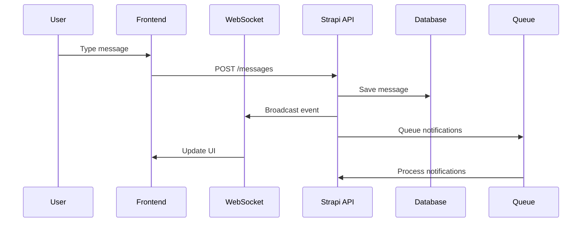
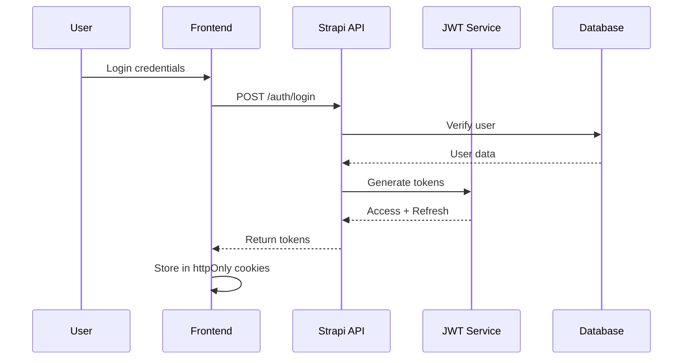

# Technical Architecture Document

## Overview

This document details the technical architecture for migrating Chatwoot to Strapi + Next.js stack.

## System Architecture

### High-Level Architecture

```
┌─────────────────────────────────────────────────────────────────┐
│                         Client Layer                             │
├─────────────────────────┬───────────────────┬──────────────────┤
│   Dashboard (Next.js)   │  Widget (Vanilla) │  Mobile Apps     │
└─────────────────────────┴───────────────────┴──────────────────┘
                                    │
                          ┌─────────┴─────────┐
                          │   API Gateway     │
                          │  (Rate Limiting)  │
                          └─────────┬─────────┘
                                    │
┌─────────────────────────────────────────────────────────────────┐
│                         Service Layer                            │
├─────────────────┬─────────────────┬─────────────────────────────┤
│   Strapi API    │  WebSocket Hub  │    Background Jobs          │
│   (REST/GraphQL)│   (Socket.io)   │    (Bull/Redis)             │
└─────────────────┴─────────────────┴─────────────────────────────┘
                                    │
┌─────────────────────────────────────────────────────────────────┐
│                         Data Layer                               │
├─────────────────┬─────────────────┬─────────────────────────────┤
│   PostgreSQL    │      Redis       │    S3/CloudStorage          │
│   (Primary DB)  │  (Cache/PubSub)  │    (File Storage)           │
└─────────────────┴─────────────────┴─────────────────────────────┘
```

### Component Architecture

#### Backend Components

1. **Strapi Core**
   - Content Type definitions
   - Custom controllers
   - Service layer
   - Middleware stack

2. **WebSocket Service**
   - Connection management
   - Room subscriptions
   - Event broadcasting
   - Presence tracking

3. **Queue Workers**
   - Email sending
   - Webhook delivery
   - Report generation
   - Data synchronization

#### Frontend Components

1. **Next.js Application**
   - Server Components for initial load
   - Client Components for interactivity
   - API routes for BFF pattern
   - Middleware for auth

2. **State Management**
   - Zustand for client state
   - React Query for server state
   - Context for theme/preferences

## Data Flow

### Message Flow



### Authentication Flow



## Security Architecture

### Authentication & Authorization

1. **JWT-based Authentication**
   - Access Token (15 min expiry)
   - Refresh Token (7 days expiry)
   - HttpOnly cookies for storage

2. **Role-Based Access Control**
   - Super Admin
   - Account Admin
   - Agent
   - Custom Roles

3. **API Security**
   - Rate limiting per IP/User
   - CORS configuration
   - Input validation
   - SQL injection prevention

### Data Security

1. **Encryption**
   - TLS 1.3 for transport
   - AES-256 for sensitive data
   - Bcrypt for passwords

2. **Privacy**
   - GDPR compliance
   - Data anonymization
   - Audit logging

## Performance Architecture

### Caching Strategy

1. **Redis Caching Layers**
   ```
   - Session Cache (User sessions)
   - Query Cache (Frequent queries)
   - Object Cache (Computed data)
   - Full Page Cache (Static pages)
   ```

2. **CDN Strategy**
   - Static assets on CDN
   - Image optimization
   - Edge caching for API

### Database Optimization

1. **Indexing Strategy**
   ```sql
   -- Critical indexes
   CREATE INDEX idx_conversations_status ON conversations(status);
   CREATE INDEX idx_messages_conversation ON messages(conversation_id);
   CREATE INDEX idx_messages_created ON messages(created_at);
   ```

2. **Query Optimization**
   - Eager loading relations
   - Query result pagination
   - Database connection pooling

## Scalability Architecture

### Horizontal Scaling

```yaml
# Kubernetes deployment example
apiVersion: apps/v1
kind: Deployment
metadata:
  name: strapi-api
spec:
  replicas: 3
  strategy:
    type: RollingUpdate
    rollingUpdate:
      maxSurge: 1
      maxUnavailable: 0
```

### Load Balancing

1. **Application Load Balancer**
   - Health checks
   - SSL termination
   - Request routing

2. **Database Load Balancing**
   - Read replicas
   - Connection pooling
   - Failover handling

## Monitoring & Observability

### Logging

```typescript
// Structured logging example
logger.info('Message created', {
  conversationId: conversation.id,
  userId: user.id,
  timestamp: new Date().toISOString(),
  metadata: {
    channel: conversation.channel,
    messageType: message.type
  }
});
```

### Metrics

1. **Application Metrics**
   - Request rate
   - Response time
   - Error rate
   - Active users

2. **Infrastructure Metrics**
   - CPU usage
   - Memory usage
   - Disk I/O
   - Network traffic

### Tracing

- Distributed tracing with OpenTelemetry
- Request correlation IDs
- Performance profiling

## Development Architecture

### CI/CD Pipeline

```yaml
# GitHub Actions example
name: Deploy
on:
  push:
    branches: [main]

jobs:
  test:
    runs-on: ubuntu-latest
    steps:
      - uses: actions/checkout@v2
      - name: Run tests
        run: |
          npm test
          npm run test:e2e

  deploy:
    needs: test
    runs-on: ubuntu-latest
    steps:
      - name: Deploy to production
        run: |
          docker build -t crove/api .
          docker push crove/api
          kubectl apply -f k8s/
```

### Development Environment

```docker
# docker-compose.yml
version: '3.8'
services:
  strapi:
    build: ./backend
    volumes:
      - ./backend:/app
    environment:
      - NODE_ENV=development
    ports:
      - "1337:1337"

  nextjs:
    build: ./frontend
    volumes:
      - ./frontend:/app
    environment:
      - NODE_ENV=development
    ports:
      - "3000:3000"

  postgres:
    image: postgres:15
    environment:
      - POSTGRES_DB=crove
      - POSTGRES_USER=crove
      - POSTGRES_PASSWORD=crove
    volumes:
      - postgres_data:/var/lib/postgresql/data

  redis:
    image: redis:7-alpine
    ports:
      - "6379:6379"

volumes:
  postgres_data:
```

## Error Handling

### API Error Response Format

```typescript
interface APIError {
  error: {
    status: number;
    name: string;
    message: string;
    details: {
      errors: Array<{
        path: string[];
        message: string;
        name: string;
      }>;
    };
  };
}
```

### Client Error Handling

```typescript
// Global error boundary
export function ErrorBoundary({ children }: Props) {
  return (
    <ErrorBoundaryComponent
      fallback={<ErrorFallback />}
      onError={(error, errorInfo) => {
        console.error('Error caught by boundary:', error);
        // Send to error tracking service
        captureException(error, { extra: errorInfo });
      }}
    >
      {children}
    </ErrorBoundaryComponent>
  );
}
```

## Migration Architecture

### Data Migration Strategy

1. **Dual Write Pattern**
   - Write to both old and new systems
   - Gradual migration of read traffic
   - Rollback capability

2. **Migration Scripts**
   ```typescript
   // Example migration script
   async function migrateConversations(batchSize = 1000) {
     let offset = 0;
     let hasMore = true;
     
     while (hasMore) {
       const batch = await oldDB.conversations
         .findMany({ skip: offset, take: batchSize });
       
       if (batch.length === 0) {
         hasMore = false;
         break;
       }
       
       await newDB.conversations.createMany({
         data: batch.map(transformConversation)
       });
       
       offset += batchSize;
       await sleep(100); // Rate limiting
     }
   }
   ```

## Conclusion

This architecture provides a solid foundation for migrating from Chatwoot to a modern Strapi + Next.js stack. Key benefits include:

1. **Scalability**: Horizontal scaling capabilities
2. **Performance**: Optimized caching and queries
3. **Maintainability**: Clear separation of concerns
4. **Security**: Comprehensive security measures
5. **Observability**: Full monitoring and debugging capabilities

The architecture is designed to be cloud-native and can be deployed on any major cloud provider or on-premises infrastructure. 