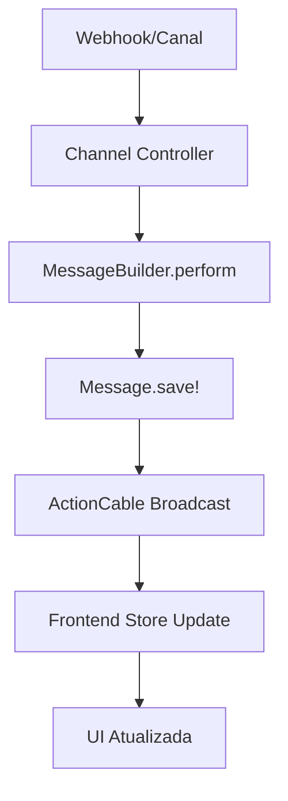
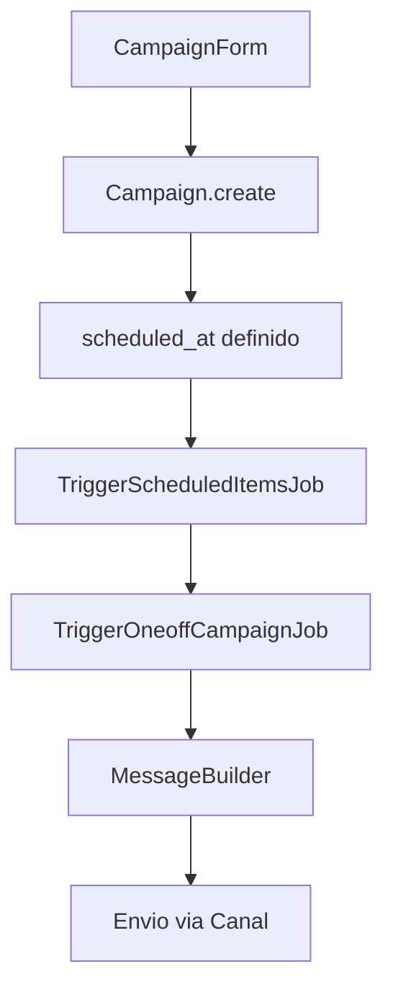

# 📨 Guia Completo do Sistema de Mensagens Chatwoot

## 📋 Índice
1. [Visão Geral](#visao-geral)
2. [Arquitetura Backend](#arquitetura-backend)
3. [Arquitetura Frontend](#arquitetura-frontend)
4. [Fluxos de Dados](#fluxos-de-dados)
5. [Modelos e Banco de Dados](#modelos-e-banco-de-dados)
6. [Jobs e Processamento](#jobs-e-processamento)
7. [APIs e Endpoints](#apis-e-endpoints)
8. [Componentes Vue](#componentes-vue)
9. [Sistema de Estados](#sistema-de-estados)
10. [Integração com Canais](#integracao-com-canais)

---

## 🎯 Visão Geral

O sistema de mensagens do Chatwoot é uma arquitetura robusta que gerencia comunicação bidirecional entre agentes e clientes através de múltiplos canais (WhatsApp, Facebook, Email, SMS, etc.).

### Características Principais:
- ✅ **Tempo Real**: WebSocket via ActionCable
- ✅ **Multi-canal**: Suporte a 10+ canais diferentes
- ✅ **Queue System**: Sidekiq para processamento assíncrono
- ✅ **Status Tracking**: Enviado, entregue, lido, falhado
- ✅ **Rich Content**: Texto, anexos, templates, stickers
- ✅ **Liquid Variables**: Sistema de variáveis dinâmicas

---

## 🏗️ Arquitetura Backend

### Stack Principal:
- **Ruby on Rails** 7.x
- **PostgreSQL** (banco principal)
- **Redis** (cache + jobs)
- **Sidekiq** (processamento de jobs)
- **ActionCable** (WebSocket)

### Estrutura de Diretórios:
```
app/
├── models/
│   ├── message.rb              # Modelo principal de mensagens
│   ├── conversation.rb         # Contexto da conversa
│   └── campaign.rb             # Campanhas (com agendamento)
├── controllers/api/v1/accounts/conversations/
│   └── messages_controller.rb  # CRUD de mensagens
├── jobs/
│   ├── send_reply_job.rb       # Envio de mensagens
│   └── trigger_scheduled_items_job.rb  # Scheduler principal
├── builders/messages/
│   └── message_builder.rb      # Construção de mensagens
└── services/
    └── [channel]_service.rb    # Serviços por canal
```

---

## 💻 Arquitetura Frontend

### Stack Principal:
- **Vue.js 3** (Composition API)
- **Vuex** (gerenciamento de estado)
- **Vue Router** (roteamento)
- **Axios** (HTTP client)

### Estrutura de Componentes:
```
app/javascript/dashboard/
├── components/widgets/conversation/
│   ├── ReplyBox.vue           # Interface principal de envio
│   ├── VariableList.vue       # Sugestões de variáveis
│   └── CannedResponse.vue     # Respostas prontas
├── components/widgets/WootWriter/
│   └── Editor.vue             # Editor rich text
├── store/modules/conversations/
│   └── actions.js             # Actions do Vuex
└── api/inbox/
    └── message.js             # API client
```

---

## 🔄 Fluxos de Dados

### 1. Fluxo de Envio de Mensagem (Usuário → Cliente)

```mermaid
graph TD
    A[ReplyBox.vue] --> B[onSendReply()]
    B --> C[Store: createPendingMessageAndSend]
    C --> D[MessageApi.create()]
    D --> E[MessagesController#create]
    E --> F[MessageBuilder.perform]
    F --> G[Message.save!]
    G --> H[SendReplyJob.perform_later]
    H --> I[Canal Service]
    I --> J[Cliente Final]
    
    G --> K[ActionCable Broadcast]
    K --> L[Frontend Update]
```

### 2. Fluxo de Recebimento (Cliente → Usuário)



### 3. Fluxo de Agendamento (Campanhas)



---

## 🗄️ Modelos e Banco de Dados

### Message Model (Schema)
```ruby
# Table: messages
create_table "messages" do |t|
  t.text     "content"                    # Conteúdo da mensagem
  t.integer  "message_type", null: false # 0: incoming, 1: outgoing, 2: activity, 3: template
  t.integer  "content_type", default: 0  # 0: text, 5: cards, 8: incoming_email, etc.
  t.integer  "status", default: 0        # 0: sent, 1: delivered, 2: read, 3: failed
  t.boolean  "private", default: false   # Nota privada ou mensagem pública
  t.text     "processed_message_content" # Conteúdo processado com variáveis
  t.jsonb    "content_attributes"        # Atributos específicos (anexos, templates)
  t.jsonb    "additional_attributes"     # Metadados adicionais
  t.integer  "conversation_id", null: false
  t.integer  "account_id", null: false
  t.integer  "inbox_id", null: false
  t.string   "sender_type"              # User, Contact, etc.
  t.bigint   "sender_id"
  t.string   "source_id"                # ID externo do canal
  t.timestamps
end
```

### Relacionamentos:
```ruby
# Message.rb
belongs_to :conversation
belongs_to :account
belongs_to :inbox
belongs_to :sender, polymorphic: true
has_many_attached :attachments
```

### Campaign Model (Agendamento)
```ruby
# Table: campaigns  
create_table "campaigns" do |t|
  t.string   "title", null: false
  t.text     "message", null: false
  t.datetime "scheduled_at"              # ⭐ Campo de agendamento
  t.integer  "campaign_type", default: 0 # 0: ongoing, 1: one_off
  t.integer  "campaign_status", default: 0 # 0: active, 1: completed
  t.jsonb    "audience"                   # Critérios de audiência
  t.jsonb    "trigger_rules"             # Regras de acionamento
  t.bigint   "account_id", null: false
  t.bigint   "inbox_id", null: false
  t.integer  "sender_id"
  t.timestamps
end
```

---

## ⚙️ Jobs e Processamento

### Hierarchy de Jobs:
```ruby
ApplicationJob
├── SendReplyJob                    # Envio individual de mensagem
├── TriggerScheduledItemsJob        # ⭐ Master scheduler (executa a cada X minutos)
│   ├── Campaigns::TriggerOneoffCampaignJob
│   ├── Conversations::ReopenSnoozedConversationsJob
│   └── Notification::RemoveOldNotificationJob
└── EventDispatcherJob             # Eventos do sistema
```

### TriggerScheduledItemsJob (Master):
```ruby
class TriggerScheduledItemsJob < ApplicationJob
  queue_as :scheduled_jobs

  def perform
    # Triggear campanhas agendadas
    Campaign.where(
      campaign_type: :one_off,
      campaign_status: :active
    ).where(
      scheduled_at: 3.days.ago..Time.current
    ).find_each(batch_size: 100) do |campaign|
      Campaigns::TriggerOneoffCampaignJob.perform_later(campaign)
    end
    
    # Outros jobs agendados...
  end
end
```

### SendReplyJob (Envio):
```ruby
class SendReplyJob < ApplicationJob
  queue_as :high

  def perform(message_id)
    message = Message.find(message_id)
    
    # Roteamento por canal
    case message.conversation.inbox.channel.class.to_s
    when 'Channel::FacebookPage'
      Facebook::SendOnFacebookService.new(message: message).perform
    when 'Channel::TwilioSms'
      Twilio::SendOnTwilioService.new(message: message).perform
    # ... outros canais
    end
  end
end
```

---

## 🛠️ APIs e Endpoints

### Messages Controller:
```ruby
# Rotas
POST   /api/v1/accounts/:account_id/conversations/:id/messages
GET    /api/v1/accounts/:account_id/conversations/:id/messages
DELETE /api/v1/accounts/:account_id/conversations/:id/messages/:message_id
POST   /api/v1/accounts/:account_id/conversations/:id/messages/:message_id/retry
```

### Payload de Criação:
```json
{
  "content": "Olá {{contact.name}}!",
  "private": false,
  "content_attributes": {
    "in_reply_to": 123,
    "automation_rule_id": 456
  },
  "attachments": [...],
  "cc_emails": "teste@exemplo.com",
  "template_params": {...}
}
```

### MessageBuilder Flow:
```ruby
def perform
  @message = @conversation.messages.build(message_params)
  process_attachments  # Processa arquivos
  process_emails      # Processa emails CC/BCC
  @message.save!
  @message
end

private

def message_params
  {
    content: @params[:content],
    message_type: @message_type,
    private: @private,
    sender: @user,
    content_attributes: content_attributes,
    # ⭐ Aqui poderíamos adicionar scheduled_at
  }
end
```

---

## 🎨 Componentes Vue

### ReplyBox.vue (Componente Principal):
```vue
<!-- Template simplificado -->
<template>
  <div class="reply-box">
    <WootMessageEditor 
      v-model="message"
      enable-variables
      :variables="messageVariables"
      @toggle-variables-menu="toggleVariablesMenu"
    />
    
    <ReplyBottomPanel 
      :on-send="onSendReply"
      :send-button-text="replyButtonLabel"
    />
  </div>
</template>

<script>
export default {
  methods: {
    async onSendReply() {
      // Validação de variáveis indefinidas
      const undefinedVariables = getUndefinedVariablesInMessage({
        message: this.message,
        variables: this.messageVariables,
      });
      
      if (undefinedVariables.length > 0) {
        // Mostrar modal de confirmação
        return;
      }
      
      // Prepara payload
      const messagePayload = this.getMessagePayload(this.message);
      
      // Envia via store
      await this.sendMessage(messagePayload);
    },
    
    async sendMessage(messagePayload) {
      await this.$store.dispatch('createPendingMessageAndSend', messagePayload);
      // Limpa formulário e emite eventos
    }
  }
}
</script>
```

### MessageApi (Client HTTP):
```javascript
class MessageApi extends ApiClient {
  create({
    conversationId,
    message,
    private: isPrivate,
    contentAttributes,
    files,
    // ⭐ scheduled_at poderia ser adicionado aqui
  }) {
    return axios.post(
      `${this.url}/${conversationId}/messages`,
      buildCreatePayload({ 
        message, 
        isPrivate, 
        contentAttributes, 
        files 
      })
    );
  }
}
```

---

## 🏪 Sistema de Estados (Vuex)

### Conversations Store:
```javascript
// actions.js
const actions = {
  createPendingMessageAndSend: async ({ dispatch }, data) => {
    const pendingMessage = createPendingMessage(data);
    dispatch('sendMessageWithData', pendingMessage);
  },

  sendMessageWithData: async ({ commit }, pendingMessage) => {
    const { conversation_id: conversationId, id } = pendingMessage;
    
    try {
      // Adiciona mensagem como "em progresso"
      commit(types.ADD_MESSAGE, {
        ...pendingMessage,
        status: MESSAGE_STATUS.PROGRESS,
      });

      // Chama API
      const response = await MessageApi.create(pendingMessage);
      
      // Atualiza para "enviado"
      commit(types.ADD_MESSAGE, {
        ...response.data,
        status: MESSAGE_STATUS.SENT,
      });
      
    } catch (error) {
      // Marca como falhou
      commit(types.ADD_MESSAGE, {
        ...pendingMessage,
        status: MESSAGE_STATUS.FAILED,
        meta: { error: error.response?.data?.error }
      });
      
      throw error;
    }
  }
};
```

### Message States:
```javascript
export const MESSAGE_STATUS = {
  SENT: 'sent',
  DELIVERED: 'delivered', 
  READ: 'read',
  FAILED: 'failed',
  PROGRESS: 'progress'  // Estado transitório
};
```

---

## 🔌 Integração com Canais

### Estrutura de Canais:
```ruby
# Cada canal tem um service específico
services = {
  'Channel::TwitterProfile' => ::Twitter::SendOnTwitterService,
  'Channel::TwilioSms' => ::Twilio::SendOnTwilioService,
  'Channel::Line' => ::Line::SendOnLineService,
  'Channel::Telegram' => ::Telegram::SendOnTelegramService,
  'Channel::Whatsapp' => ::Whatsapp::SendOnWhatsappService,
  'Channel::FacebookPage' => ::Facebook::SendOnFacebookService
}
```

### Exemplo de Service (WhatsApp):
```ruby
class Whatsapp::SendOnWhatsappService < Base::SendOnChannelService
  def perform
    # Processa diferentes tipos de conteúdo
    case @message.content_type
    when 'text'
      send_text_message
    when 'cards' 
      send_interactive_message
    when 'template'
      send_template_message
    end
  end

  private

  def send_text_message
    # API call para WhatsApp
    # Atualiza status da mensagem
  end
end
```

---

## 🎯 Pontos Importantes para Agendamento

### 1. **Infraestrutura Existente Aproveitável:**
- ✅ `TriggerScheduledItemsJob` já roda periodicamente
- ✅ `SendReplyJob` já processa envios
- ✅ `Campaign` model já tem `scheduled_at`
- ✅ Frontend já tem datetime inputs funcionando

### 2. **Gaps a Implementar:**
- ❌ Campo `scheduled_at` no modelo Message
- ❌ Logic no MessageBuilder para scheduled messages
- ❌ UI no ReplyBox para agendamento
- ❌ Jobs específicos para mensagens individuais agendadas

### 3. **Padrões a Seguir:**
- 📋 Usar mesmo pattern de Campaign para agendamento
- 📋 Integrar no TriggerScheduledItemsJob existente  
- 📋 Manter API RESTful consistency
- 📋 Seguir padrões Vue/Vuex estabelecidos

---

## 🧪 Testing Strategy

### Backend Tests:
```ruby
# spec/jobs/send_reply_job_spec.rb
# spec/builders/messages/message_builder_spec.rb  
# spec/controllers/api/v1/accounts/conversations/messages_controller_spec.rb
# spec/models/message_spec.rb
```

### Frontend Tests:
```javascript
// spec/javascript/dashboard/components/widgets/conversation/ReplyBox.spec.js
// spec/javascript/dashboard/store/modules/conversations/actions.spec.js
// spec/javascript/dashboard/api/inbox/message.spec.js
```

---

## 📊 Métricas e Monitoramento

### Sidekiq Jobs:
- Queue sizes e processing times
- Failed job rates
- Retry patterns

### Message Status:
- Delivery rates por canal
- Response times
- Error patterns

### ActionCable:
- WebSocket connections
- Broadcast performance
- Real-time sync accuracy

---

## 🔧 Ferramentas de Debug

### Rails Console:
```ruby
# Verificar mensagens
Message.where(conversation_id: 123).order(:created_at)

# Verificar jobs
Sidekiq::Queue.new('high').size
Sidekiq::RetrySet.new.size

# Verificar campanhas agendadas  
Campaign.where('scheduled_at > ?', Time.current)
```

### Browser DevTools:
```javascript
// Store state
$vm.$store.state.conversations

// ActionCable connection
App.cable.connection.monitor.connectionIsStale()
```

---

Este guia fornece uma visão completa da arquitetura atual do sistema de mensagens, servindo como base sólida para implementar mensagens agendadas aproveitando ao máximo a infraestrutura existente.