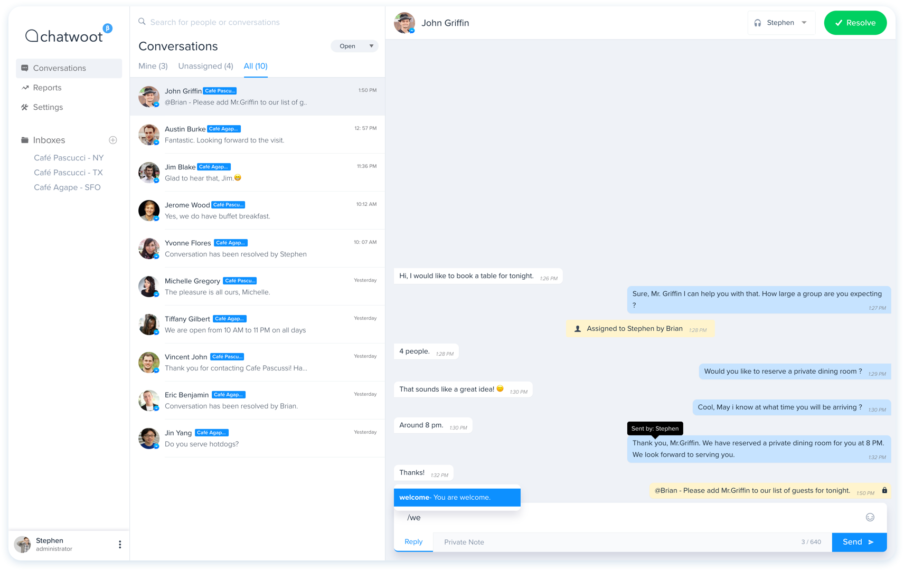

  

  
A simple and elegant live chat software

  
An opensource alternative to Intercom, Zendesk, Drift, Crisp etc.

  

___

  
  
  
  
  
  
  

## Background

Chatwoot is a customer support tool for instant messaging channels which can help businesses to provide exceptional customer support. The development of Chatwoot started in 2016 and it failed to succeed as a business and eventually shut the shop in 2017. During 2019 #Hacktoberfest, the maintainers decided to make it opensource instead of letting the code rust in a private repo. With a pleasant surprise, Chatwoot became a trending project on Hacker News and best of all, got lots of love from the community.

Now, a failed project is back on track and the prospects are looking great. The team is back to working on the project and we are building it in the open. Thanks to the ideas and contributions from the community.

## Documentation

Detailed documentation is available at [www.chatwoot.com/docs](https://www.chatwoot.com/docs).

You can find the quick setup docs [here](https://www.chatwoot.com/docs/quick-setup).

## Heroku one-click deploy

Deploying chatwoot to heroku, it's a breeze. It's as simple as clicking this button.

## Contributors ✨

Thanks goes to all these [wonderful people](https://www.chatwoot.com/docs/contributors):

*Chatwoot* &copy; 2017-2019, ThoughtWoot Inc - Released under the MIT License.
