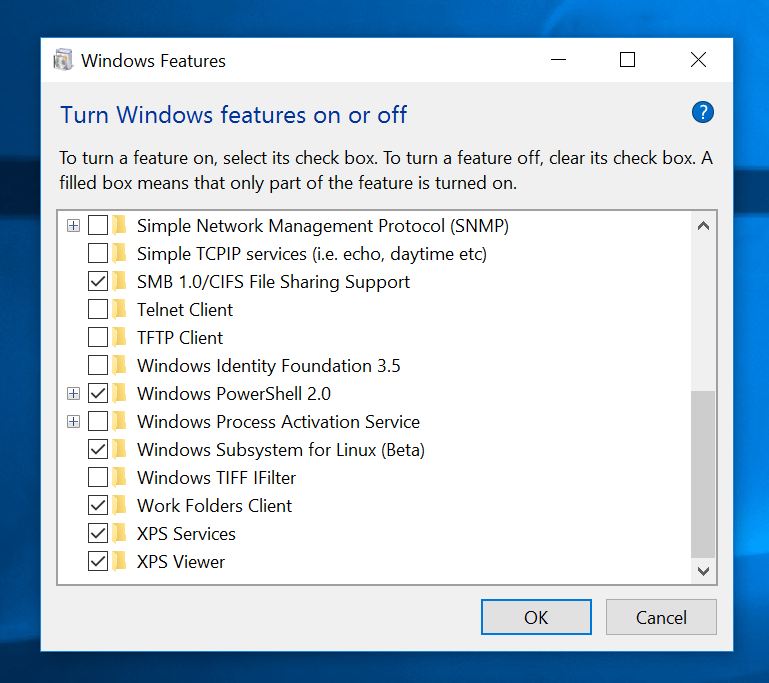

# Chatwoot

The modern customer support platform, an open-source alternative to Intercom, Zendesk, Salesforce Service Cloud etc.

## Environment Setup
Follow the instructions to setup the frontend and backend environments for your operating system.<details>
<summary> Ubuntu </summary> <br>
Open a terminal and run the following commands:

 ### Start a login shell to ensure environment variables are loaded
```
/bin/bash --login
```
 ### Import the GPG keys required for installing RVM
```
gpg --keyserver hkp://keyserver.ubuntu.com --recv-keys 409B6B1796C275462A1703113804BB82D39DC0E3 \
7D2BAF1CF37B13E2069D6956105BD0E739499BDB
```
### Install RVM (Ruby Version Manager)
```
\curl -sSL https://get.rvm.io | bash -s stable
```
### Install Ruby 3.4.4 and set it as default
```
rvm install ruby-3.4.4
rvm use ruby-3.4.4 --default
```
### Install Node.js
```
curl -sL https://deb.nodesource.com/setup_20.x | sudo -E bash 
sudo apt-get install -y nodejs
```
### Install Postgres
```
sudo apt install postgresql postgresql-contrib
```
Install postgresql-14-pgvector
```
sudo apt install curl ca-certificates gnupg lsb-release
curl -fsSL https://www.postgresql.org/media/keys/ACCC4CF8.asc | sudo gpg --dearmor -o /usr/share/keyrings/postgresql.gpg
echo "deb [signed-by=/usr/share/keyrings/postgresql.gpg] http://apt.postgresql.org/pub/repos/apt $(lsb_release -cs)-pgdg main" | sudo tee /etc/apt/sources.list.d/pgdg.list
sudo apt update
sudo apt install postgresql-14-pgvector
sudo service postgresql restart
```
Install `libpg-dev` dependencies for ubuntu:
```
sudo apt-get install libpq-dev
```
###  Install redis-server
```
sudo add-apt-repository ppa:redislabs/redis
sudo apt-get update
sudo apt-get install redis
```
### Install imagemagick
```
sudo apt-get install imagemagick
```
</details>

</details>

<details>
<summary>Mac OS</summary><br>
Installing the standalone Command Line Tools

Open terminal app and write the code below

```
xcode-select --install
```

### Install Homebrew

```
/bin/bash -c "$(curl -fsSL https://raw.githubusercontent.com/Homebrew/install/master/install.sh)"
```

### Install Git

```
brew updatebrew install git
```

### Install RVM or rbenv

```
curl -L https://get.rvm.io | bash -s stable
```

Alternatively you can use `rbenv`

```
brew install rbenv
```

### Install Ruby

Chatwoot APIs are built on Ruby on Rails, you need install ruby 3.4.4

If you are using `rvm` :

```
rvm install ruby-3.4.4
rvm use 3.4.4
source ~/.rvm/scripts/rvm
```

If you are using `rbenv` to manage ruby versions do :

```
rbenv install 3.4.4
```

`rbenv` identifies the ruby version from `.ruby-version` file on the root of the project and loads it automatically.

### Install Node.js

Chatwoot requires `node` version `20`. Install Node.js from NodeSource using the following commands

```
brew install node@20
```

### Install pnpm

We use `pnpm` as package manager

```
brew install pnpm
```

### Install postgres

The database used in Chatwoot is PostgreSQL.

1.  Install PostgresApp ([https://postgresapp.com](https://postgresapp.com)). This is easiest way to get started with PostgreSQL on mac.

or

2.  Use the following commands to install postgres.

```
brew install postgresql# Ensure Postgres is startedbrew services start postgresql# create user postgres createuser postgres
```

The installation procedure created a user account called postgres that is associated with the default Postgres role. In order to use Postgres, you can log into that account.

```
sudo psql -U postgres
```

### Install redis-server

Chatwoot uses Redis server in agent assignments and reporting. To install `redis-server`

```
brew install redis
```

Start the redis service.

```
brew services start redis
```

### Install imagemagick

Chatwoot uses `imagemagick` library to resize images for showing previews and smaller size based on context.

```
brew install imagemagick
```
</details>
</details>
<details>
<summary>Windows</summary><br>
Requirements

You need to install the Linux Subsystem for Windows.

   1)  The first step is to enable "Developer mode" in Windows. You can do this by opening up Settings and navigating to "Update & Security". In there, choose the tab on the left that reads "For Developers". Turn the "Developer mode" toggle on to enable it.
      

2) Next you have to enable the Windows Subsystem for Linux. Open the "Control Panel" and go to "Programs and Features". Click on the link on the left "Turn Windows features on or off". Look for the "Windows Subsystem for Linux" option and select the checkbox next to it.


3) Once that's complete, you can open up the Start Menu again and search for "Bash". This time it will have the Ubuntu logo.

### Installing RVM & Ruby

You need core linux dependencies installed in order to install ruby.
```
sudo apt-get update
sudo apt-get install git-core curl zlib1g-dev build-essential libssl-dev libreadline-dev libyaml-dev libsqlite3-dev sqlite3 libxml2-dev libxslt1-dev libcurl4-openssl-dev software-properties-common libffi-dev
```
### Install RVM & ruby version 3.4.4
```
sudo apt-get install libgdbm-dev libncurses5-dev automake libtool bison libffi-dev
gpg --keyserver hkp://keys.gnupg.net --recv-keys 409B6B1796C275462A1703113804BB82D39DC0E3 7D2BAF1CF37B13E2069D6956105BD0E739499BDB
curl -sSL https://get.rvm.io | bash -s stable
source ~/.rvm/scripts/rvm
rvm install 3.4.4
rvm use 3.4.4 --default
ruby -v
```
### Install Node.js

Chatwoot requires node version 20. Install Node.js from NodeSource using the following commands
```
curl -sL https://deb.nodesource.com/setup_20.x | sudo -E bash -
sudo apt-get install -y nodejs
```
### Install pnpm

We use pnpm as the package manager
```
iwr https://get.pnpm.io/install.ps1 -useb | iex
```

### Install postgres

The database used in Chatwoot is PostgreSQL. Use the following commands to install postgres:
```
sudo apt install postgresql postgresql-contrib
```

The installation procedure created a user account called postgres that is associated with the default Postgres role. In order to use Postgres, you can log into that account.
```
sudo -u postgres psql
```
### Install libpg-dev dependencies for Ubuntu
```
sudo apt-get install libpq-dev
sudo service postgresql start
```
### Install redis-server

Chatwoot uses Redis server in agent assignments and reporting. To install redis-server
```
sudo apt-get install redis-server
```
Enable Redis to start on system boot.
```
sudo systemctl enable redis-server.service
```
### Install imagemagick
```
sudo apt-get install imagemagick
```
</details>

<details>
<summary>Make Commands</summary><br>

### Clone the repo and cd to the Chatwoot directory

Clone the repository and navigate to the Chatwoot directory:
```
git clone https://github.com/chatwoot/chatwoot.git
cd chatwoot
```
### Install Ruby & JavaScript dependencies

Install Ruby and JavaScript dependencies using the following command. This command runs Bundler and pnpm:
```
make burn
```
### Run database migrations

Apply necessary database schema changes to your development environment by running the following command:
``` 
make db
```
### Run database seed

Load some seed data to your development environment for testing by running the following command:
```
make db_seed
```
### Run dev server using Overmind

Start the development server using Overmind, a process manager that can run multiple processes concurrently:
```
make run
```
Force run if ./.overmind.sock file exists

If the make run command fails due to the existence of a ./.overmind.sock file, you can try using the following command:
```
make force_run
```
Debug - Attach to backend via Overmind tmux session

For debugging purposes, you can attach to the backend via the Overmind tmux session using the following command:
```
make debug
```
### Debug worker

To debug the worker, use the following command:
```
make debug_worker
```
### Get Rails console

Access the Rails console, which provides an interactive environment for interacting with the Chatwoot application:
```
make console

Build Docker image

Build the Docker image for the Chatwoot project:

make docker
```
Workflow after pulling in the latest changes from develop

To update your development environment after pulling the latest changes from the develop branch, follow these steps:
```
make burn     # Install dependencies

make db       # Run migrations

make run      # Start the server
```
</details>

## Project Setup
Please make sure you have setup the environment first by following the instructions above.

### Clone the repo
```
# clone the repo and cd to chatwoot dir
git clone https://github.com/chatwoot/chatwoot.git
cd chatwoot
```
### Install Ruby & Javascript dependencies
Use the following command to install Ruby and Javascript dependencies
```
make burn
```

### Environment Setup
This will setup an example environment
```
cp .env.example .env
```
Update postgres host, username and password. Find the following lines and make the changes
```
POSTGRES_HOST=postgres #change to localhost 
POSTGRES_USERNAME=postgres #change to your username
POSTGRES_PASSWORD=... #change to your password
RAILS_ENV=development
```
### Setup rails server
```
# run db migrations
make db
# fireup the server
foreman start -f Procfile.dev
```

### Login with credentials
```
http://localhost:3000
user name: john@acme.inc
password: Password1!
```
Note: If login fails, run db seed manually to create the user.

```
RAILS_ENV=development bundle exec rails db:seed

```
### Troubleshooting tips
If you face error while running the application.
1. NoMethodError: undefined method `schema_format' for #<ActiveRecord::ConnectionAdapters::PostgreSQLAdapter ...>
    Replace the following code in db_enhancements.rake
    ```
    db_namespace['load_config'].invoke if ActiveRecord::Base.connection.schema_format == :ruby
    ```
    with
    ```
    db_namespace['load_config'].invoke if Rails.application.config.active_record.schema_format == :ruby
    ```
    This issue is caused if version of rails is 7.1+
2. You might see an error for post css import, run the following command
    ```
    pnpm add -D postcss postcss-import postcss-loader
    ```

### Debugging Docker for production

You can use our official Docker image from https://hub.docker.com/r/chatwoot/chatwoot
```
docker pull chatwoot/chatwoot
```
You can create an image yourselves by running the following command on the root directory.
```
docker compose -f docker-compose.production.yaml build
```

## Test

You can run the test cases to check the functionality 
```
bundle exec rspec
```

### Add channel and Test
You can add a Telegram channel and then test conversations
#### Install ngrok 
```
sudo snap install ngrok
```

start ngrok at port 3000 or based on your env settings

```
ngrok http 5000
```

Replace frontend URL with in .env with the ngrok https url

#### Create a bot
Create a bot using bot father in telegram and get the token.

#### Add a new telegram channel and set the token


send a message to your bot and it should appear under conversations.

