# 🛠️ Chatwoot Local Setup Documentation (macOS – Apple Silicon M1/M2)

This document provides a complete, beginner-friendly guide to set up Chatwoot locally on a MacBook Pro (macOS, Apple Silicon). It includes all the steps needed to install prerequisites, configure the backend and frontend, run the application, test basic functionality, and resolve setup issues.

## 📑 Table of Contents
- [Prerequisites](#-prerequisites)
- [Backend Environment Setup](#-backend-environment-setup)
- [Frontend Environment Setup](#-frontend-environment-setup)
- [Verify Application](#-verify-application-is-working)
- [Troubleshooting Tips](#-troubleshooting-tips)
- [Core Functionality Testing](#-core-functionality-testing-guide-chatwoot-local)
- [Initial Account Setup](#-initial-account-setup)
- [Final Notes](#-final-notes)

### 💻 System Requirements
- macOS Monterey (12.0) or later
- Apple Silicon (M1/M2) processor
- Minimum 8GB RAM recommended
- At least 1GB free disk space
- Active internet connection for package downloads

### 📦 Required Software Versions
- Ruby 3.4.4
- PostgreSQL 14.x
- Redis 7.x (latest stable)
- Node.js 18.x or higher
- pnpm 8.x or higher
- Bundler 2.5.16 or compatible
- Git (latest version)

## ✅ Prerequisites

### 🧰 Tools to Install

#### VS Code- https://code.visualstudio.com/
#### Homebrew- /bin/bash -c "$(curl -fsSL https://raw.githubusercontent.com/Homebrew/install/HEAD/install.sh)"
#### Add Homebrew to shell- echo 'eval "$(/opt/homebrew/bin/brew shellenv)"' >> ~/.zprofile
####                        eval "$(/opt/homebrew/bin/brew shellenv)"
#### ✅ TIP:Run these in your VS Code terminal:
echo >> ~/.zprofile
echo 'eval "$(/opt/homebrew/bin/brew shellenv)"' >> ~/.zprofile
eval "$(/opt/homebrew/bin/brew shellenv)"

This will:
	•	Add Homebrew's path to your shell configuration (.zprofile)
	•	Make the brew command available every time you open Terminal
  
#### rbenv (Ruby Version Manager)- brew install rbenv ruby-build
#### Ruby 3.4.4- r benv install 3.4.4 && rbenv global 3.4.4
#### Bundler- gem install bundler
#### PostgreSQL- brew install postgresql@14 && brew services start postgresql@14
#### Redis- brew install redis && brew services start redis
#### Node.js- brew install node
#### pnpm- npm install -g pnpm


### 💡 VS Code Extensions (Recommended)

#### Ruby LSP- Shopify.ruby-lsp
#### Rails- bung87.rails
#### Vue 3 (Volar)- Vue.volar
#### ESLint- dbaeumer.vscode-eslint
#### Prettier- esbenp.prettier-vscode
#### DotENV- mikestead.dotenv

### 🧱 Backend Environment Setup

#### 1. Clone the Repository
COMMAND- git clone https://github.com/<your-username>/chatwoot.git
cd chatwoot

#### 2. Install Ruby Dependencies
COMMAND- bundle install
note- 💡 Bundler 2.5.16 will auto-install to match Gemfile.lock version.

#### 3. Database Configuration
Look for database.yml and Check for the default section. Make sure this part looks like:
default: &default
  adapter: postgresql
  encoding: unicode
  pool: <%= ENV.fetch("RAILS_MAX_THREADS") { 5 } %>
  username: postgres
  password:

✅ If your PostgreSQL doesn't use a password (typical on macOS), leave it blank.

Then run:
COMMAND- bundle exec rails db:setup

Follow below based on Errors:

✅ Fix Postgres start issue: Start PostgreSQL server manually: brew services start postgresql
You should see: Successfully started `postgresql` (label: homebrew.mxcl.postgresql)
🔁 Then retry: bundle exec rails db:setup

✅ Fix role issue: Create the postgres role manually: createuser -s postgres
This creates a superuser role named postgres, which your database.yml is trying to use.
You won't be prompted for a password since it defaults to trust-based local access on macOS.
🔁 Then retry: bundle exec rails db:setup

✅ Fix pgvector issue: Install pgvector for PostgreSQL: brew install pgvector
Then enable it in Postgres: psql -U postgres -d chatwoot_dev -c "CREATE EXTENSION IF NOT EXISTS vector;"
                            psql -U postgres -d chatwoot_test -c "CREATE EXTENSION IF NOT EXISTS vector;"
🔁 Then retry: bundle exec rails db:setup

✅ Fix redis start issue: Start Redis: brew services start redis
You should see: Successfully started `redis` (label: homebrew.mxcl.redis)
🔁 Then retry: bundle exec rails db:setup

#### 4. Environment Configuration
COMMAND- cp .env.example .env or create a new .env file in the rot directory and copy paste contents

Then edit the .env file and make these important changes:
1. Find and change Redis URL:
   ```
   # Change this line:
   REDIS_URL=redis://redis:6379
   # To:
   REDIS_URL=redis://localhost:6379
   ```

2. Update PostgreSQL configuration:
   ```
   # Change this line:
   POSTGRES_HOST=postgres
   # To:
   POSTGRES_HOST=localhost
   
   # Add this line below:
   POSTGRES_PORT=5432
   ```

These changes are necessary for local development as your services are running on localhost rather than in Docker containers.

#### 5. Start Backend Server
COMMAND- bundle exec rails s

Access the app at: http://localhost:3000

### 🌐 Frontend Environment Setup

#### 1. Install Node Modules
COMMAND- pnpm install

#### 2. Start Vite Dev Server
COMMAND- bin/vite dev

Vite will serve assets on: http://localhost:3036

### ✅ Verify Application is Working

1.	Run both:
	•	bundle exec rails s (port 3000)
	•	bin/vite dev (port 3036)
2.	Open http://localhost:3000 in your browser
3.	You should see the Chatwoot login UI

## Note- Instead of running front end, Backend separately you can run pnpm dev(Always best choice)

### 🧰 Troubleshooting Tips

❌ Gem native extension failed for io-console on Windows- Avoid using Ruby 3.4+ on Windows — switch to macOS or WSL2

❌ PostgreSQL role postgres does not exist- Run createuser -s postgres

❌ PG extension vector missing- Run: CREATE EXTENSION IF NOT EXISTS vector; in both dev and test DBs

❌ Redis error during db:setup- Start Redis with brew services start redis

❌ Rails server not starting- Ensure Ruby is set with rbenv global 3.4.4 and restart terminal

❌ Vite warning about CJS API deprecation- can be safely ignored for now

❌ Database setup fails with permission error- Ensure Postgres is running with correct user and port (5432)

### ✅ Core Functionality Testing Guide (Chatwoot Local)

##### Step 1: Start the Backend and frontend
- In your terminal (inside the Chatwoot folder), run: pnpm dev
 🧪 Test 1: App Loads (Backend) and Step 2: Start the Frontend (Vite) will run in the same terminal
 After running command in same terminal:
      . Vite Dev Server Running: It should say: ➜  Local:   http://localhost:3036/vite-dev/
      . 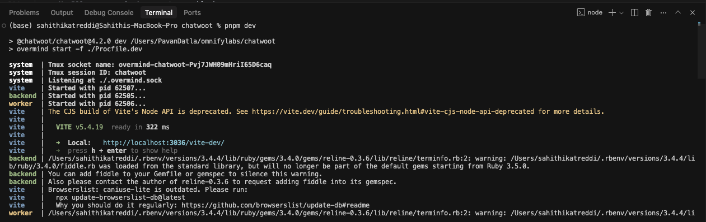
      . Check if the output shows: Listening on http://127.0.0.1:3000
      . 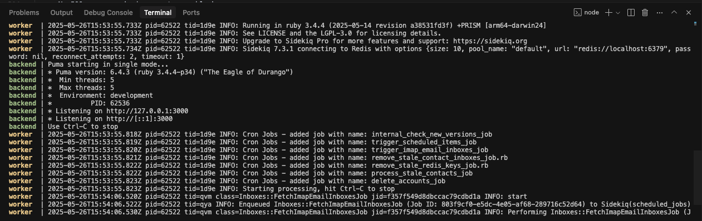


#### Step 3: Open Chatwoot in Browser

🧪 Test 2: App Loads in Browser
	•	You should see either:
	•	A Sign-up page (if it's the first time), or
	•	A Login page (if account already exists)
	•	No 500 errors, missing assets, or blank screens

 Screeenshot
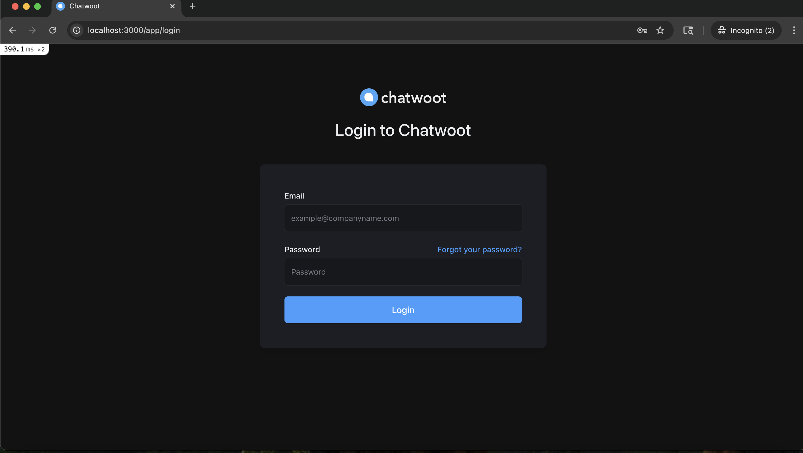

### ✅ Step 4: Test Login Functionality and verify Dashboard

🧪 Test 3: Login Works  
- If you already created a user:  
  → Enter your email and password and click **Login**  
- If not, click **Sign Up**, create an account refer 🔑 Initial Account Setup and then log in
- You are redirected to the **Dashboard** (usually shows All conversations, Side bar consists contacs,settings,readdocs,notifications etc)  
- No error messages like "Invalid credentials" (unless your input is wrong)

🧪 Test 4: Dashboard Loads  
- After login, the app should redirect you to the **Dashboard**
- You will be in **All Conversations**.
- Below that you can see **@Mentions**, **Unattended**(Try clicking on them)
- You should see icons on side bar like  **Contacts**, **Settings**, **ReadDocs**, **notifications** etc.

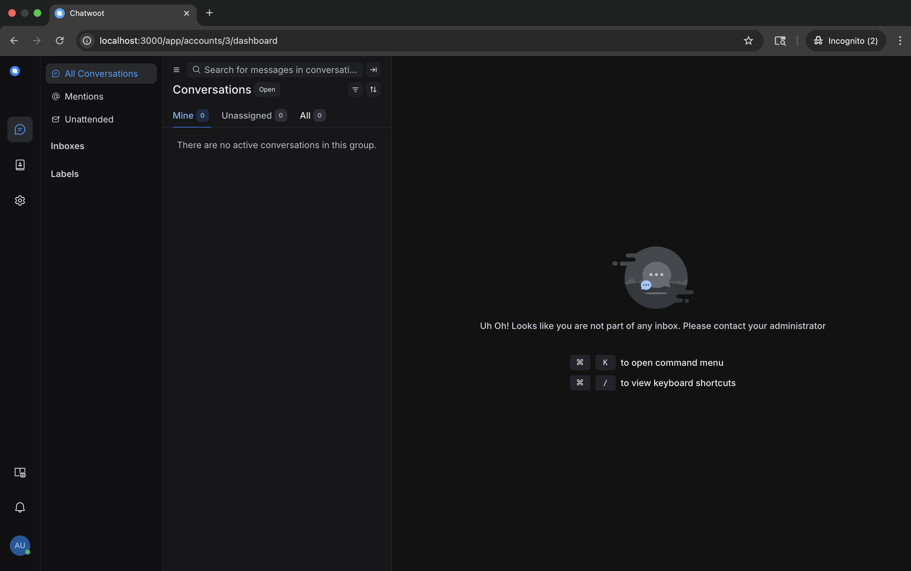
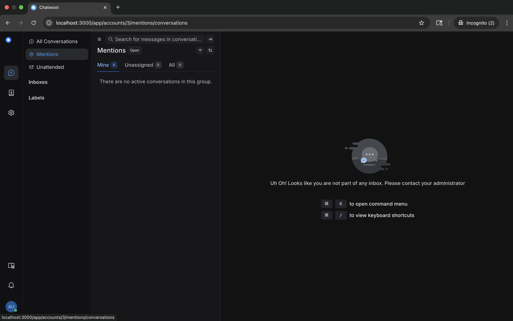
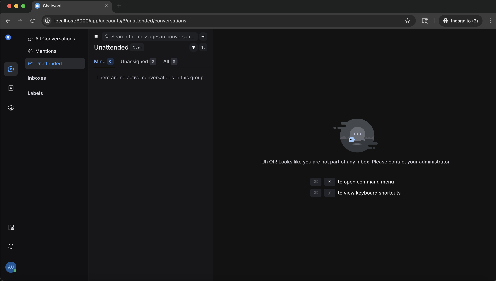

### ✅ Step 5: Verify whether you are able navigate through options available on side bar


🧪 Test 5: Navigate through  each option
- Click on **Contacts** in the sidebar
- You should see the **add contacts** panel
- Youn can add contacts, update contact etc.
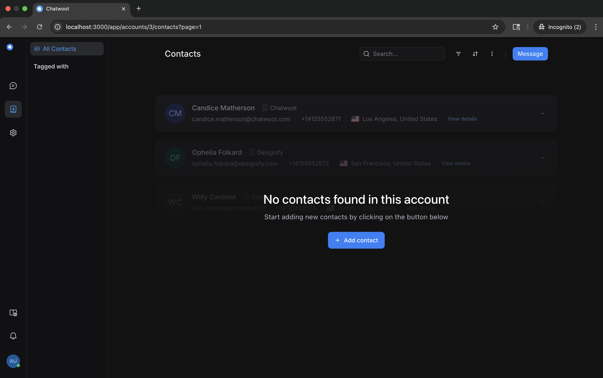 
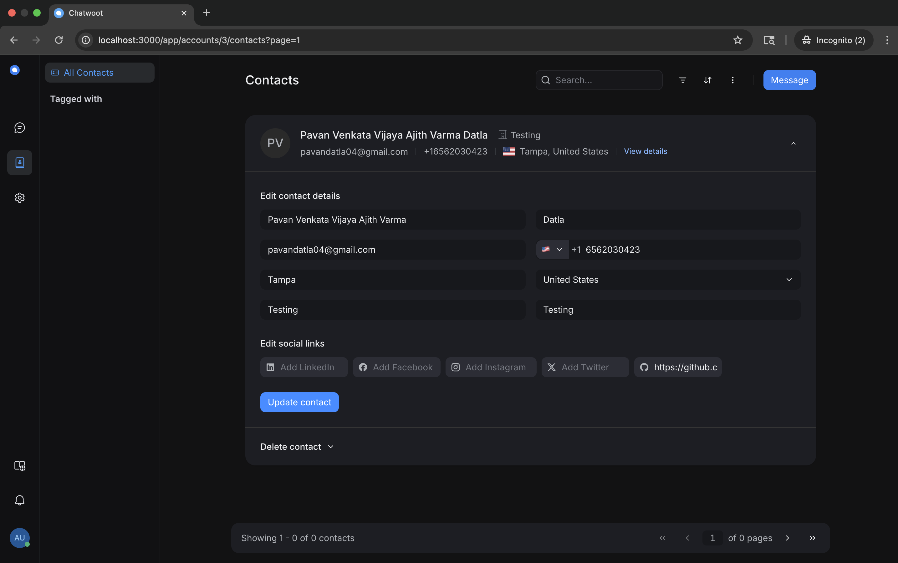 
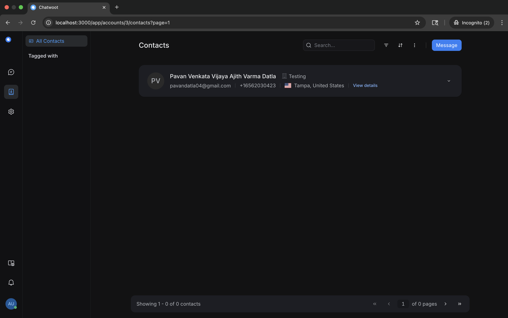 

- Click on **Settings** in the sidebar
- You should see the **Canned Responses** panel, you can **Add Canned response**, etc
- You can click on **Macros**, **Add a new macro** etc
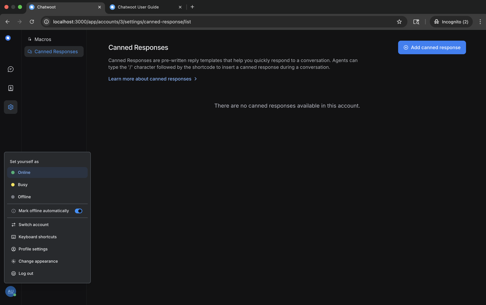 
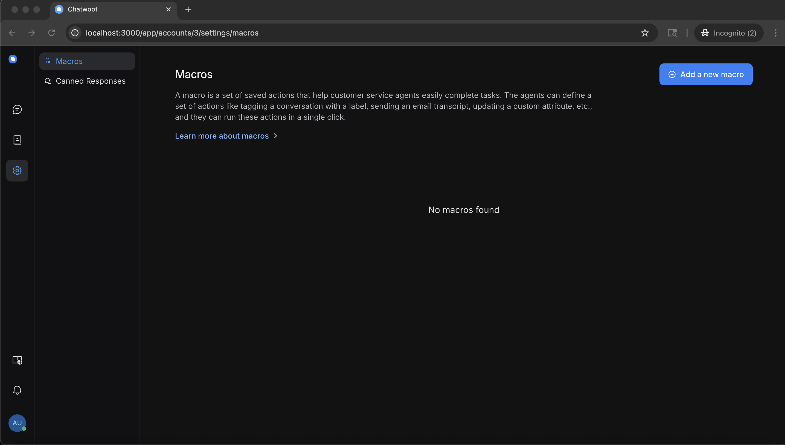 

- Click on **Chatwood user guide** in the sidebar
- You should see the **Chatwood user guide** will open in new page.
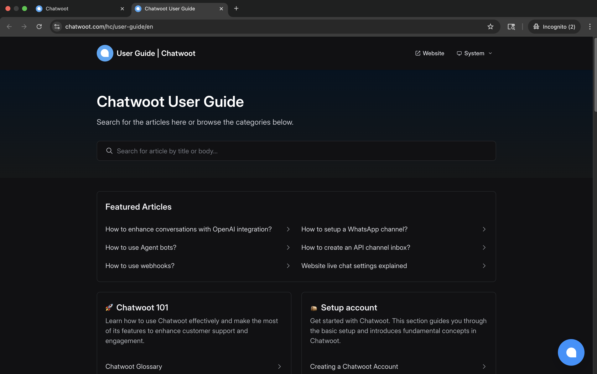 

- Click on **Notifications** in the sidebar
- You should see the **You have no Unread Notifications** panel
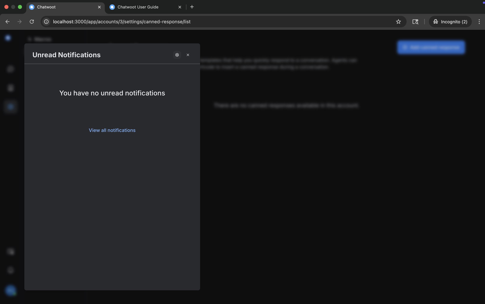 

- Click on **Profile Settings** in the sidebar
- You should see the **Set yourself options, profile settings , logout, etc** options, you click and see if they are working or not
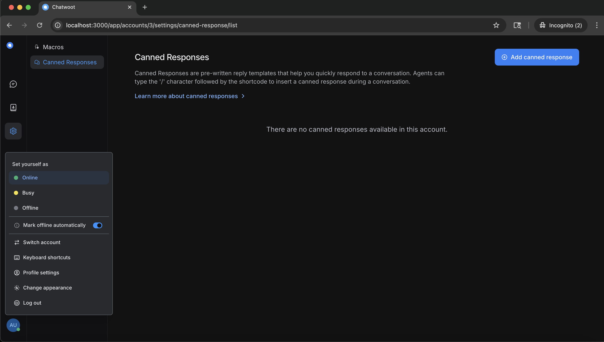 

### ✅ Step 6: Test Sign-Out Functionality

🧪 Test 6: Sign Out Works  
- Click on profile settings and choose **logout**
- After logging out you should see loginPage.
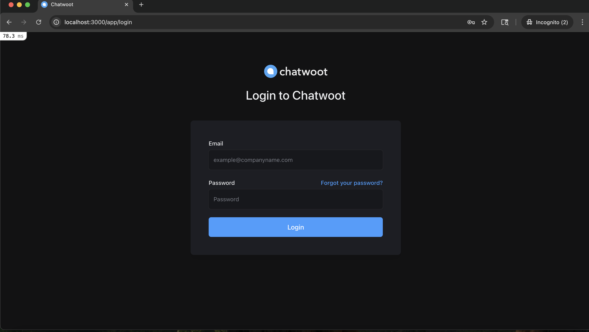 

### 🔑 Initial Account Setup

After installing and running the application, you'll need to create an admin user and set up the initial account. Follow these steps:

#### Step 1: Create Admin User
In the Rails console (run `bundle exec rails console`), create your admin user:

```ruby
user = User.create!(
  email: 'admin@example.com',
  password: 'Admin@123',
  password_confirmation: 'Admin@123',
  name: 'Admin User',
  confirmed_at: Time.zone.now
)
```

#### Step 2: Create Organization Account
Still in the Rails console:

```ruby
account = Account.create!(name: "My Organization")
```

#### Step 3: Link User to Account as Administrator
Finally, create the administrator association:

```ruby
AccountUser.create!(account_id: account.id, user_id: user.id, role: 0)
```

#### Step 4: Verify Setup
1. Log out if you're currently logged in
2. Go to http://localhost:3000
3. Log in with:
   - Email: admin@example.com
   - Password: Admin@123
4. You should now see the full dashboard

#### Troubleshooting Account Setup
- If you see a blank screen after login, ensure you've completed all three steps above
- If you get stuck in the Rails console with a `:` or `(END)` prompt, press 'q' to return to the console prompt
- Make sure to run each command separately and wait for confirmation before proceeding to the next step

### ⚠️ Important Note About Inbox and Labels
After initial setup, you might notice that the Inbox and Labels sections are not clickable or appear inactive. This is normal because:

1. **Inbox**: 
   - Requires additional setup to be functional
   - You need to create and configure at least one inbox channel (like Web Widget, Email, or API)
   - To set up your first inbox, use the Rails console:
   ```ruby
   # In Rails console (bundle exec rails console)
   web_widget = Channel::WebWidget.create!(account: account, website_url: 'https://mywebsite.com')
   inbox = Inbox.create!(channel: web_widget, account: account, name: 'Website Inbox')
   InboxMember.create!(user: user, inbox: inbox)
   ```

2. **Labels**:
   - Labels become active only after you have at least one inbox and conversation
   - You need to create conversations first before you can use labels
   - This is by design as labels are used to organize conversations

These features will become accessible once you've completed the additional setup steps. For development purposes, you can set these up using the Rails console commands provided above.

## 📦 Final Notes

- Chatwoot setup completed successfully on **macOS M1/M2 (Apple Silicon)**  
- Backend (Rails) and Frontend (Vite) are running as expected  
- All core features: Signup, Login, Dashboard, Conversations, Logout tested successfully  
- Troubleshooting issues were resolved with environment fixes and dependency setup

If any part of the setup fails for new users:
👉 Refer to the troubleshooting section above
👉 Make sure Postgres and Redis services are running
👉 Run `bundle install`, `pnpm install`, and restart servers

🎉 Your Setup done!

### 🔄 Restarting Chatwoot After System Shutdown

When you restart your computer or need to run Chatwoot again, follow these steps:

1. **Start Required Services First**:
   ```bash
   # Start PostgreSQL if it's not running
   brew services start postgresql@14
   
   # Start Redis if it's not running
   brew services start redis
   ```

2. **Navigate to Project Directory**:
   ```bash
   cd /Users/PavanDatla/omnifylabs/chatwoot
   ```

3. **Start the Application**:
   ```bash
   # The easiest way (Recommended):
   pnpm dev
   ```
   This single command will start both the backend and frontend servers.

   OR, if you prefer to run them separately:
   ```bash
   # In one terminal:
   bundle exec rails s
   
   # In another terminal:
   bin/vite dev
   ```

4. **Access the Application**:
   - Open http://localhost:3000 in your browser
   - Log in with your credentials
   - You should see the dashboard with all your previous data intact

#### Troubleshooting Restart Issues:
- If you see database connection errors, make sure PostgreSQL is running
- If real-time features don't work, ensure Redis is running
- If you see "Address already in use" errors, you might have old processes still running. You can kill them with:
  ```bash
  # Find and kill processes using port 3000 (Rails)
  lsof -i :3000 | grep LISTEN | awk '{print $2}' | xargs kill -9
  
  # Find and kill processes using port 3036 (Vite)
  lsof -i :3036 | grep LISTEN | awk '{print $2}' | xargs kill -9
  ```

### 📝 Next Steps Implementing features

