# 📋 Sistema de Preview e Builder Visual de Variáveis - Chatwoot

## 📖 Índice

1. [Visão Geral](#-1-visão-geral)
2. [Arquitetura do Sistema](#-2-arquitetura-do-sistema)
3. [FASE 1: Preview Contextual](#-3-fase-1-preview-contextual)
4. [FASE 2: Builder Visual](#-4-fase-2-builder-visual)
5. [FASE 3: Funcionalidades Avançadas](#-5-fase-3-funcionalidades-avançadas)
6. [Implementação Técnica](#-6-implementação-técnica)
7. [Testes e Validação](#-7-testes-e-validação)
8. [Cronograma](#-8-cronograma)
9. [Notas de Desenvolvimento](#-9-notas-de-desenvolvimento)

---

## 🎯 1. Visão Geral

### **Objetivo Principal**
Criar um sistema de preview em tempo real para variáveis do Chatwoot que permita ao time comercial:
- Ver exatamente como suas mensagens ficam antes de enviar
- Criar templates complexos sem conhecimento técnico
- Usar dados reais dos contatos para validação

### **Contexto Atual**
- Sistema Liquid funcional no backend Ruby
- VariableList.vue com auto-complete
- WootMessageEditor com suporte a variáveis
- Falta preview visual e contexto real

### **Resultado Esperado**
- **FASE 1**: Preview humanizado com dados reais
- **FASE 2**: Builder visual para lógica condicional
- **FASE 3**: Funcionalidades avançadas

---

## 🏗️ 2. Arquitetura do Sistema

### **Componentes Principais**

```
PreviewSystem/
├── components/
│   ├── VariablePreview.vue          # Componente principal de preview
│   ├── PreviewPanel.vue             # Panel lateral de preview
│   ├── VisualBuilder.vue            # Builder visual para FASE 2
│   ├── ContextualPreview.vue        # Preview com dados reais
│   └── HumanizedPreview.vue         # Preview com nomes de campos
├── composables/
│   ├── useVariablePreview.js        # Lógica de processamento
│   ├── useContextualData.js         # Dados do contexto atual
│   └── useVisualBuilder.js          # Lógica do builder visual
├── stores/
│   └── previewContext.js            # Store para contexto de preview
└── utils/
    ├── liquidProcessor.js           # Processador JavaScript de Liquid
    ├── variableExtractor.js         # Extração de variáveis
    └── templateGenerator.js         # Gerador de templates
```

### **Fluxo de Dados**


---

## 🚀 3. FASE 1: Preview Contextual

### **3.1 Objetivos da FASE 1**
- [ ] Preview no chat com dados reais do contato atual
- [ ] Canned responses com preview humanizado
- [ ] Destaque visual sutil para diferençar preview
- [ ] Botão toggle para mostrar/esconder preview

### **3.2 Componentes a Implementar**

#### **A. ContextualPreview.vue**
**Localização**: `app/javascript/dashboard/components/widgets/conversation/`

```vue
<template>
  <div class="contextual-preview-container">
    
    <!-- Botão Toggle (só aparece se tem variáveis) -->
    <div v-if="hasVariables" class="preview-controls">
      <button 
        class="preview-toggle-btn"
        :class="{ active: showPreview }"
        @click="togglePreview"
      >
        <fluent-icon icon="eye" class="mr-2" />
        {{ showPreview ? 'Ocultar' : 'Visualizar' }} preview
      </button>
    </div>
    
    <!-- Preview Panel -->
    <transition name="preview-slide">
      <div v-if="showPreview" class="preview-panel">
        <div class="preview-header">
          <fluent-icon icon="preview" class="mr-2" />
          <span class="preview-title">
            Como {{ contextType === 'conversation' ? currentContact?.name || 'o contato' : 'ficará' }} verá:
          </span>
        </div>
        
        <div class="preview-content">
          <div 
            class="preview-message"
            :class="previewTypeClass"
            v-html="processedContent"
          ></div>
        </div>
        
        <!-- Status das Variáveis -->
        <div v-if="unresolvedVariables.length" class="variables-status">
          <div class="status-header">
            <fluent-icon icon="warning" class="mr-1 text-yellow-500" />
            <span class="text-sm text-yellow-700">Variáveis não encontradas:</span>
          </div>
          <div class="unresolved-list">
            <span 
              v-for="variable in unresolvedVariables" 
              :key="variable"
              class="unresolved-tag"
            >
              {{ variable }}
            </span>
          </div>
        </div>
        
      </div>
    </transition>
    
  </div>
</template>

<script>
import { ref, computed, watch } from 'vue';
import { useVariablePreview } from 'dashboard/composables/useVariablePreview';
import { useContextualData } from 'dashboard/composables/useContextualData';

export default {
  name: 'ContextualPreview',
  props: {
    content: { type: String, required: true },
    contextType: { type: String, default: 'conversation' }, // 'conversation' | 'settings'
    previewType: { type: String, default: 'contextual' }, // 'contextual' | 'humanized'
  },
  emits: ['preview-toggled'],
  setup(props, { emit }) {
    const showPreview = ref(false);
    
    const { processTemplate, extractVariables } = useVariablePreview();
    const { currentContact, currentAgent, currentConversation } = useContextualData();
    
    // Computed properties
    const detectedVariables = computed(() => extractVariables(props.content));
    const hasVariables = computed(() => detectedVariables.value.length > 0);
    
    const contextData = computed(() => ({
      'contact.name': currentContact.value?.name,
      'contact.email': currentContact.value?.email,
      'contact.phone': currentContact.value?.phone_number,
      'contact.custom_attribute': currentContact.value?.custom_attributes || {},
      'agent.name': currentAgent.value?.name,
      'agent.email': currentAgent.value?.email,
      'conversation.display_id': currentConversation.value?.display_id,
      'conversation.custom_attribute': currentConversation.value?.custom_attributes || {}
    }));
    
    const processedContent = computed(() => {
      if (props.previewType === 'humanized') {
        return processTemplateHumanized(props.content);
      }
      return processTemplate(props.content, contextData.value);
    });
    
    const unresolvedVariables = computed(() => {
      return detectedVariables.value.filter(variable => {
        const value = getNestedValue(contextData.value, variable);
        return !value;
      });
    });
    
    const previewTypeClass = computed(() => ({
      'preview-contextual': props.previewType === 'contextual',
      'preview-humanized': props.previewType === 'humanized',
      'preview-conversation': props.contextType === 'conversation',
      'preview-settings': props.contextType === 'settings'
    }));
    
    // Methods
    const togglePreview = () => {
      showPreview.value = !showPreview.value;
      emit('preview-toggled', showPreview.value);
    };
    
    const processTemplateHumanized = (content) => {
      const humanizedMap = {
        'contact.name': '[Nome do Contato]',
        'contact.first_name': '[Primeiro Nome]',
        'contact.last_name': '[Último Nome]',
        'contact.email': '[Email do Contato]',
        'contact.phone': '[Telefone do Contato]',
        'contact.custom_attribute.vip_status': '[Status VIP]',
        'contact.custom_attribute.customer_tier': '[Nível do Cliente]',
        'agent.name': '[Nome do Agente]',
        'agent.email': '[Email do Agente]',
        'conversation.display_id': '[Número da Conversa]',
        'conversation.custom_attribute.priority': '[Prioridade]'
      };
      
      let result = content;
      Object.entries(humanizedMap).forEach(([variable, humanName]) => {
        const regex = new RegExp(`\\{\\{\\s*${variable.replace('.', '\\.')}\\s*\\}\\}`, 'g');
        result = result.replace(regex, humanName);
      });
      
      return result;
    };
    
    const getNestedValue = (obj, path) => {
      return path.split('.').reduce((current, key) => {
        return current?.[key];
      }, obj);
    };
    
    // Watchers
    watch(() => props.content, () => {
      // Auto-show preview if variables are detected and none shown yet
      if (hasVariables.value && !showPreview.value) {
        // Could auto-show here or leave manual
      }
    });
    
    return {
      showPreview,
      hasVariables,
      processedContent,
      unresolvedVariables,
      previewTypeClass,
      togglePreview
    };
  }
};
</script>

<style scoped>
/* Botão Toggle */
.preview-toggle-btn {
  @apply flex items-center px-3 py-2 text-sm bg-blue-50 text-blue-700 border border-blue-200 rounded-md hover:bg-blue-100 transition-colors;
}

.preview-toggle-btn.active {
  @apply bg-blue-100 text-blue-800;
}

/* Preview Panel */
.preview-panel {
  @apply mt-3 border border-gray-200 rounded-lg overflow-hidden;
}

.preview-header {
  @apply flex items-center px-3 py-2 bg-gray-50 border-b border-gray-200;
}

.preview-title {
  @apply text-sm font-medium text-gray-700;
}

.preview-content {
  @apply p-3;
}

/* Preview Messages */
.preview-message {
  @apply p-3 rounded-lg border-l-4 relative;
}

.preview-contextual {
  @apply bg-blue-50 border-blue-400;
}

.preview-humanized {
  @apply bg-green-50 border-green-400;
}

.preview-conversation {
  @apply bg-purple-50 border-purple-400;
}

.preview-settings {
  @apply bg-amber-50 border-amber-400;
}

.preview-message::before {
  content: "PREVIEW";
  @apply absolute -top-2 right-2 text-xs bg-current text-white px-2 py-1 rounded opacity-70;
}

/* Variables Status */
.variables-status {
  @apply px-3 py-2 bg-yellow-50 border-t border-yellow-200;
}

.status-header {
  @apply flex items-center mb-2;
}

.unresolved-list {
  @apply flex flex-wrap gap-1;
}

.unresolved-tag {
  @apply text-xs bg-yellow-200 text-yellow-800 px-2 py-1 rounded;
}

/* Animations */
.preview-slide-enter-active,
.preview-slide-leave-active {
  transition: all 0.3s ease;
}

.preview-slide-enter-from,
.preview-slide-leave-to {
  opacity: 0;
  transform: translateY(-10px);
}
</style>
```

#### **B. Modificações em ReplyBox.vue**
**Localização**: `app/javascript/dashboard/components/widgets/conversation/ReplyBox.vue`

**Alterações necessárias**:
```vue
<!-- Adicionar após o WootMessageEditor -->
<ContextualPreview
  :content="message"
  context-type="conversation"
  preview-type="contextual"
  class="mt-2"
/>
```

#### **C. Modificações em AddCanned.vue e EditCanned.vue**
**Localização**: `app/javascript/dashboard/routes/dashboard/settings/canned/`

**Alterações necessárias**:
```vue
<!-- Adicionar após o WootMessageEditor -->
<ContextualPreview
  :content="content"
  context-type="settings"
  preview-type="humanized"
  class="mt-3"
/>
```

#### **D. Modificações em CannedResponse.vue**
**Localização**: `app/javascript/dashboard/components/widgets/conversation/CannedResponse.vue`

**Alterações necessárias**:
```vue
<!-- Adicionar preview automático quando item é hoverable/selected -->
<div v-if="showPreview" class="canned-preview-inline">
  <div class="preview-divider">
    <span class="preview-label">👁️ Preview:</span>
  </div>
  <div class="preview-content-canned">
    {{ processedCannedContent }}
  </div>
</div>
```

### **3.3 Composables a Implementar**

#### **A. useVariablePreview.js**
**Localização**: `app/javascript/dashboard/composables/useVariablePreview.js`

```javascript
import { ref, computed } from 'vue';

export function useVariablePreview() {
  // Extrai todas as variáveis de um template
  const extractVariables = (content) => {
    const regex = /\{\{([^}]+)\}\}/g;
    const variables = [];
    let match;
    
    while ((match = regex.exec(content)) !== null) {
      const variable = match[1].trim();
      if (!variables.includes(variable)) {
        variables.push(variable);
      }
    }
    
    return variables;
  };
  
  // Processa template com dados reais
  const processTemplate = (template, data) => {
    let result = template;
    
    const processNestedVariable = (variable, data) => {
      const keys = variable.split('.');
      let value = data;
      
      for (const key of keys) {
        if (value && typeof value === 'object') {
          value = value[key];
        } else {
          return null;
        }
      }
      
      return value;
    };
    
    // Substitui todas as variáveis
    result = result.replace(/\{\{([^}]+)\}\}/g, (match, variable) => {
      const trimmedVar = variable.trim();
      const value = processNestedVariable(trimmedVar, data);
      
      if (value !== null && value !== undefined) {
        return String(value);
      }
      
      return match; // Mantém original se não encontrou valor
    });
    
    return result;
  };
  
  // Verifica se template tem variáveis
  const hasVariables = (content) => {
    return /\{\{([^}]+)\}\}/.test(content);
  };
  
  // Valida se todas as variáveis podem ser resolvidas
  const validateTemplate = (template, data) => {
    const variables = extractVariables(template);
    const resolved = [];
    const unresolved = [];
    
    variables.forEach(variable => {
      const value = processNestedVariable(variable, data);
      if (value !== null && value !== undefined) {
        resolved.push(variable);
      } else {
        unresolved.push(variable);
      }
    });
    
    return { resolved, unresolved, isValid: unresolved.length === 0 };
  };
  
  return {
    extractVariables,
    processTemplate,
    hasVariables,
    validateTemplate
  };
}
```

#### **B. useContextualData.js**
**Localização**: `app/javascript/dashboard/composables/useContextualData.js`

```javascript
import { computed } from 'vue';
import { useRoute } from 'vue-router';
import { useStoreGetters } from 'dashboard/composables/store';

export function useContextualData() {
  const route = useRoute();
  const getters = useStoreGetters();
  
  // Contato atual baseado na conversa ativa
  const currentContact = computed(() => {
    const conversationId = route.params.conversationId;
    if (conversationId) {
      const conversation = getters.getConversationById.value(conversationId);
      return conversation?.meta?.sender;
    }
    return null;
  });
  
  // Conversa atual
  const currentConversation = computed(() => {
    const conversationId = route.params.conversationId;
    if (conversationId) {
      return getters.getConversationById.value(conversationId);
    }
    return null;
  });
  
  // Agente atual
  const currentAgent = computed(() => {
    return getters.getCurrentUser.value;
  });
  
  // Inbox atual
  const currentInbox = computed(() => {
    const conversation = currentConversation.value;
    if (conversation?.inbox_id) {
      return getters.getInboxById.value(conversation.inbox_id);
    }
    return null;
  });
  
  // Conta atual
  const currentAccount = computed(() => {
    return getters.getCurrentAccount.value;
  });
  
  // Detecta contexto automaticamente
  const contextType = computed(() => {
    if (route.name && route.name.includes('conversation')) {
      return 'conversation';
    }
    if (route.name && route.name.includes('settings')) {
      return 'settings';
    }
    return 'unknown';
  });
  
  // Dados completos para processamento
  const contextData = computed(() => ({
    contact: currentContact.value,
    agent: currentAgent.value,
    conversation: currentConversation.value,
    inbox: currentInbox.value,
    account: currentAccount.value,
    contextType: contextType.value
  }));
  
  return {
    currentContact,
    currentAgent,
    currentConversation,
    currentInbox,
    currentAccount,
    contextType,
    contextData
  };
}
```

### **3.4 Checklist de Implementação - FASE 1**

#### **Preparação**
- [ ] Criar estrutura de pastas para componentes de preview
- [ ] Configurar composables necessários
- [ ] Definir estilos CSS globais para preview

#### **Desenvolvimento**
- [ ] Implementar `ContextualPreview.vue`
- [ ] Implementar `useVariablePreview.js`
- [ ] Implementar `useContextualData.js`
- [ ] Integrar preview no `ReplyBox.vue`
- [ ] Integrar preview humanizado no `AddCanned.vue`
- [ ] Integrar preview humanizado no `EditCanned.vue`
- [ ] Modificar `CannedResponse.vue` para mostrar preview

#### **Testes**
- [ ] Testar preview contextual em conversa ativa
- [ ] Testar preview humanizado em canned responses
- [ ] Testar com variáveis inexistentes
- [ ] Testar com custom attributes
- [ ] Validar estilos visuais
- [ ] Testar responsividade

#### **Polimento**
- [ ] Ajustar transições e animações
- [ ] Otimizar performance
- [ ] Adicionar loading states
- [ ] Implementar error handling
- [ ] Documentar componentes

---

## 🔨 4. FASE 2: Builder Visual

### **4.1 Objetivos da FASE 2**
- [ ] Interface visual para criação de templates complexos
- [ ] Blocos drag-and-drop para lógica condicional
- [ ] Preview em tempo real durante construção
- [ ] Geração automática de código Liquid
- [ ] Modo avançado nas canned responses

### **4.2 Componentes a Implementar**

#### **A. VisualBuilder.vue**
**Localização**: `app/javascript/dashboard/components/widgets/VisualBuilder/`

```vue
<template>
  <div class="visual-builder-container">
    
    <!-- Header com Modos -->
    <div class="builder-header">
      <div class="builder-modes">
        <button 
          :class="{ active: mode === 'simple' }" 
          @click="setMode('simple')"
          class="mode-btn"
        >
          <fluent-icon icon="edit" class="mr-2" />
          Texto Simples
        </button>
        <button 
          :class="{ active: mode === 'visual' }" 
          @click="setMode('visual')"
          class="mode-btn"
        >
          <fluent-icon icon="design-ideas" class="mr-2" />
          Builder Visual
        </button>
      </div>
      
      <div class="builder-actions">
        <button @click="clearAll" class="action-btn danger">
          <fluent-icon icon="delete" class="mr-1" />
          Limpar Tudo
        </button>
        <button @click="exportTemplate" class="action-btn">
          <fluent-icon icon="code" class="mr-1" />
          Ver Código
        </button>
      </div>
    </div>
    
    <!-- Modo Visual -->
    <div v-if="mode === 'visual'" class="visual-mode">
      
      <!-- Paleta de Blocos -->
      <div class="blocks-palette">
        <h4 class="palette-title">🧱 Componentes</h4>
        
        <div class="palette-section">
          <h5 class="section-title">Básicos</h5>
          <div 
            v-for="blockType in basicBlocks" 
            :key="blockType.type"
            class="palette-item" 
            draggable
            @dragstart="startDrag($event, blockType)"
          >
            <span class="block-icon">{{ blockType.icon }}</span>
            <span class="block-name">{{ blockType.name }}</span>
          </div>
        </div>
        
        <div class="palette-section">
          <h5 class="section-title">Lógica</h5>
          <div 
            v-for="blockType in logicBlocks" 
            :key="blockType.type"
            class="palette-item" 
            draggable
            @dragstart="startDrag($event, blockType)"
          >
            <span class="block-icon">{{ blockType.icon }}</span>
            <span class="block-name">{{ blockType.name }}</span>
          </div>
        </div>
        
        <div class="palette-section">
          <h5 class="section-title">Dados</h5>
          <div 
            v-for="blockType in dataBlocks" 
            :key="blockType.type"
            class="palette-item" 
            draggable
            @dragstart="startDrag($event, blockType)"
          >
            <span class="block-icon">{{ blockType.icon }}</span>
            <span class="block-name">{{ blockType.name }}</span>
          </div>
        </div>
      </div>
      
      <!-- Canvas de Construção -->
      <div class="builder-canvas">
        <div 
          class="canvas-area"
          @drop="handleDrop"
          @dragover.prevent
          @dragenter.prevent
        >
          
          <!-- Blocos Construídos -->
          <div 
            v-for="(block, index) in blocks" 
            :key="block.id"
            class="canvas-block"
            :class="{ 'block-selected': selectedBlock === block.id }"
          >
            
            <!-- Bloco de Texto -->
            <TextBlock
              v-if="block.type === 'text'"
              :block="block"
              :selected="selectedBlock === block.id"
              @update="updateBlock(index, $event)"
              @select="selectBlock(block.id)"
              @delete="deleteBlock(index)"
            />
            
            <!-- Bloco de Variável -->
            <VariableBlock
              v-if="block.type === 'variable'"
              :block="block"
              :selected="selectedBlock === block.id"
              @update="updateBlock(index, $event)"
              @select="selectBlock(block.id)"
              @delete="deleteBlock(index)"
            />
            
            <!-- Bloco Condicional -->
            <ConditionalBlock
              v-if="block.type === 'condition'"
              :block="block"
              :selected="selectedBlock === block.id"
              @update="updateBlock(index, $event)"
              @select="selectBlock(block.id)"
              @delete="deleteBlock(index)"
            />
            
          </div>
          
          <!-- Zona de Drop quando vazio -->
          <div v-if="blocks.length === 0" class="empty-canvas">
            <fluent-icon icon="design-ideas" class="empty-icon" />
            <p class="empty-text">Arraste componentes da paleta para começar a construir</p>
          </div>
          
        </div>
        
        <!-- Botão Adicionar Bloco -->
        <div class="add-block-section">
          <button @click="showQuickAdd = !showQuickAdd" class="add-block-btn">
            <fluent-icon icon="add-circle" class="mr-2" />
            Adicionar Componente
          </button>
          
          <!-- Quick Add Menu -->
          <div v-if="showQuickAdd" class="quick-add-menu">
            <button 
              v-for="blockType in [...basicBlocks, ...logicBlocks]" 
              :key="blockType.type"
              @click="addBlock(blockType)"
              class="quick-add-item"
            >
              <span class="block-icon">{{ blockType.icon }}</span>
              <span>{{ blockType.name }}</span>
            </button>
          </div>
        </div>
        
      </div>
      
      <!-- Preview em Tempo Real -->
      <div class="live-preview-section">
        <div class="preview-header">
          <h4 class="preview-title">👁️ Pré-visualização</h4>
          <div class="preview-modes">
            <button 
              :class="{ active: previewMode === 'humanized' }" 
              @click="previewMode = 'humanized'"
              class="preview-mode-btn"
            >
              [Campos]
            </button>
            <button 
              :class="{ active: previewMode === 'sample' }" 
              @click="previewMode = 'sample'"
              class="preview-mode-btn"
            >
              Dados Exemplo
            </button>
          </div>
        </div>
        
        <div class="preview-content">
          <div 
            class="preview-output"
            :class="`preview-${previewMode}`"
          >
            {{ generatedPreview }}
          </div>
        </div>
        
        <!-- Código Liquid Gerado -->
        <div v-if="showLiquidCode" class="liquid-code-section">
          <div class="code-header">
            <span class="code-title">📄 Código Liquid Gerado</span>
            <button @click="copyCode" class="copy-btn">
              <fluent-icon icon="copy" class="mr-1" />
              Copiar
            </button>
          </div>
          <pre class="liquid-code"><code>{{ generatedLiquid }}</code></pre>
        </div>
      </div>
      
    </div>
    
    <!-- Modo Simples (Texto) -->
    <div v-else class="simple-mode">
      <WootMessageEditor
        v-model="simpleContent"
        enable-variables
        :placeholder="'Digite sua mensagem aqui...'"
        class="simple-editor"
      />
    </div>
    
  </div>
</template>

<script>
import { ref, computed, watch } from 'vue';
import { useVisualBuilder } from 'dashboard/composables/useVisualBuilder';
import TextBlock from './blocks/TextBlock.vue';
import VariableBlock from './blocks/VariableBlock.vue';
import ConditionalBlock from './blocks/ConditionalBlock.vue';

export default {
  name: 'VisualBuilder',
  components: {
    TextBlock,
    VariableBlock,
    ConditionalBlock
  },
  props: {
    initialContent: { type: String, default: '' },
    builderMode: { type: String, default: 'simple' }
  },
  emits: ['content-updated', 'mode-changed'],
  setup(props, { emit }) {
    const mode = ref(props.builderMode);
    const showQuickAdd = ref(false);
    const showLiquidCode = ref(false);
    const selectedBlock = ref(null);
    const previewMode = ref('humanized');
    const simpleContent = ref(props.initialContent);
    
    const {
      blocks,
      addBlock,
      updateBlock,
      deleteBlock,
      clearAllBlocks,
      generateLiquid,
      generatePreview,
      basicBlocks,
      logicBlocks,
      dataBlocks
    } = useVisualBuilder();
    
    // Computed
    const generatedLiquid = computed(() => generateLiquid(blocks.value));
    const generatedPreview = computed(() => {
      const liquid = generatedLiquid.value;
      return generatePreview(liquid, previewMode.value);
    });
    
    // Methods
    const setMode = (newMode) => {
      mode.value = newMode;
      emit('mode-changed', newMode);
    };
    
    const startDrag = (event, blockType) => {
      event.dataTransfer.setData('blockType', JSON.stringify(blockType));
    };
    
    const handleDrop = (event) => {
      event.preventDefault();
      const blockTypeData = event.dataTransfer.getData('blockType');
      if (blockTypeData) {
        const blockType = JSON.parse(blockTypeData);
        addBlock(blockType);
      }
    };
    
    const selectBlock = (blockId) => {
      selectedBlock.value = blockId;
    };
    
    const clearAll = () => {
      if (confirm('Tem certeza que deseja limpar tudo?')) {
        clearAllBlocks();
        selectedBlock.value = null;
      }
    };
    
    const exportTemplate = () => {
      showLiquidCode.value = !showLiquidCode.value;
    };
    
    const copyCode = async () => {
      try {
        await navigator.clipboard.writeText(generatedLiquid.value);
        // Show success toast
      } catch (err) {
        console.error('Failed to copy:', err);
      }
    };
    
    // Watchers
    watch([generatedLiquid, simpleContent], () => {
      const content = mode.value === 'visual' ? generatedLiquid.value : simpleContent.value;
      emit('content-updated', content);
    });
    
    return {
      mode,
      blocks,
      showQuickAdd,
      showLiquidCode,
      selectedBlock,
      previewMode,
      simpleContent,
      generatedLiquid,
      generatedPreview,
      basicBlocks,
      logicBlocks,
      dataBlocks,
      setMode,
      addBlock,
      updateBlock,
      deleteBlock,
      startDrag,
      handleDrop,
      selectBlock,
      clearAll,
      exportTemplate,
      copyCode
    };
  }
};
</script>

<style scoped>
/* Container Principal */
.visual-builder-container {
  @apply flex flex-col h-full bg-white border border-gray-200 rounded-lg overflow-hidden;
}

/* Header */
.builder-header {
  @apply flex items-center justify-between p-4 bg-gray-50 border-b border-gray-200;
}

.builder-modes {
  @apply flex gap-2;
}

.mode-btn {
  @apply flex items-center px-4 py-2 text-sm font-medium border rounded-md transition-colors;
}

.mode-btn:not(.active) {
  @apply bg-white text-gray-700 border-gray-300 hover:bg-gray-50;
}

.mode-btn.active {
  @apply bg-blue-100 text-blue-700 border-blue-300;
}

.builder-actions {
  @apply flex gap-2;
}

.action-btn {
  @apply flex items-center px-3 py-2 text-sm border rounded-md transition-colors;
}

.action-btn:not(.danger) {
  @apply bg-white text-gray-700 border-gray-300 hover:bg-gray-50;
}

.action-btn.danger {
  @apply bg-red-50 text-red-700 border-red-300 hover:bg-red-100;
}

/* Modo Visual */
.visual-mode {
  @apply flex flex-1 min-h-0;
}

/* Paleta de Blocos */
.blocks-palette {
  @apply w-64 bg-gray-50 border-r border-gray-200 overflow-y-auto;
}

.palette-title {
  @apply px-4 py-3 text-lg font-semibold text-gray-800 border-b border-gray-200;
}

.palette-section {
  @apply p-4 border-b border-gray-200;
}

.section-title {
  @apply text-sm font-medium text-gray-600 mb-3;
}

.palette-item {
  @apply flex items-center gap-3 p-3 mb-2 bg-white border border-gray-200 rounded-lg cursor-grab hover:bg-gray-50 hover:border-gray-300 transition-colors;
}

.palette-item:active {
  @apply cursor-grabbing;
}

.block-icon {
  @apply text-lg;
}

.block-name {
  @apply text-sm font-medium text-gray-700;
}

/* Canvas */
.builder-canvas {
  @apply flex-1 flex flex-col min-h-0;
}

.canvas-area {
  @apply flex-1 p-4 overflow-y-auto;
}

.empty-canvas {
  @apply flex flex-col items-center justify-center h-full text-center text-gray-500;
}

.empty-icon {
  @apply text-6xl mb-4 text-gray-300;
}

.empty-text {
  @apply text-lg;
}

.canvas-block {
  @apply mb-4 p-1 rounded-lg transition-all;
}

.canvas-block:hover {
  @apply bg-blue-50;
}

.canvas-block.block-selected {
  @apply bg-blue-100 ring-2 ring-blue-300;
}

/* Add Block Section */
.add-block-section {
  @apply relative p-4 border-t border-gray-200 bg-gray-50;
}

.add-block-btn {
  @apply flex items-center justify-center w-full p-3 bg-white border-2 border-dashed border-gray-300 rounded-lg text-gray-600 hover:bg-gray-50 hover:border-gray-400 transition-colors;
}

.quick-add-menu {
  @apply absolute bottom-full left-4 right-4 mb-2 bg-white border border-gray-200 rounded-lg shadow-lg z-10;
}

.quick-add-item {
  @apply flex items-center gap-3 w-full p-3 text-left hover:bg-gray-50 transition-colors first:rounded-t-lg last:rounded-b-lg;
}

/* Preview Section */
.live-preview-section {
  @apply w-80 border-l border-gray-200 bg-white overflow-y-auto;
}

.preview-header {
  @apply flex items-center justify-between p-4 border-b border-gray-200;
}

.preview-title {
  @apply text-lg font-semibold text-gray-800;
}

.preview-modes {
  @apply flex gap-1;
}

.preview-mode-btn {
  @apply px-3 py-1 text-sm border rounded transition-colors;
}

.preview-mode-btn:not(.active) {
  @apply bg-white text-gray-600 border-gray-300 hover:bg-gray-50;
}

.preview-mode-btn.active {
  @apply bg-blue-100 text-blue-700 border-blue-300;
}

.preview-content {
  @apply p-4;
}

.preview-output {
  @apply p-4 rounded-lg border-l-4 min-h-[100px] whitespace-pre-wrap;
}

.preview-humanized {
  @apply bg-green-50 border-green-400 text-green-800;
}

.preview-sample {
  @apply bg-blue-50 border-blue-400 text-blue-800;
}

/* Liquid Code Section */
.liquid-code-section {
  @apply border-t border-gray-200 bg-gray-50;
}

.code-header {
  @apply flex items-center justify-between p-4 border-b border-gray-200;
}

.code-title {
  @apply text-sm font-medium text-gray-700;
}

.copy-btn {
  @apply flex items-center px-2 py-1 text-xs bg-white border border-gray-300 rounded hover:bg-gray-50 transition-colors;
}

.liquid-code {
  @apply p-4 bg-gray-900 text-green-400 text-sm overflow-x-auto;
}

/* Modo Simples */
.simple-mode {
  @apply flex-1 p-4;
}

.simple-editor {
  @apply min-h-[300px];
}
</style>
```

#### **B. Blocos Individuais**

**TextBlock.vue**:
```vue
<template>
  <div class="text-block" :class="{ selected }">
    <div class="block-header">
      <div class="block-info">
        <fluent-icon icon="text-field" class="block-icon" />
        <span class="block-title">Texto</span>
      </div>
      <div class="block-actions">
        <button @click="$emit('select')" class="action-btn" title="Selecionar">
          <fluent-icon icon="target" />
        </button>
        <button @click="$emit('delete')" class="action-btn danger" title="Excluir">
          <fluent-icon icon="delete" />
        </button>
      </div>
    </div>
    
    <div class="block-content">
      <textarea
        :value="block.content"
        @input="updateContent"
        @focus="$emit('select')"
        placeholder="Digite seu texto aqui..."
        class="text-input"
        rows="3"
      ></textarea>
    </div>
  </div>
</template>

<script>
export default {
  name: 'TextBlock',
  props: {
    block: { type: Object, required: true },
    selected: { type: Boolean, default: false }
  },
  emits: ['update', 'select', 'delete'],
  methods: {
    updateContent(event) {
      this.$emit('update', {
        ...this.block,
        content: event.target.value
      });
    }
  }
};
</script>

<style scoped>
.text-block {
  @apply border border-gray-200 rounded-lg overflow-hidden bg-white;
}

.text-block.selected {
  @apply ring-2 ring-blue-300 border-blue-300;
}

.block-header {
  @apply flex items-center justify-between p-3 bg-gray-50 border-b border-gray-200;
}

.block-info {
  @apply flex items-center gap-2;
}

.block-icon {
  @apply text-blue-600;
}

.block-title {
  @apply text-sm font-medium text-gray-700;
}

.block-actions {
  @apply flex gap-1;
}

.action-btn {
  @apply p-1 rounded hover:bg-gray-200 transition-colors;
}

.action-btn.danger {
  @apply text-red-600 hover:bg-red-100;
}

.block-content {
  @apply p-3;
}

.text-input {
  @apply w-full border border-gray-300 rounded px-3 py-2 text-sm resize-none focus:ring-2 focus:ring-blue-500 focus:border-transparent;
}
</style>
```

**VariableBlock.vue**:
```vue
<template>
  <div class="variable-block" :class="{ selected }">
    <div class="block-header">
      <div class="block-info">
        <fluent-icon icon="database" class="block-icon" />
        <span class="block-title">Variável</span>
      </div>
      <div class="block-actions">
        <button @click="$emit('select')" class="action-btn" title="Selecionar">
          <fluent-icon icon="target" />
        </button>
        <button @click="$emit('delete')" class="action-btn danger" title="Excluir">
          <fluent-icon icon="delete" />
        </button>
      </div>
    </div>
    
    <div class="block-content">
      <div class="form-group">
        <label class="form-label">Variável:</label>
        <select
          :value="block.variable"
          @change="updateVariable"
          @focus="$emit('select')"
          class="form-select"
        >
          <option value="">Selecione uma variável</option>
          <optgroup label="Contato">
            <option value="contact.name">Nome do Contato</option>
            <option value="contact.first_name">Primeiro Nome</option>
            <option value="contact.last_name">Último Nome</option>
            <option value="contact.email">Email do Contato</option>
            <option value="contact.phone">Telefone do Contato</option>
          </optgroup>
          <optgroup label="Contato - Customizado">
            <option value="contact.custom_attribute.vip_status">Status VIP</option>
            <option value="contact.custom_attribute.customer_tier">Nível do Cliente</option>
            <option value="contact.custom_attribute.company">Empresa</option>
          </optgroup>
          <optgroup label="Agente">
            <option value="agent.name">Nome do Agente</option>
            <option value="agent.email">Email do Agente</option>
          </optgroup>
          <optgroup label="Conversa">
            <option value="conversation.display_id">Número da Conversa</option>
            <option value="conversation.custom_attribute.priority">Prioridade</option>
          </optgroup>
        </select>
      </div>
      
      <div class="form-group">
        <label class="form-label">Valor padrão (opcional):</label>
        <input
          :value="block.fallback"
          @input="updateFallback"
          @focus="$emit('select')"
          placeholder="ex: Cliente"
          class="form-input"
        />
      </div>
      
      <div v-if="block.variable" class="variable-preview">
        <span class="preview-label">Preview:</span>
        <code class="preview-code">{{ generatedVariable }}</code>
      </div>
    </div>
  </div>
</template>

<script>
export default {
  name: 'VariableBlock',
  props: {
    block: { type: Object, required: true },
    selected: { type: Boolean, default: false }
  },
  emits: ['update', 'select', 'delete'],
  computed: {
    generatedVariable() {
      if (!this.block.variable) return '';
      
      let liquid = `{{${this.block.variable}`;
      if (this.block.fallback) {
        liquid += ` | default: "${this.block.fallback}"`;
      }
      liquid += '}}';
      
      return liquid;
    }
  },
  methods: {
    updateVariable(event) {
      this.$emit('update', {
        ...this.block,
        variable: event.target.value
      });
    },
    
    updateFallback(event) {
      this.$emit('update', {
        ...this.block,
        fallback: event.target.value
      });
    }
  }
};
</script>

<style scoped>
.variable-block {
  @apply border border-gray-200 rounded-lg overflow-hidden bg-white;
}

.variable-block.selected {
  @apply ring-2 ring-green-300 border-green-300;
}

.block-header {
  @apply flex items-center justify-between p-3 bg-green-50 border-b border-gray-200;
}

.block-info {
  @apply flex items-center gap-2;
}

.block-icon {
  @apply text-green-600;
}

.block-title {
  @apply text-sm font-medium text-gray-700;
}

.block-actions {
  @apply flex gap-1;
}

.action-btn {
  @apply p-1 rounded hover:bg-green-100 transition-colors;
}

.action-btn.danger {
  @apply text-red-600 hover:bg-red-100;
}

.block-content {
  @apply p-3 space-y-3;
}

.form-group {
  @apply space-y-1;
}

.form-label {
  @apply block text-sm font-medium text-gray-700;
}

.form-select,
.form-input {
  @apply w-full border border-gray-300 rounded px-3 py-2 text-sm focus:ring-2 focus:ring-green-500 focus:border-transparent;
}

.variable-preview {
  @apply flex items-center gap-2 p-2 bg-gray-100 rounded;
}

.preview-label {
  @apply text-xs font-medium text-gray-600;
}

.preview-code {
  @apply text-xs bg-gray-800 text-green-400 px-2 py-1 rounded;
}
</style>
```

**ConditionalBlock.vue**:
```vue
<template>
  <div class="conditional-block" :class="{ selected }">
    <div class="block-header">
      <div class="block-info">
        <fluent-icon icon="branch" class="block-icon" />
        <span class="block-title">Se/Então</span>
      </div>
      <div class="block-actions">
        <button @click="$emit('select')" class="action-btn" title="Selecionar">
          <fluent-icon icon="target" />
        </button>
        <button @click="$emit('delete')" class="action-btn danger" title="Excluir">
          <fluent-icon icon="delete" />
        </button>
      </div>
    </div>
    
    <div class="block-content">
      <!-- Condição -->
      <div class="condition-section">
        <div class="section-header">
          <fluent-icon icon="question-circle" class="section-icon" />
          <span class="section-title">Se</span>
        </div>
        
        <div class="condition-builder">
          <select
            :value="block.variable"
            @change="updateVariable"
            @focus="$emit('select')"
            class="condition-select"
          >
            <option value="">Selecione campo</option>
            <option value="contact.custom_attribute.vip_status">Status VIP</option>
            <option value="contact.custom_attribute.customer_tier">Nível Cliente</option>
            <option value="contact.custom_attribute.company">Empresa</option>
            <option value="conversation.custom_attribute.priority">Prioridade</option>
          </select>
          
          <select
            :value="block.operator"
            @change="updateOperator"
            @focus="$emit('select')"
            class="condition-select"
          >
            <option value="==">é igual a</option>
            <option value="!=">é diferente de</option>
            <option value="contains">contém</option>
            <option value="blank">está vazio</option>
            <option value="present">tem valor</option>
          </select>
          
          <input
            v-if="needsValue"
            :value="block.value"
            @input="updateValue"
            @focus="$emit('select')"
            placeholder="Valor para comparar"
            class="condition-input"
          />
        </div>
      </div>
      
      <!-- Então -->
      <div class="then-section">
        <div class="section-header">
          <fluent-icon icon="checkmark-circle" class="section-icon text-green-600" />
          <span class="section-title">Então mostrar</span>
        </div>
        
        <textarea
          :value="block.thenContent"
          @input="updateThenContent"
          @focus="$emit('select')"
          placeholder="Mensagem quando a condição for verdadeira..."
          class="content-textarea"
          rows="3"
        ></textarea>
      </div>
      
      <!-- Senão -->
      <div class="else-section">
        <div class="section-header">
          <fluent-icon icon="dismiss-circle" class="section-icon text-gray-500" />
          <span class="section-title">Senão mostrar</span>
          <span class="optional-label">(opcional)</span>
        </div>
        
        <textarea
          :value="block.elseContent"
          @input="updateElseContent"
          @focus="$emit('select')"
          placeholder="Mensagem alternativa (opcional)..."
          class="content-textarea"
          rows="2"
        ></textarea>
      </div>
      
      <!-- Preview da Lógica -->
      <div v-if="block.variable" class="logic-preview">
        <div class="preview-header">
          <fluent-icon icon="code" class="mr-1" />
          <span class="preview-title">Lógica gerada:</span>
        </div>
        <pre class="logic-code">{{ generatedLogic }}</pre>
      </div>
    </div>
  </div>
</template>

<script>
export default {
  name: 'ConditionalBlock',
  props: {
    block: { type: Object, required: true },
    selected: { type: Boolean, default: false }
  },
  emits: ['update', 'select', 'delete'],
  computed: {
    needsValue() {
      return !['blank', 'present'].includes(this.block.operator);
    },
    
    generatedLogic() {
      if (!this.block.variable) return '';
      
      let condition = '';
      const variable = this.block.variable;
      const operator = this.block.operator;
      const value = this.block.value;
      
      switch (operator) {
        case '==':
          condition = `${variable} == "${value}"`;
          break;
        case '!=':
          condition = `${variable} != "${value}"`;
          break;
        case 'contains':
          condition = `${variable} contains "${value}"`;
          break;
        case 'blank':
          condition = `${variable} == blank`;
          break;
        case 'present':
          condition = `${variable} != blank`;
          break;
      }
      
      let liquid = `\n${this.block.thenContent || '  [Conteúdo do ENTÃO]'}`;
      
      if (this.block.elseContent) {
        liquid += `\n\n${this.block.elseContent}`;
      }
      
      liquid += '\n';
      
      return liquid;
    }
  },
  methods: {
    updateVariable(event) {
      this.$emit('update', {
        ...this.block,
        variable: event.target.value
      });
    },
    
    updateOperator(event) {
      this.$emit('update', {
        ...this.block,
        operator: event.target.value
      });
    },
    
    updateValue(event) {
      this.$emit('update', {
        ...this.block,
        value: event.target.value
      });
    },
    
    updateThenContent(event) {
      this.$emit('update', {
        ...this.block,
        thenContent: event.target.value
      });
    },
    
    updateElseContent(event) {
      this.$emit('update', {
        ...this.block,
        elseContent: event.target.value
      });
    }
  }
};
</script>

<style scoped>
.conditional-block {
  @apply border border-gray-200 rounded-lg overflow-hidden bg-white;
}

.conditional-block.selected {
  @apply ring-2 ring-purple-300 border-purple-300;
}

.block-header {
  @apply flex items-center justify-between p-3 bg-purple-50 border-b border-gray-200;
}

.block-info {
  @apply flex items-center gap-2;
}

.block-icon {
  @apply text-purple-600;
}

.block-title {
  @apply text-sm font-medium text-gray-700;
}

.block-actions {
  @apply flex gap-1;
}

.action-btn {
  @apply p-1 rounded hover:bg-purple-100 transition-colors;
}

.action-btn.danger {
  @apply text-red-600 hover:bg-red-100;
}

.block-content {
  @apply p-3 space-y-4;
}

.condition-section,
.then-section,
.else-section {
  @apply space-y-2;
}

.section-header {
  @apply flex items-center gap-2;
}

.section-icon {
  @apply text-sm;
}

.section-title {
  @apply text-sm font-medium text-gray-700;
}

.optional-label {
  @apply text-xs text-gray-500 ml-1;
}

.condition-builder {
  @apply flex gap-2 flex-wrap;
}

.condition-select {
  @apply flex-1 min-w-[120px] border border-gray-300 rounded px-3 py-2 text-sm focus:ring-2 focus:ring-purple-500 focus:border-transparent;
}

.condition-input {
  @apply flex-1 min-w-[120px] border border-gray-300 rounded px-3 py-2 text-sm focus:ring-2 focus:ring-purple-500 focus:border-transparent;
}

.content-textarea {
  @apply w-full border border-gray-300 rounded px-3 py-2 text-sm resize-none focus:ring-2 focus:ring-purple-500 focus:border-transparent;
}

.logic-preview {
  @apply border-t border-gray-200 pt-3 mt-3;
}

.preview-header {
  @apply flex items-center text-xs text-gray-600 mb-2;
}

.preview-title {
  @apply font-medium;
}

.logic-code {
  @apply text-xs bg-gray-900 text-green-400 p-3 rounded overflow-x-auto;
}
</style>
```

### **4.3 Composable para Builder Visual**

#### **useVisualBuilder.js**
**Localização**: `app/javascript/dashboard/composables/useVisualBuilder.js`

```javascript
import { ref, reactive } from 'vue';

export function useVisualBuilder() {
  const blocks = ref([]);
  const nextId = ref(1);
  
  // Tipos de blocos disponíveis
  const basicBlocks = [
    { type: 'text', name: 'Texto', icon: '📝' },
    { type: 'variable', name: 'Variável', icon: '📊' }
  ];
  
  const logicBlocks = [
    { type: 'condition', name: 'Se/Então', icon: '❓' },
    { type: 'loop', name: 'Repetir', icon: '🔄' }
  ];
  
  const dataBlocks = [
    { type: 'contact', name: 'Dados Contato', icon: '👤' },
    { type: 'custom', name: 'Campo Custom', icon: '⚙️' }
  ];
  
  // Funções de manipulação de blocos
  const addBlock = (blockType, position = -1) => {
    const newBlock = createBlock(blockType);
    
    if (position === -1) {
      blocks.value.push(newBlock);
    } else {
      blocks.value.splice(position, 0, newBlock);
    }
    
    return newBlock;
  };
  
  const createBlock = (blockType) => {
    const id = `block_${nextId.value++}`;
    
    const baseBlock = {
      id,
      type: blockType.type,
      created_at: new Date().toISOString()
    };
    
    switch (blockType.type) {
      case 'text':
        return {
          ...baseBlock,
          content: ''
        };
        
      case 'variable':
        return {
          ...baseBlock,
          variable: '',
          fallback: ''
        };
        
      case 'condition':
        return {
          ...baseBlock,
          variable: '',
          operator: '==',
          value: '',
          thenContent: '',
          elseContent: ''
        };
        
      case 'loop':
        return {
          ...baseBlock,
          collection: '',
          itemName: 'item',
          content: ''
        };
        
      default:
        return baseBlock;
    }
  };
  
  const updateBlock = (index, updatedBlock) => {
    if (index >= 0 && index < blocks.value.length) {
      blocks.value[index] = { ...updatedBlock };
    }
  };
  
  const deleteBlock = (index) => {
    if (index >= 0 && index < blocks.value.length) {
      blocks.value.splice(index, 1);
    }
  };
  
  const moveBlock = (fromIndex, toIndex) => {
    if (fromIndex >= 0 && fromIndex < blocks.value.length &&
        toIndex >= 0 && toIndex < blocks.value.length) {
      const block = blocks.value.splice(fromIndex, 1)[0];
      blocks.value.splice(toIndex, 0, block);
    }
  };
  
  const clearAllBlocks = () => {
    blocks.value = [];
    nextId.value = 1;
  };
  
  // Geração de código Liquid
  const generateLiquid = (blocksArray) => {
    return blocksArray.map(block => generateBlockLiquid(block)).join('\n');
  };
  
  const generateBlockLiquid = (block) => {
    switch (block.type) {
      case 'text':
        return block.content || '';
        
      case 'variable':
        let variable = `{{${block.variable}`;
        if (block.fallback) {
          variable += ` | default: "${block.fallback}"`;
        }
        variable += '}}';
        return variable;
        
      case 'condition':
        let condition = '';
        
        if (block.variable && block.operator) {
          let conditionCheck = '';
          
          switch (block.operator) {
            case '==':
              conditionCheck = `${block.variable} == "${block.value}"`;
              break;
            case '!=':
              conditionCheck = `${block.variable} != "${block.value}"`;
              break;
            case 'contains':
              conditionCheck = `${block.variable} contains "${block.value}"`;
              break;
            case 'blank':
              conditionCheck = `${block.variable} == blank`;
              break;
            case 'present':
              conditionCheck = `${block.variable} != blank`;
              break;
            default:
              conditionCheck = `${block.variable} == "${block.value}"`;
          }
          
          condition = `\n${block.thenContent || ''}`;
          
          if (block.elseContent) {
            condition += `\n\n${block.elseContent}`;
          }
          
          condition += '\n';
        }
        
        return condition;
        
      case 'loop':
        if (block.collection && block.content) {
          return `\n${block.content}\n`;
        }
        return '';
        
      default:
        return '';
    }
  };
  
  // Geração de preview
  const generatePreview = (liquidCode, mode = 'humanized') => {
    if (mode === 'humanized') {
      return generateHumanizedPreview(liquidCode);
    } else {
      return generateSamplePreview(liquidCode);
    }
  };
  
  const generateHumanizedPreview = (liquidCode) => {
    const humanizedMap = {
      'contact.name': '[Nome do Contato]',
      'contact.first_name': '[Primeiro Nome]',
      'contact.last_name': '[Último Nome]',
      'contact.email': '[Email do Contato]',
      'contact.phone': '[Telefone do Contato]',
      'contact.custom_attribute.vip_status': '[Status VIP]',
      'contact.custom_attribute.customer_tier': '[Nível do Cliente]',
      'contact.custom_attribute.company': '[Empresa]',
      'agent.name': '[Nome do Agente]',
      'agent.email': '[Email do Agente]',
      'conversation.display_id': '[Número da Conversa]',
      'conversation.custom_attribute.priority': '[Prioridade]'
    };
    
    let preview = liquidCode;
    
    // Remove tags Liquid para preview humanizado
    preview = preview.replace(/{% if [^%]+ %}/g, '');
    preview = preview.replace(//g, ' OU ');
    preview = preview.replace(//g, '');
    preview = preview.replace(/{% for [^%]+ %}/g, '');
    preview = preview.replace(//g, '');
    
    // Substitui variáveis por nomes humanizados
    Object.entries(humanizedMap).forEach(([variable, humanName]) => {
      const regex = new RegExp(`\\{\\{\\s*${variable.replace('.', '\\.')}[^}]*\\}\\}`, 'g');
      preview = preview.replace(regex, humanName);
    });
    
    return preview.trim();
  };
  
  const generateSamplePreview = (liquidCode) => {
    const sampleData = {
      'contact.name': 'João Silva',
      'contact.first_name': 'João',
      'contact.last_name': 'Silva',
      'contact.email': 'joao@email.com',
      'contact.phone': '+5511999887766',
      'contact.custom_attribute.vip_status': 'Gold',
      'contact.custom_attribute.customer_tier': 'Premium',
      'contact.custom_attribute.company': 'Tech Corp',
      'agent.name': 'Maria Santos',
      'agent.email': 'maria@empresa.com',
      'conversation.display_id': '#1234',
      'conversation.custom_attribute.priority': 'High'
    };
    
    let preview = liquidCode;
    
    // Simula processamento Liquid básico
    // Substitui variáveis simples
    Object.entries(sampleData).forEach(([variable, value]) => {
      const regex = new RegExp(`\\{\\{\\s*${variable.replace('.', '\\.')}[^}]*\\}\\}`, 'g');
      preview = preview.replace(regex, value);
    });
    
    // Processa condicionais básicas (simplificado)
    preview = preview.replace(/{% if [^%]*vip_status[^%]*== "Gold"[^%]+ %}([^{]*)([^{]*)/g, '$1');
    preview = preview.replace(/{% if [^%]*priority[^%]*== "High"[^%]+ %}([^{]*)([^{]*)/g, '$1');
    
    // Remove tags restantes
    preview = preview.replace(/{%[^%]*%}/g, '');
    
    return preview.trim();
  };
  
  // Validação
  const validateBlocks = (blocksArray) => {
    const errors = [];
    
    blocksArray.forEach((block, index) => {
      switch (block.type) {
        case 'text':
          if (!block.content?.trim()) {
            errors.push(`Bloco ${index + 1}: Texto não pode estar vazio`);
          }
          break;
          
        case 'variable':
          if (!block.variable) {
            errors.push(`Bloco ${index + 1}: Selecione uma variável`);
          }
          break;
          
        case 'condition':
          if (!block.variable) {
            errors.push(`Bloco ${index + 1}: Selecione um campo para a condição`);
          }
          if (!block.thenContent?.trim()) {
            errors.push(`Bloco ${index + 1}: Conteúdo do "Então" é obrigatório`);
          }
          break;
      }
    });
    
    return {
      isValid: errors.length === 0,
      errors
    };
  };
  
  // Import/Export
  const exportTemplate = (blocksArray) => {
    return {
      version: '1.0',
      created_at: new Date().toISOString(),
      blocks: blocksArray,
      liquid_code: generateLiquid(blocksArray)
    };
  };
  
  const importTemplate = (templateData) => {
    if (templateData.blocks && Array.isArray(templateData.blocks)) {
      blocks.value = templateData.blocks;
      nextId.value = Math.max(...templateData.blocks.map(b => parseInt(b.id.split('_')[1]) || 0)) + 1;
      return true;
    }
    return false;
  };
  
  return {
    // State
    blocks,
    basicBlocks,
    logicBlocks,
    dataBlocks,
    
    // Block manipulation
    addBlock,
    updateBlock,
    deleteBlock,
    moveBlock,
    clearAllBlocks,
    
    // Code generation
    generateLiquid,
    generatePreview,
    
    // Validation
    validateBlocks,
    
    // Import/Export
    exportTemplate,
    importTemplate
  };
}
```

### **4.4 Integração no AddCanned.vue**

```vue
<!-- Modificações no AddCanned.vue -->
<template>
  <Modal v-model:show="show" :on-close="onClose">
    <div class="flex flex-col h-auto overflow-auto">
      <woot-modal-header
        :header-title="$t('CANNED_MGMT.ADD.TITLE')"
        :header-content="$t('CANNED_MGMT.ADD.DESC')"
      />
      
      <form class="flex flex-col w-full" @submit.prevent="addCannedResponse()">
        <!-- Short Code -->
        <div class="w-full">
          <label :class="{ error: v$.shortCode.$error }">
            {{ $t('CANNED_MGMT.ADD.FORM.SHORT_CODE.LABEL') }}
            <input
              v-model="shortCode"
              type="text"
              :placeholder="$t('CANNED_MGMT.ADD.FORM.SHORT_CODE.PLACEHOLDER')"
              @blur="v$.shortCode.$touch"
            />
          </label>
        </div>

        <!-- Content com Builder -->
        <div class="w-full">
          <label :class="{ error: v$.content.$error }">
            {{ $t('CANNED_MGMT.ADD.FORM.CONTENT.LABEL') }}
          </label>
          
          <!-- NOVO: Visual Builder -->
          <div class="content-builder">
            <VisualBuilder
              :initial-content="content"
              :builder-mode="builderMode"
              @content-updated="content = $event"
              @mode-changed="builderMode = $event"
              class="builder-container"
            />
          </div>
        </div>
        
        <!-- Actions -->
        <div class="flex flex-row justify-end w-full gap-2 px-0 py-2">
          <NextButton
            faded
            slate
            type="reset"
            :label="$t('CANNED_MGMT.ADD.CANCEL_BUTTON_TEXT')"
            @click.prevent="onClose"
          />
          <NextButton
            type="submit"
            :label="$t('CANNED_MGMT.ADD.FORM.SUBMIT')"
            :disabled="
              v$.content.$invalid ||
              v$.shortCode.$invalid ||
              addCanned.showLoading
            "
            :is-loading="addCanned.showLoading"
          />
        </div>
      </form>
    </div>
  </Modal>
</template>

<script>
import VisualBuilder from 'dashboard/components/widgets/VisualBuilder/VisualBuilder.vue';

export default {
  name: 'AddCanned',
  components: {
    VisualBuilder,
    // ... outros componentes
  },
  data() {
    return {
      shortCode: '',
      content: this.responseContent || '',
      builderMode: 'simple', // 'simple' | 'visual'
      // ... outros dados
    };
  },
  // ... resto do componente
};
</script>

<style scoped>
.content-builder {
  @apply border border-gray-300 rounded-lg overflow-hidden;
}

.builder-container {
  @apply min-h-[400px];
}
</style>
```

### **4.5 Checklist de Implementação - FASE 2**

#### **Preparação**
- [ ] Criar estrutura de pastas para VisualBuilder
- [ ] Implementar composable useVisualBuilder
- [ ] Criar componentes de blocos individuais

#### **Desenvolvimento Core**
- [ ] Implementar `VisualBuilder.vue`
- [ ] Implementar `TextBlock.vue`
- [ ] Implementar `VariableBlock.vue`
- [ ] Implementar `ConditionalBlock.vue`
- [ ] Implementar sistema de drag-and-drop
- [ ] Implementar geração de código Liquid

#### **Integração**
- [ ] Integrar VisualBuilder no AddCanned.vue
- [ ] Integrar VisualBuilder no EditCanned.vue
- [ ] Implementar preview em tempo real
- [ ] Implementar validação de blocos

#### **Funcionalidades Avançadas**
- [ ] Sistema de templates pré-definidos
- [ ] Import/Export de templates
- [ ] Undo/Redo para operações
- [ ] Keyboard shortcuts
- [ ] Copy/Paste de blocos

#### **Testes**
- [ ] Testar criação de blocos
- [ ] Testar drag-and-drop
- [ ] Testar geração de código Liquid
- [ ] Testar preview em tempo real
- [ ] Validar com templates complexos

#### **Polimento**
- [ ] Animations e transitions
- [ ] Error states e loading states
- [ ] Responsive design
- [ ] Performance optimization
- [ ] Accessibility (a11y)

---

## ⚡ 5. FASE 3: Funcionalidades Avançadas

### **5.1 Objetivos da FASE 3**
- [ ] Builder visual no chat (contexto de conversa)
- [ ] Loops e iterações visuais
- [ ] Filtros Liquid avançados
- [ ] Templates por segmento/categoria
- [ ] Sistema de versionamento de templates
- [ ] Analytics de uso de templates

### **5.2 Funcionalidades Planejadas**

#### **A. Builder Visual no Chat**
- Mini-builder integrado ao ReplyBox
- Acesso rápido a blocos condicionais
- Preview contextual instantâneo

#### **B. Blocos Avançados**
- **Loop Block**: Para iterações sobre listas
- **Filter Block**: Para aplicar filtros Liquid
- **Calculation Block**: Para operações matemáticas
- **Date Block**: Para formatação de datas

#### **C. Sistema de Templates**
- Templates por segmento (E-commerce, SaaS, Educação)
- Biblioteca de templates da comunidade
- Versionamento e controle de mudanças

#### **D. Analytics e Insights**
- Métricas de uso de templates
- Performance de conversão
- A/B testing de templates

### **5.3 Checklist de Implementação - FASE 3**

#### **Builder no Chat**
- [ ] Mini-builder component
- [ ] Integração no ReplyBox
- [ ] Quick templates toolbar
- [ ] Contextual suggestions

#### **Blocos Avançados**
- [ ] LoopBlock.vue
- [ ] FilterBlock.vue
- [ ] CalculationBlock.vue
- [ ] DateBlock.vue

#### **Sistema de Templates**
- [ ] Template library component
- [ ] Category system
- [ ] Import/Export functionality
- [ ] Version control

#### **Analytics**
- [ ] Usage tracking
- [ ] Performance metrics
- [ ] A/B testing framework
- [ ] Reporting dashboard

---

## 🔧 6. Implementação Técnica

### **6.1 Estrutura de Arquivos**

```
app/javascript/dashboard/
├── components/
│   └── widgets/
│       ├── conversation/
│       │   ├── ContextualPreview.vue      # FASE 1
│       │   ├── CannedResponse.vue         # Modificado FASE 1
│       │   └── ReplyBox.vue               # Modificado FASE 1
│       └── VisualBuilder/                 # FASE 2
│           ├── VisualBuilder.vue
│           ├── blocks/
│           │   ├── TextBlock.vue
│           │   ├── VariableBlock.vue
│           │   ├── ConditionalBlock.vue
│           │   └── LoopBlock.vue          # FASE 3
│           └── templates/
│               ├── TemplateLibrary.vue    # FASE 3
│               └── TemplateManager.vue    # FASE 3
├── composables/
│   ├── useVariablePreview.js              # FASE 1
│   ├── useContextualData.js               # FASE 1
│   ├── useVisualBuilder.js                # FASE 2
│   └── useTemplateAnalytics.js            # FASE 3
├── routes/dashboard/settings/canned/
│   ├── AddCanned.vue                      # Modificado FASE 1 e 2
│   └── EditCanned.vue                     # Modificado FASE 1 e 2
└── stores/
    ├── previewContext.js                  # FASE 1
    └── builderTemplates.js                # FASE 2
```

### **6.2 Dependências e Instalações**

#### **FASE 1**
```bash
# Nenhuma dependência externa nova
# Usa apenas Vue 3, Vuex e componentes existentes
```

#### **FASE 2**
```bash
# Para drag-and-drop (opcional, se não usar HTML5 nativo)
npm install @shopify/draggable
# ou
npm install vue-draggable-next

# Para syntax highlighting do código Liquid
npm install prismjs
```

#### **FASE 3**
```bash
# Para analytics (se necessário)
npm install chart.js vue-chartjs

# Para versionamento de templates
npm install diff2html
```

### **6.3 Configurações Necessárias**

#### **A. Vuex Store Updates**

**Adicionar ao store principal**:
```javascript
// store/index.js
import previewContext from './modules/previewContext';
import builderTemplates from './modules/builderTemplates';

export default new Vuex.Store({
  modules: {
    // ... módulos existentes
    previewContext,
    builderTemplates
  }
});
```

#### **B. Router Updates**

**Nenhuma rota nova necessária** - todos os componentes são integrados nas rotas existentes.

#### **C. CSS/Styling Framework**

**Estilos globais para preview**:
```css
/* app/assets/stylesheets/dashboard/components/_preview.scss */
.preview-contextual {
  @apply bg-blue-50 border-blue-400;
}

.preview-humanized {
  @apply bg-green-50 border-green-400;
}

.preview-visual-builder {
  @apply bg-purple-50 border-purple-400;
}

.preview-message {
  @apply relative;
}

.preview-message::before {
  content: "PREVIEW";
  @apply absolute -top-2 right-2 text-xs bg-current text-white px-2 py-1 rounded opacity-70;
}
```

### **6.4 Performance e Otimizações**

#### **A. Lazy Loading**
```javascript
// Lazy loading para componentes pesados
const VisualBuilder = defineAsyncComponent(() =>
  import('dashboard/components/widgets/VisualBuilder/VisualBuilder.vue')
);
```

#### **B. Debounce para Preview**
```javascript
// useVariablePreview.js
import { debounce } from 'lodash-es';

const debouncedProcess = debounce((template, data) => {
  return processTemplate(template, data);
}, 300);
```

#### **C. Memoização**
```javascript
// Usar computed properties e watchers otimizados
const processedContent = computed(() => {
  return processTemplate(props.content, contextData.value);
});
```

---

## 🧪 7. Testes e Validação

### **7.1 Testes Unitários**

#### **A. useVariablePreview.js**
```javascript
// tests/composables/useVariablePreview.spec.js
import { describe, it, expect } from 'vitest';
import { useVariablePreview } from '@/composables/useVariablePreview';

describe('useVariablePreview', () => {
  const { extractVariables, processTemplate, hasVariables } = useVariablePreview();
  
  it('should extract variables correctly', () => {
    const template = 'Hello {{contact.name}}, your status is {{contact.custom_attribute.vip_status}}';
    const variables = extractVariables(template);
    
    expect(variables).toEqual([
      'contact.name',
      'contact.custom_attribute.vip_status'
    ]);
  });
  
  it('should process template with real data', () => {
    const template = 'Hello {{contact.name}}!';
    const data = {
      contact: { name: 'John Doe' }
    };
    
    const result = processTemplate(template, data);
    expect(result).toBe('Hello John Doe!');
  });
  
  it('should detect variables in content', () => {
    expect(hasVariables('Hello {{contact.name}}')).toBe(true);
    expect(hasVariables('Hello world')).toBe(false);
  });
});
```

#### **B. VisualBuilder Components**
```javascript
// tests/components/VisualBuilder/TextBlock.spec.js
import { mount } from '@vue/test-utils';
import TextBlock from '@/components/widgets/VisualBuilder/blocks/TextBlock.vue';

describe('TextBlock', () => {
  it('should render correctly', () => {
    const block = { id: 'test', type: 'text', content: 'Hello world' };
    const wrapper = mount(TextBlock, {
      props: { block, selected: false }
    });
    
    expect(wrapper.find('.text-input').element.value).toBe('Hello world');
  });
  
  it('should emit update when content changes', async () => {
    const block = { id: 'test', type: 'text', content: '' };
    const wrapper = mount(TextBlock, {
      props: { block, selected: false }
    });
    
    await wrapper.find('.text-input').setValue('New content');
    
    expect(wrapper.emitted('update')).toBeTruthy();
    expect(wrapper.emitted('update')[0][0].content).toBe('New content');
  });
});
```

### **7.2 Testes de Integração**

#### **A. Preview Integration**
```javascript
// tests/integration/preview.spec.js
import { mount } from '@vue/test-utils';
import { createStore } from 'vuex';
import ContextualPreview from '@/components/widgets/conversation/ContextualPreview.vue';

describe('ContextualPreview Integration', () => {
  let store;
  
  beforeEach(() => {
    store = createStore({
      getters: {
        getCurrentUser: () => ({ name: 'Agent Smith', email: 'agent@test.com' }),
        getConversationById: () => () => ({
          meta: { sender: { name: 'John Doe', email: 'john@test.com' } }
        })
      }
    });
  });
  
  it('should show contextual preview with real data', async () => {
    const wrapper = mount(ContextualPreview, {
      props: {
        content: 'Hello {{contact.name}}!',
        contextType: 'conversation',
        previewType: 'contextual'
      },
      global: {
        plugins: [store]
      }
    });
    
    await wrapper.find('.preview-toggle-btn').trigger('click');
    
    expect(wrapper.find('.preview-message').text()).toContain('Hello John Doe!');
  });
});
```

### **7.3 Testes E2E**

#### **A. Cypress Tests**
```javascript
// cypress/e2e/canned-responses-preview.cy.js
describe('Canned Responses with Preview', () => {
  beforeEach(() => {
    cy.login();
    cy.visit('/app/accounts/1/settings/canned-responses');
  });
  
  it('should create canned response with preview', () => {
    cy.get('[data-testid="add-canned-btn"]').click();
    cy.get('[data-testid="short-code-input"]').type('welcome');
    cy.get('[data-testid="content-editor"]').type('Hello {{contact.name}}!');
    
    // Should show preview
    cy.get('[data-testid="preview-toggle"]').click();
    cy.get('[data-testid="preview-content"]').should('contain', 'Hello [Nome do Contato]!');
    
    cy.get('[data-testid="save-btn"]').click();
    cy.get('.success-message').should('be.visible');
  });
  
  it('should use visual builder', () => {
    cy.get('[data-testid="add-canned-btn"]').click();
    cy.get('[data-testid="builder-mode-visual"]').click();
    
    // Add text block
    cy.get('[data-testid="text-block-btn"]').click();
    cy.get('[data-testid="text-block-content"]').type('Hello ');
    
    // Add variable block
    cy.get('[data-testid="variable-block-btn"]').click();
    cy.get('[data-testid="variable-select"]').select('contact.name');
    
    // Check generated liquid
    cy.get('[data-testid="export-template"]').click();
    cy.get('[data-testid="liquid-code"]').should('contain', 'Hello {{contact.name}}');
  });
});
```

### **7.4 Checklist de Testes**

#### **Testes Unitários**
- [ ] useVariablePreview composable
- [ ] useContextualData composable  
- [ ] useVisualBuilder composable
- [ ] TextBlock component
- [ ] VariableBlock component
- [ ] ConditionalBlock component
- [ ] ContextualPreview component
- [ ] VisualBuilder component

#### **Testes de Integração**
- [ ] Preview integration with ReplyBox
- [ ] Preview integration with CannedResponses
- [ ] Visual Builder integration
- [ ] Store integrations
- [ ] Router integrations

#### **Testes E2E**
- [ ] Create canned response with preview
- [ ] Use canned response in conversation
- [ ] Visual builder workflow
- [ ] Template import/export
- [ ] Error handling scenarios

#### **Testes de Performance**
- [ ] Large template processing
- [ ] Multiple preview updates
- [ ] Memory leak tests
- [ ] Bundle size impact

---

## 📅 8. Cronograma

### **8.1 FASE 1: Preview Contextual (2-3 semanas)**

#### **Semana 1**
- **Dias 1-2**: Setup e estrutura base
  - [ ] Criar estrutura de pastas
  - [ ] Implementar useVariablePreview composable
  - [ ] Implementar useContextualData composable
  
- **Dias 3-5**: Componente principal
  - [ ] Implementar ContextualPreview.vue
  - [ ] Integrar no ReplyBox.vue
  - [ ] Testes unitários básicos

#### **Semana 2**
- **Dias 1-3**: Integrações
  - [ ] Modificar AddCanned.vue
  - [ ] Modificar EditCanned.vue
  - [ ] Modificar CannedResponse.vue
  
- **Dias 4-5**: Polimento e testes
  - [ ] Estilos visuais
  - [ ] Animações e transições
  - [ ] Testes de integração

#### **Semana 3 (Buffer)**
- **Dias 1-2**: Bug fixes e refinamentos
- **Dias 3-5**: Documentação e deploy

### **8.2 FASE 2: Builder Visual (3-4 semanas)**

#### **Semana 1**
- **Dias 1-2**: Composable e estrutura
  - [ ] Implementar useVisualBuilder composable
  - [ ] Criar estrutura de blocos
  
- **Dias 3-5**: Blocos básicos
  - [ ] TextBlock.vue
  - [ ] VariableBlock.vue

#### **Semana 2**
- **Dias 1-3**: Blocos avançados
  - [ ] ConditionalBlock.vue
  - [ ] Sistema de drag-and-drop
  
- **Dias 4-5**: Builder principal
  - [ ] VisualBuilder.vue base
  - [ ] Paleta de componentes

#### **Semana 3**
- **Dias 1-3**: Funcionalidades core
  - [ ] Geração de código Liquid
  - [ ] Preview em tempo real
  - [ ] Validação de blocos
  
- **Dias 4-5**: Integrações
  - [ ] Integrar no AddCanned.vue
  - [ ] Integrar no EditCanned.vue

#### **Semana 4**
- **Dias 1-3**: Polimento
  - [ ] UX/UI refinements
  - [ ] Performance optimization
  - [ ] Error handling
  
- **Dias 4-5**: Testes e deploy
  - [ ] Testes E2E
  - [ ] Bug fixes
  - [ ] Documentação

### **8.3 FASE 3: Funcionalidades Avançadas (4-5 semanas)**

#### **Semanas 1-2**: Builder no Chat
- [ ] Mini-builder component
- [ ] Integração contextual
- [ ] Quick templates

#### **Semanas 3-4**: Blocos Avançados
- [ ] LoopBlock.vue
- [ ] FilterBlock.vue
- [ ] Sistema de templates

#### **Semana 5**: Analytics e Finalização
- [ ] Métricas de uso
- [ ] Performance monitoring
- [ ] Documentação final

### **8.4 Timeline Total**

```mermaid
gantt
    title Sistema de Preview e Builder Visual
    dateFormat  YYYY-MM-DD
    section FASE 1
    Estrutura Base           :done, fase1-setup, 2024-01-01, 5d
    ContextualPreview        :done, fase1-component, after fase1-setup, 7d
    Integrações             :active, fase1-integration, after fase1-component, 7d
    Polimento               :fase1-polish, after fase1-integration, 5d
    
    section FASE 2
    Visual Builder Base      :fase2-base, after fase1-polish, 10d
    Blocos Componentes      :fase2-blocks, after fase2-base, 10d
    Integrações             :fase2-integration, after fase2-blocks, 7d
    
    section FASE 3
    Funcionalidades Avançadas :fase3-advanced, after fase2-integration, 21d
```



---

## 📝 9. Notas de Desenvolvimento

### **9.1 Decisões de Design**

#### **A. Arquitetura Escolhida**
- **Composables over Mixins**: Usar Vue 3 Composition API para melhor reusabilidade
- **Component-based**: Cada bloco do builder é um componente independente
- **Store Separation**: Context preview e builder templates em stores separados
- **Progressive Enhancement**: Funcionalidade adicional sem quebrar existente

#### **B. UX/UI Principles**
- **Progressive Disclosure**: Mostrar preview apenas quando necessário
- **Contextual Awareness**: Usar dados reais quando disponível
- **Visual Hierarchy**: Clara separação entre modos e estados
- **Consistent Styling**: Manter padrões visuais do Chatwoot

### **9.2 Considerações Técnicas**

#### **A. Performance**
- **Debounce Updates**: Evitar processamento excessivo durante digitação
- **Lazy Loading**: Carregar builder visual apenas quando necessário
- **Memoization**: Cache de resultados de processamento
- **Bundle Size**: Monitorar impacto no tamanho final

#### **B. Compatibilidade**
- **Vue 3 Only**: Aproveitar Composition API e novas features
- **Modern Browsers**: ES2020+ com polyfills quando necessário
- **Mobile Responsive**: Design funcional em dispositivos móveis
- **Accessibility**: ARIA labels e navegação por teclado

### **9.3 Extensibilidade**

#### **A. Plugin System**
```javascript
// Exemplo de sistema de plugins para blocos customizados
const customBlock = {
  type: 'custom-calculation',
  name: 'Cálculo Customizado',
  icon: '🧮',
  component: CustomCalculationBlock,
  generator: (block) => `{{ ${block.formula} }}`
};

// Registrar bloco customizado
registerCustomBlock(customBlock);
```

#### **B. Template Marketplace**
```javascript
// Sistema para compartilhar templates
const templateMarketplace = {
  publish: (template) => api.post('/templates/marketplace', template),
  search: (query) => api.get(`/templates/marketplace/search?q=${query}`),
  install: (templateId) => api.post(`/templates/marketplace/${templateId}/install`)
};
```

### **9.4 Monitoramento e Analytics**

#### **A. Métricas de Uso**
```javascript
// Tracking de eventos importantes
trackEvent('preview_toggled', { context: 'canned_response', mode: 'humanized' });
trackEvent('visual_builder_used', { blocks_count: 3, has_conditions: true });
trackEvent('template_generated', { liquid_lines: 15, variables_count: 5 });
```

#### **B. Performance Monitoring**
```javascript
// Monitoramento de performance
const performanceObserver = new PerformanceObserver((list) => {
  for (const entry of list.getEntries()) {
    if (entry.name.includes('liquid-processing')) {
      console.log(`Liquid processing took ${entry.duration}ms`);
    }
  }
});
```

### **9.5 Configurações Opcionais**

#### **A. Feature Flags**
```javascript
// config/features.js
export const FEATURES = {
  PREVIEW_CONTEXTUAL: true,
  VISUAL_BUILDER: true,
  ADVANCED_BLOCKS: false, // FASE 3
  TEMPLATE_MARKETPLACE: false, // FASE 3
  ANALYTICS: false // FASE 3
};
```

#### **B. Environment Variables**
```bash
# .env
VITE_ENABLE_PREVIEW_DEBUG=false
VITE_LIQUID_PROCESSING_TIMEOUT=5000
VITE_MAX_PREVIEW_LENGTH=1000
VITE_ENABLE_PERFORMANCE_MONITORING=false
```

### **9.6 Troubleshooting**

#### **A. Problemas Comuns**

**Preview não atualiza**:
- Verificar reatividade dos computed properties
- Confirmar que watchers estão configurados corretamente
- Debug do processamento de variáveis

**Builder visual lento**:
- Implementar debounce em updates
- Otimizar re-renders desnecessários
- Profile de performance no DevTools

**Variáveis não processam**:
- Validar estrutura de dados do contexto
- Verificar regex de extração de variáveis
- Debug do sistema de processamento Liquid

#### **B. Debug Utils**
```javascript
// utils/debug.js
export const debugPreview = (template, context) => {
  console.group('🔍 Debug Preview');
  console.log('Template:', template);
  console.log('Context:', context);
  console.log('Variables:', extractVariables(template));
  console.log('Result:', processTemplate(template, context));
  console.groupEnd();
};
```

### **9.7 Documentação Adicional**

#### **A. README Components**
Cada componente deve ter documentação inline:
```vue
<!-- 
  ContextualPreview.vue
  
  Componente para preview contextual de templates com variáveis.
  
  Props:
  - content: String - Template com variáveis Liquid
  - contextType: String - Tipo de contexto ('conversation' | 'settings')
  - previewType: String - Tipo de preview ('contextual' | 'humanized')
  
  Events:
  - preview-toggled: Boolean - Emitido quando preview é mostrado/ocultado
  
  Usage:
  <ContextualPreview
    :content="messageTemplate"
    context-type="conversation"
    preview-type="contextual"
    @preview-toggled="handlePreviewToggle"
  />
-->
```

#### **B. API Documentation**
```javascript
/**
 * useVariablePreview - Composable para processamento de variáveis
 * 
 * @returns {Object} - Funções para processamento de templates
 * @returns {Function} extractVariables - Extrai variáveis de um template
 * @returns {Function} processTemplate - Processa template com dados
 * @returns {Function} hasVariables - Verifica se template tem variáveis
 * @returns {Function} validateTemplate - Valida template e dados
 * 
 * @example
 * const { processTemplate } = useVariablePreview();
 * const result = processTemplate('Hello {{contact.name}}', { contact: { name: 'John' } });
 * // result: "Hello John"
 */
```

---

## 🎊 Conclusão

Este documento fornece um roadmap completo para implementação do Sistema de Preview e Builder Visual de Variáveis no Chatwoot. 

### **Principais Benefícios**:
- ✅ **FASE 1**: Preview contextual elimina incerteza na criação de templates
- ✅ **FASE 2**: Builder visual democratiza criação de lógica complexa
- ✅ **FASE 3**: Funcionalidades avançadas colocam produto à frente da concorrência

### **Implementação Sugerida**:
1. **Começar com FASE 1** - Impacto imediato com baixo risco
2. **Avaliar feedback** antes de partir para FASE 2
3. **FASE 3** baseada na demanda e uso das fases anteriores

### **Success Metrics**:
- Redução de 70% em templates quebrados
- Aumento de 3x na criação de templates personalizados
- 90% dos usuários usando preview regularmente
- Feedback qualitativo positivo do time comercial

Este sistema transformará a experiência de criação de templates no Chatwoot, passando de uma tarefa técnica para uma experiência visual e intuitiva! 🚀