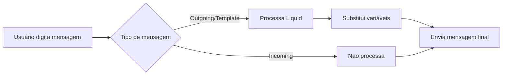

# 📋 Sistema de Variáveis do Chatwoot - Guia Completo

Este documento é o guia definitivo sobre o sistema de variáveis do Chatwoot. Ele serve como referência técnica completa para desenvolvedores, administradores e IAs que precisam compreender como funciona o sistema de templates e personalização de mensagens.

## 📖 Índice

1. [Visão Geral](#-1-visão-geral)
2. [Arquitetura do Sistema](#-2-arquitetura-do-sistema)
3. [Tipos de Variáveis](#-3-tipos-de-variáveis)
4. [Como Funciona o Processamento](#-4-como-funciona-o-processamento)
5. [Drop Objects - A Base do Sistema](#-5-drop-objects---a-base-do-sistema)
6. [Exemplos Práticos Detalhados](#-6-exemplos-práticos-detalhados)
7. [Casos de Uso por Segmento](#-7-casos-de-uso-por-segmento)
8. [Sistema de WhatsApp Templates](#-8-sistema-de-whatsapp-templates)
9. [Interface do Usuário](#-9-interface-do-usuário)
10. [Limitações e Considerações](#-10-limitações-e-considerações)
11. [Guia para Desenvolvedores](#-11-guia-para-desenvolvedores)
12. [Troubleshooting](#-12-troubleshooting)
13. [Referências Técnicas](#-13-referências-técnicas)

---

## 🎯 1. Visão Geral

### **O Que É o Sistema de Variáveis**

O Chatwoot possui um sistema robusto de variáveis que permite personalizar automaticamente mensagens, emails, campanhas e automações usando dados do contato, conversa, agente e conta. É como ter "placeholders inteligentes" que são substituídos por informações reais na hora de enviar.

### **Por Que É Importante**

- ✅ **Personalização**: "Olá João" em vez de "Olá cliente"
- ✅ **Automação**: Inserir dados automaticamente em templates
- ✅ **Eficiência**: Evita digitação manual repetitiva
- ✅ **Consistência**: Padroniza formato das mensagens
- ✅ **Escalabilidade**: Funciona com milhares de contatos

### **Tecnologias Utilizadas**

1. **Ruby Liquid Templates** (Backend) - Sistema principal
2. **JavaScript Regex** (Frontend) - Para WhatsApp e interface
3. **Vuex/Vue.js** (Interface) - Para auto-complete e listas

---

## 🏗️ 2. Arquitetura do Sistema

### **🔥 Dual Architecture - Dois Sistemas Paralelos**

#### **Sistema Liquid (Servidor)**
```ruby
# Processamento no backend Ruby
template = Liquid::Template.parse("Olá {{contact.name}}")
result = template.render(drops) # "Olá João Silva"
```

#### **Sistema JavaScript (Cliente)**
```javascript
// Processamento no frontend JavaScript
const result = template.replace(/{{([^}]+)}}/g, (match, variable) => {
  return processedParams[variable] || match;
});
```

### **🔄 Fluxo de Processamento**



### **📊 Quando Cada Sistema É Usado**

| Contexto | Sistema | Sintaxe | Exemplo |
|----------|---------|---------|---------|
| **Mensagens saindo** | Liquid | `{{contact.name}}` | Respostas do agente |
| **Templates de email** | Liquid | `{{agent.email}}` | Notificações |
| **Campanhas** | Liquid | `{{contact.custom_attribute.vip}}` | Marketing |
| **WhatsApp templates** | JavaScript | `{{1}}, {{2}}, {{name}}` | Templates aprovados |
| **Interface (autocomplete)** | JavaScript | `{{contact.name}}` | Editor de mensagens |

---

## 📋 3. Tipos de Variáveis

### **🏛️ 3.1 Variáveis Padrão (Standard Variables)**

Estas são as variáveis básicas sempre disponíveis no sistema:

#### **👤 Variáveis de Contato**
| Variável | Exemplo | Descrição |
|----------|---------|-----------|
| `{{contact.id}}` | `12345` | ID único do contato |
| `{{contact.name}}` | `"João Silva"` | Nome completo |
| `{{contact.first_name}}` | `"João"` | Primeiro nome |
| `{{contact.last_name}}` | `"Silva"` | Último nome |
| `{{contact.email}}` | `"joao@email.com"` | Email do contato |
| `{{contact.phone}}` | `"+5511999887766"` | Telefone |

#### **👨‍💼 Variáveis de Agente**
| Variável | Exemplo | Descrição |
|----------|---------|-----------|
| `{{agent.name}}` | `"Maria Santos"` | Nome do agente |
| `{{agent.first_name}}` | `"Maria"` | Primeiro nome do agente |
| `{{agent.last_name}}` | `"Santos"` | Último nome do agente |
| `{{agent.email}}` | `"maria@empresa.com"` | Email do agente |

#### **💬 Variáveis de Conversa**
| Variável | Exemplo | Descrição |
|----------|---------|-----------|
| `{{conversation.id}}` | `67890` | ID único da conversa |
| `{{conversation.display_id}}` | `#1234` | ID para exibição |

#### **📨 Variáveis de Inbox**
| Variável | Exemplo | Descrição |
|----------|---------|-----------|
| `{{inbox.name}}` | `"Suporte WhatsApp"` | Nome da caixa de entrada |
| `{{inbox.id}}` | `5` | ID da inbox |

#### **🏢 Variáveis de Conta**
| Variável | Exemplo | Descrição |
|----------|---------|-----------|
| `{{account.name}}` | `"Empresa XYZ"` | Nome da conta |

### **🔧 3.2 Variáveis Personalizadas (Custom Attributes)**

O sistema permite criar variáveis customizadas infinitamente extensíveis:

#### **📝 Para Contatos:**
```liquid
{{contact.custom_attribute.customer_type}}     → "VIP"
{{contact.custom_attribute.purchase_history}}  → "Premium"
{{contact.custom_attribute.birth_date}}        → "15/03/1985"
{{contact.custom_attribute.company}}           → "Tech Corp"
{{contact.custom_attribute.preferred_lang}}    → "pt-BR"
```

#### **💼 Para Conversas:**
```liquid
{{conversation.custom_attribute.priority}}      → "High"
{{conversation.custom_attribute.source}}        → "Website Chat"
{{conversation.custom_attribute.order_number}}  → "ORD-12345"
{{conversation.custom_attribute.category}}      → "Technical Support"
{{conversation.custom_attribute.resolution}}    → "Pending"
```

### **📊 3.3 Como Definir Custom Attributes**

```json
{
  "attribute_key": "customer_tier",
  "attribute_display_name": "Nível do Cliente", 
  "attribute_display_type": "list",
  "attribute_model": "contact_attribute",
  "attribute_values": ["Bronze", "Silver", "Gold", "Platinum"]
}
```

**Resultado:**
```liquid
{{contact.custom_attribute.customer_tier}} → "Gold"
```

---

## ⚙️ 4. Como Funciona o Processamento

### **🔄 4.1 Processamento Liquid (Backend)**

#### **Etapa 1: Parsing**
```ruby
# Input da mensagem
content = "Olá {{contact.name}}, seu pedido {{conversation.custom_attribute.order_id}} foi confirmado!"

# Parse do template Liquid
template = Liquid::Template.parse(content)
```

#### **Etapa 2: Criação dos Drops**
```ruby
drops = {
  'contact' => ContactDrop.new(conversation.contact),
  'agent' => UserDrop.new(sender),
  'conversation' => ConversationDrop.new(conversation),
  'inbox' => InboxDrop.new(inbox),
  'account' => AccountDrop.new(conversation.account)
}
```

#### **Etapa 3: Renderização**
```ruby
# Processamento final
result = template.render(drops)
# → "Olá João Silva, seu pedido ORD-12345 foi confirmado!"
```

### **🎯 4.2 Regras de Processamento**

#### **✅ Mensagens Processadas:**
- ✅ **Outgoing** (mensagens saindo do agente)
- ✅ **Template** (templates de campanha)
- ✅ **Emails** (notificações por email)
- ✅ **Campanhas** (marketing/automação)

#### **❌ Mensagens NÃO Processadas:**
- ❌ **Incoming** (mensagens chegando do cliente)
- ❌ **Private notes** (notas internas)
- ❌ **Código entre backticks** (`` `{{contact.name}}` ``)

### **🛡️ 4.3 Proteções de Segurança**

#### **Proteção de Código:**
```ruby
# Código em backticks não é processado
content = "Use `{{contact.name}}` na mensagem"
# Resultado: "Use {{contact.name}} na mensagem" (literal)
```

#### **Tratamento de Erros:**
```ruby
begin
  template = Liquid::Template.parse(content)
  result = template.render(drops)
rescue Liquid::Error
  # Em caso de erro, retorna o conteúdo original
  result = content
end
```

---

## 🏛️ 5. Drop Objects - A Base do Sistema

### **🎯 5.1 O Que São Drop Objects**

Drop Objects são classes Ruby que definem **exatamente quais propriedades** estão disponíveis para as variáveis Liquid. Eles controlam a segurança e formatação dos dados.

### **📦 5.2 Estrutura dos Drop Objects**

#### **BaseDrop (Classe Pai)**
```ruby
class BaseDrop < Liquid::Drop
  def initialize(obj)
    @obj = obj  # Objeto do banco de dados
  end

  def id
    @obj.try(:id)  # ID sempre disponível
  end

  def name
    @obj.try(:name)  # Nome sempre disponível
  end
end
```

#### **ContactDrop (Dados do Contato)**
```ruby
class ContactDrop < BaseDrop
  def name
    # Formata nome com capitalização
    @obj.try(:name).try(:split).try(:map, &:capitalize).try(:join, ' ')
  end

  def email
    @obj.try(:email)
  end

  def phone_number
    @obj.try(:phone_number)
  end

  def first_name
    # Extrai primeiro nome se houver múltiplas palavras
    @obj.try(:name).try(:split).try(:first).try(:capitalize) if @obj.try(:name).try(:split).try(:size) > 1
  end

  def last_name
    # Extrai último nome se houver múltiplas palavras
    @obj.try(:name).try(:split).try(:last).try(:capitalize) if @obj.try(:name).try(:split).try(:size) > 1
  end

  def custom_attribute  # ← CHAVE PARA CUSTOM ATTRIBUTES
    custom_attributes = @obj.try(:custom_attributes) || {}
    custom_attributes.transform_keys(&:to_s)  # Converte chaves para string
  end
end
```

#### **ConversationDrop (Dados da Conversa)**
```ruby
class ConversationDrop < BaseDrop
  def display_id
    @obj.try(:display_id)  # Ex: #1234
  end

  def contact_name
    @obj.try(:contact).name.try(:capitalize) || 'Customer'
  end

  def recent_messages
    # Retorna array das mensagens recentes formatadas
    @obj.try(:recent_messages).map do |message|
      {
        'sender' => message_sender_name(message.sender),
        'content' => render_message_content(message.content),
        'attachments' => message.attachments.map(&:file_url)
      }
    end
  end

  def custom_attribute  # ← CUSTOM ATTRIBUTES DA CONVERSA
    custom_attributes = @obj.try(:custom_attributes) || {}
    custom_attributes.transform_keys(&:to_s)
  end
end
```

#### **UserDrop (Dados do Agente)**
```ruby
class UserDrop < BaseDrop
  def available_name
    @obj.try(:available_name)  # Nome de exibição
  end

  def first_name
    @obj.try(:name).try(:split).try(:first).try(:capitalize)
  end

  def last_name
    @obj.try(:name).try(:split).try(:last).try(:capitalize)
  end
  
  # Note: UserDrop NÃO tem custom_attribute
  # Agentes não têm atributos customizados no sistema
end
```

### **🔑 5.3 Importância dos Custom Attributes**

```ruby
# Em ContactDrop e ConversationDrop:
def custom_attribute
  custom_attributes = @obj.try(:custom_attributes) || {}
  custom_attributes.transform_keys(&:to_s)
end
```

**Isso permite:**
```liquid
{{contact.custom_attribute.any_field}}        → Qualquer campo customizado
{{conversation.custom_attribute.priority}}    → Prioridade da conversa
{{contact.custom_attribute.vip_status}}       → Status VIP
```

---

## 📝 6. Exemplos Práticos Detalhados

### **🎯 6.1 Respostas Prontas (Canned Responses)**

#### **Exemplo Básico:**
```liquid
Olá {{contact.name}},

Obrigado por entrar em contato conosco através do {{inbox.name}}!

Sou {{agent.name}} e estarei cuidando do seu atendimento.

Atenciosamente,
{{agent.name}}
{{agent.email}}
```

**Resultado:**
```
Olá João Silva,

Obrigado por entrar em contato conosco através do Suporte WhatsApp!

Sou Maria Santos e estarei cuidando do seu atendimento.

Atenciosamente,
Maria Santos
maria.santos@empresa.com
```

#### **Exemplo Avançado com Custom Attributes:**
```liquid
Olá {{contact.name}},


Como cliente VIP, você terá atendimento prioritário! 🌟

Como cliente Premium, agradecemos sua fidelidade! 💎

Obrigado por escolher nossos serviços! 😊


**Dados da sua conta:**
- ID: {{contact.id}}
- Telefone: {{contact.phone}}
- Nível: {{contact.custom_attribute.customer_tier | default: "Standard"}}

**Informações da conversa:**
- Conversa: {{conversation.display_id}}
- Canal: {{inbox.name}}


Vejo que você já abriu {{conversation.custom_attribute.previous_tickets}} tickets conosco anteriormente.


Como posso ajudá-lo hoje?

Atenciosamente,
{{agent.name}}
Equipe {{account.name}}
```

### **🎯 6.2 Templates de Email**

#### **Notificação para Agente:**
```liquid
<h2>Nova mensagem recebida</h2>

<p><strong>De:</strong> {{contact.name}} &lt;{{contact.email}}&gt;</p>
<p><strong>Telefone:</strong> {{contact.phone}}</p>
<p><strong>Conversa:</strong> {{conversation.display_id}}</p>
<p><strong>Canal:</strong> {{inbox.name}}</p>


<p><strong>Nível do Cliente:</strong> 
<span style="background: gold; padding: 2px 8px; border-radius: 4px;">
  {{contact.custom_attribute.customer_tier}}
</span></p>



<div style="background: #ff4444; color: white; padding: 10px; border-radius: 4px; margin: 10px 0;">
  🚨 ALTA PRIORIDADE - Responder imediatamente!
</div>


<hr>

<h3>Mensagens recentes:</h3>

<div style="border-left: 3px solid #ccc; padding-left: 15px; margin: 10px 0;">
  <strong>{{message.sender}}:</strong> {{message.content}}
</div>


<a href="https://app.chatwoot.com/app/accounts/1/conversations/{{conversation.id}}" 
   style="background: #007bff; color: white; padding: 10px 20px; text-decoration: none; border-radius: 5px;">
   Responder Agora
</a>
```

### **🎯 6.3 Automações e Macros**

#### **Macro de Boas-vindas:**
```liquid
🎉 Bem-vindo à {{account.name}}, {{contact.first_name || contact.name}}!


Como é sua primeira vez conosco, permita-me explicar como funciona:

1. Você pode falar conosco a qualquer momento
2. Nosso horário de atendimento é das 8h às 18h
3. Para emergências, use o código #URGENTE

Como cliente novo, você ganhou 10% de desconto! 🎁
Código: BEMVINDO10

É sempre um prazer ter você de volta! 
Sua última conversa foi sobre: {{conversation.custom_attribute.last_topic | default: "suporte geral"}}


Em que posso ajudá-lo hoje?

{{agent.name}}
{{inbox.name}}
```

### **🎯 6.4 Campanhas de Marketing**

#### **Email promocional:**
```liquid
<html>
<head>
  <title>Oferta Especial para {{contact.name}}</title>
</head>
<body style="font-family: Arial, sans-serif;">

<h1>Olá {{contact.name}}! 👋</h1>




  <h2 style="color: gold;">🌟 Oferta VIP Exclusiva - 50% OFF!</h2>
  <p>Como nosso cliente VIP mais especial, você tem acesso antecipado às nossas melhores ofertas!</p>

  <h2 style="color: silver;">💎 Oferta Premium - 30% OFF!</h2>
  <p>Clientes Premium como você merecem o melhor tratamento!</p>

  <h2 style="color: blue;">🎁 Oferta Especial - 15% OFF!</h2>
  <p>Não perca essa oportunidade incrível!</p>


<div style="background: #f8f9fa; padding: 20px; border-radius: 8px; margin: 20px 0;">
  <h3>Seus dados:</h3>
  <p><strong>Nome:</strong> {{contact.name}}</p>
  <p><strong>Email:</strong> {{contact.email}}</p>
  <p><strong>Telefone:</strong> {{contact.phone | default: "não informado"}}</p>
  <p><strong>Cliente desde:</strong> {{contact.custom_attribute.registration_date | default: "não informado"}}</p>
</div>


<p>🎂 Ah! E não esquecemos que seu aniversário é dia {{contact.custom_attribute.birthday}}!</p>


<a href="https://loja.com/ofertas?customer={{contact.id}}" 
   style="background: #28a745; color: white; padding: 15px 30px; text-decoration: none; border-radius: 5px; font-size: 18px;">
   APROVEITAR OFERTA
</a>

<p style="margin-top: 30px;">
Atenciosamente,<br>
Equipe {{account.name}}
</p>

</body>
</html>
```

---

## 🏢 7. Casos de Uso por Segmento

### **🛒 7.1 E-commerce**

#### **Custom Attributes Recomendados:**
```json
// Para CONTATOS:
{
  "customer_tier": ["Bronze", "Silver", "Gold", "VIP"],
  "purchase_count": "number",
  "total_spent": "currency", 
  "last_order_date": "date",
  "preferred_category": "text",
  "shipping_address": "text"
}

// Para CONVERSAS:
{
  "order_number": "text",
  "order_status": ["Pending", "Processing", "Shipped", "Delivered"],
  "issue_type": ["Payment", "Shipping", "Product", "Return"],
  "resolution_time": "number"
}
```

#### **Template de Suporte a Pedido:**
```liquid
Olá {{contact.name}}! 👋

Referente ao seu pedido {{conversation.custom_attribute.order_number}}:

**Status atual:** {{conversation.custom_attribute.order_status}}
**Valor total:** R$ {{contact.custom_attribute.last_order_value | default: "0,00"}}



  ⏳ Seu pedido está sendo preparado com carinho!
  Previsão de envio: 1-2 dias úteis.

  🚚 Oba! Seu pedido foi enviado!
  Código de rastreamento: {{conversation.custom_attribute.tracking_code}}

  ✅ Pedido entregue com sucesso!
  Que tal avaliar sua experiência? {{conversation.custom_attribute.review_link}}



Como cliente VIP, você tem frete grátis em todas as compras! 🌟


Precisa de mais alguma coisa?

{{agent.name}}
Equipe {{account.name}}
```

### **💰 7.2 Setor Financeiro**

#### **Custom Attributes:**
```json
// Para CONTATOS:
{
  "account_number": "text",
  "account_type": ["Corrente", "Poupança", "Investimento"],
  "customer_since": "date",
  "risk_profile": ["Conservador", "Moderado", "Agressivo"],
  "current_balance": "currency",
  "credit_limit": "currency"
}

// Para CONVERSAS:
{
  "ticket_type": ["Cartão", "Empréstimo", "Investimento", "PIX"],
  "urgency_level": ["Baixa", "Média", "Alta", "Crítica"],
  "resolution_sla": "number"
}
```

#### **Template de Atendimento Bancário:**
```liquid
Olá Sr(a) {{contact.name}},

**Dados da sua conta:**
- Conta: {{contact.custom_attribute.account_number}}
- Tipo: {{contact.custom_attribute.account_type}}
- Cliente desde: {{contact.custom_attribute.customer_since | date: "%B de %Y"}}


🚨 **ATENDIMENTO PRIORITÁRIO**
Identificamos que seu caso requer atenção imediata.


**Assunto:** {{conversation.custom_attribute.ticket_type}}



  Para questões relacionadas ao PIX, posso ajudar imediatamente!
  Seu limite PIX atual é R$ {{contact.custom_attribute.pix_limit | default: "1.000,00"}}/dia.

  Sobre seu cartão, vejo que você possui:
  - Limite: R$ {{contact.custom_attribute.credit_limit | default: "não informado"}}
  - Fatura atual: R$ {{contact.custom_attribute.current_invoice | default: "0,00"}}

  Como seu perfil é {{contact.custom_attribute.risk_profile}}, posso sugerir produtos adequados.


Como posso ajudá-lo especificamente hoje?

Atenciosamente,
{{agent.name}} - Gerente de Relacionamento
{{inbox.name}}
{{account.name}}

---
*Conversa #{{conversation.display_id}} | {{agent.email}}*
```

### **🎓 7.3 Educação/Cursos**

#### **Custom Attributes:**
```json
// Para CONTATOS:
{
  "enrollment_date": "date",
  "course_name": "text", 
  "current_module": "text",
  "completion_percentage": "number",
  "student_level": ["Iniciante", "Intermediário", "Avançado"],
  "preferred_schedule": "text"
}

// Para CONVERSAS:
{
  "support_category": ["Técnico", "Conteúdo", "Acesso", "Certificado"],
  "lesson_reference": "text",
  "priority": ["Normal", "Alta", "Urgente"]
}
```

#### **Template de Suporte Educacional:**
```liquid
Olá {{contact.name}}! 📚

**Dados do seu curso:**
- Curso: {{contact.custom_attribute.course_name}}
- Módulo atual: {{contact.custom_attribute.current_module}}
- Progresso: {{contact.custom_attribute.completion_percentage}}% concluído
- Matriculado desde: {{contact.custom_attribute.enrollment_date | date: "%d/%m/%Y"}}


🎉 Parabéns! Você está quase terminando o curso!
Lembre-se que o certificado fica disponível com 100% de conclusão.

👏 Você está indo muito bem! Continue assim!

💪 Que bom que está começando! Tenho certeza que vai adorar o conteúdo.


**Sua dúvida é sobre:** {{conversation.custom_attribute.support_category}}



  Para problemas técnicos, vamos resolver rapidinho! 
  Qual dispositivo você está usando? (computador, celular, tablet)

  Sobre o conteúdo da {{conversation.custom_attribute.lesson_reference}}, 
  ficarei feliz em esclarecer suas dúvidas!

  Problemas de acesso são nossa prioridade!
  Vou verificar seu login: {{contact.email}}

  Sobre certificados, você precisa atingir 100% de conclusão.
  Atualmente você está com {{contact.custom_attribute.completion_percentage}}%.


Como posso ajudá-lo hoje?

{{agent.name}} 
Suporte Pedagógico | {{account.name}}

---
*Atendimento #{{conversation.display_id}} | Nível: {{contact.custom_attribute.student_level}}*
```

### **🏥 7.4 Saúde/Clínicas**

#### **Custom Attributes:**
```json
// Para CONTATOS:
{
  "patient_id": "text",
  "birth_date": "date",
  "insurance_plan": "text",
  "emergency_contact": "text",
  "last_appointment": "date",
  "medical_conditions": "text"
}

// Para CONVERSAS:
{
  "appointment_type": ["Consulta", "Exame", "Retorno", "Emergência"],
  "doctor_name": "text",
  "urgency": ["Normal", "Urgente", "Emergência"],
  "department": ["Clínica Geral", "Cardiologia", "Pediatria"]
}
```

#### **Template Médico:**
```liquid
Olá {{contact.name}}, 

**Dados do paciente:**
- ID: {{contact.custom_attribute.patient_id}}
- Data de nascimento: {{contact.custom_attribute.birth_date | date: "%d/%m/%Y"}}
- Convênio: {{contact.custom_attribute.insurance_plan | default: "Particular"}}


🚨 **ATENDIMENTO DE EMERGÊNCIA**
Sua situação foi classificada como emergencial.
Em casos graves, procure imediatamente o hospital!
Telefone emergência: (11) 9999-0000

⚡ **ATENDIMENTO PRIORITÁRIO**
Vamos priorizar seu atendimento.


**Tipo de solicitação:** {{conversation.custom_attribute.appointment_type}}
**Departamento:** {{conversation.custom_attribute.department}}



  Para agendar sua consulta com {{conversation.custom_attribute.doctor_name | default: "nossos médicos"}},
  preciso confirmar seus dados e disponibilidade.

  Para agendamento de exames, preciso saber:
  - Tipo do exame solicitado
  - Médico solicitante
  - Urgência

  Vejo que sua última consulta foi em {{contact.custom_attribute.last_appointment | date: "%d/%m/%Y"}}.
  Vou verificar a disponibilidade para seu retorno.



**Observação:** Vejo que você tem histórico de {{contact.custom_attribute.medical_conditions}}.
Isso será considerado no seu atendimento.


Como posso ajudá-lo hoje?

{{agent.name}}
Atendimento Médico | {{account.name}}

---
*Telefone: {{contact.phone}} | Atendimento: {{conversation.display_id}}*
```

---

## 📱 8. Sistema de WhatsApp Templates

### **🎯 8.1 Diferenças Importantes**

O WhatsApp tem um sistema de templates **separado e diferente** do sistema Liquid:

#### **WhatsApp Templates:**
- ✅ Aprovados pelo Meta/WhatsApp
- ✅ Sintaxe: `{{1}}`, `{{2}}`, `{{name}}`
- ✅ Processamento: JavaScript no frontend
- ✅ Validação obrigatória de todos os parâmetros

#### **Templates Liquid:**
- ✅ Internos do Chatwoot
- ✅ Sintaxe: `{{contact.name}}`, `{{agent.email}}`  
- ✅ Processamento: Ruby no backend
- ✅ Campos opcionais (com fallbacks)

### **🔧 8.2 Como Funciona o WhatsApp**

#### **Estrutura de um Template WhatsApp:**
```json
{
  "name": "order_confirmation",
  "language": "pt_BR", 
  "components": [
    {
      "type": "BODY",
      "text": "Olá {{1}}, seu pedido {{2}} foi confirmado! Será entregue em {{3}} dias úteis."
    }
  ]
}
```

#### **Processamento JavaScript:**
```javascript
const processVariable = str => {
  return str.replace(/{{|}}/g, '');
};

const processedString = templateString.replace(/{{([^}]+)}}/g, (match, variable) => {
  const variableKey = processVariable(variable);
  return processedParams[variableKey] || `{{${variable}}}`;
});

// Input: "Olá {{1}}, seu pedido {{2}} foi confirmado!"
// Parâmetros: {"1": "João", "2": "ORD-123"}  
// Output: "Olá João, seu pedido ORD-123 foi confirmado!"
```

### **🎯 8.3 Templates WhatsApp com Nomes**

Alguns templates permitem parâmetros nomeados:

```json
{
  "parameter_format": "NAMED",
  "components": [
    {
      "type": "BODY", 
      "text": "Olá {{name}}, sua consulta com {{doctor}} está marcada para {{date}}."
    }
  ]
}
```

**Processamento:**
```javascript
// Parâmetros nomeados
{
  "name": "Maria Silva",
  "doctor": "Dr. João", 
  "date": "15/12/2024"
}

// Resultado:
// "Olá Maria Silva, sua consulta com Dr. João está marcada para 15/12/2024."
```

### **🚀 8.4 Integração WhatsApp + Liquid**

Para ter o melhor dos dois mundos, você pode usar uma estratégia híbrida:

#### **1. Template WhatsApp Simples:**
```
Olá {{1}}, {{2}}
```

#### **2. Conteúdo Gerado via Liquid:**
```javascript
// No frontend, antes de enviar para WhatsApp:
const liquidContent = `

como cliente VIP, você tem desconto especial de 30%!

obrigado por escolher nossos serviços!

`.trim();

// Processar via API Liquid primeiro
const processedContent = await processLiquidTemplate(liquidContent, contactData);

// Depois enviar para WhatsApp
const whatsappParams = {
  "1": contactData.name,
  "2": processedContent
};
```

---

## 🖥️ 9. Interface do Usuário

### **🎯 9.1 Auto-complete de Variáveis**

O sistema possui uma interface inteligente que sugere variáveis:

#### **Componente VariableList:**
```javascript
// app/javascript/dashboard/components/widgets/conversation/VariableList.vue

// Variáveis padrão
standardAttributeVariables() {
  return MESSAGE_VARIABLES.filter(variable => {
    return (
      variable.label.includes(this.searchKey) ||
      variable.key.includes(this.searchKey)
    );
  });
}

// Variáveis customizadas
customAttributeVariables() {
  return this.customAttributes.map(attribute => {
    const attributePrefix = 
      attribute.attribute_model === 'conversation_attribute'
        ? 'conversation'
        : 'contact';

    return {
      label: `${attributePrefix}.custom_attribute.${attribute.attribute_key}`,
      key: `${attributePrefix}.custom_attribute.${attribute.attribute_key}`,
      description: attribute.attribute_description,
    };
  });
}
```

### **🔍 9.2 Como Usar na Interface**

#### **Acionamento do Auto-complete:**
1. **Digite `{{`** - Abre lista de variáveis
2. **Digite `/`** - Menu de respostas prontas (que podem conter variáveis)
3. **Search** - Filtra variáveis por nome

#### **Estrutura da Lista:**
```
📋 Variáveis Disponíveis:
├── 👤 Contact
│   ├── contact.name (Contact name)
│   ├── contact.email (Contact email) 
│   └── contact.custom_attribute.vip_status (VIP Status)
├── 👨‍💼 Agent  
│   ├── agent.name (Agent name)
│   └── agent.email (Agent email)
└── 💬 Conversation
    ├── conversation.id (Conversation Id)
    └── conversation.custom_attribute.priority (Priority)
```

### **⌨️ 9.3 Atalhos de Teclado**

| Ação | Atalho | Resultado |
|------|--------|-----------|
| Abrir variáveis | `{{` | Lista de variáveis |
| Respostas prontas | `/` | Templates com variáveis |
| Confirmar seleção | `Enter` | Insere variável |
| Cancelar | `Esc` | Fecha menu |

---

## ⚠️ 10. Limitações e Considerações

### **🚨 10.1 Limitações Técnicas**

#### **Processamento Limitado:**
- ❌ **Só mensagens saindo** - Incoming messages não são processadas
- ❌ **Notas privadas** - Private notes não processam variáveis
- ❌ **Código protegido** - Conteúdo entre `` ` ` `` não é processado
- ❌ **Erros silenciosos** - Liquid com erro volta ao original sem avisar

#### **Performance:**
- ⚠️ **Templates complexos** podem ser lentos
- ⚠️ **Muitos custom attributes** impactam memória
- ⚠️ **Liquid parsing** adiciona latência ao envio

#### **Segurança:**
- ✅ **Liquid é seguro** - Não permite execução de código
- ✅ **Sanitização automática** - Dados são limpos
- ⚠️ **Dados sensíveis** - Custom attributes são visíveis para agentes

### **🔧 10.2 Limitações Funcionais**

#### **WhatsApp Templates:**
- ❌ **Sintaxe diferente** - Não usa sistema Liquid
- ❌ **Parâmetros obrigatórios** - Todos devem ser preenchidos
- ❌ **Aprovação necessária** - Templates precisam ser aprovados pelo Meta

#### **Custom Attributes:**
- ⚠️ **Sem validação automática** - Dados podem estar inconsistentes
- ⚠️ **Sem tipagem forte** - Tudo é tratado como string no Liquid
- ❌ **Sem versionamento** - Mudanças afetam templates existentes

### **📋 10.3 Boas Práticas**

#### **✅ Recomendações:**

1. **Use fallbacks sempre:**
   ```liquid
   {{contact.email | default: "email não informado"}}
   ```

2. **Valide dados antes de usar:**
   ```liquid
   
   Você é VIP!
   
   ```

3. **Mantenha templates simples:**
   ```liquid
   // ✅ BOM
   Olá {{contact.name}}!
   
   // ❌ EVITAR
   
     
       // Lógica complexa...
     
   
   ```

4. **Documente custom attributes:**
   ```json
   {
     "attribute_key": "customer_tier",
     "attribute_description": "Nível do cliente: Bronze, Silver, Gold, VIP"
   }
   ```

#### **❌ O Que Evitar:**

1. **Não confie em dados não validados:**
   ```liquid
   // ❌ PERIGOSO
   {{contact.custom_attribute.phone}} 
   
   // ✅ SEGURO
   {{contact.custom_attribute.phone | default: "não informado"}}
   ```

2. **Não use lógica complexa em templates:**
   ```liquid
   // ❌ EVITAR - muito complexo
   
   
     
   
   ```

3. **Não misture sistemas:**
   ```liquid
   // ❌ NÃO FUNCIONA - mistura WhatsApp com Liquid
   Olá {{contact.name}}, seu pedido {{1}} foi confirmado
   ```

### **🐛 10.4 Problemas Comuns**

#### **Variáveis não são substituídas:**
```liquid
// Problema: {{contact.nome}} (nome errado)
// Solução: {{contact.name}} (propriedade correta)

// Problema: {{ contact.name }} (espaços extras)
// Solução: {{contact.name}} (sem espaços)
```

#### **Custom attributes vazios:**
```liquid
// Problema: Campo vazio aparece em branco
{{contact.custom_attribute.company}}

// Solução: Usar fallback
{{contact.custom_attribute.company | default: "Empresa não informada"}}
```

#### **Templates não processam:**
```liquid
// Problema: Mensagem incoming não processa
message_type: 'incoming' → variáveis ficam literais

// Solução: Só funciona em outgoing/template
message_type: 'outgoing' → variáveis são processadas
```

---

## 👨‍💻 11. Guia para Desenvolvedores

### **🚀 11.1 Criando Custom Attributes**

#### **Via API:**
```json
POST /api/v1/accounts/{account_id}/custom_attribute_definitions

{
  "custom_attribute_definition": {
    "attribute_display_name": "Nível VIP",
    "attribute_key": "vip_level",
    "attribute_display_type": "list",
    "attribute_model": "contact_attribute",
    "attribute_values": ["Bronze", "Silver", "Gold", "Platinum"],
    "attribute_description": "Nível de importância do cliente"
  }
}
```

#### **Resultado:**
```liquid
// Variável disponível automaticamente:
{{contact.custom_attribute.vip_level}}
```

### **🔧 11.2 Estendendo Drop Objects**

#### **Adicionando nova propriedade ao ContactDrop:**
```ruby
# app/drops/contact_drop.rb
class ContactDrop < BaseDrop
  def full_address
    # Combina múltiplos custom attributes
    street = @obj.try(:custom_attributes)&.dig('street') || ''
    city = @obj.try(:custom_attributes)&.dig('city') || ''
    state = @obj.try(:custom_attributes)&.dig('state') || ''
    
    [street, city, state].reject(&:blank?).join(', ')
  end
  
  def is_vip?
    @obj.try(:custom_attributes)&.dig('vip_status') == 'true'
  end
end
```

**Uso:**
```liquid
{{contact.full_address}}     → "Rua A, São Paulo, SP"
{{contact.is_vip?}}         → true/false
```

### **🎯 11.3 Criando Novos Serviços Liquid**

#### **Service para Campanhas Personalizadas:**
```ruby
# app/services/liquid/custom_campaign_service.rb
class Liquid::CustomCampaignService
  pattr_initialize [:campaign!, :contact!]

  def call(message)
    # Drops customizados para campanha
    drops = {
      'contact' => ContactDrop.new(contact),
      'campaign' => CampaignDrop.new(campaign),  # Novo!
      'products' => ProductsDrop.new(contact.recommended_products)  # Novo!
    }
    
    process_liquid_in_content(drops, message)
  end

  private

  def process_liquid_in_content(drops, message)
    # Proteção contra código
    message = message.gsub(/`(.*?)`/m, '`\\1`')
    
    template = Liquid::Template.parse(message)
    template.render(drops)
  rescue Liquid::Error => e
    Rails.logger.error "Liquid processing error: #{e.message}"
    message  # Retorna original em caso de erro
  end
end
```

### **⚡ 11.4 Frontend - Processamento JavaScript**

#### **Função para processar variáveis no frontend:**
```javascript
// app/javascript/shared/helpers/variableProcessor.js
export const processVariables = (template, variables) => {
  return template.replace(/{{([^}]+)}}/g, (match, variable) => {
    const cleanVariable = variable.trim();
    
    // Suporte a propriedades aninhadas: contact.name, contact.custom_attribute.vip
    const value = getNestedProperty(variables, cleanVariable);
    
    return value !== undefined ? value : match;  // Mantém original se não encontrar
  });
};

const getNestedProperty = (obj, path) => {
  return path.split('.').reduce((current, key) => {
    return current && current[key] !== undefined ? current[key] : undefined;
  }, obj);
};

// Uso:
const template = "Olá {{contact.name}}, você é {{contact.custom_attribute.vip_level}}";
const variables = {
  contact: {
    name: "João Silva",
    custom_attribute: {
      vip_level: "Gold"
    }
  }
};

const result = processVariables(template, variables);
// → "Olá João Silva, você é Gold"
```

### **🔒 11.5 Segurança e Validação**

#### **Validação de Templates:**
```ruby
# app/services/liquid/template_validator_service.rb
class Liquid::TemplateValidatorService
  def self.validate(template_content)
    begin
      # Tenta fazer parse do template
      template = Liquid::Template.parse(template_content)
      
      # Verifica variáveis não suportadas
      undefined_variables = extract_variables(template_content) - SUPPORTED_VARIABLES
      
      {
        valid: true,
        template: template,
        warnings: undefined_variables.any? ? ["Variáveis não reconhecidas: #{undefined_variables.join(', ')}"] : []
      }
    rescue Liquid::Error => e
      {
        valid: false,
        error: e.message,
        template: nil
      }
    end
  end

  private

  def self.extract_variables(content)
    content.scan(/{{([^}]+)}}/).flatten.map(&:strip)
  end

  SUPPORTED_VARIABLES = %w[
    contact.name contact.email contact.phone
    agent.name agent.email
    conversation.id conversation.display_id
    inbox.name inbox.id
    account.name
  ].freeze
end
```

---

## 🔧 12. Troubleshooting

### **🐛 12.1 Problemas Comuns e Soluções**

#### **Problema: Variáveis não são substituídas**
```liquid
// ❌ PROBLEMA
Input:  "Olá {{contact.name}}"
Output: "Olá {{contact.name}}" (sem substituição)

// 🔍 CAUSAS POSSÍVEIS:
1. Mensagem é "incoming" (só outgoing processa)
2. Erro de sintaxe no template
3. Propriedade não existe no Drop object
4. Dados do contato estão vazios

// ✅ SOLUÇÕES:
1. Verificar message_type: deve ser 'outgoing' ou 'template'
2. Usar syntax correta: {{contact.name}} (sem espaços extras)
3. Verificar se propriedade existe no Drop
4. Usar fallbacks: {{contact.name | default: "Cliente"}}
```

#### **Problema: Custom attributes vazios**
```liquid
// ❌ PROBLEMA  
{{contact.custom_attribute.vip_status}} → ""

// 🔍 VERIFICAÇÕES:
1. Attribute existe na definição?
2. Valor foi salvo no contato?
3. Chave está correta?

// ✅ SOLUÇÕES:
// 1. Verificar definição do attribute
GET /api/v1/accounts/{id}/custom_attribute_definitions

// 2. Verificar valor no contato
GET /api/v1/accounts/{id}/contacts/{contact_id}

// 3. Usar fallback sempre
{{contact.custom_attribute.vip_status | default: "Standard"}}
```

#### **Problema: WhatsApp templates não funcionam**
```liquid
// ❌ PROBLEMA
Template: "Olá {{contact.name}}"
Erro: "Template parameter missing"

// 🔍 CAUSA:
WhatsApp templates usam sintaxe diferente: {{1}}, {{2}}

// ✅ SOLUÇÃO:
// WhatsApp template deve ser:
"Olá {{1}}"

// E parâmetros enviados:
{
  "1": contactData.name
}
```

### **🔍 12.2 Debugging**

#### **Log de Processamento Liquid:**
```ruby
# Em development/staging, adicione logs:
def process_liquid_in_content
  Rails.logger.info "Processing liquid content: #{content}"
  Rails.logger.info "Available drops: #{message_drops.keys}"
  
  template = Liquid::Template.parse(modified_liquid_content)
  result = template.render(message_drops)
  
  Rails.logger.info "Liquid result: #{result}"
  
  self.content = result
rescue Liquid::Error => e
  Rails.logger.error "Liquid error: #{e.message}"
  Rails.logger.error "Content: #{content}"
end
```

#### **Verificação de Dados:**
```ruby
# Console Rails
contact = Contact.find(123)
contact.custom_attributes  # Verifica attributes salvos

drops = {
  'contact' => ContactDrop.new(contact)
}

template = Liquid::Template.parse("{{contact.name}} - {{contact.custom_attribute.vip_status}}")
result = template.render(drops)
puts result
```

#### **Teste de Templates:**
```ruby
# spec/models/concerns/liquidable_spec.rb
it 'processes custom attributes correctly' do
  contact = create(:contact, custom_attributes: { vip_status: 'Gold' })
  conversation = create(:conversation, contact: contact)
  
  message = create(:message, 
    conversation: conversation,
    content: 'Customer {{contact.name}} is {{contact.custom_attribute.vip_status}}',
    message_type: 'outgoing'
  )
  
  expect(message.content).to eq 'Customer John Doe is Gold'
end
```

### **📊 12.3 Performance Debugging**

#### **Measuring Liquid Performance:**
```ruby
# Em ApplicationController ou BaseService
def measure_liquid_processing
  start_time = Time.current
  
  yield  # Executa processamento Liquid
  
  processing_time = Time.current - start_time
  
  if processing_time > 0.1  # Log se demorar mais que 100ms
    Rails.logger.warn "Slow liquid processing: #{processing_time}s"
  end
end

# Uso:
measure_liquid_processing do
  process_liquid_in_content
end
```

### **⚠️ 12.4 Alertas de Monitoramento**

#### **Métricas Importantes:**
```ruby
# app/services/liquid/monitoring_service.rb
class Liquid::MonitoringService
  def self.track_processing(template_size, processing_time, success)
    # Enviar para monitoring (NewRelic, DataDog, etc.)
    
    metrics = {
      template_size: template_size,
      processing_time: processing_time,
      success: success,
      timestamp: Time.current
    }
    
    # Alertar se performance degradar
    if processing_time > 0.5
      alert_slow_processing(metrics)
    end
    
    # Alertar se muitos erros
    if error_rate_last_hour > 0.05  # 5%
      alert_high_error_rate
    end
  end
end
```

---

## 📚 13. Referências Técnicas

### **🗂️ 13.1 Arquivos Importantes**

#### **Backend (Ruby):**
```
├── app/models/concerns/liquidable.rb           # Processamento principal
├── app/drops/                                   # Drop objects
│   ├── base_drop.rb                            # Classe base
│   ├── contact_drop.rb                         # Dados do contato
│   ├── conversation_drop.rb                    # Dados da conversa
│   ├── user_drop.rb                           # Dados do agente
│   ├── inbox_drop.rb                          # Dados da inbox
│   └── account_drop.rb                        # Dados da conta
├── app/services/liquid/                        # Serviços Liquid
│   └── campaign_template_service.rb           # Processamento de campanhas
├── app/helpers/email_helper.rb                # Processamento em emails
└── app/mailers/application_mailer.rb          # Base dos emails
```

#### **Frontend (JavaScript):**
```
├── app/javascript/shared/constants/messages.js       # Constantes de variáveis
├── app/javascript/dashboard/components/widgets/conversation/
│   ├── VariableList.vue                              # Lista de variáveis
│   └── WhatsappTemplates/TemplateParser.vue         # Parser WhatsApp
├── app/javascript/dashboard/helper/editorHelper.js   # Helper do editor
└── app/javascript/dashboard/composables/             # Composables Vue
```

#### **Testes:**
```
├── spec/models/concerns/liquidable_shared.rb         # Testes compartilhados
├── spec/services/liquid/                             # Testes dos serviços
└── app/javascript/dashboard/helper/specs/            # Testes JS
```

### **🔗 13.2 APIs Importantes**

#### **Custom Attribute Definitions:**
```
GET    /api/v1/accounts/{id}/custom_attribute_definitions
POST   /api/v1/accounts/{id}/custom_attribute_definitions
PUT    /api/v1/accounts/{id}/custom_attribute_definitions/{attr_id}
DELETE /api/v1/accounts/{id}/custom_attribute_definitions/{attr_id}
```

#### **Contacts com Custom Attributes:**
```
GET    /api/v1/accounts/{id}/contacts/{contact_id}
PUT    /api/v1/accounts/{id}/contacts/{contact_id}

# Body para update:
{
  "custom_attributes": {
    "vip_status": "Gold",
    "customer_since": "2023-01-15"
  }
}
```

#### **Conversations com Custom Attributes:**
```
GET    /api/v1/accounts/{id}/conversations/{conversation_id}
PUT    /api/v1/accounts/{id}/conversations/{conversation_id}

# Body para update:
{
  "custom_attributes": {
    "priority": "High",
    "category": "Technical"
  }
}
```

### **📖 13.3 Documentação Liquid**

#### **Sintaxe Básica:**
```liquid
{{variable}}                    # Output simples
{{contact.name}}               # Propriedade aninhada
{{contact.email | upcase}}     # Com filtro
{{contact.phone | default: "N/A"}}  # Com fallback

          # Condicional
  Olá {{contact.name}}!




  Você é VIP!

  Obrigado por ser cliente!

```

#### **Filtros Úteis:**
```liquid
{{text | upcase}}              # MAIÚSCULA
{{text | downcase}}            # minúscula
{{text | capitalize}}          # Primeira Maiúscula
{{text | truncate: 50}}        # Máximo 50 caracteres
{{text | default: "vazio"}}    # Fallback se vazio
{{number | plus: 10}}          # Soma 10
{{date | date: "%d/%m/%Y"}}    # Formatar data
{{array | size}}               # Tamanho do array
{{text | strip}}               # Remove espaços
```

### **🎯 13.4 Convenções e Padrões**

#### **Nomenclatura de Custom Attributes:**
```
✅ BOM:
- customer_tier
- vip_status  
- order_number
- last_contact_date

❌ EVITAR:
- CustomerTier (PascalCase)
- vip-status (hífen)
- Order Number (espaços)
- lást_côntact (acentos)
```

#### **Estrutura de Templates:**
```liquid
# ✅ BOM - Template bem estruturado
Olá {{contact.name}},


Status VIP: {{contact.custom_attribute.vip_status}}


Dados da conversa #{{conversation.display_id}}:
- Canal: {{inbox.name}}
- Agente: {{agent.name}}

Atenciosamente,
{{agent.name}} | {{agent.email}}

# ❌ EVITAR - Muito complexo


  // Lógica complexa demais para template

```

### **🔧 13.5 Configurações Importantes**

#### **Limites do Sistema:**
```ruby
# config/initializers/liquid.rb (se existir)
Liquid::Template.error_mode = :strict    # Modo de erro
Liquid::Template.file_system = ...       # Sistema de arquivos
```

#### **Variáveis de Ambiente:**
```bash
# .env
LIQUID_TEMPLATE_TIMEOUT=5000    # Timeout em ms
LIQUID_CACHE_TEMPLATES=true     # Cache de templates
LIQUID_ERROR_MODE=lax           # lax ou strict
```

---

## 🎊 Conclusão

O sistema de variáveis do Chatwoot é uma ferramenta **extremamente poderosa** que permite personalização avançada de mensagens, emails, campanhas e automações. Com o conhecimento deste guia, você pode:

### **✅ O que Você Pode Fazer:**
- Criar templates personalizados inteligentes
- Implementar automações sofisticadas
- Personalizar mensagens em escala
- Integrar dados customizados seamlessly
- Otimizar a experiência do cliente

### **🚀 Próximos Passos:**
1. **Experimente** com templates simples primeiro
2. **Crie** custom attributes relevantes para seu negócio  
3. **Teste** templates em ambiente de desenvolvimento
4. **Monitore** performance em produção
5. **Documente** seus templates personalizados

### **💡 Lembre-se:**
- Use **fallbacks** sempre (`| default: "valor"`)
- Mantenha templates **simples** e legíveis
- **Teste** antes de aplicar em produção
- **Monitore** erros e performance
- **Documente** custom attributes para a equipe

---

**Este documento é uma referência viva.** Conforme o Chatwoot evolui, novas funcionalidades podem ser adicionadas ao sistema de variáveis. Mantenha-se atualizado com a documentação oficial e teste sempre em ambiente seguro.

**Data de criação:** Dezembro 2024  
**Versão:** 1.0  
**Compatibilidade:** Chatwoot v3.x+  
**Testado em:** Ruby 3.x, Vue.js 3.x, Liquid 5.x

---

*Desenvolvido com 💙 para facilitar o desenvolvimento com Chatwoot*

