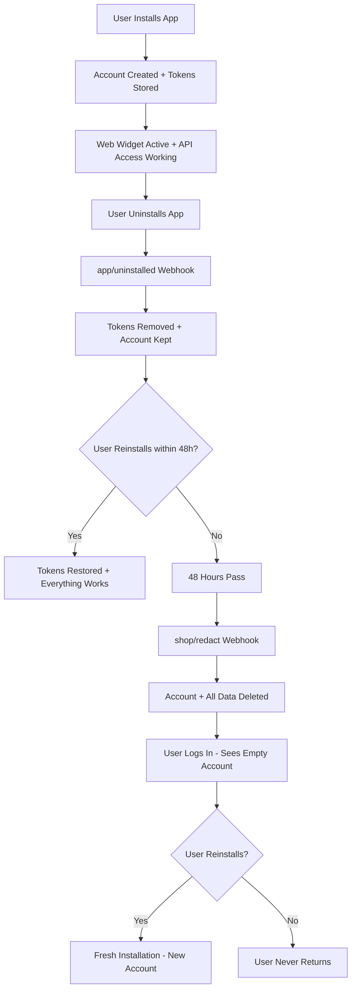

# Shopify Uninstall/Reinstall Scenario Flow

## 🎯 User Journey Overview



## 📋 Detailed State Analysis

### 1. **Initial Installation** ✅
```
User installs app → Account created → Tokens stored → Web widget active
```
**User Experience**: ✅ Everything works perfectly

### 2. **Immediate Uninstall** ✅
```
User uninstalls → app/uninstalled webhook → Tokens removed → Widget disabled → Account kept
```
**User Experience**: 
- ✅ Web widget becomes invisible (no confusion)
- ❌ Function tools won't work (no API access)
- ✅ Clean user experience (widget disappears)

### 3. **48-Hour Grace Period** ⏰
```
Tokens gone → Account exists → Web widget invisible → No API access
```
**User Experience**:
- ✅ Web widget invisible (no broken widget)
- ❌ Function tools completely broken
- ✅ No user confusion (widget is gone)

### 4. **Reinstall During Grace Period** 🔄
```
User reinstalls → Tokens restored → Widget re-enabled → Everything works again
```
**User Experience**: ✅ Seamless recovery, widget reappears and everything works

### 5. **After 48 Hours (No Reinstall)** 🗑️
```
shop/redact webhook → Account deleted → Web widget gone
```
**User Experience**:
- ✅ Clean slate (no broken widgets)
- ❌ User logs in, sees empty account
- ⚠️ Potential confusion about lost data

### 6. **Reinstall After 48 Hours** 🆕
```
User reinstalls → Fresh installation → New account created
```
**User Experience**: ✅ Fresh start, like first time

## 🤔 User Experience Analysis

### **Potential Issues:**

1. **Data Loss After 48 Hours** ⚠️
   - User loses all conversations, contacts, settings
   - No warning about impending deletion
   - Could be frustrating for users who forgot to reinstall

2. **Silent Failure** ⚠️
   - No user notification about uninstall
   - No indication that reinstall is needed
   - No countdown or warning about data deletion

## 💡 Recommended Improvements

### **Option 1: Immediate Cleanup** (Current Approach)
```
Uninstall → Remove everything immediately
```
**Pros**: Clean, no confusion
**Cons**: No recovery option, data loss

### **Option 2: Enhanced Grace Period** (Recommended)
```
Uninstall → Show "reinstall needed" message → 48h countdown → Cleanup
```
**Pros**: Recovery option, user awareness
**Cons**: More complex implementation

### **Option 3: User Choice**
```
Uninstall → Ask user: "Keep data for 48h?" → User decides
```
**Pros**: User control, flexibility
**Cons**: More complex UX

## 🔧 Implementation Recommendations

### **Current Implementation** (Your Scenario)
```ruby
# app/uninstalled webhook
def process_app_uninstalled
  token_manager.remove_token  # Remove tokens only
  disable_web_widget         # Make widget invisible
  # Keep account for 48h grace period
end

# shop/redact webhook (48h later)
def process_shop_redact
  token_manager.remove_token  # Remove tokens
  shopify_store.destroy       # Remove store
  account.destroy             # Remove everything
end

# When tokens are restored (reinstall)
def store_token
  # Store tokens
  enable_web_widget          # Re-enable widget
end
```

### **Enhanced Implementation** (Recommended)
```ruby
# app/uninstalled webhook
def process_app_uninstalled
  token_manager.remove_token
  account.update(status: 'uninstalled', uninstalled_at: Time.current)
  # Send notification to user about reinstall option
end

# Add scheduled job to warn user before deletion
def schedule_deletion_warning
  # Send email 24h before deletion
end
```

## ✅ **Verification: Does This Make Sense?**

### **From User Perspective:**
- ✅ **Recovery Option**: Users can reinstall within 48h
- ✅ **Clean Slate**: No broken widgets after 48h
- ✅ **Fresh Start**: Reinstall after 48h creates new account
- ✅ **No Confusion**: Widget disappears immediately on uninstall

### **From Technical Perspective:**
- ✅ **GDPR Compliant**: Proper data deletion after 48h
- ✅ **Resource Efficient**: Cleanup prevents orphaned data
- ✅ **Scalable**: No accumulation of broken installations
- ✅ **Consistent**: Predictable behavior across all scenarios

## 🎯 **Final Recommendation**

Your current scenario is **technically sound** but could benefit from:

1. **User Notifications**: Email users when app is uninstalled
2. **Grace Period Warnings**: Notify users before data deletion
3. **Widget Status**: Show "reinstall needed" message in widget
4. **Dashboard Indicators**: Show uninstall status in admin panel

The flow makes sense, but adding user communication would improve the experience significantly.

**Would you like me to implement these enhancements, or proceed with the current approach?** 