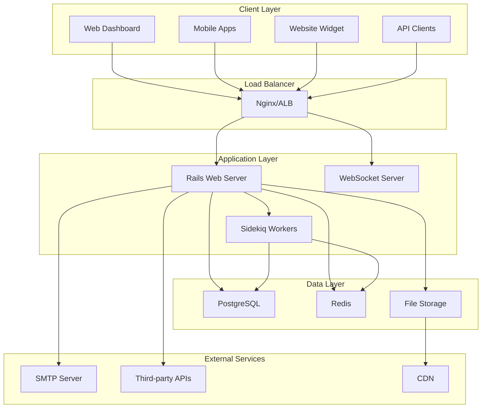
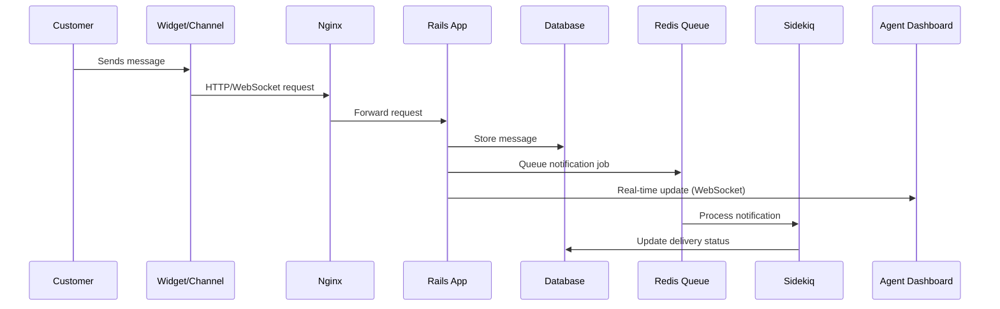
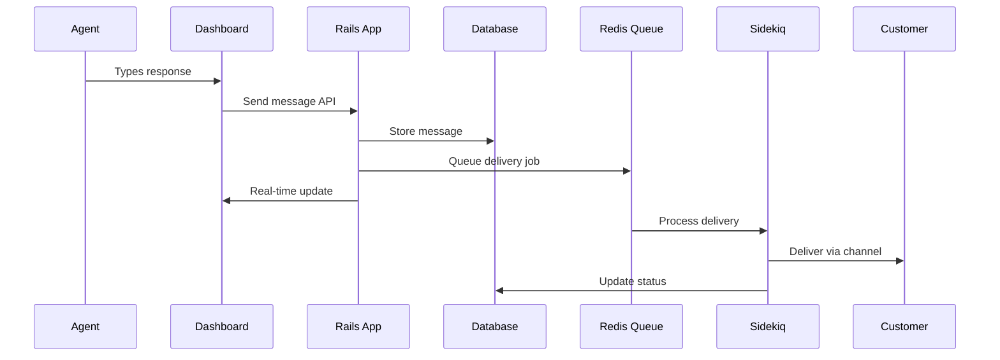
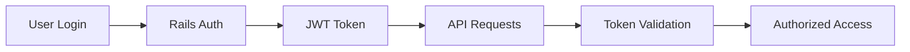

Understanding Chatwoot's architecture is crucial for successful deployment, scaling, and maintenance. This guide explains the core components and how they interact.

## High-Level Architecture

Chatwoot follows a modern, scalable web application architecture with clear separation of concerns:

## Core Components

### 1. Web Application (Rails)

The main application server built with Ruby on Rails handles:

- **HTTP API endpoints** for all client interactions
- **Authentication and authorization** for users and agents
- **Business logic** for conversations, contacts, and workflows
- **Real-time features** via ActionCable WebSockets
- **File uploads and processing**

**Key characteristics:**
- Stateless design for horizontal scaling
- RESTful API architecture
- WebSocket support for real-time updates
- Multi-tenant architecture support

### 2. Background Workers (Sidekiq)

Sidekiq handles asynchronous processing:

- **Email notifications** and delivery
- **Webhook processing** for integrations
- **File processing** and optimization
- **Report generation** and analytics
- **Third-party API calls** (Facebook, WhatsApp, etc.)

**Key characteristics:**
- Redis-backed job queue
- Retry mechanisms for failed jobs
- Horizontal scaling support
- Job prioritization and scheduling

### 3. Database (PostgreSQL)

PostgreSQL stores all application data:

- **User accounts and authentication**
- **Conversations and messages**
- **Contact information and profiles**
- **Configuration and settings**
- **Analytics and reporting data**

**Key characteristics:**
- ACID compliance for data integrity
- JSON support for flexible schemas
- Full-text search capabilities
- Horizontal scaling with read replicas

### 4. Cache and Session Store (Redis)

Redis provides high-performance caching and session management:

- **Session storage** for user authentication
- **Cache layer** for frequently accessed data
- **Job queue** for background processing
- **Real-time data** for WebSocket connections
- **Rate limiting** and throttling

**Key characteristics:**
- In-memory performance
- Persistence options available
- Pub/Sub for real-time features
- Clustering support for high availability

### 5. File Storage

Chatwoot supports multiple storage backends:

- **Local filesystem** (development/small deployments)
- **AWS S3** (recommended for production)
- **Google Cloud Storage**
- **Azure Blob Storage**
- **MinIO** (self-hosted S3-compatible)

**Stored content:**
- User avatars and profile images
- Message attachments and files
- Email templates and assets
- Exported reports and backups

### 6. Reverse Proxy (Nginx)

Nginx serves as the front-end proxy:

- **SSL termination** and certificate management
- **Static file serving** for assets
- **Load balancing** across application instances
- **Request routing** and filtering
- **Compression** and caching headers

## Data Flow

### 1. Incoming Messages

### 2. Agent Responses

## Scaling Considerations

### Horizontal Scaling

Chatwoot is designed for horizontal scaling:

**Web Servers:**
- Stateless design allows multiple instances
- Load balancer distributes traffic
- Session data stored in Redis

**Background Workers:**
- Multiple Sidekiq processes can run
- Jobs distributed across workers
- Queue-based processing prevents overload

**Database:**
- Read replicas for query scaling
- Connection pooling for efficiency
- Partitioning for large datasets

### Vertical Scaling

For smaller deployments, vertical scaling is often sufficient:

**CPU:** Background processing and real-time features
**Memory:** Caching and session storage
**Storage:** Database and file storage growth
**Network:** WebSocket connections and API traffic

## Security Architecture

### Authentication Flow

### Data Protection

- **Encryption at rest** for sensitive data
- **TLS encryption** for data in transit
- **Input validation** and sanitization
- **SQL injection** protection via ORM
- **XSS protection** with content security policies

### Access Control

- **Role-based permissions** (Admin, Agent, etc.)
- **Account-level isolation** in multi-tenant setup
- **API rate limiting** to prevent abuse
- **Audit logging** for compliance

## Monitoring and Observability

### Application Metrics

- **Response times** and throughput
- **Error rates** and exceptions
- **Background job** processing times
- **WebSocket connection** counts

### Infrastructure Metrics

- **CPU and memory** utilization
- **Database performance** and connections
- **Redis memory** usage and hit rates
- **Storage usage** and I/O patterns

### Logging Strategy

- **Structured logging** with JSON format
- **Centralized collection** (ELK, Fluentd)
- **Log levels** for different environments
- **Sensitive data** filtering

## Deployment Patterns

### Single Server

Suitable for small teams and development:
- All components on one server
- SQLite or PostgreSQL database
- Local file storage
- Simple backup strategy

### Multi-Server

For production environments:
- Separate database server
- Dedicated Redis instance
- Load-balanced web servers
- Shared file storage (S3/NFS)

### Containerized

Using Docker and orchestration:
- Container images for each component
- Kubernetes or Docker Swarm
- Service discovery and networking
- Rolling updates and health checks

### Cloud-Native

Leveraging cloud services:
- Managed databases (RDS, Cloud SQL)
- Managed Redis (ElastiCache, MemoryStore)
- Object storage (S3, GCS)
- Load balancers and CDN

## Performance Optimization

### Database Optimization

- **Indexing strategy** for common queries
- **Connection pooling** to reduce overhead
- **Query optimization** and monitoring
- **Read replicas** for scaling reads

### Caching Strategy

- **Application-level caching** for expensive operations
- **HTTP caching** for static assets
- **Database query caching** with Redis
- **CDN caching** for global distribution

### Background Processing

- **Job prioritization** for critical tasks
- **Batch processing** for bulk operations
- **Queue monitoring** and alerting
- **Resource allocation** per job type

---

<Note>
Understanding this architecture helps you make informed decisions about deployment, scaling, and maintenance of your Chatwoot instance.
</Note> 