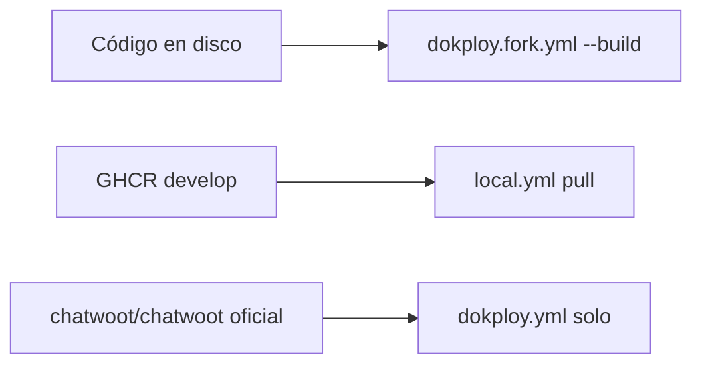

# Desarrollo local — Chatwoot fork (InboxHub)

## Regla de oro

| Objetivo | Comando |
|----------|---------|
| **Desarrollo diario** (código en disco) | `dokploy.yml` + **`dokploy.fork.yml`** `--build` |
| Preview igual a staging (GHCR) | `dokploy.yml` + `local.yml` `pull` |
| ~~Nunca para dev~~ | `dokploy.yml` solo → imagen upstream oficial |

## Arranque rápido

```powershell
cd D:\DOCUMENTOS\GITHUB\chatwoot\chatwoot
.\scripts\dev-up.ps1
```

Manual:

```powershell
docker network create main-chatwoot-local   # una vez
docker compose -f docker-compose.dokploy.yml -f docker-compose.dokploy.fork.yml up -d --build
```

- App: http://localhost:3000
- Widget test: http://localhost:8080/test-chat.html
- Imagen: `inboxhub-chatwoot:local` (build local, `pull_policy: never`)

## Qué ves según el modo



| Cambio | fork.yml build | local.yml GHCR |
|--------|----------------|----------------|
| Ruby sin commit | Sí (restart rails) | No |
| Vue sin commit | Tras `pnpm exec vite build` | No |
| Migración nueva | Sí (`db:migrate`) | Solo si está en GHCR |
| Ya pusheado a develop | Sí | Sí |

## Ciclo de trabajo

### Backend (Ruby)

```powershell
# editar app/, config/, db/migrate/
docker compose -f docker-compose.dokploy.yml -f docker-compose.dokploy.fork.yml restart chatwoot-rails chatwoot-sidekiq
```

### Migración

```powershell
.\scripts\dev-migrate.ps1
# o:
docker compose -f docker-compose.dokploy.yml -f docker-compose.dokploy.fork.yml exec chatwoot-rails bundle exec rails db:migrate
```

### Frontend (Vue)

```powershell
pnpm exec vite build
docker compose -f docker-compose.dokploy.yml -f docker-compose.dokploy.fork.yml restart chatwoot-rails
```

## Panel IA (mismo stack)

```powershell
cd D:\DOCUMENTOS\GITHUB\chatwoot\panel-ai
docker compose -f docker-compose.yml -f docker-compose.local.yml up -d --build
```

- UI: http://localhost:3010
- API: http://localhost:8010

Ambos comparten la red `main-chatwoot-local`.

## Ramas (orden recomendado)

1. **Feature branch** — trabajo diario (`fix/...`, `feat/...`)
2. **`develop`** — integración; GHCR `:develop` se construye desde aquí (CI)
3. **Staging Dokploy** — pull `ghcr.io/pabloluna3596afk/chatwoot:develop`
4. **Producción** — tag/release cuando el piloto esté validado

Local con `fork.yml` funciona en **cualquier rama** con cambios sin push.

## Pipeline (después de validar local)

```
Código local OK → commit → push develop → GitHub Actions → GHCR
→ Dokploy staging (test.inbox / test.ainbox) → smoke → producción
```

## Parar

```powershell
docker compose -f docker-compose.dokploy.yml -f docker-compose.dokploy.fork.yml down
```
