# Chatwoot Webhook Flow Analysis

**Author**: Simón (AI Worker Architect)
**Date**: 2025-09-30
**Version**: 1.0
**Purpose**: Understand Chatwoot's message processing architecture to identify optimal integration points for GP Bikes AI Workers

---

## Executive Summary

Chatwoot uses a **sophisticated event-driven architecture** based on the **Wisper pub/sub pattern**. Messages trigger events that are dispatched to registered listeners. The optimal integration point for AI Workers is through a **custom listener** that subscribes to the `MESSAGE_CREATED` event.

**Recommendation**: Create a custom `AiWorkerListener` that subscribes to `MESSAGE_CREATED` events and processes incoming WhatsApp messages through the AI Worker pipeline.

---

## Current Message Processing Flow

### 1. Message Creation Pipeline

When a WhatsApp message arrives at Chatwoot:

```
WhatsApp API → POST /webhooks/whatsapp/{phone_number}
  ↓
Whatsapp::IncomingMessageService
  ↓
Messages::MessageBuilder.perform
  ↓
Message.create (ActiveRecord)
  ↓
after_create_commit callback: execute_after_create_commit_callbacks
  ↓
dispatch_create_events method
  ↓
Rails.configuration.dispatcher.dispatch(MESSAGE_CREATED, ...)
  ↓
SyncDispatcher & AsyncDispatcher
  ↓
Registered Listeners (ActionCableListener, AgentBotListener, etc.)
```

### 2. Key Files in Message Flow

| File | Role | Key Methods |
|------|------|-------------|
| `app/models/message.rb` | Core message model | `execute_after_create_commit_callbacks`, `dispatch_create_events` |
| `app/dispatchers/dispatcher.rb` | Main event dispatcher | `dispatch(event_name, timestamp, data)` |
| `app/dispatchers/sync_dispatcher.rb` | Synchronous event dispatcher | `dispatch`, `listeners` |
| `app/listeners/base_listener.rb` | Base listener class | Helper methods for extracting event data |
| `app/listeners/agent_bot_listener.rb` | Example listener for bots | `message_created(event)` |
| `lib/events/types.rb` | Event constant definitions | `MESSAGE_CREATED`, `MESSAGE_UPDATED`, etc. |
| `config/initializers/event_handlers.rb` | Listener registration | Loads all listeners at boot time |

---

## Message Model Callbacks

### Callback Chain in `Message` Model

```ruby
# app/models/message.rb (lines 65-308)

before_validation :ensure_content_type
before_validation :prevent_message_flooding
before_save :ensure_processed_message_content
before_save :ensure_in_reply_to

after_create_commit :execute_after_create_commit_callbacks
after_update_commit :dispatch_update_event
```

### The Critical Method: `execute_after_create_commit_callbacks`

```ruby
def execute_after_create_commit_callbacks
  reopen_conversation           # Reopens resolved/snoozed conversations
  notify_via_mail              # Sends email notifications if configured
  set_conversation_activity    # Updates conversation.last_activity_at
  dispatch_create_events       # 🎯 DISPATCHES MESSAGE_CREATED EVENT
  send_reply                   # Sends message to external channel (WhatsApp, etc.)
  execute_message_template_hooks
  update_contact_activity
end
```

### Event Dispatching

```ruby
def dispatch_create_events
  # Line 335: Main MESSAGE_CREATED event
  Rails.configuration.dispatcher.dispatch(
    MESSAGE_CREATED,
    Time.zone.now,
    message: self,
    performed_by: Current.executed_by
  )

  # Lines 337-339: First reply event (if applicable)
  if valid_first_reply?
    Rails.configuration.dispatcher.dispatch(
      FIRST_REPLY_CREATED,
      Time.zone.now,
      message: self,
      performed_by: Current.executed_by
    )
  end
end
```

---

## Event System Architecture

### Wisper Pub/Sub Pattern

Chatwoot uses the [Wisper gem](https://github.com/krisleech/wisper) for event dispatching:

```ruby
# config/initializers/event_handlers.rb
Rails.application.configure do
  config.to_prepare do
    Rails.configuration.dispatcher = Dispatcher.instance
    Rails.configuration.dispatcher.load_listeners  # Registers all listeners
  end
end
```

### Dispatcher Hierarchy

```
Dispatcher (singleton)
├── SyncDispatcher
│   ├── ActionCableListener (broadcasts to WebSocket)
│   └── AgentBotListener (triggers bot webhooks)
└── AsyncDispatcher
    ├── AutomationRuleListener
    ├── WebhookListener
    ├── NotificationListener
    ├── ReportingEventListener
    └── ... (more listeners)
```

### How Listeners Work

Example from `AgentBotListener`:

```ruby
class AgentBotListener < BaseListener
  def message_created(event)
    message = extract_message_and_account(event)[0]
    inbox = message.inbox

    # Early exits (guards)
    return unless connected_agent_bot_exist?(inbox)
    return unless message.webhook_sendable?

    # Process the message
    method_name = __method__.to_s
    process_message_event(method_name, inbox.agent_bot, message, event)
  end
end
```

**Key Pattern**:
1. Method name matches event name (snake_case): `message_created` ← `MESSAGE_CREATED`
2. Extract message from event data
3. Apply business logic filters (guards)
4. Process the message

---

## Message Types & Filtering

### Message Types Enum

```ruby
# app/models/message.rb (line 85)
enum message_type: {
  incoming: 0,   # Messages FROM customers
  outgoing: 1,   # Messages TO customers (from agents/bots)
  activity: 2,   # System messages (assignment changes, etc.)
  template: 3    # WhatsApp template messages
}
```

### Identifying Incoming WhatsApp Messages

```ruby
# How to detect incoming WhatsApp messages:
message.incoming?  # => true
message.inbox.whatsapp?  # => true
message.conversation.inbox.channel_type  # => "Channel::Whatsapp"

# webhook_sendable? filter (used by AgentBotListener)
def webhook_sendable?
  incoming? || outgoing? || template?
end
```

### Message Structure

```ruby
message.attributes:
  id: 123
  content: "Hola, quiero información sobre motos"
  content_type: "text" (enum)
  message_type: 0 (incoming)
  inbox_id: 1
  conversation_id: 45
  sender_type: "Contact"
  sender_id: 67
  account_id: 1
  created_at: 2025-09-30 10:30:00

message.associations:
  inbox: #<Inbox channel_type="Channel::Whatsapp">
  conversation: #<Conversation status="open">
  sender: #<Contact name="Juan Pérez">
  account: #<Account>
```

---

## Channel Detection: WhatsApp

### How to Identify WhatsApp Messages

```ruby
# Method 1: Through Inbox
message.inbox.whatsapp?  # => true
message.inbox.channel_type  # => "Channel::Whatsapp"

# Method 2: Through Channel (polymorphic)
message.inbox.channel.class  # => Channel::Whatsapp
message.inbox.channel.phone_number  # => "+15551234567"

# Method 3: Direct check in listener
def whatsapp_message?(message)
  message.inbox.channel_type == 'Channel::Whatsapp'
end
```

### WhatsApp Channel Model

```ruby
# app/models/channel/whatsapp.rb
class Channel::Whatsapp < ApplicationRecord
  include Channelable

  # Providers: 360dialog (default) or whatsapp_cloud
  PROVIDERS = %w[default whatsapp_cloud].freeze

  validates :phone_number, presence: true, uniqueness: true

  def name
    'Whatsapp'
  end
end
```

---

## Proposed Integration Point

### Option 1: Event Listener (RECOMMENDED ✅)

**Create**: `app/listeners/ai_worker_listener.rb`

**Advantages**:
- ✅ Non-invasive: No changes to Chatwoot core models
- ✅ Follows Chatwoot's established patterns
- ✅ Easy to enable/disable via listener registration
- ✅ Clean separation of concerns
- ✅ Can be toggled with feature flags
- ✅ Allows asynchronous processing via jobs

**Implementation**:

```ruby
# app/listeners/ai_worker_listener.rb
class AiWorkerListener < BaseListener
  def message_created(event)
    message = extract_message_and_account(event)[0]

    # Guard clauses
    return unless should_process?(message)

    # Dispatch to AI Worker processor
    AiWorkers::MessageProcessorJob.perform_later(message.id)
  end

  private

  def should_process?(message)
    # Only incoming messages
    return false unless message.incoming?

    # Only WhatsApp messages
    return false unless message.inbox.whatsapp?

    # Only text messages (skip attachments for now)
    return false unless message.content_type == 'text'

    # Don't process if conversation is assigned to human agent
    # (unless feature flag allows it)
    return false if message.conversation.assignee_id.present? && !allow_with_assigned_agent?

    true
  end

  def allow_with_assigned_agent?
    # Feature flag or account setting
    ENV['AI_WORKER_WITH_HUMAN_AGENTS'] == 'true'
  end
end
```

**Registration**:

```ruby
# app/dispatchers/async_dispatcher.rb
class AsyncDispatcher < BaseDispatcher
  def listeners
    [
      AutomationRuleListener.instance,
      WebhookListener.instance,
      # ... existing listeners ...
      AiWorkerListener.instance  # GP_BIKES_CUSTOM: Add AI Worker listener
    ]
  end
end
```

### Option 2: Model Callback (NOT RECOMMENDED ❌)

**Alternative**: Add callback directly to `Message` model

**Disadvantages**:
- ❌ Invasive: Modifies Chatwoot core model
- ❌ Harder to maintain during Chatwoot upgrades
- ❌ Couples AI Worker logic to core model
- ❌ Violates Open/Closed Principle

**Why we reject this**: Chatwoot's event system exists precisely to avoid polluting models with business logic.

### Option 3: Initializer Hook (NOT RECOMMENDED ❌)

**Alternative**: Use initializer to monkey-patch callbacks

**Disadvantages**:
- ❌ Fragile: Depends on Ruby load order
- ❌ Hidden logic: Not discoverable
- ❌ Hard to test

---

## AI Worker Message Processing Pipeline

### Sequence Diagram

```mermaid
sequenceDiagram
    participant WA as WhatsApp
    participant CW as Chatwoot API
    participant M as Message Model
    participant D as Dispatcher
    participant AIL as AiWorkerListener
    participant Job as MessageProcessorJob
    participant BP as BaseProcessor
    participant GW as GreetingWorker
    participant Conv as Conversation

    WA->>CW: POST /webhooks/whatsapp/{phone}
    Note over WA,CW: {"text": "Hola"}

    CW->>M: Message.create(content: "Hola", message_type: :incoming)
    Note over M: Validates & saves message

    M->>M: after_create_commit
    M->>M: execute_after_create_commit_callbacks
    M->>M: dispatch_create_events

    M->>D: dispatch(MESSAGE_CREATED, {message: self})
    Note over D: Wisper pub/sub

    D->>AIL: message_created(event)
    Note over AIL: Extract message from event

    AIL->>AIL: should_process?(message)
    alt Should NOT process
        Note over AIL: Skip: not incoming, not WhatsApp,<br/>or assigned to human
        AIL-->>D: return early
    end

    alt Should process
        AIL->>Job: perform_later(message.id)
        Note over Job: Sidekiq background job

        Job->>BP: process(message)
        Note over BP: MessageProcessor orchestrator

        BP->>BP: determine_worker(message)
        BP->>GW: should_handle?(message)
        GW-->>BP: true (greeting detected)

        BP->>GW: process(message, conversation)
        Note over GW: OpenAI API call
        GW-->>BP: "¡Hola! Soy el asistente de GP Bikes..."

        BP->>Conv: create_outgoing_message(response)
        Conv->>WA: Send WhatsApp message
    end
```



### Integration Points Summary

| Step | File | Action | Invasiveness |
|------|------|--------|--------------|
| 1. Message arrives | `app/controllers/webhooks/whatsapp_controller.rb` | WhatsApp webhook endpoint | Core (no changes) |
| 2. Message created | `app/models/message.rb` | `after_create_commit` callback | Core (no changes) |
| 3. Event dispatched | `app/dispatchers/dispatcher.rb` | Wisper pub/sub | Core (no changes) |
| 4. **AI Worker listens** | `app/listeners/ai_worker_listener.rb` | **Custom listener** | **Custom (new file)** |
| 5. Job queued | `app/jobs/ai_workers/message_processor_job.rb` | Sidekiq job | Custom (new file) |
| 6. Worker processes | `app/services/ai_workers/base_ai_worker.rb` | AI logic | Custom (new file) |
| 7. Response sent | `app/models/conversation.rb` | Create outgoing message | Core (existing API) |

---

## Risk Assessment

### Potential Issues

#### 1. **Race Conditions**
- **Risk**: Multiple listeners processing same message
- **Mitigation**: Use idempotency keys in jobs
- **Implementation**:
  ```ruby
  AiWorkers::MessageProcessorJob.set(wait: 2.seconds).perform_later(message.id)
  ```

#### 2. **Duplicate Processing**
- **Risk**: Message processed by both AI Worker and human agent
- **Mitigation**: Check conversation assignment status in `should_process?`
- **Implementation**:
  ```ruby
  return false if conversation.assignee_id.present?
  ```

#### 3. **Infinite Loops**
- **Risk**: AI Worker response triggers another AI Worker
- **Mitigation**: Only process `incoming` messages, never `outgoing`
- **Implementation**:
  ```ruby
  return false unless message.incoming?
  ```

#### 4. **Performance Impact**
- **Risk**: Listener adds latency to message creation
- **Mitigation**: Offload to background job immediately
- **Implementation**:
  ```ruby
  AiWorkers::MessageProcessorJob.perform_later(message.id)  # Non-blocking
  ```

#### 5. **Chatwoot Upgrades**
- **Risk**: Breaking changes to event system
- **Mitigation**:
  - Use only public APIs (Dispatcher, BaseListener)
  - Monitor Chatwoot changelog for deprecations
  - Write comprehensive integration tests

---

## Implementation Strategy

### Phase 1: Listener Setup (Week 1-2)

1. **Create AiWorkerListener**
   - File: `app/listeners/ai_worker_listener.rb`
   - Register in `AsyncDispatcher` (or custom dispatcher)
   - Implement `should_process?` guards

2. **Create MessageProcessorJob**
   - File: `app/jobs/ai_workers/message_processor_job.rb`
   - Use Sidekiq for async processing
   - Implement idempotency

3. **Integration Testing**
   - Test with mock WhatsApp messages
   - Verify event flow end-to-end
   - Test guard clauses

### Phase 2: Worker Pipeline (Week 3-4)

4. **Implement BaseAiWorker**
   - Abstract class for all workers
   - `should_handle?` and `process` methods

5. **Implement MessageProcessor**
   - Orchestrates worker selection
   - Handles worker chain of responsibility

6. **Implement First Worker**
   - GreetingWorker (simplest to start)
   - OpenAI integration
   - Response formatting

### Phase 3: Production Rollout (Week 5-6)

7. **Feature Flags**
   - Enable/disable AI Workers per account
   - A/B testing capabilities

8. **Monitoring & Logging**
   - Track processing times
   - Log AI Worker decisions
   - Alert on errors

9. **Production Testing**
   - Start with test WhatsApp number
   - Gradual rollout to real conversations

---

## Feature Flag Strategy

### Recommended Approach

```ruby
# app/listeners/ai_worker_listener.rb
def should_process?(message)
  # Global kill switch
  return false unless ENV['GP_BIKES_AI_WORKERS_ENABLED'] == 'true'

  # Account-level feature flag
  return false unless message.account.feature_enabled?('gp_bikes_ai_workers')

  # Inbox-level feature flag
  return false unless message.inbox.additional_attributes&.dig('gp_bikes_ai_workers_enabled')

  # ... other guards
end
```

### Gradual Rollout Plan

1. **Week 1**: Test account only
2. **Week 2**: 10% of conversations (selected inboxes)
3. **Week 3**: 50% of conversations
4. **Week 4**: 100% rollout

---

## Testing Strategy

### Unit Tests

```ruby
# spec/listeners/ai_worker_listener_spec.rb
RSpec.describe AiWorkerListener do
  describe '#message_created' do
    it 'processes incoming WhatsApp messages' do
      message = create(:message, :incoming, :whatsapp)
      expect(AiWorkers::MessageProcessorJob).to receive(:perform_later).with(message.id)

      listener.message_created(build_event(message))
    end

    it 'ignores outgoing messages' do
      message = create(:message, :outgoing, :whatsapp)
      expect(AiWorkers::MessageProcessorJob).not_to receive(:perform_later)

      listener.message_created(build_event(message))
    end
  end
end
```

### Integration Tests

```ruby
# spec/integration/ai_worker_flow_spec.rb
RSpec.describe 'AI Worker Integration' do
  it 'processes WhatsApp message end-to-end' do
    # Simulate WhatsApp webhook
    post "/webhooks/whatsapp/#{phone_number}", params: webhook_payload

    # Verify message created
    message = Message.last
    expect(message.content).to eq('Hola')

    # Verify job enqueued
    expect(AiWorkers::MessageProcessorJob).to have_been_enqueued.with(message.id)

    # Process job
    perform_enqueued_jobs

    # Verify response sent
    response = message.conversation.messages.outgoing.last
    expect(response.content).to include('GP Bikes')
  end
end
```

---

## Mermaid Architecture Diagram


---

## Event Lifecycle Example

### Example: Processing "Hola" Message

```ruby
# 1. WhatsApp sends message
POST /webhooks/whatsapp/15551234567
{
  "messages": [{
    "from": "5215512345678",
    "text": { "body": "Hola" }
  }]
}

# 2. Message created
message = Message.create!(
  content: "Hola",
  message_type: :incoming,
  inbox_id: 1,
  conversation_id: 45,
  sender: contact,
  account: account
)

# 3. Event dispatched (line 335 in message.rb)
Rails.configuration.dispatcher.dispatch(
  MESSAGE_CREATED,
  Time.zone.now,
  message: message,
  performed_by: nil
)

# 4. Wisper publishes to all listeners
# Internally: Wisper calls message_created(event) on each listener

# 5. AiWorkerListener receives event
def message_created(event)
  message = event.data[:message]  # Extract from event

  # Guards
  return unless message.incoming?           # ✅ Pass
  return unless message.inbox.whatsapp?     # ✅ Pass
  return unless message.content_type == 'text'  # ✅ Pass

  # Enqueue job
  AiWorkers::MessageProcessorJob.perform_later(message.id)
end

# 6. Job processed (in background)
class AiWorkers::MessageProcessorJob < ApplicationJob
  def perform(message_id)
    message = Message.find(message_id)
    processor = AiWorkers::MessageProcessor.new(message)
    processor.process
  end
end

# 7. Worker selected
worker = GreetingWorker.new
if worker.should_handle?(message)
  response = worker.process(message, conversation)
end

# 8. Response created
conversation.messages.create!(
  content: response,
  message_type: :outgoing,
  sender: nil  # Bot message
)

# 9. Response sent to WhatsApp
# (handled by Chatwoot's SendReplyJob)
```

---

## Comparison with Other Chatwoot Integrations

### How Chatwoot Currently Handles Bots

| Feature | Agent Bot (Chatwoot Core) | GP Bikes AI Workers |
|---------|---------------------------|---------------------|
| **Integration** | WebhookListener | Custom AiWorkerListener |
| **Trigger** | `message_created` event | `message_created` event |
| **Processing** | External webhook URL | Internal service objects |
| **Routing** | One bot per inbox | Multiple workers per conversation |
| **Context** | Stateless (conversation webhook data) | Stateful (access to full Rails models) |
| **OpenAI** | Must implement externally | Built-in via ruby-openai gem |
| **Error handling** | External service responsibility | Rails error handling + retries |

### Why Not Use AgentBotInbox?

Chatwoot has a built-in `AgentBotInbox` feature, but:

1. **Limited Context**: Bots receive webhook payloads only, not full Rails models
2. **External Dependency**: Requires separate bot server
3. **No Worker Routing**: One bot per inbox, no dynamic worker selection
4. **Complex Setup**: Requires webhook infrastructure
5. **Latency**: Extra HTTP round trip

**GP Bikes AI Workers** improve on this by:
- ✅ Running in-process (no HTTP overhead)
- ✅ Full access to Rails models and associations
- ✅ Dynamic worker selection based on context
- ✅ Easier to test and debug
- ✅ Unified codebase

---

## References

### Chatwoot Documentation
- [Events System](https://www.chatwoot.com/docs/product/others/webhooks#events)
- [WhatsApp Channel](https://www.chatwoot.com/docs/product/channels/whatsapp/)
- [Agent Bot Configuration](https://www.chatwoot.com/docs/product/channels/agent-bots)

### Code References
- `app/models/message.rb` (lines 135, 299-343)
- `app/listeners/base_listener.rb`
- `app/listeners/agent_bot_listener.rb` (reference implementation)
- `app/dispatchers/dispatcher.rb`
- `lib/events/types.rb`
- `config/initializers/event_handlers.rb`

### External Libraries
- [Wisper Gem](https://github.com/krisleech/wisper) - Pub/sub for Ruby objects
- [Sidekiq](https://sidekiq.org/) - Background job processing

---

## Next Steps

1. ✅ **Complete**: Webhook flow analysis
2. 🔄 **Next**: Design BaseAiWorker architecture (Tarea 2)
3. ⏳ **After**: Create directory structure (Tarea 3)
4. ⏳ **After**: Implement AiWorkerListener (Tarea 4)
5. ⏳ **After**: Implement MessageProcessor (Tarea 5)
6. ⏳ **After**: Implement GreetingWorker (Tarea 6)
7. ⏳ **After**: Write comprehensive tests (Tarea 7)

---

## Appendix: Event Constants

```ruby
# lib/events/types.rb
module Events::Types
  # Message events
  MESSAGE_CREATED = 'message.created'
  MESSAGE_UPDATED = 'message.updated'
  FIRST_REPLY_CREATED = 'first.reply.created'
  REPLY_CREATED = 'reply.created'

  # Conversation events
  CONVERSATION_CREATED = 'conversation.created'
  CONVERSATION_UPDATED = 'conversation.updated'
  CONVERSATION_OPENED = 'conversation.opened'
  CONVERSATION_RESOLVED = 'conversation.resolved'
  CONVERSATION_STATUS_CHANGED = 'conversation.status_changed'

  # Contact events
  CONTACT_CREATED = 'contact.created'
  CONTACT_UPDATED = 'contact.updated'
  CONTACT_DELETED = 'contact.deleted'
end
```

---

**Document Status**: ✅ Complete
**Review Status**: Pending review by Daniela (Backend Lead)
**Implementation Status**: Ready to proceed with Tarea 2 (BaseAiWorker Design)
