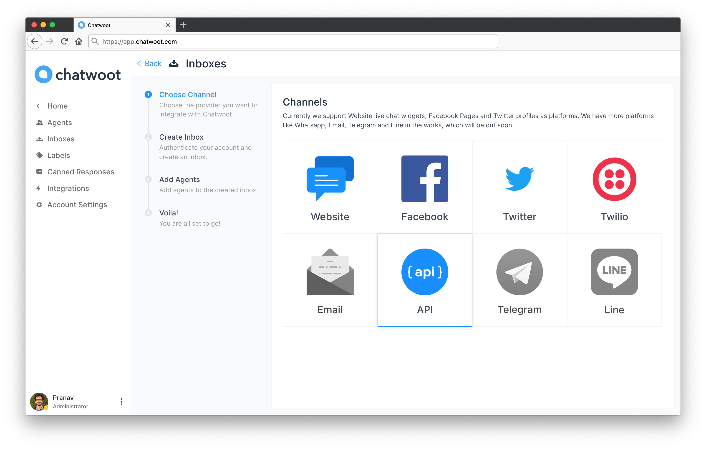
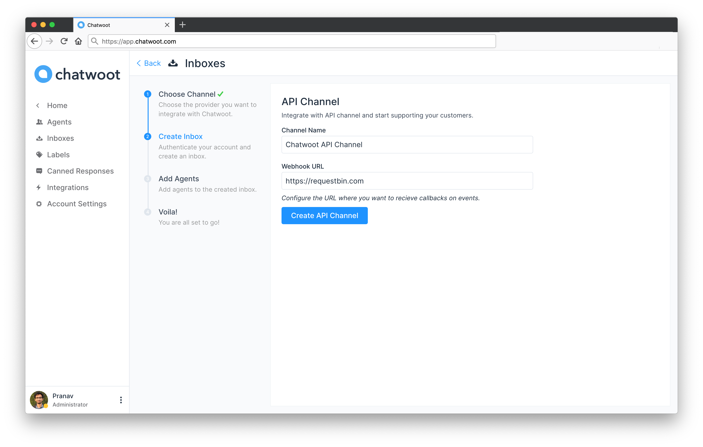
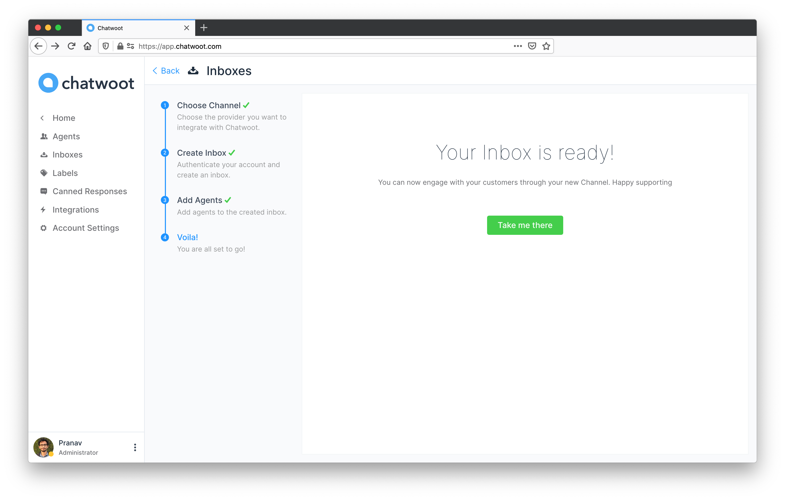
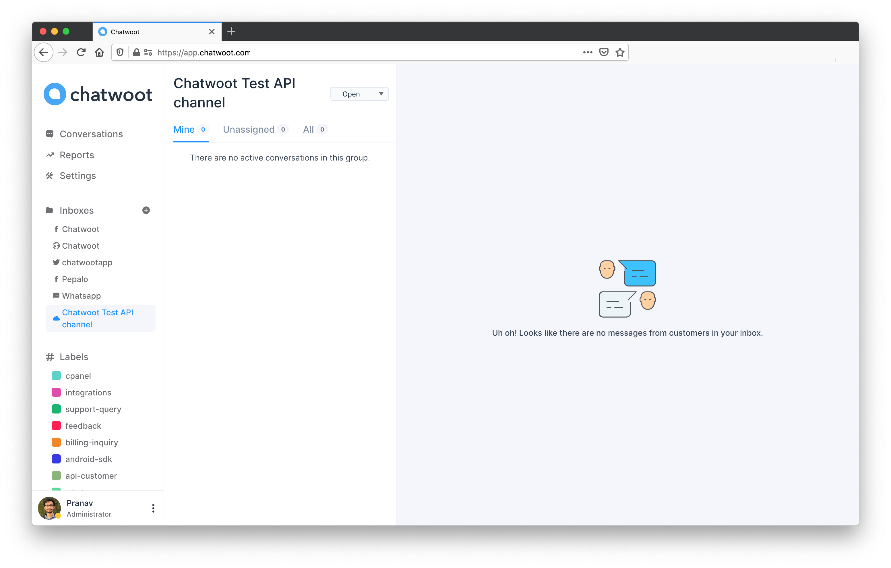

Setting up an API channel consists of the following steps.

1. Create API Channel inbox
2. Send messages using Chatwoot APIs
3. Receive webhooks on new messages from Chatwoot

This document allows you to create and configure an API channel inbox in Chatwoot installations.

**Step 1**: Go to Settings > Inboxes and click on "Add Inbox".

**Step 2**: Select **API** from the list of channels.

**Step 3**: Provide an name for the channel and a callback URL (the events and corresponding payload is defined in the subsequent articles)

**Step 4**: Add agents to the inbox.

**Step 5**: Hooray!! The inbox setup is complete.

Now the channel setup is complete, let us try to send a message using Chatwoot APIs. Read more about it [here](/docs/channels/api/send-messages)
