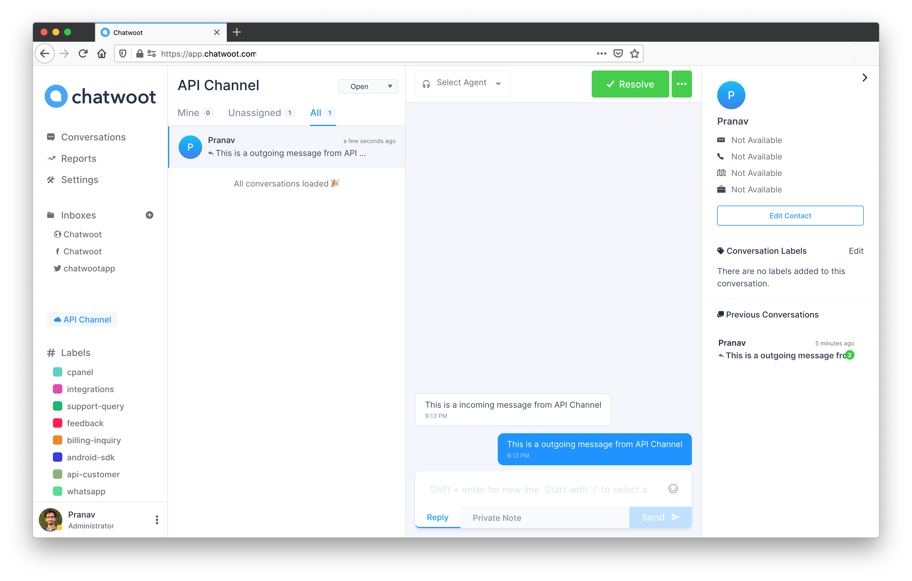

To send messages to API channel, you need have a basic understanding of the models and nomenclature used in Chatwoot. Let us try to understand these first.

1. **Channel**: Channel defines the type of the source of conversations. Eg: Facebook, Twitter, API etc.

2. **Inbox**: You can create multiple sources of conversations which is of the same channel type. For eg: You can have more than one Facebook page connected to a Chatwoot account. Each page is called as the inbox in Chatwoot.

3. **Conversation**: A Conversation is a collection of messages.

4. **Contact**: Each conversation has a real life person associated with it, this person is called a contact.

5. **Contact Inboxes**: This is the session for each contact on a inbox. A contact can have multiple sessions and multiple conversations in the same inbox.

### How to send a message in an API Channel?

To send a message in an API channel, you have to create a contact, then create a conversation and then send a message.

APIs require `api_access_token` in the request header. You can get this token by visiting your Profile settings >  Access Token

#### 1. Create a contact

API documentation: (https://www.chatwoot.com/developers/api/#operation/contactCreate)

Pass the inbox id of the API channel along with other params specified. This would create a session for you automatically. A sample response would look like the one below.

```json
{
  "email": "string",
  "name": "string",
  "phone_number": "string",
  "thumbnail": "string",
  "additional_attributes": {},
  "contact_inboxes": [
    {
      "source_id": "string",
      "inbox": {
        "id": 0,
        "name": "string",
        "website_url": "string",
        "channel_type": "string",
        "avatar_url": "string",
        "widget_color": "string",
        "website_token": "string",
        "enable_auto_assignment": true,
        "web_widget_script": "string",
        "welcome_title": "string",
        "welcome_tagline": "string",
        "greeting_enabled": true,
        "greeting_message": "string"
      }
    }
  ],
  "id": 0,
  "availability_status": "string"
}
```

As you can see in the payload, you will be able to see the `contact_inboxes` and each `contact_inbox` will have a `source_id`. Source Id can be seen as the session identifier. You will use this source_id to create a new conversation as defined below.

#### 2. Create a conversation

API documentation: (https://www.chatwoot.com/developers/api/#operation/newConversation)

Use the `source_id` received in the previous API call.

You will receive a conversation id which can be used to create a message.

```json
{
  "id": 0
}
```

#### 3. Create a new message

API documentation: (https://www.chatwoot.com/developers/api/#operation/conversationNewMessage)

There are 2 types of messages.

1. **Incoming**: Messages sent by the end user is classified as an incoming message.

2. **Outgoing**: Messages sent by the agent is classified as an outgoing message.

If you call the API with the correct content, you will receive a payload similar to the one below.

```json
{
    "id": 0,
    "content": "This is a incoming message from API Channel",
    "inbox_id": 0,
    "conversation_id": 0,
    "message_type": 0,
    "content_type": null,
    "content_attributes": {},
    "created_at": 0,
    "private": false,
    "sender": {
        "id": 0,
        "name": "Pranav",
        "type": "contact"
    }
}
```

If everything is sucessful you will see the conversation on the dashboard as follows.



You will be notified when a new message is created on the URL specified while creating the API channel. You can read about the message payload [here](/docs/channels/api/callback-url)
