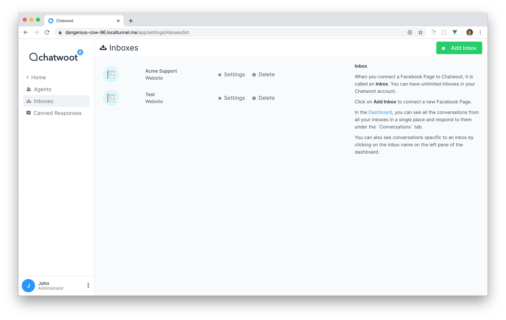
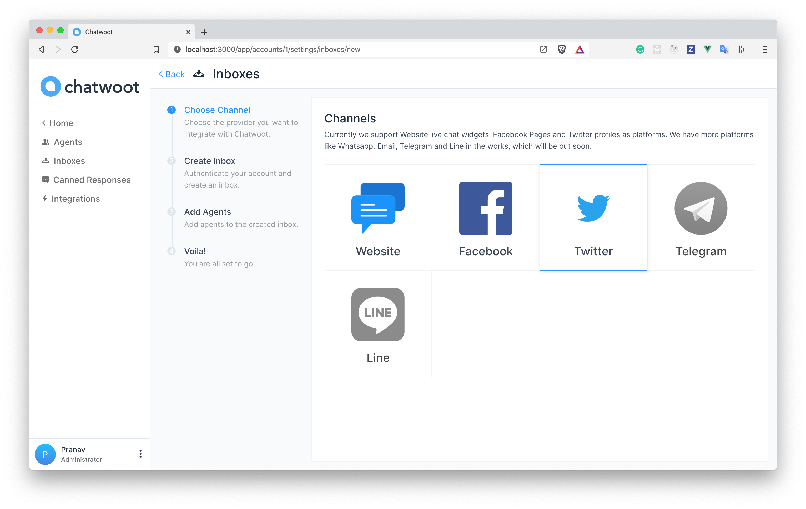
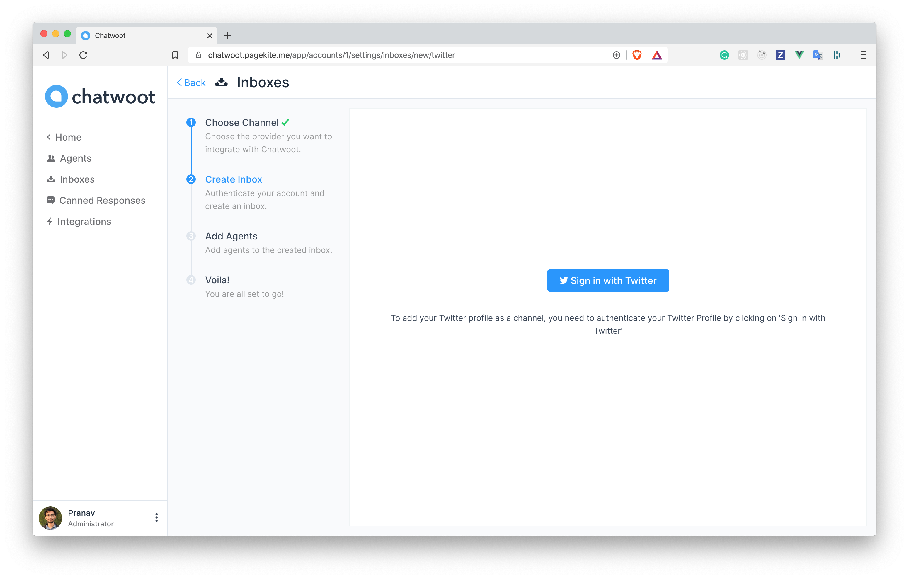
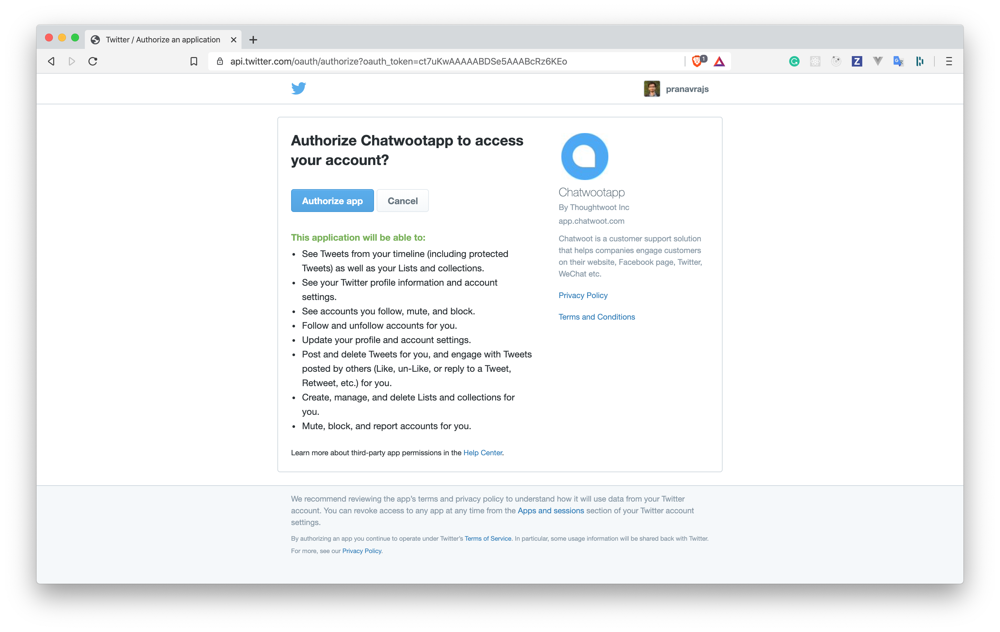
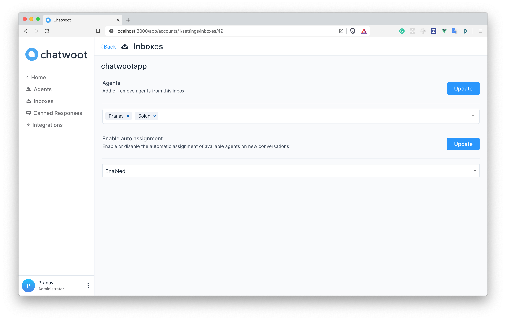

**Step 1**. Click on "Add Inbox" button from Settings > Inboxes page.

**Step 2**. Click on "Twitter" icon.

**Step 3**. Click on "Sign in with Twitter" button.

**Step 4**. You will be redirected to Twitter. Click on "Authorize app" button.

**Step 5**. "Add agents" to your website inbox.

**Step 6**. Hooray! You have successfully created a Twitter inbox. You will be able to manage Twitter DMs and tweets mentioning you in the Chatwoot Inbox.

**Step 7**. If you want to update the agents who have access to the inbox, you can go to Settings > Inboxes.

