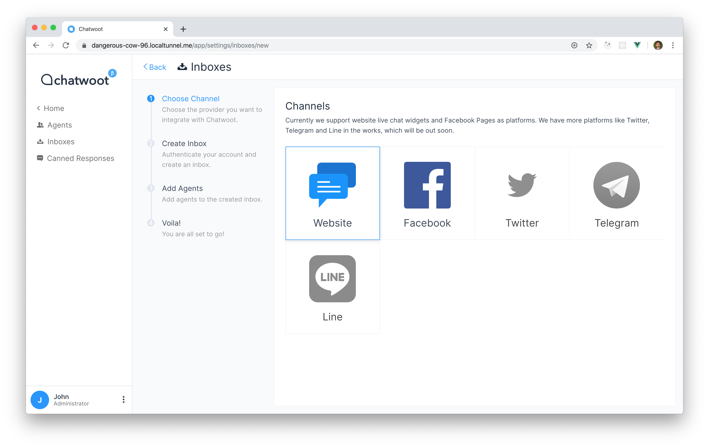
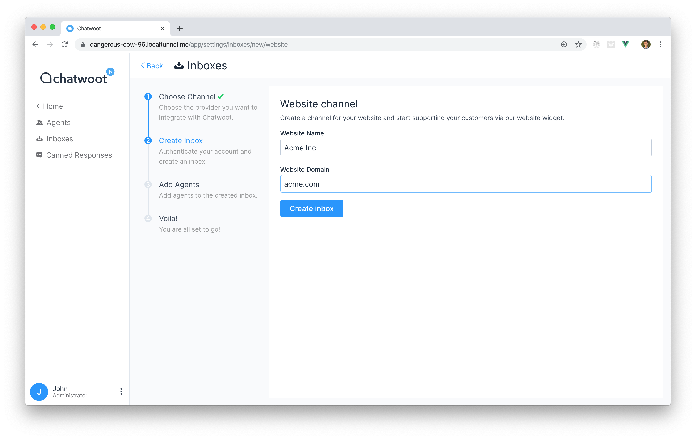
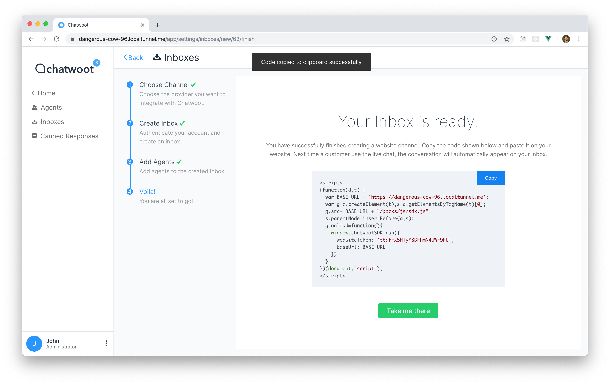
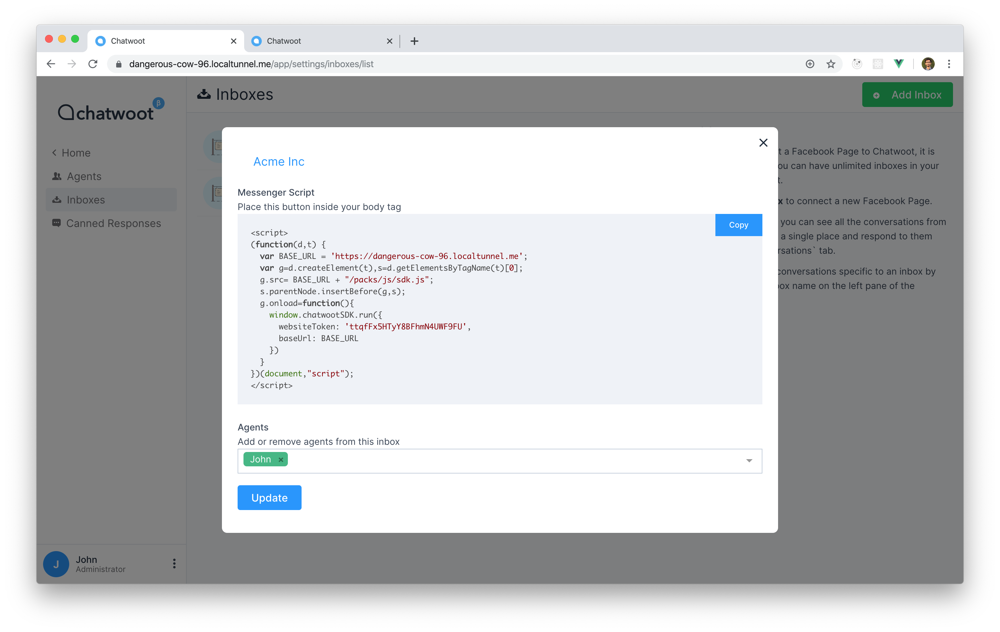

**Step 1**. Click on "Add Inbox" button from Settings > Inboxes page.

**Step 2**. Click on "Website" icon.

**Step 3**. Provide your website name and url. Website name will be shown on the live chat widget.

**Step 4**. "Add agents" to your website inbox.

**Step 5**. Hooray! You have successfully created a website inbox. Copy and paste the code shown in the page to your website and start supporting your customers.

**Step 6**. If you want to update the agents who have access to the inbox, you can go to Settings > Inboxes. You will be able to see your website inbox listed there. Click on Settings. You will be able to Code as well the list of agents who have access to the inbox.

