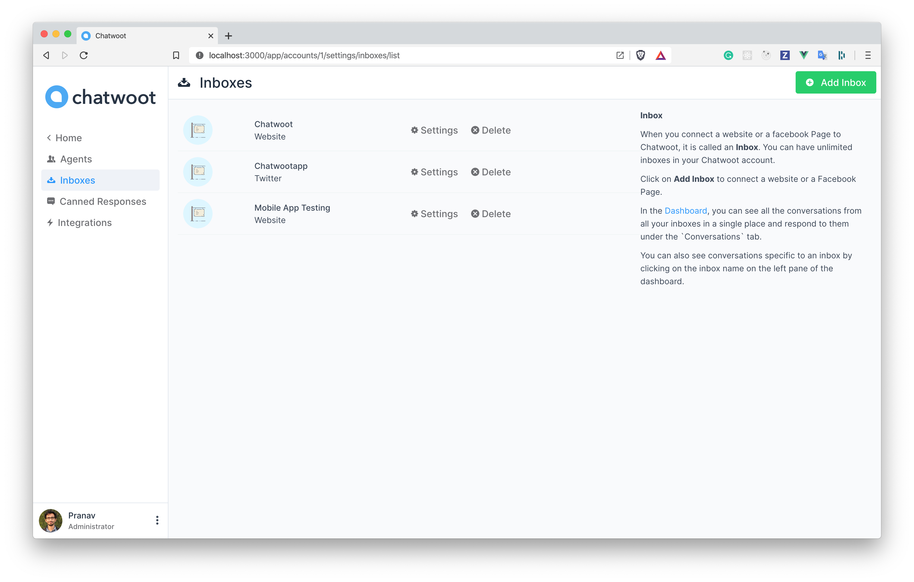
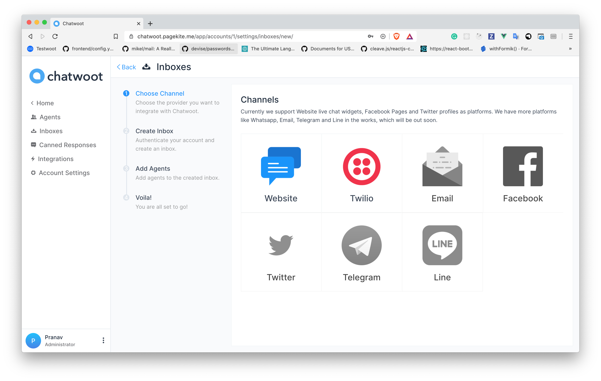
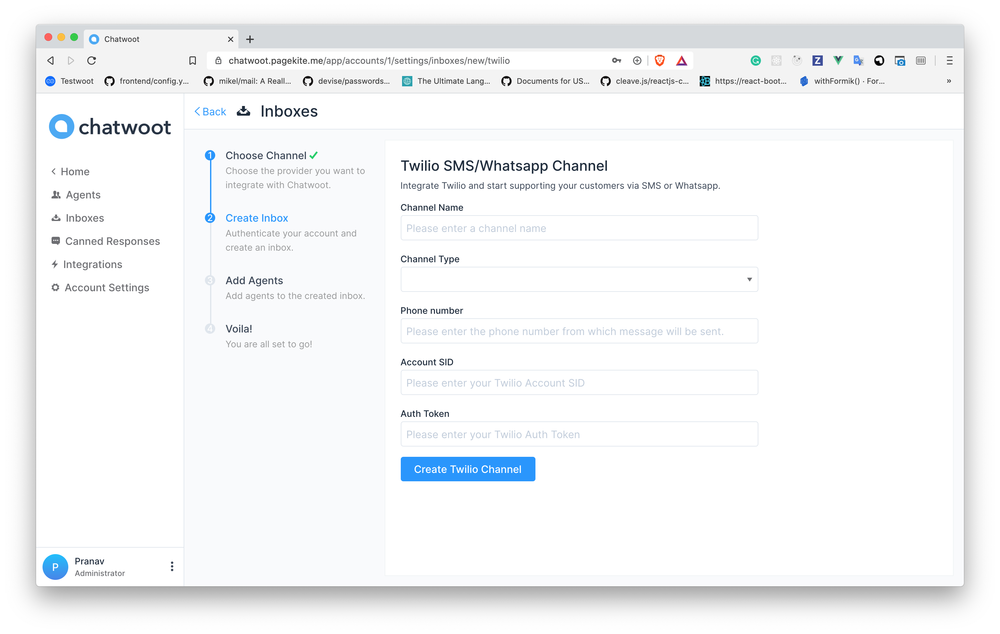
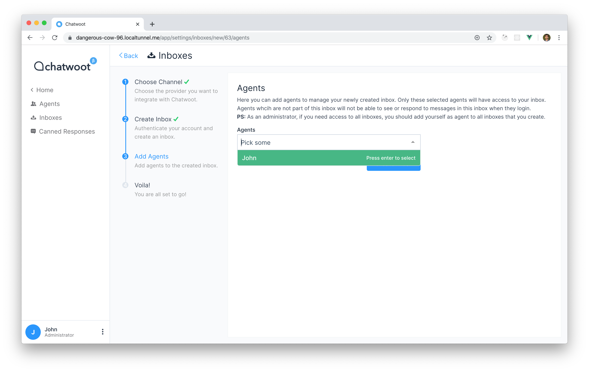
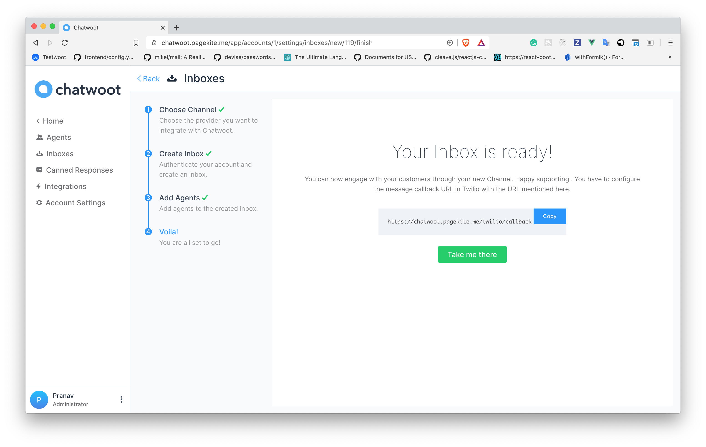
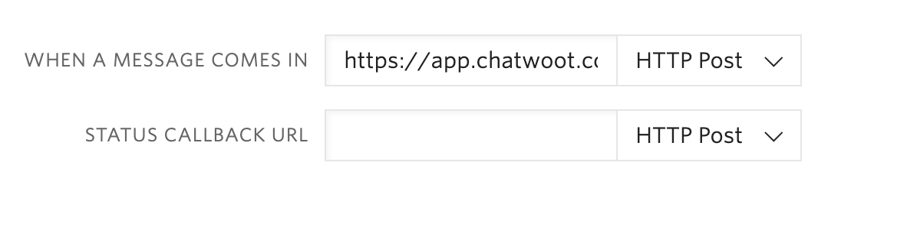
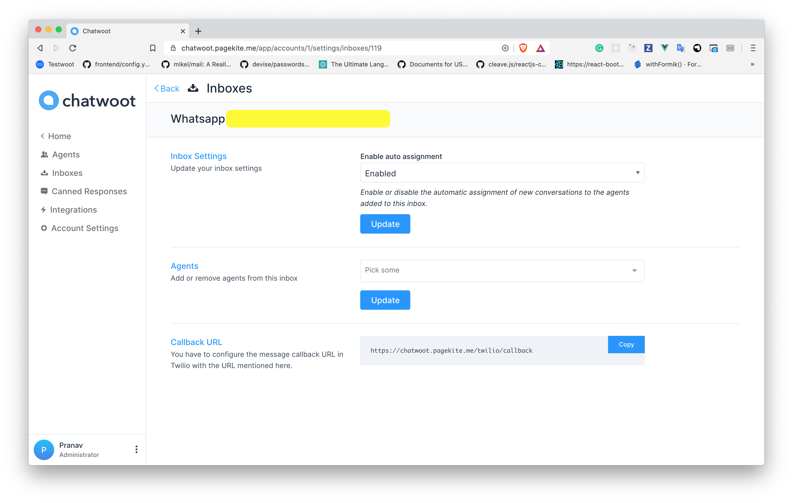

**Step 1**. Click on "Add Inbox" button from Settings > Inboxes page.

**Step 2**. Click on "Twilio" icon.

**Step 3**. Configure the inbox.

These are input required to create this channel

| Input | Description | Where can I find it |
| -- | -- | -- |
| Channel Name | This is the name inbox, this will used across the application | N/A |
| Channel Type | Select SMS if you are integrating SMS channel, select Whatsapp if you have a verified Whatsapp number in Twilio | N/A |
| Phone Number | This is number you will be using to communicate with you customer, this has to be verified in Twilio | Enter your number as in Twilio Dashboard  |
| Account SID | Account SID in Twilio Console | Login to Twilio Console, you would be able to see Account SID and Auth Token |
| Auth Token | Auth token for the account | Login to Twilio Console, you would be able to see Account SID and Auth Token |

**Step 4**. "Add agents" to your inbox.

**Step 6**. Hooray! You have successfully created a whatsapp/sms inbox.

If it is an SMS Channel then you don't need to do anything else, you will start receiving the messages in the dashboard whenever a customer sends you one.

If you are connecting a **Whatsapp** channel, you have configure a callback URL in the Twilio inbox.

- Login to your Twilio Console.
- Go to `Programmable SMS > Whatsapp > Senders`
- You will be able to see your phone number. Click on it, it will display a field like the one below.

- Provide `https://app.chatwoot.com/twilio/callback` as the value for `WHEN A MESSAGE COMES IN` input.

**Step 7**. If you want to update the agents who have access to the inbox, you can go to Settings > Inboxes.

