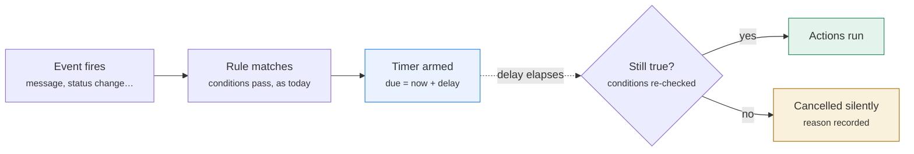
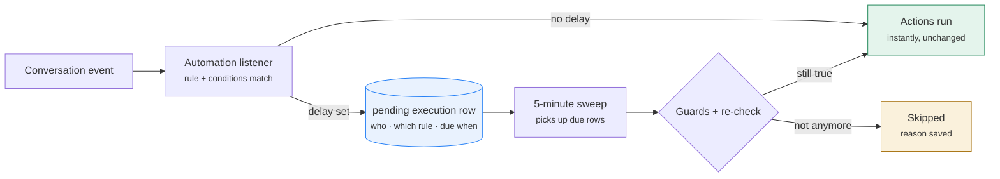
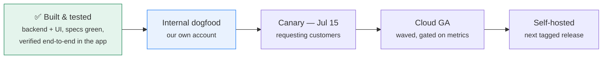

# Delayed automations, in five minutes

**Team explainer · CW-7513** — automation rules can now wait. Set a delay on any rule and it
runs later, but only if what triggered it is still true.

> **TL;DR** — We never schedule an *action*. We schedule a *question* — "is this still
> true?" — and only act when the answer is yes.

Companion docs: [design](delayed-automations.md) ·
[implementation plan](delayed-automations-implementation-plan.md) ·
[phasing & rollout](time-based-automations-phasing-and-rollout.md)

---

## One new option on the rule form

Every automation rule gets an **Execute: immediately / after a delay** choice
(10 minutes to 30 days). Everything else — events, conditions, actions — is the automation
feature people already know. The three things customers asked for become plain rules:

| Scenario | Rule | If things change first |
|---|---|---|
| **Stuck in a status too long** | `Conversation Updated` + `status = pending` + **after 4h** → add label | Resolved before the 4 hours pass? Nothing happens. |
| **Customer went quiet** | `Message Created` + `type = outgoing` + **after 24h** → send message | "Just checking in…" — sent once, cancelled automatically if the customer replies first. |
| **Agent went quiet** | `Message Created` + `type = incoming` + **after 30m** → unassign agent | Frees the conversation for reassignment — cancelled the moment the agent actually replies. |

## The core idea: delay + re-check

"Has been in state X for N hours" is the same as "matched at some moment, and still matches
N hours later." So the rule is evaluated twice — once to start the timer, once before acting.

The re-check is what makes the semantics right: a follow-up message cancels itself when the
customer replies; a "stuck in pending" label never lands on a conversation that got resolved.

## Under the hood: one table and the cron we already have

No new events, no future-scheduled Sidekiq jobs sitting in Redis for days. A delayed match
writes one row; the existing 5-minute scheduler sweeps whatever is due — the same pattern
snooze, campaigns, auto-resolve and SLA already use.

Accounts with no delayed rules create zero rows and zero cost. Repeated events for the same
wait collapse into the same row — the timer does not reset every time someone touches the
conversation.

## One conversation, two endings

The "stuck in pending" rule from above, on a real timeline:

**Stays pending → the rule fires**

| 10:00 | 11:30 | 14:00 |
|---|---|---|
| Moved to Pending — timer armed, due 14:00 | Agent adds a note — clock unchanged | Still pending → **label added** ✓ |

**Resolved in time → the rule cancels itself**

| 10:00 | 13:00 | 14:00 |
|---|---|---|
| Moved to Pending — timer armed, due 14:00 | Resolved — the wait it measured is over | **Nothing happens** — cancelled, nothing visible |

Leaving and re-entering Pending starts a fresh timer. A rule fires at most once per
"episode" — the platform owns the anti-loop guarantee; users never build "only once" hacks
into their conditions.

> **Good to know:** delayed rules apply to conversations with activity *after* the rule is
> created. A brand-new rule doesn't retroactively scan the existing backlog — closing that
> gap is on the roadmap (Phase 2).

## "Why didn't my rule fire?"

Every timer that doesn't run records exactly why. Six reasons cover every case:

| Reason | What it means |
|---|---|
| `conditions_changed` | The conversation no longer matched at fire time — the usual, healthy cancellation. |
| `episode_moved` | The wait it was measuring ended — customer replied, agent replied, or the status changed. |
| `rule_inactive` | The rule was switched off or deleted while the timer was running. |
| `flag_disabled` | Delayed automations were turned off for the account after the timer was armed. |
| `conversation_gone` | The conversation was deleted. |
| `expired` | The row was overdue by more than 3 days (e.g. long downtime) — we don't replay stale actions. |

Rows are kept for 30 days — support and engineering can answer "what fired, what didn't,
and why" for any conversation. An admin-facing history view ships in Phase 2.

## Three ways to stop it, three different sizes

| Scope | Lever | Behaviour |
|---|---|---|
| One rule | The existing on/off toggle | Pending timers for a disabled rule are skipped at fire time. |
| One account | `delayed_automations` feature flag | Gates the form control, the timer arming, and firing. Off means nothing arms and nothing fires — it never falls back to running instantly. |
| Whole instance | `DISABLE_DELAYED_AUTOMATIONS` config | Super-admin setting, takes effect within one 5-minute tick, no deploy. Checked by the sweep **and** every in-flight job. |

## Where we are

**Covered in v1**

- Delay on any rule, 10 min – 30 days
- All three customer scenarios, including unassign-on-silence
- Automatic cancellation on reply / status change
- Fires at most once per episode — no loops, by design
- Full audit trail with skip reasons

**Deliberately later**

- "Hours since X" conditions for already-quiet conversations — Phase 2
- Business-hours aware delays — Phase 2
- Admin-facing run history UI — Phase 2
- Reminder chains ("remind ×3, then resolve") — Phase 3
- Calendar/cron triggers — Phase 4

---

Code on `feature/cw-7513` · Tracking: CW-7513, parent CW-5790
