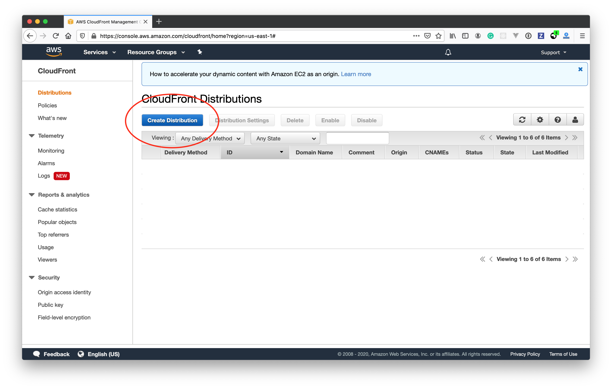
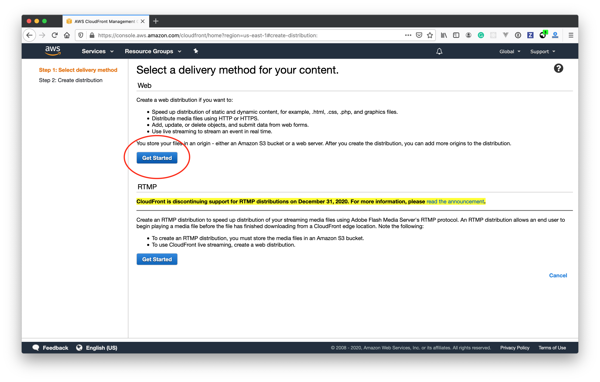
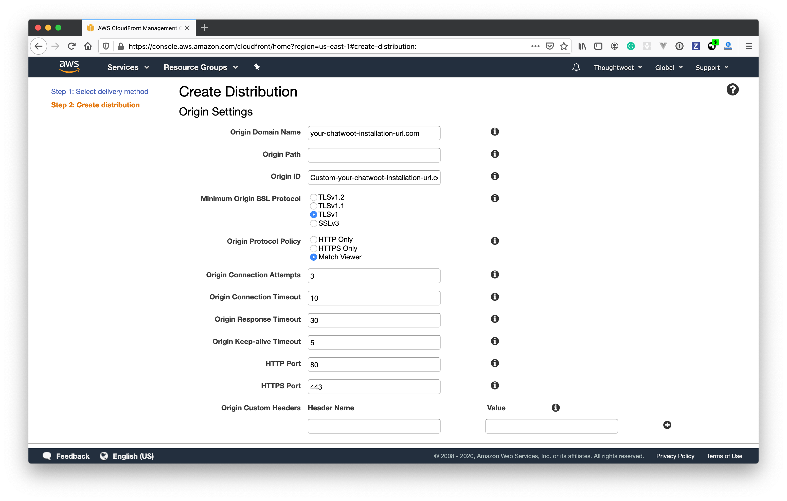
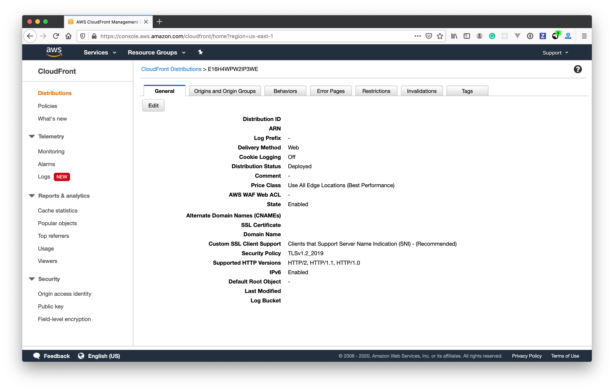

This document helps you to configure Cloudfront as the asset host for Chatwoot. If you have a high traffic website, we would recommend setting up a CDN for Chatwoot.

### Configure a Cloudfront distribution

**Step 1**: Create a Cloudfront distribution.



**Step 2**: Select "Web" as delivery method for your content.



**Step 3**: Configure the Origin Settings as the following.



- Provide your Chatwoot Installation URL under Origin Domain Name.
- Select "Origin Protocol Policy" as Match Viewer.

**Step 4**: Configure Cache behaviour.


- Configure **Allowed HTTP methods** to use *GET, HEAD, OPTIONS*.
- Configure **Cache and origin request settings** to use *Use legacy cache settings*.
- Select **Whitelist** for *Cache Based on Selected Request Headers*.
- Add the following headers to the **Whitelist Headers**.

  - **Access-Control-Request-Headers**
  - **Access-Control-Request-Method**
  - **Origin**

**Step 5**: Click on **Create Distribution**. You will be able to see the distribution as shown below. Use the **Domain name** listed in the details as the **ASSET_CDN_HOST** in Chatwoot.



### Add ASSET_CDN_HOST in Chatwoot

Your Cloudfront URL will be of the format `<distribution>.cloudfront.net`.

Set

```bash
ASSET_CDN_HOST=<distribution>.cloudfront.net
```

in the environment variables.
