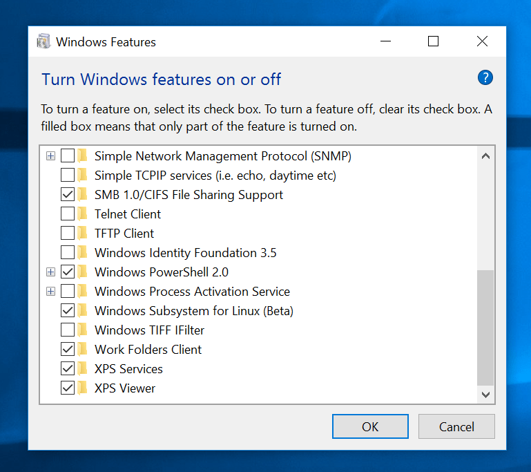

### Requirements

You need to install the Linux Subsystem for Windows.

1. The first step is to enable "Developer mode" in Windows. You can do this by opening up Settings and navigating to "Update & Security". In there, choose the tab on the left that reads "For Developers". Turn the "Developer mode" toggle on to enable it.


2. Next you have to enable the Windows Subsystem for Linux. Open the "Control Panel" and go to "Programs and Features". Click on the link on the left "Turn Windows features on or off". Look for the "Windows Subsystem for Linux" option and select the checkbox next to it.



3. Once that's complete, you can open up the Start Menu again and search for "Bash". This time it will have the Ubuntu logo.

### Installing RVM & Ruby

You need core linux dependencies installed in order to install ruby.

```bash
sudo apt-get update
sudo apt-get install git-core curl zlib1g-dev build-essential libssl-dev libreadline-dev libyaml-dev libsqlite3-dev sqlite3 libxml2-dev libxslt1-dev libcurl4-openssl-dev software-properties-common libffi-dev
```

Install RVM & ruby version 2.7.1

```bash
sudo apt-get install libgdbm-dev libncurses5-dev automake libtool bison libffi-dev
gpg --keyserver hkp://keys.gnupg.net --recv-keys 409B6B1796C275462A1703113804BB82D39DC0E3 7D2BAF1CF37B13E2069D6956105BD0E739499BDB
curl -sSL https://get.rvm.io | bash -s stable
source ~/.rvm/scripts/rvm
rvm install 2.7.1
rvm use 2.7.1 --default
ruby -v
```

### Install Node.js

Install `Node.js` from NodeSource using the following commands

```bash
curl -sL https://deb.nodesource.com/setup_12.x | sudo -E bash -
sudo apt-get install -y nodejs
```

### Install yarn

We use `yarn` as the package manager

```bash
curl -sS https://dl.yarnpkg.com/debian/pubkey.gpg | sudo apt-key add -
echo "deb https://dl.yarnpkg.com/debian/ stable main" | sudo tee /etc/apt/sources.list.d/yarn.list
```

```bash
sudo apt-get update && sudo apt-get install yarn
```

### Install postgres

The database used in Chatwoot is PostgreSQL. Use the following commands to install postgres:

```bash
sudo apt install postgresql postgresql-contrib
```

The installation procedure created a user account called postgres that is associated with the default Postgres role. In order to use Postgres, you can log into that account.

```bash
sudo -u postgres psql
```

Install `libpg-dev` dependencies for Ubuntu

```bash
sudo apt-get install libpq-dev
sudo service postgresql start
```

### Install redis-server

Chatwoot uses Redis server in agent assignments and reporting. To install `redis-server`

```bash
sudo apt-get install redis-server
```

Enable Redis to start on system boot.

```bash
sudo systemctl enable redis-server.service
```

### Install imagemagick

```bash
sudo apt-get install imagemagick
```
