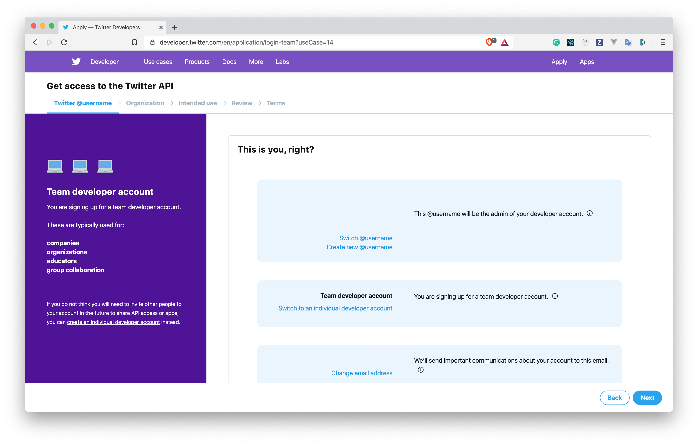
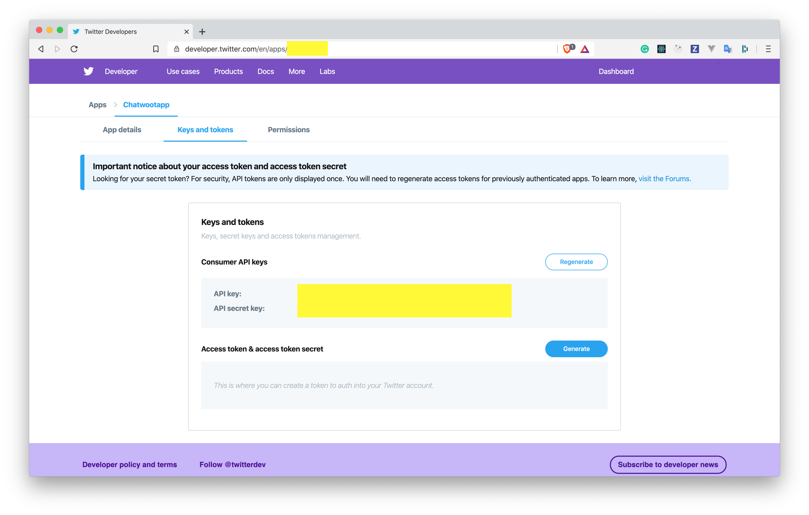
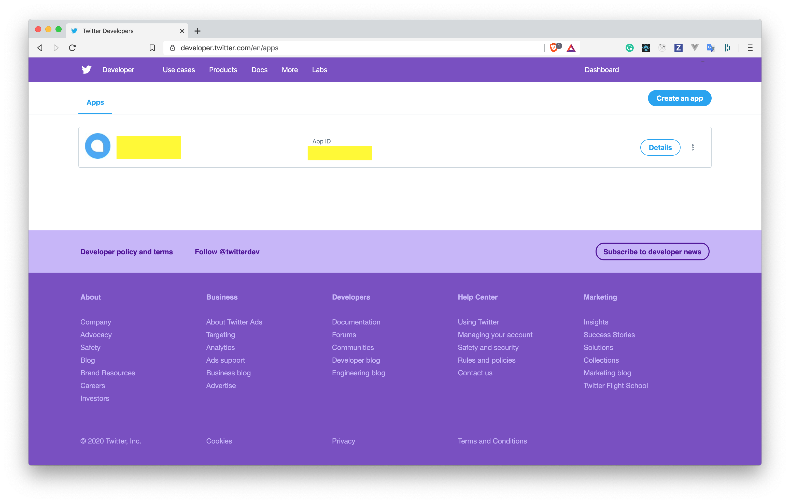
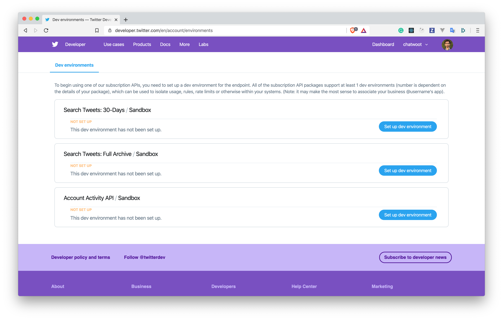
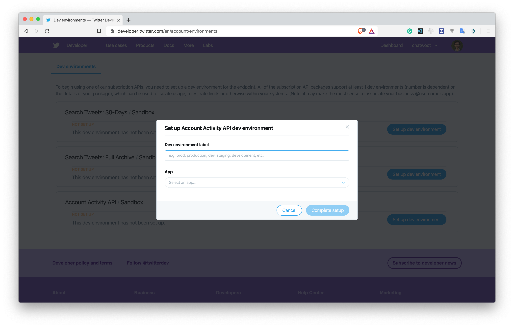

Twitter channel with Chatwoot requires access to Twitter APIs. We are using Account Activity API. If you don't have an access to Twitter Business APIs, apply for one at [Twitter developer portal](https://developer.twitter.com/en/apply-for-access).



Once your application is approved, you will be able to add Twitter Apps and dev environments. If you have applied for a team account, you will able to invite more team members. Inorder for the channel to work you will have to set the following environment variables. We will be describing what it means in the following sections.

```bash
TWITTER_APP_ID=
TWITTER_CONSUMER_KEY=
TWITTER_CONSUMER_SECRET=
TWITTER_ENVIRONMENT=
```

### Create a Twitter App

URL: https://developer.twitter.com/en/apps/create

Create a Twitter by filling all the required fields in the above link.

#### Things to note:

1. Enable Sign in with Twitter
2. Configure the callback url as `{your_chatwoot_installation_url}/twitter/callback`

After you create the app, you will be able to see a tab `Keys and Tokens`.

Use `API key` under `Consumer API keys` as `TWITTER_CONSUMER_KEY` in Chatwoot.

Use `API secret key` under `Consumer API keys` as `TWITTER_CONSUMER_SECRET` in Chatwoot.



Go to your apps, you will able to see your app id. Use this app id as `TWITTER_APP_ID` in Chatwoot.



### Create a dev environment

Inorder for the DMs and Tweets to work in realtime, you need to set up Account Activity API dev environment as follows.

URL: https://developer.twitter.com/en/account/environments



Click on `Set up dev environment`. You will be able to see a form as follows.

Provide a `Dev Environment Label`, this should be an alphanumeric string. Use the same string as `TWITTER_ENVIRONMENT` in Chatwoot.



Once you do this, you will ready to use Twitter Channels. To connect your Twitter Account, follow this [guide](/docs/channels/twitter).
