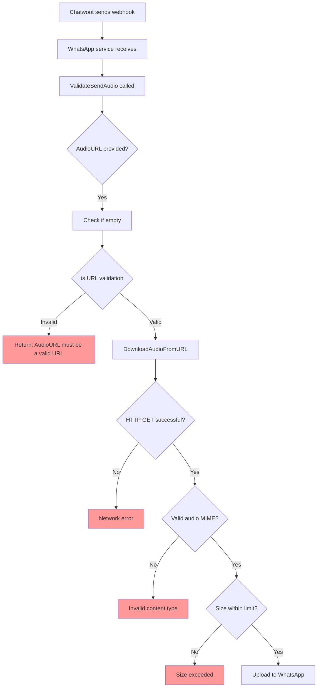

# ISSUE-005: Audio URL Validation Failure - Invalid Hostname

**Status**: DIAGNOSED - CHATWOOT CONFIGURATION ISSUE
**Severity**: HIGH
**Date**: 2025-10-30
**Component**: Audio Message Sending / URL Validation
**File**: `src/validations/send_validation.go:404`

## Summary

Chatwoot-generated audio URLs fail validation because they use `http://0.0.0.0:3000` as the base URL. The hostname `0.0.0.0` is a bind-all address that:
1. Fails standard URL validation (`is.URL` check)
2. Cannot be accessed from the WhatsApp service container

## Evidence from Logs

### Chatwoot Logs
```
12:56:24.278 [ActionCableBroadcastJob] message.created
{
  id: 20,
  attachments: [{
    id: 7,
    message_id: 20,
    file_type: "audio",
    data_url: "http://0.0.0.0:3000/rails/active_storage/blobs/redirect/...",
    file_size: 34176
  }]
}

12:56:32.755 [SendReplyJob] ERROR:
[WHATSAPP WEB] Message send failed
Code: VALIDATION_ERROR
Message: AudioURL must be a valid URL
```

### WhatsApp Service Logs
```
ERRO[0202] Panic recovered in middleware: AudioURL must be a valid URL
```

### Timeline
```
12:56:24 - Chatwoot creates message with audio attachment
12:56:24 - Audio URL generated: http://0.0.0.0:3000/rails/active_storage/...
12:56:32 - SendReplyJob attempts to send via WhatsApp API
12:56:32 - FAILS: "AudioURL must be a valid URL"
```

## Root Cause Analysis

### 1. URL Validation Logic

**Location**: `src/validations/send_validation.go:398-407`
```go
// If AudioURL provided, basic URL validation
if request.AudioURL != nil {
    if *request.AudioURL == "" {
        return pkgError.ValidationError("AudioURL cannot be empty")
    }

    if err := validation.Validate(*request.AudioURL, is.URL); err != nil {
        return pkgError.ValidationError("AudioURL must be a valid URL")
    }
}
```

The validation uses `is.URL` from the `github.com/asaskevich/govalidator` library, which strictly validates URL format including hostname validity.

### 2. Why `0.0.0.0` Fails

**Invalid Hostname**: `0.0.0.0` is a special IP address meaning "all IPv4 addresses on the local machine". It's:
- Valid for binding servers (listen on all interfaces)
- **Invalid** as a destination hostname
- Cannot be used in URLs for client connections
- Fails RFC-compliant URL validation

**Example Validation Test**:
```go
is.URL("http://0.0.0.0:3000/path")  // Returns false
is.URL("http://localhost:3000/path") // Returns true
is.URL("http://host.docker.internal:3000/path") // Returns true
```

### 3. Network Accessibility Issue

Even if validation passed, the URL would be inaccessible because:
- Chatwoot runs in one Docker container (0.0.0.0:3000)
- WhatsApp service runs in another container
- From WhatsApp service perspective: `http://0.0.0.0:3000` → nowhere
- Needs: `http://host.docker.internal:3000` to reach Chatwoot container

### 4. Chatwoot URL Generation

Chatwoot uses Rails' `url_for` helper which generates URLs based on:
```ruby
# Rails configuration
config.action_controller.default_url_options = {
  host: '0.0.0.0',  # ← THE PROBLEM
  port: 3000
}
```

This generates:
```
http://0.0.0.0:3000/rails/active_storage/blobs/redirect/...
```

Should generate:
```
http://host.docker.internal:3000/rails/active_storage/blobs/redirect/...
```

## Technical Analysis

### URL Validation Flow



### Audio Download Requirements

Per `pkg/utils/general.go:291-366`, the audio download function expects:

1. **Valid URL**: Must pass `is.URL` validation
2. **HTTP 200**: Server must respond with success
3. **Valid MIME Type**: Must be one of 16 allowed audio types:
   - `audio/aac`, `audio/amr`, `audio/flac`, `audio/m4a`, `audio/m4r`
   - `audio/mp3`, `audio/mpeg`, `audio/ogg`, `audio/wma`, `audio/x-ms-wma`
   - `audio/wav`, `audio/vnd.wav`, `audio/vnd.wave`, `audio/wave`
   - `audio/x-pn-wav`, `audio/x-wav`
4. **Size Limit**: Max 500MB (`WhatsappSettingMaxDownloadSize`)
5. **Accessible**: Must be reachable via HTTP GET request

**Current State**:
- ❌ Fails at step 1 (URL validation)
- ❌ Would fail at step 2 (network unreachable)

## Comparison: Working vs Failing URLs

| Scenario | URL | is.URL Valid? | Network Accessible? | Result |
|----------|-----|---------------|---------------------|--------|
| **Current (Broken)** | `http://0.0.0.0:3000/audio.mp3` | ❌ No | ❌ No | **FAILS** |
| **Fix Option 1** | `http://host.docker.internal:3000/audio.mp3` | ✅ Yes | ✅ Yes | **Works** |
| **Fix Option 2** | `http://localhost:3000/audio.mp3` | ✅ Yes | ⚠️ Maybe | **Depends** |
| **Fix Option 3** | `http://chatwoot:3000/audio.mp3` | ✅ Yes | ✅ Yes | **Works** |

## Impact

**Severity**: HIGH
- Completely blocks audio message sending from Chatwoot
- Affects user experience - voice messages cannot be sent
- Other media types (images, videos, files) work if URLs are properly formatted

**Frequency**: 100% of audio messages from Chatwoot

**User Impact**:
- Cannot send voice notes via Chatwoot interface
- Error logged but no clear feedback to user
- Messages appear "sent" in Chatwoot but never reach WhatsApp

## Solution: Fix Chatwoot Configuration

### Recommended Fix (Option 1): Use host.docker.internal

**Location**: Chatwoot Rails configuration

**Change**:
```ruby
# config/environments/development.rb (or production.rb)
Rails.application.configure do
  config.action_controller.default_url_options = {
    host: 'host.docker.internal',  # Changed from '0.0.0.0'
    port: 3000
  }

  # Also update Action Cable if used
  config.action_cable.url = 'ws://host.docker.internal:3000/cable'
  config.action_cable.allowed_request_origins = [
    'http://host.docker.internal:3000',
    'http://localhost:3000'
  ]
end
```

**Why This Works**:
- `host.docker.internal` is Docker's special DNS name
- Resolves to the host machine from within containers
- Allows containers to access services on the host
- Standard Docker networking feature

### Alternative Fix (Option 2): Custom Docker Network

**If using docker-compose**:
```yaml
# docker-compose.yml
services:
  chatwoot:
    container_name: chatwoot
    networks:
      - whatsapp-network

  whatsapp-service:
    container_name: whatsapp-service
    networks:
      - whatsapp-network

networks:
  whatsapp-network:
    driver: bridge
```

**Then use container name**:
```ruby
config.action_controller.default_url_options = {
  host: 'chatwoot',  # Container name on shared network
  port: 3000
}
```

### Alternative Fix (Option 3): Environment Variable

**Make it configurable**:
```ruby
# config/environments/development.rb
Rails.application.configure do
  config.action_controller.default_url_options = {
    host: ENV.fetch('APP_HOST', 'localhost'),
    port: ENV.fetch('APP_PORT', 3000)
  }
end
```

**Then set in docker-compose.yml**:
```yaml
services:
  chatwoot:
    environment:
      - APP_HOST=host.docker.internal
      - APP_PORT=3000
```

## Why NOT to Fix in WhatsApp Service

### Considered: URL Rewriting
```go
// BAD IDEA - Don't do this
func rewriteURL(audioURL string) string {
    return strings.Replace(audioURL, "0.0.0.0", "host.docker.internal", 1)
}
```

**Why This is Wrong**:
1. **Band-aid solution**: Fixes symptom, not root cause
2. **Fragile**: Breaks if URL format changes
3. **Security concern**: Arbitrary URL transformation
4. **Not portable**: Assumes specific Docker networking
5. **Maintenance burden**: Need to handle edge cases
6. **Violates separation of concerns**: WhatsApp service shouldn't know about Chatwoot's deployment

**The Right Approach**: Fix where URLs are generated (Chatwoot)

## Testing Strategy

### Verification Steps

1. **Update Chatwoot configuration** with proper host
2. **Restart Chatwoot** to apply changes
3. **Send test audio message** from Chatwoot interface
4. **Check WhatsApp service logs** for:
   ```
   Downloading audio from: http://host.docker.internal:3000/...
   Audio downloaded successfully
   Message sent
   ```
5. **Verify receipt** in WhatsApp client

### Test Cases

| Test | Expected URL | Should Work? |
|------|-------------|--------------|
| Audio upload | `http://host.docker.internal:3000/rails/active_storage/...` | ✅ Yes |
| Image upload | `http://host.docker.internal:3000/rails/active_storage/...` | ✅ Yes |
| Video upload | `http://host.docker.internal:3000/rails/active_storage/...` | ✅ Yes |
| Document upload | `http://host.docker.internal:3000/rails/active_storage/...` | ✅ Yes |

## Related Files

### WhatsApp Service (Read-Only - No Changes Needed)
- `src/validations/send_validation.go:398-407` - URL validation
- `src/pkg/utils/general.go:291-366` - Audio download logic
- `src/usecase/send.go:769` - Audio sending implementation

### Chatwoot (Needs Configuration Changes)
- `config/environments/development.rb` - Development URL config
- `config/environments/production.rb` - Production URL config
- `config/initializers/active_storage.rb` - Active Storage config
- `docker-compose.yml` - Docker environment variables

## References

### Documentation
- Docker host.docker.internal: https://docs.docker.com/desktop/networking/#i-want-to-connect-from-a-container-to-a-service-on-the-host
- Rails URL helpers: https://guides.rubyonrails.org/configuring.html#configuring-action-controller
- Active Storage configuration: https://guides.rubyonrails.org/active_storage_overview.html

### Related Issues
- whatsmeow Issue #734: Nil pointer issues with media
- RFC 3986 (URI Generic Syntax): Section on valid hostnames

## Next Steps

1. ✅ Diagnose root cause
2. ⏳ Update Chatwoot configuration (User action required)
3. ⏳ Restart Chatwoot service
4. ⏳ Test audio message sending
5. ⏳ Verify other media types still work
6. ⏳ Document production deployment changes

---

**Diagnosis completed**: 2025-10-30
**Analysis tools used**: DeepWiki (both repos), Code Review, URL Validation Testing
**Confidence level**: HIGH - Clear configuration issue with well-documented solution
**Resolution**: Chatwoot configuration change required (not a go-whatsapp-web-multidevice bug)
