# WhatsApp Web Provider - Architecture Diagram

## System Architecture Overview

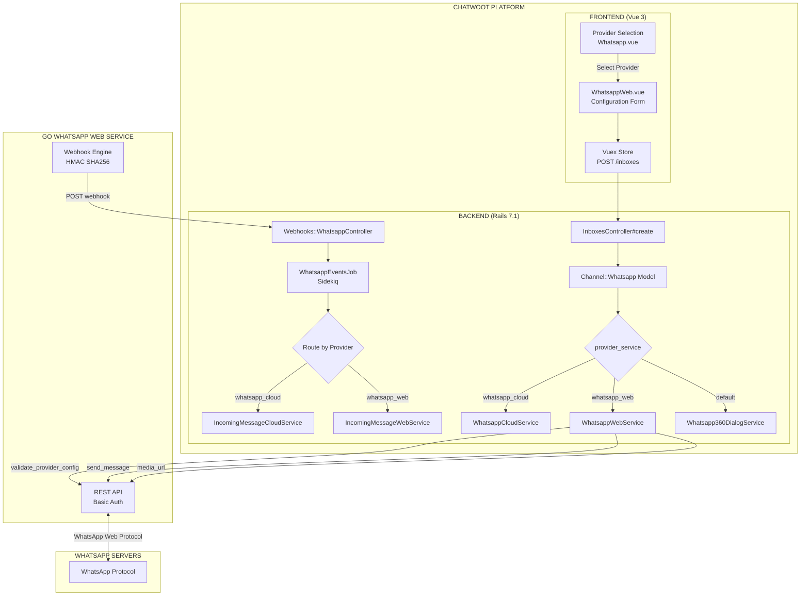

## Message Flow Diagrams

### Outgoing Message Flow

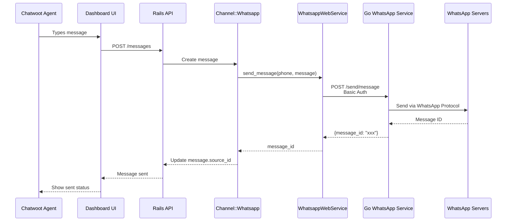

### Incoming Message Flow

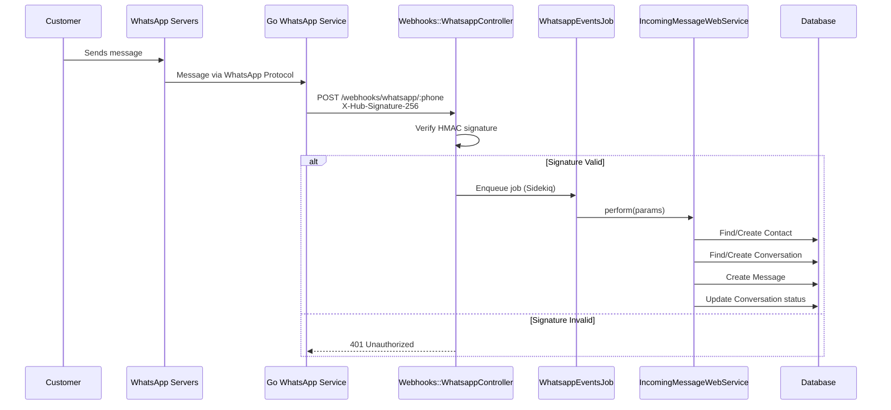

### Message Receipt Flow

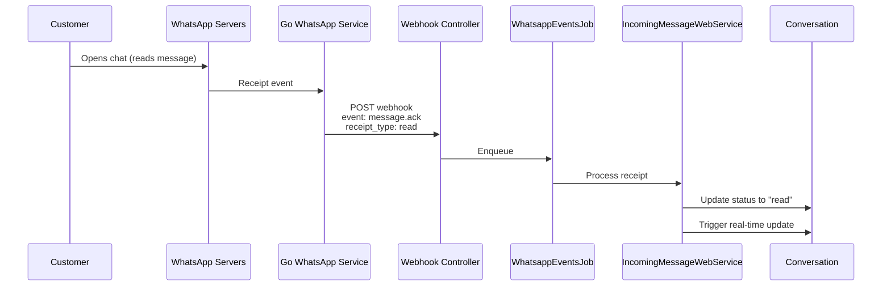

## Security Flow

### HMAC Signature Verification

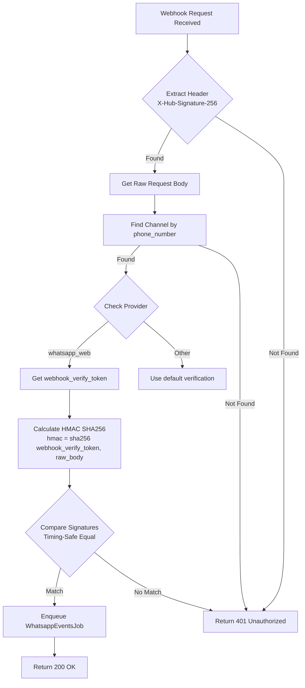

## Database Schema

### Channel WhatsApp Table

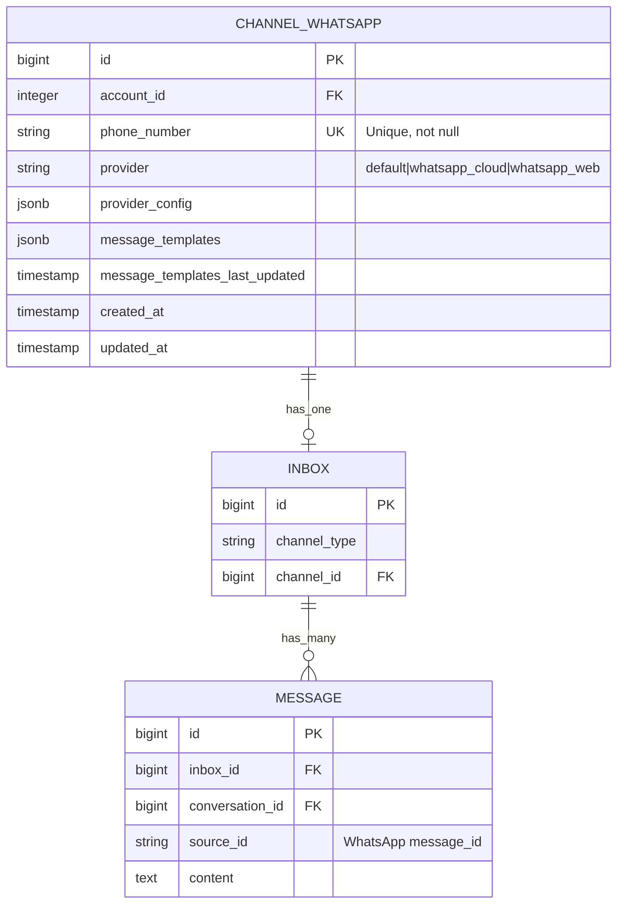

### Provider Config Structure for whatsapp_web

```json
{
  "api_base_url": "http://localhost:3000",
  "basic_auth_username": "admin",
  "basic_auth_password": "secret123",
  "webhook_verify_token": "auto_generated_hex_32",
  "phone_number": "+1234567890"
}
```

### Database Files (Go WhatsApp Service)

```
storages/
├── whatsapp.db          # SQLite: Connection state, devices
├── chatstorage.db       # SQLite: Chat history (optional)
└── qrcode/             # QR code images
    └── scan-qr-*.png
```

## Component Interaction Diagram

### Configuration & Login Flow

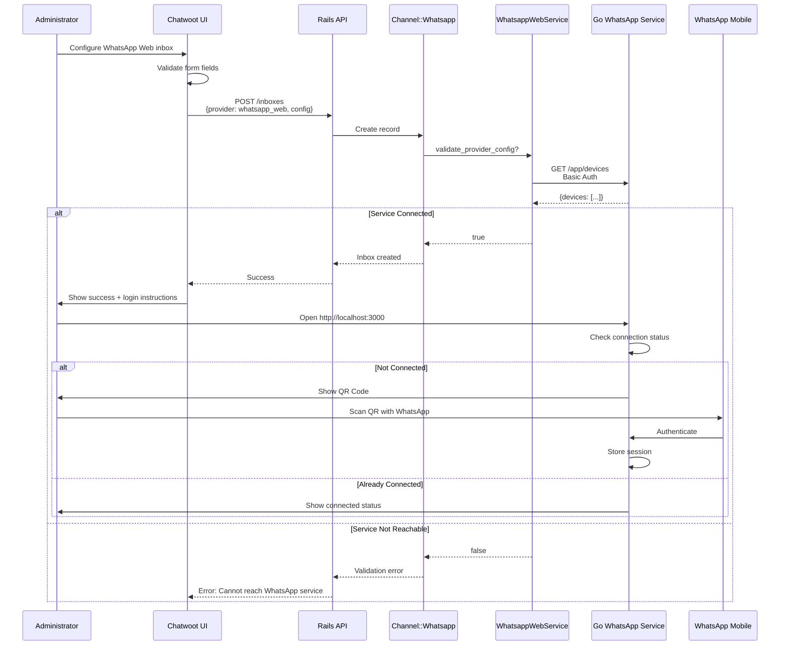

### Group Event Flow

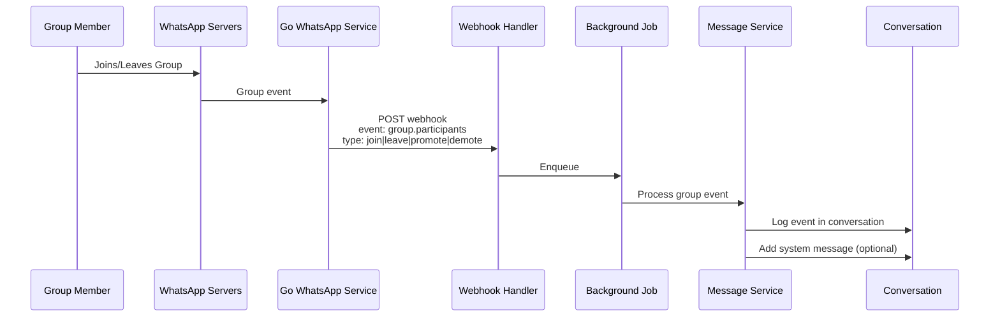

## Event Type Processing Matrix

| Event Type | Payload Field | Chatwoot Action | Creates Message? |
|-----------|---------------|-----------------|------------------|
| **Text Message** | `message.text` | Create text message | ✅ Yes |
| **Image Message** | `image.media_path` | Download & attach | ✅ Yes |
| **Video Message** | `video.media_path` | Download & attach | ✅ Yes |
| **Audio Message** | `audio.media_path` | Download & attach | ✅ Yes |
| **Document Message** | `document.media_path` | Download & attach | ✅ Yes |
| **Sticker Message** | `sticker.media_path` | Download & attach | ✅ Yes |
| **Contact Message** | `contact.vcard` | Parse & display | ✅ Yes |
| **Location Message** | `location.{lat,lng}` | Display map | ✅ Yes |
| **Message Delivered** | `receipt_type: delivered` | Update status | ❌ No (update only) |
| **Message Read** | `receipt_type: read` | Update status, show checkmarks | ❌ No (update only) |
| **Message Revoked** | `action: message_revoked` | Mark as deleted | ❌ No (update only) |
| **Message Edited** | `action: message_edited` | Update content | ❌ No (update only) |
| **Reaction** | `reaction.message` | Add reaction | ⚠️ Optional |
| **Group Join** | `type: join` | Log event | ⚠️ Optional |
| **Group Leave** | `type: leave` | Log event | ⚠️ Optional |
| **Group Promote** | `type: promote` | Log event | ⚠️ Optional |
| **Group Demote** | `type: demote` | Log event | ⚠️ Optional |

## Configuration Checklist

### Go WhatsApp Service Setup

- [ ] Service deployed and running
- [ ] Port 3000 exposed (or custom port)
- [ ] Basic Auth configured (`APP_BASIC_AUTH=user:pass`)
- [ ] Webhook URL configured (`WHATSAPP_WEBHOOK=https://chatwoot.domain/webhooks/whatsapp/:phone`)
- [ ] Webhook secret configured (`WHATSAPP_WEBHOOK_SECRET=random_32_char`)
- [ ] FFmpeg installed (for media processing)
- [ ] Storage directory writable (`./storages`)
- [ ] Logged in via QR code or pairing code

### Chatwoot Configuration

- [ ] Feature flag enabled (if using feature flags)
- [ ] Provider added to `Channel::Whatsapp::PROVIDERS`
- [ ] Service class created: `Whatsapp::Providers::WhatsappWebService`
- [ ] Incoming message service created: `Whatsapp::IncomingMessageWebService`
- [ ] Webhook controller updated for HMAC verification
- [ ] Frontend component created: `WhatsappWeb.vue`
- [ ] i18n translations added
- [ ] Routes configured

### Network Configuration

- [ ] Chatwoot accessible from Go WhatsApp Service
- [ ] Webhook URL publicly accessible (or via tunnel for dev)
- [ ] HTTPS configured (production)
- [ ] Firewall rules allow connections
- [ ] DNS configured (if using domain)

## Deployment Patterns

### Pattern 1: Same Server

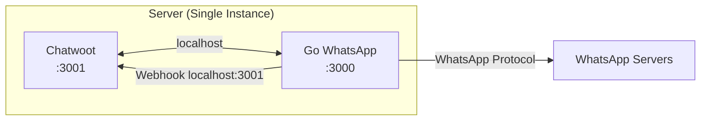

### Pattern 2: Separate Servers

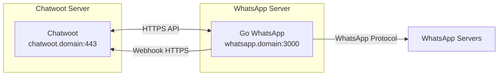

### Pattern 3: Docker Compose

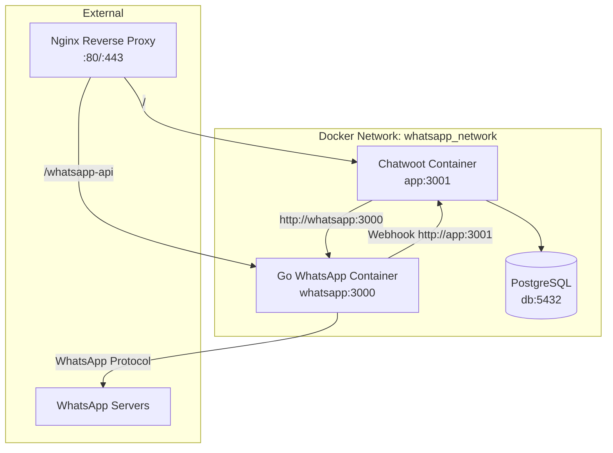

## Error Handling Flow

### Connection Error Handling

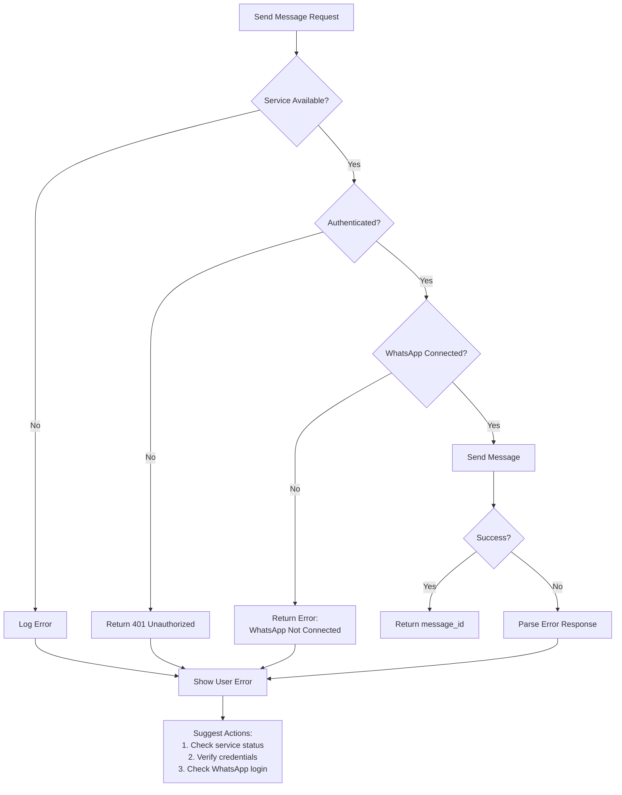

### Webhook Error Recovery

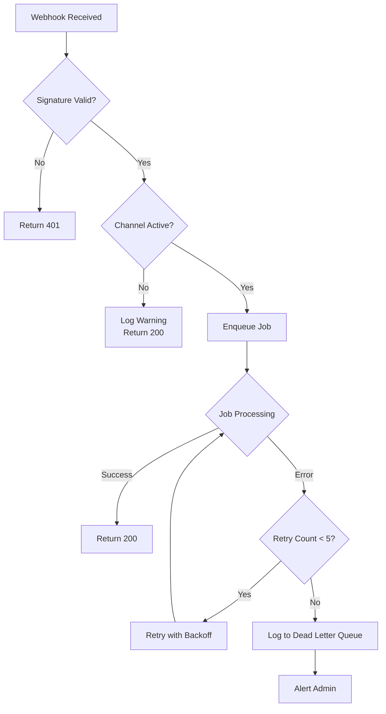

## Media Handling Flow

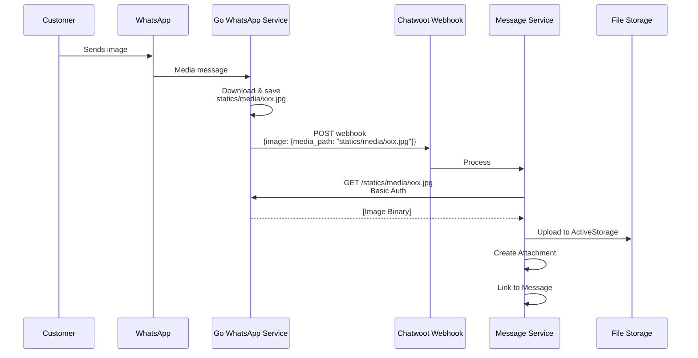

## Implementation Phases

### Phase 1: Core Integration (Week 1-2)

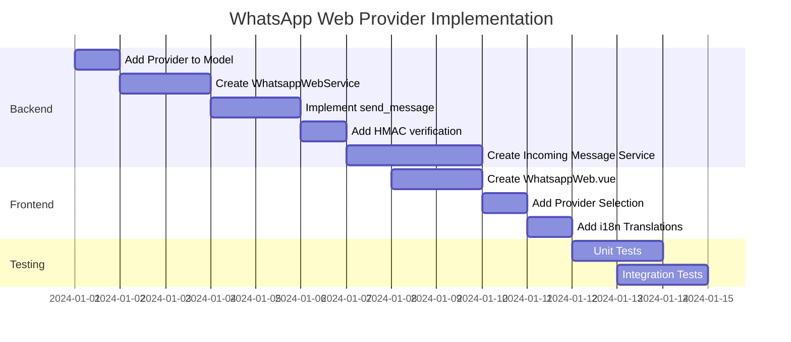

### Phase 2: Advanced Features (Week 3-4)

- Media download optimization
- Group event processing
- Receipt status updates
- Error handling improvements
- Performance optimization

### Phase 3: Production Readiness (Week 5)

- Security audit
- Load testing
- Documentation
- Deployment guide
- Monitoring setup

---

## Related Documentation

- [Implementation Story](docs/features/FEAT-004/implementation-story.md)
- [Creating WhatsApp Inbox Provider Guide](docs/features/FEAT-004/creating-whatsapp-inbox-provider.md)
- [Go WhatsApp Deployment Guide](docs/features/FEAT-004/deployment-guide.md)
- [Webhook Payload Documentation](docs/features/FEAT-004/webhook-payload.md)
- [API Reference](docs/features/FEAT-004/openapi.md)
