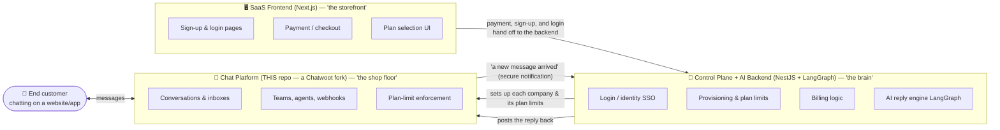
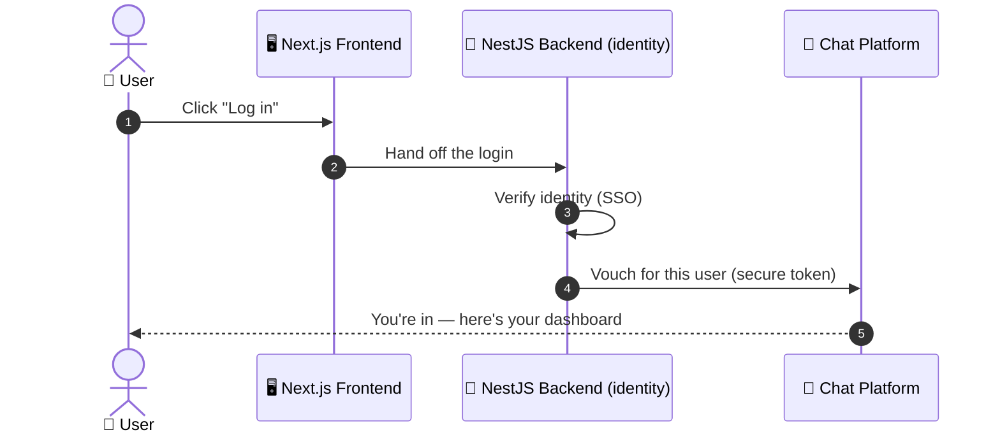
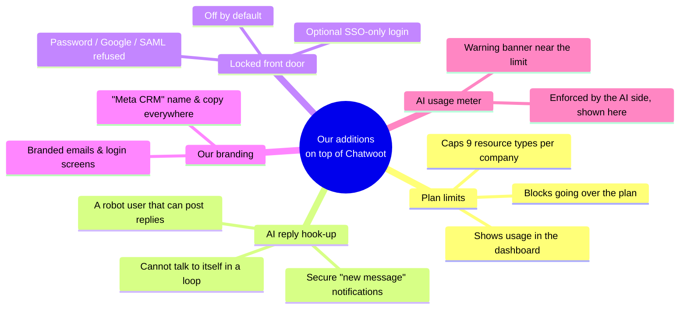
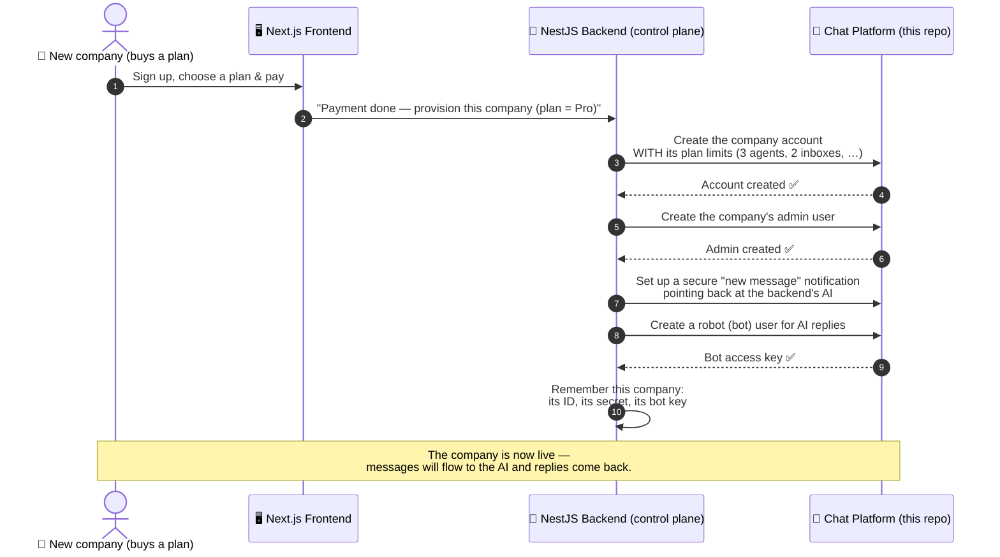
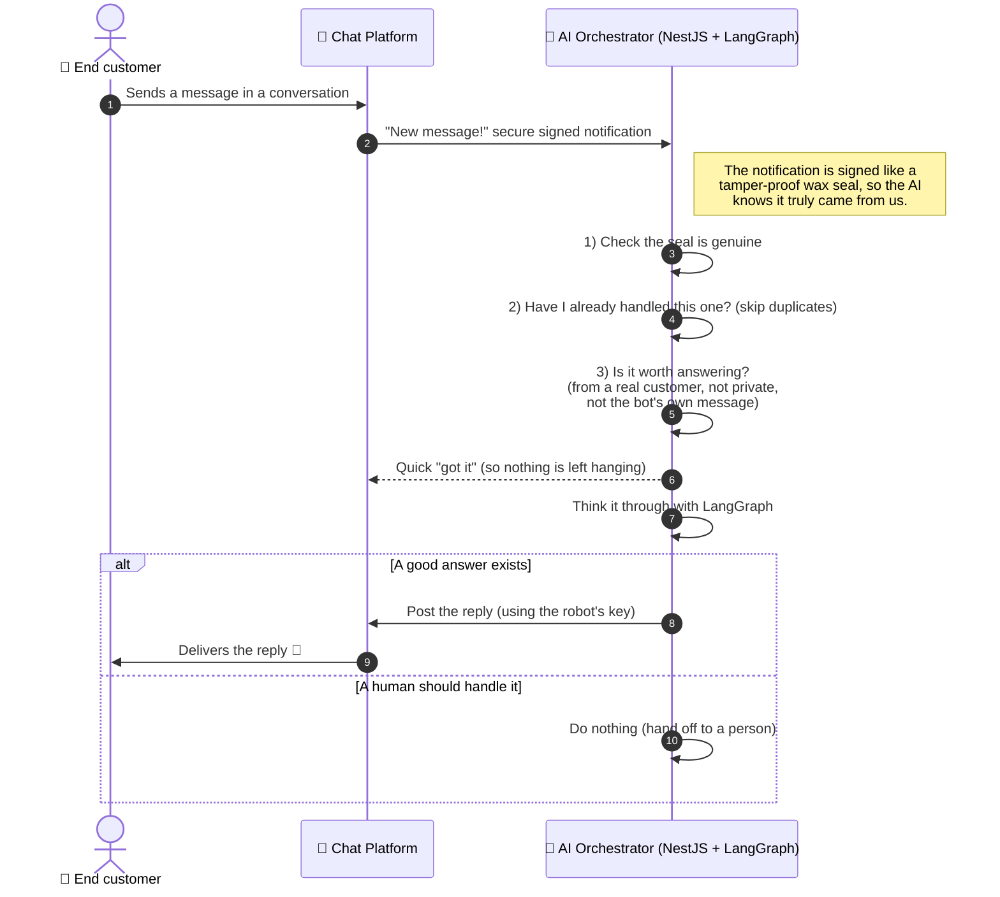
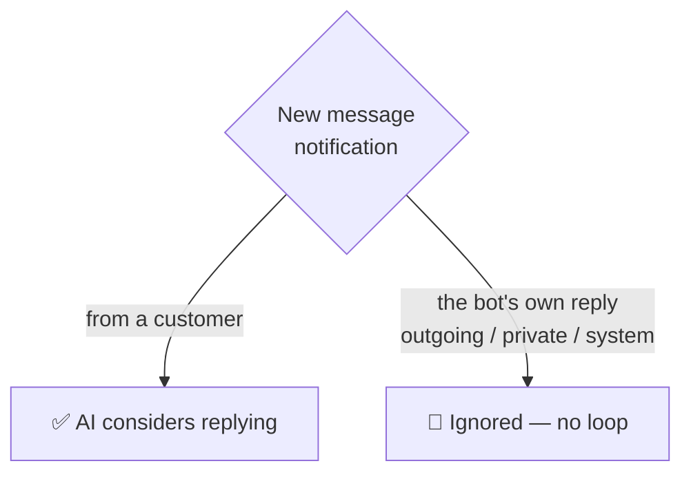
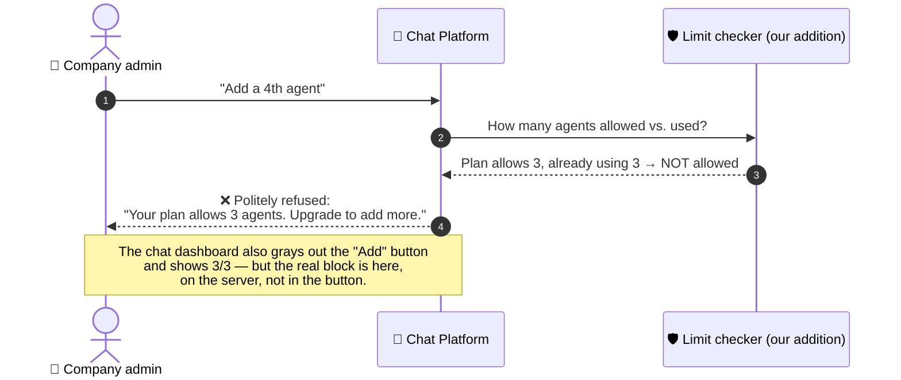
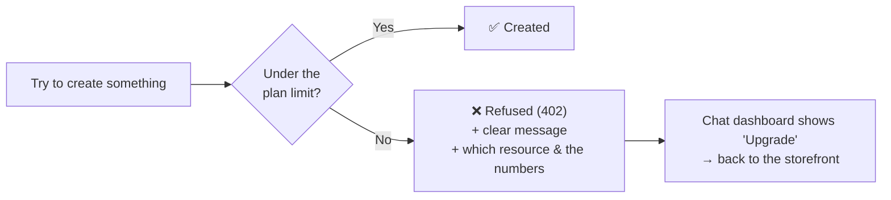
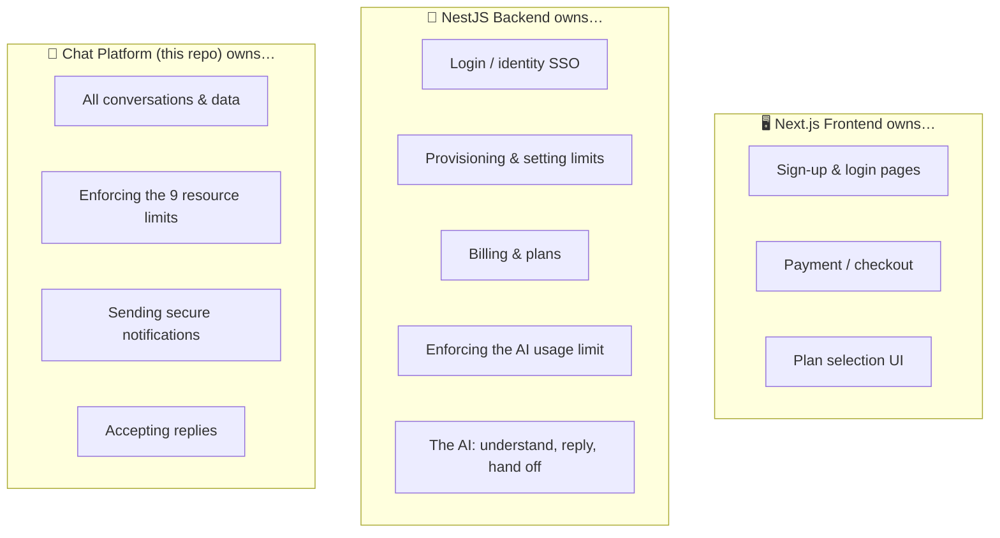
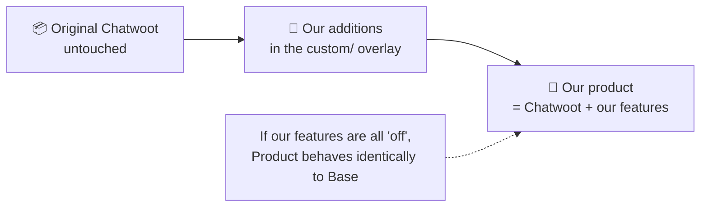

# How It All Works — A Plain-English Guide

This guide explains, without assuming any coding background, **what this project
is**, **what we added to it**, and **how it works together with the AI and the
customer dashboard**. If you can picture a call-center building, you can
understand this system.

> If you only read one thing: we took a well-known open-source chat platform
> (Chatwoot), kept it 100% compatible, and wrapped **plan limits**, a
> **plug-in point for an AI assistant**, an **optional locked front door**, and
> **our own branding** around it — all without changing how the original system
> behaves.

---

## 1. The big idea, in one picture

Think of the whole product as a **customer-support building** made of three
systems. Two of them live in other repositories; **only the chat platform is
this repo.**

**Who does what:**

| System | Built with | Its job | Where it lives |
| --- | --- | --- | --- |
| **SaaS Frontend** | Next.js | The website customers see: sign-up/login pages, payment, choosing a plan. It does no heavy lifting — it hands off to the backend. | *External* (separate repo) |
| **Control Plane + AI Backend** | NestJS + LangGraph | The brain behind the frontend: handles login/identity, sets up each company in the chat platform, tracks plans & billing, **and** runs the AI that reads messages and writes replies. | *External* (separate repo) |
| **Chat Platform** | Chatwoot (Ruby) | Actually runs the conversations, stores everything, and enforces the plan limits. | **This repo** |

> **Note — the backend wears two hats.** The external NestJS backend is *both*
> the **control plane** (signing companies up, setting limits, billing) *and* the
> **AI orchestrator** (the LangGraph pipeline that answers messages). They're the
> same repo; we call out whichever hat is relevant in each flow below.

The three systems only ever talk through **standard "doors"** (interfaces)
that Chatwoot already had — we did not cut new doors into the building. That's
what keeps us able to pull in future upstream Chatwoot updates without conflicts.

### How people log in (the redirect)

Customers don't type a password into the chat platform directly. They sign in on
the **Next.js frontend**, which hands the login to the **NestJS backend** (the
one identity authority). The backend proves who they are and drops them into
their chat dashboard.

When the optional **"locked front door"** is switched on (see §3.3), this is the
*only* way in — the chat platform refuses passwords, Google, and SAML on its own,
so the NestJS backend stays the single source of truth for who gets access.

---

## 2. Key words (glossary, one line each)

- **Tenant / Account** — one company that uses the product (e.g. "Acme Inc").
  Everything is separated per tenant so companies never see each other's data.
- **Fork** — our own copy of the open-source Chatwoot project that we build on
  top of.
- **Overlay (`custom/`)** — a special "sticky-note" folder where all our
  additions live. The original Chatwoot files underneath are left untouched, so
  our notes can be peeled off cleanly. This is the key trick for staying
  upgrade-safe.
- **Quota / Limit** — how much of something a plan allows (e.g. "3 agents",
  "2 inboxes").
- **Webhook** — an automatic phone call the system makes to notify another
  system that something happened ("a new message just arrived").
- **API** — a doorway one system uses to ask another system to do something
  ("please post this reply").
- **Provisioning** — the setup steps that create a brand-new company account and
  everything it needs.
- **SSO (Single Sign-On)** — logging in through one central identity system
  instead of a separate password here.
- **White-label** — putting *our* brand name and logo on the product instead of
  "Chatwoot".

---

## 3. What we added (the 5 features), in plain terms

### 3.1 Plan limits (the biggest piece)

Every plan says how much a company can have. We enforce **nine** kinds of
"stuff":

> agents · teams · inboxes · AI bots · webhooks · labels · custom fields ·
> automation rules · integrations

**The rule is simple:** you can always *edit* or *delete* things, but you cannot
*create* a new one once you hit your plan's cap. Editing and deleting stay open
so a company can always free up space by removing something.

Crucially, we enforce this **deep inside the engine**, not just by graying out a
button. Even if someone tried a clever back-door path (connecting a Facebook
page, a Slack app, importing via a script), the limit still holds. The grayed-out
button in the dashboard is only a *mirror* of the real enforcement.

**One important fairness rule — the platform's own robots don't use up your
plan.** To run the AI, our backend quietly creates a few pieces of *plumbing*
inside each company: the AI's robot user, its secure "new message" notification,
and a behind-the-scenes service login. These are **platform infrastructure**, not
things the company bought — so they are **flagged as "platform-managed" and left
out of the count entirely.** A plan that says "3 agents, 1 AI bot, 2 webhooks"
gives the company all of those — the platform never secretly reserves one for its
own robots. Anything a *company* creates still counts normally.

### 3.2 AI reply hook-up

We make it possible for the external AI to answer customers — **without changing
any of Chatwoot's original code.** Chatwoot already knew how to (a) send a secure
"new message" notification and (b) accept a posted reply. We simply:

- give each company a **secure notification** pointed at the AI, and
- give the AI a **robot user identity** (a "bot") so it can post replies.

### 3.3 Locked front door (optional)

Some deployments want the *only* way into a company account to be through the
central identity system. When switched on, this refuses passwords, Google login,
and SAML — right at the server, not just by hiding buttons. It is **off by
default**, so nothing changes unless someone deliberately turns it on.

### 3.4 Our branding ("Meta CRM")

The product shows our name, our copy, and branded emails instead of "Chatwoot".
This is cosmetic only — no doorway or notification was renamed, so integrations
keep working.

### 3.5 AI usage meter

The AI side counts how much automated work each company has used. It writes that
number into Chatwoot, and Chatwoot shows a friendly warning banner when a company
is near its AI limit. (Chatwoot only *displays* this one; the AI side does the
actual enforcing.)

---

## 4. Flow 1 — Setting up a new company (provisioning)

When a company buys a plan, the **Next.js frontend** takes the payment, then the
**NestJS backend** sets everything up in the chat platform automatically. Nobody
does this by hand.

**In words:** the frontend collects the money and signup details; the backend
then tells the chat platform "make a company this big," creates the boss user,
wires up the AI notification and the AI's robot login, and remembers the keys it
needs. From here on it runs by itself.

If the company later upgrades or downgrades, the backend just re-sends the new
plan limits, and the chat platform starts enforcing them immediately.

---

## 5. Flow 2 — The AI answering a customer (the reply loop)

This is the heart of the product. A customer types a message; the AI answers.

### Why the AI can't get stuck talking to itself

When the AI posts a reply, that reply is *also* a new message — so wouldn't
Chatwoot notify the AI again, forever? No. The AI only reacts to messages coming
**from a customer**. Its own replies are marked as **outgoing**, so they're
ignored. This is a built-in structural guarantee, not a fragile check.

### Why duplicates never cause double replies

Notifications can occasionally be sent twice (networks are imperfect). Each one
carries a unique delivery ID, so the AI recognizes "I've already seen this" and
answers **exactly once**.

---

## 6. Flow 3 — Hitting a plan limit (quota)

Say a company on a 3-agent plan already has 3 agents and tries to add a 4th.

The refusal is a standard, machine-readable "payment required" response, so the
chat dashboard (and any integration) can react to it consistently — for example
by showing an **Upgrade** prompt that links back to the Next.js storefront.

---

## 7. How the three systems stay cleanly separated

Each system owns a clear slice, and they only ever talk through the standard
doorways. This is deliberate — it's what keeps everything reliable and
upgrade-safe.

**One-line summary of the boundary:** the frontend is the *storefront*, the
NestJS backend is the *brain* (identity, setup, billing, and the AI), and the
chat platform *holds and protects* every conversation. None of them reaches into
another's job.

---

## 8. What did NOT change (why upgrades stay easy)

A guiding rule throughout: **don't break the original Chatwoot.** Concretely:

- We never renamed a doorway, a notification, or a data field. We only *added*
  new, optional ones.
- With no plan limits set, no branding set, and the locked door off, the product
  behaves **exactly** like standard Chatwoot.
- All of our additions live in the peel-off "sticky-note" folder (`custom/`), so
  pulling future Chatwoot updates stays clean.

---

## 9. Where things stand today

- ✅ **Built and tested:** all plan limits (including the platform-managed
  infrastructure exclusion), the AI hook-up (our side), the locked door, and the
  branding — verified by an automated test suite for our additions that passes
  cleanly (83 checks, all green).
- 🟡 **Still to finish (not programming work):**
  - Supply the final **brand image files** (logo, favicon, app icons).
  - Fill in a few **deployment settings** (brand links, the "from" email
    address).
  - Run one **live end-to-end test** with the real external AI, since that part
    lives in the other repository.

For a plain-English tour of **what happens to a vendor's data** — where it's
stored, who can see it, what reaches the AI, and what happens when a vendor leaves
— see the companion [VENDOR_DATA_HANDLING.md](./VENDOR_DATA_HANDLING.md).

For the engineering-level details, see the companion docs in this folder:
`SPEC.md` (scope), `ENTITLEMENTS.md` (limits), `AI_REPLY_LOOP.md` (the AI hook),
`PROVISIONING.md` (setup steps), and `CHATWOOT_ENGINE_INTEGRATION.md` (the exact
contract the external NestJS + LangGraph backend builds against).
