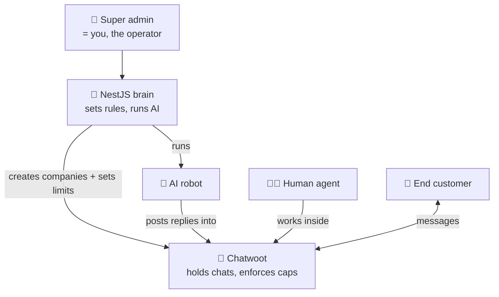
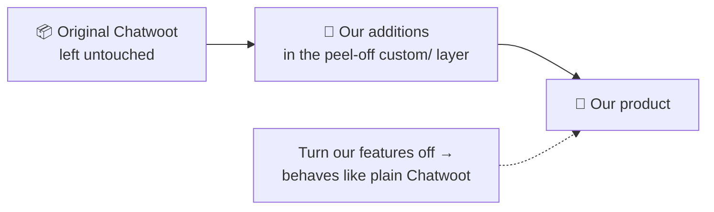

# Who Controls What — A Plain-English Guide to Roles, Limits & Safety

*No technical background needed. If [HOW_IT_WORKS.md](./HOW_IT_WORKS.md) is the
"how the machine runs" tour, this is the "who's allowed to touch which lever, and
why nothing we added will break future updates" guide.*

---

## 1. The whole thing in one paragraph

There are **three programs** working together. The **Next.js website** (the
storefront) is where a company signs up and pays. The **NestJS + LangGraph
backend** (the brain) is the boss: it sets each company up, decides the rules,
tracks billing, and runs the AI that answers customers. The **Chatwoot chat
platform** (this project — the shop floor) actually holds the conversations,
delivers messages to WhatsApp/Messenger/Instagram, and enforces how much each
company is allowed to have. Customers only ever see WhatsApp; staff work inside
Chatwoot; the brain runs everything behind the scenes. **We changed nothing about
how original Chatwoot behaves** — we only wrapped rules and an AI hook-up around
it, in a peel-off layer.

---

## 2. The programs, and where they run locally

| Program | Nickname | What it's for | Local address |
| --- | --- | --- | --- |
| **Chatwoot fork** (this repo) | the shop floor | Holds conversations; delivers messages; enforces plan limits | `http://localhost:3000` |
| **NestJS + LangGraph** | the brain | Setup, billing, identity, and the AI itself | `http://localhost:3001` |
| **Next.js dashboard** | the storefront | Sign-up, login, payment, plan choice | `http://localhost:3002` |

The brain (3001) and the shop floor (3000) talk **machine-to-machine**. People log
in on the storefront (3002).

---

## 3. Who controls what (the roles)

Think of it like a shop with an owner, staff, a robot helper, and customers.

| Role | Who/what it is | What it CAN do | What it CANNOT do |
| --- | --- | --- | --- |
| **Super admin** | The operator of the whole platform (you) | Everything at the platform level: create companies, set plan limits, mint login links | — |
| **Platform service login** | An automatic "manager" account the brain uses to run each company | Set up inboxes, the AI robot, and notifications inside a company | It's a robot, not a person — it never logs in by hand |
| **AI reply user** (platform-managed `role: agent`) | The system's AI identity that writes replies (ADR-0006) | Read a conversation and post an automated reply | Manage the company, change settings, or exceed the AI usage allowance |
| **Human agent** | A real support person at the company | Open conversations and reply by hand; take over from the AI | Change plan limits, create billing, or bypass caps |
| **The company (tenant)** | One business using the product | Use everything their plan allows; add agents/teams/inboxes up to their caps | Go over their plan; see any other company's data |
| **End customer** | The person messaging on WhatsApp etc. | Send and receive messages | See anything about Chatwoot, plans, or the AI |

**The golden rule of control:** the **brain (NestJS)** owns the *rules* (who exists,
what they're allowed, what's billed, and what the AI does). The **shop floor
(Chatwoot)** owns the *conversations* and *enforces* the resource limits the brain
sets. Neither reaches into the other's job.

---

## 4. The limits we built (what's capped, and how)

We added a **plan-limit system**. Every company's plan says how much of each thing
it may have. There are two kinds of limits.

### 4.1 Capacity limits — enforced by Chatwoot (the shop floor)

Nine kinds of "stuff" are capped per company:

> agents · teams · inboxes · AI bots · webhooks · labels · custom fields ·
> automation rules · integrations

- You can always **edit or delete** — only **creating a new one over the cap** is
  blocked, with a clear "your plan allows N, upgrade to add more" message.
- The block lives **deep in the engine**, so no clever back-door (importing,
  connecting a Facebook page, a script) can sneak past it.

### 4.2 The fairness rule — platform robots don't spend the company's plan

To run the AI, the brain creates a little **plumbing** inside each company: the
**AI robot**, its **secure notification (webhook)**, and a **service login**.
These are the *platform's* infrastructure, not something the company bought — so
they are marked **"platform-managed" and excluded from the counts entirely.** A
"3 agents / 1 AI bot / 2 webhooks" plan gives the company **all** of those; the
platform never quietly reserves one for its own robots. Anything the *company*
makes still counts normally. (Only the platform can mark something this way —
companies can't exempt their own things.)

### 4.3 The AI usage meter — enforced by the brain, only shown here

How much *AI work* a company uses (the "agentic AI" allowance) is **counted and
enforced by the brain**, because only the brain runs the AI. Chatwoot just
**displays** a friendly warning banner when a company is near its AI limit. If the
company goes over, the AI quietly pauses — a human can still reply by hand.

---

## 5. Why none of this will cause merge conflicts

This was a hard design goal: **stay able to pull future Chatwoot updates without
painful conflicts.** Here's why our additions are safe, in plain terms:

- **Everything lives in a peel-off layer.** All our code sits in a separate folder
  (`custom/`) that "sticks on top of" the original files without editing them —
  like sticky notes on a document. Upstream updates change the document
  underneath; our sticky notes lift off cleanly.
- **We only *added*, never *renamed* or *removed*.** New rules, new optional
  settings, a couple of new database columns for the "platform-managed" flag — but
  no existing door, notification, or data field was changed. Old behavior is
  untouched.
- **Everything is off by default.** With no plan limits set, no branding, and the
  locked door off, the product behaves **exactly** like stock Chatwoot. The limits
  only "wake up" once a plan is configured.
- **We touched the original files in only two tiny, standard spots**, both of which
  are the officially-blessed way to extend Chatwoot — a one-time startup line and a
  couple of one-line "extension points" at the very bottom of a file. These are the
  same hooks Chatwoot's own paid edition uses, so upstream expects them.

> The full, auditable list of exactly what we changed lives in
> [UPSTREAM_DIFF.md](./UPSTREAM_DIFF.md). The short version: additive, layered,
> reversible.

---

## 6. Quick "who do I ask?" cheat sheet

| I want to… | It's handled by… |
| --- | --- |
| Sign up / pay / pick a plan | Next.js storefront (3002) |
| Log in | Next.js → NestJS identity (the brain) |
| Change a company's plan limits | NestJS brain → writes them into Chatwoot |
| Get an automatic answer to a customer | NestJS + LangGraph (the AI), posting into Chatwoot |
| Reply to a customer by hand | A human agent, inside Chatwoot (3000) |
| Store conversations & enforce caps | Chatwoot (this repo) |
| See "you're near your AI limit" | Chatwoot shows it; the brain enforces it |

---

*Companion reading: [HOW_IT_WORKS.md](./HOW_IT_WORKS.md) (step-by-step flows),
[VENDOR_DATA_HANDLING.md](./VENDOR_DATA_HANDLING.md) (where each company's data
lives and how it's kept separate), and — for the engineers on the other repo —
[CHATWOOT_ENGINE_INTEGRATION.md](./CHATWOOT_ENGINE_INTEGRATION.md) plus
[SYSTEM_ARCHITECTURE.md](./SYSTEM_ARCHITECTURE.md).*
</content>
