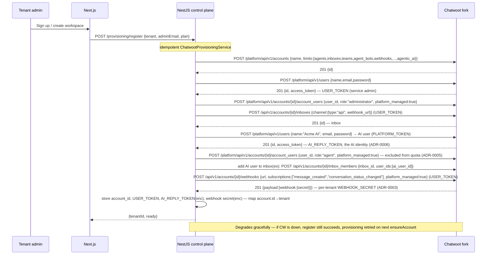
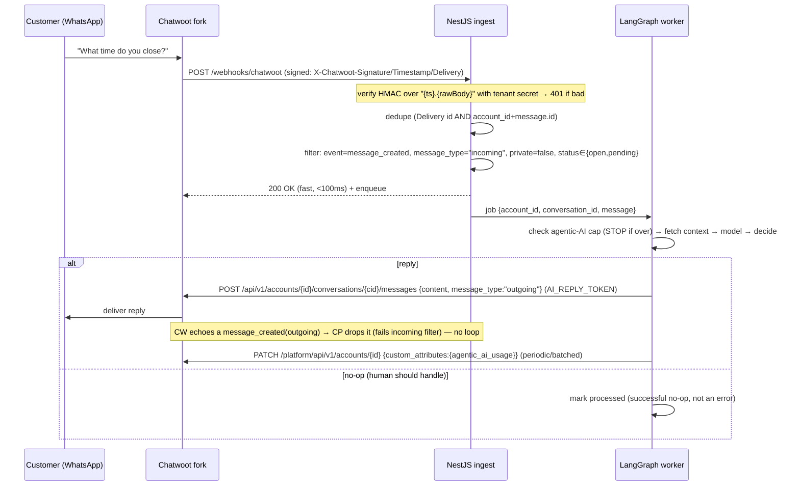
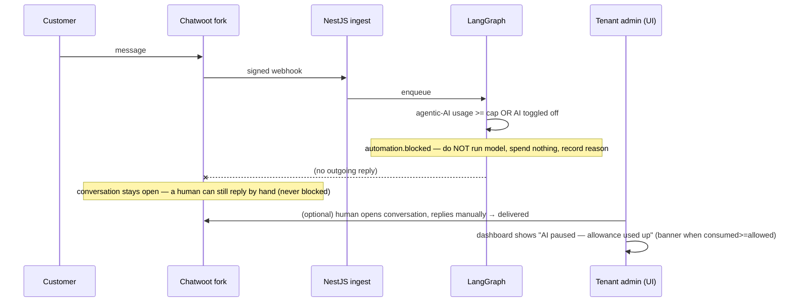
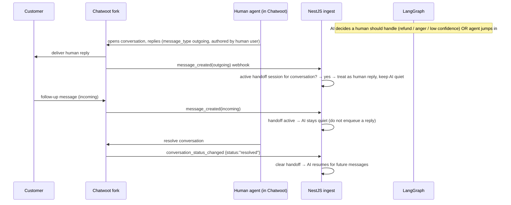
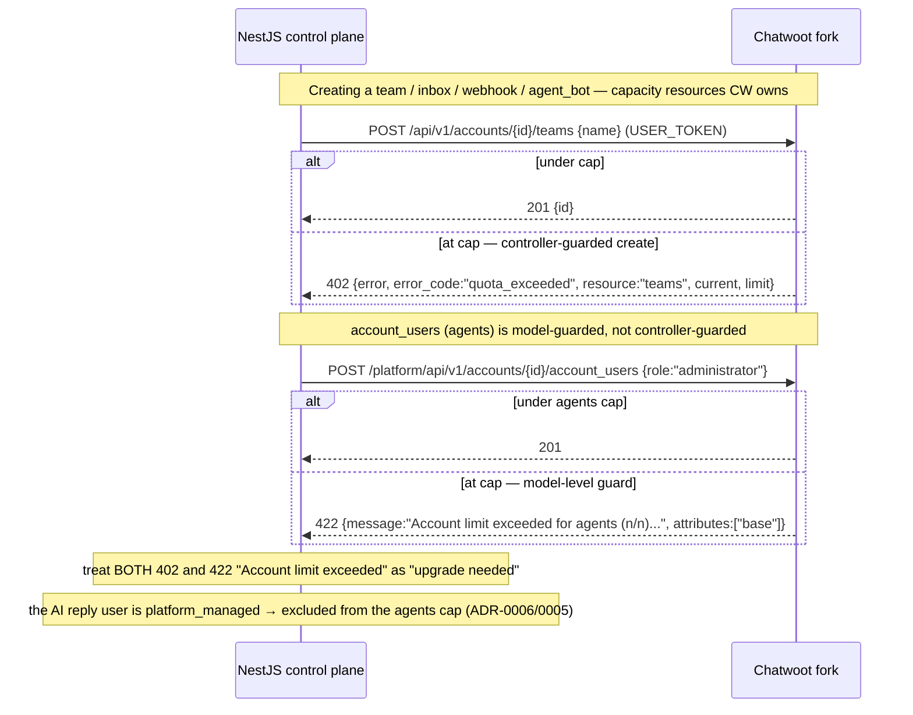

# System Architecture Contract (cross-repo, authoritative)

**Audience:** engineers on **both** repositories — this Chatwoot fork and the
external meta-saas monorepo (Next.js dashboard + NestJS control plane + LangGraph
orchestrator).

**Status:** authoritative reference. Where this document and any repo's code
disagree, the disagreement is a bug; fix it to match the relevant
[ADR](./adr/README.md). This doc describes **ownership and flows across systems**;
for the fork's internal overlay mechanics see [ARCHITECTURE.md](./ARCHITECTURE.md),
and for the exact API/webhook contract see
[CHATWOOT_ENGINE_INTEGRATION.md](./CHATWOOT_ENGINE_INTEGRATION.md).

---

## 1. The five systems

```text
   ┌───────────────┐        ┌──────────────────┐        ┌───────────────────────┐
   │  Next.js      │  HTTP  │  NestJS control  │  Meta  │  Meta (WhatsApp /      │
   │  dashboard    │───────▶│  plane +         │        │  Messenger / IG)      │
   │  (tenant UI)  │        │  LangGraph       │        └───────────┬───────────┘
   └───────────────┘        │  orchestrator    │                    │ channel
                            └───────┬──────────┘                    │ (owned by Chatwoot)
                    Platform API │   │ Application API               ▼
                    (provision)  │   │ (reply, read)        ┌─────────────────┐
                                 ▼   ▼                      │    Chatwoot     │
                            ┌─────────────────┐  webhook    │    fork (this   │
                            │    Chatwoot     │────────────▶│    repo)        │
                            │    fork (this   │  (signed     └─────────────────┘
                            │    repo)        │  message_created)
                            └─────────────────┘
```

| # | System | Repo | Owns |
| - | ------ | ---- | ---- |
| 1 | **Next.js dashboard** | meta-saas | Tenant-facing UI: onboarding, billing, usage meters, AI config. The only login surface. |
| 2 | **NestJS control plane** | meta-saas | Provisioning, entitlements source-of-truth, billing, tenant isolation, webhook ingest + verification. |
| 3 | **LangGraph orchestrator** | meta-saas | The AI: runs the model, decides reply vs handoff, counts + enforces agentic-AI usage. |
| 4 | **Chatwoot fork** | **this repo** | Messaging gateway; conversation state; capacity-quota enforcement; agentic-AI limit *display*. |
| 5 | **Meta channels** | external | WhatsApp / Messenger / Instagram transport — connected **only** to Chatwoot (ADR-0001). |

---

## 2. Ownership matrix (who is authoritative for what)

| Capability | Next.js | NestJS | LangGraph | Chatwoot fork | Meta |
| --- | :-: | :-: | :-: | :-: | :-: |
| Customer ↔ business message transport | | | | | **●** (via Chatwoot) |
| Inbound message → platform (signed webhook) | | | | **● emits** | |
| Live conversation state / history | | | | **●** | |
| AI reply generation | | | **●** | | |
| Posting the reply back to the channel | | | | **● delivers** | |
| **Human-agent / team / inbox quotas** | | | | **● enforces** | |
| Agentic-AI **usage** cap: counting + enforcing | | | **●** | | |
| Agentic-AI usage cap: **display** to tenant | | | | **●** | |
| Billing, plans, entitlement source-of-truth | | **●** | | | |
| Tenant isolation / data separation | | **●** | | **●** (row-level per account) | |
| Webhook signature verification (ingest) | | **●** | | **● signs** | |
| AI usage metering / token counting | | | **●** | | |
| Authentication / login surface | **●** | **●** | | (SSO handoff only) | |
| AI reply identity (`AI_REPLY_TOKEN`) | | **● stores (encrypted)** | **● uses** | **● provisions platform-managed `role: agent` user** | |
| Provisioning (accounts, users, inboxes, AI user, webhook) | | **●** (Platform API) | | **● executes** | |

Legend: **●** = authoritative/owner. Blank = not involved. Read the columns to see
each system's surface; read the rows to see who to talk to for a capability.

**Two invariants that fall out of the matrix:**

1. **Chatwoot never stores AI rules, billing, or usage truth** — only conversation
   state and the capacity caps it enforces. (ADR-0001)
2. **The AI identity is a platform-managed `role: agent` account_user, not a human
   agent** — `platform_managed: true` excludes it from the `agents` quota. (ADR-0006,
   ADR-0005)

---

## 3. Sequence diagrams

> Rendered as Mermaid. `CW` = Chatwoot fork, `CP` = NestJS control plane,
> `LG` = LangGraph orchestrator, `UI` = Next.js dashboard.

### 3.1 Tenant onboarding + provisioning



### 3.2 Everyday AI reply loop



### 3.3 Over-limit / AI paused



### 3.4 Human handoff + resume



### 3.5 Quota enforcement (Chatwoot-owned resources)



---

## 4. Cross-repo change protocol

- A change to any **frozen contract** (route paths, webhook event names,
  `X-Chatwoot-*` headers, existing response keys) requires a superseding ADR and a
  coordinated change in **both** repos — it is never a one-sided edit.
- Additive changes (new JSON keys, new limit keys) are allowed without an ADR but
  must be recorded in [UPSTREAM_DIFF.md](./UPSTREAM_DIFF.md) and reflected in
  [CHATWOOT_ENGINE_INTEGRATION.md](./CHATWOOT_ENGINE_INTEGRATION.md).
- When the two integration documents drift, reconcile them in
  [INTEGRATION_RECONCILIATION.md](./INTEGRATION_RECONCILIATION.md) and, if a
  decision is involved, record it as an ADR.
</content>
