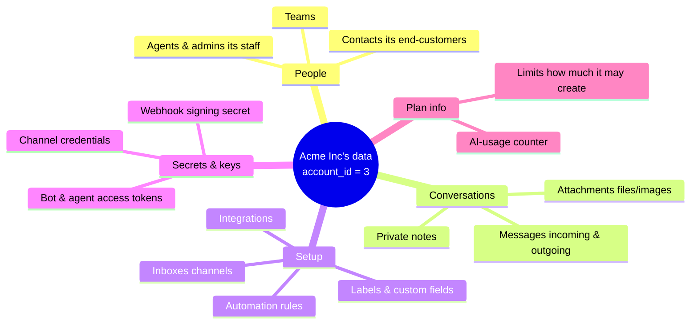
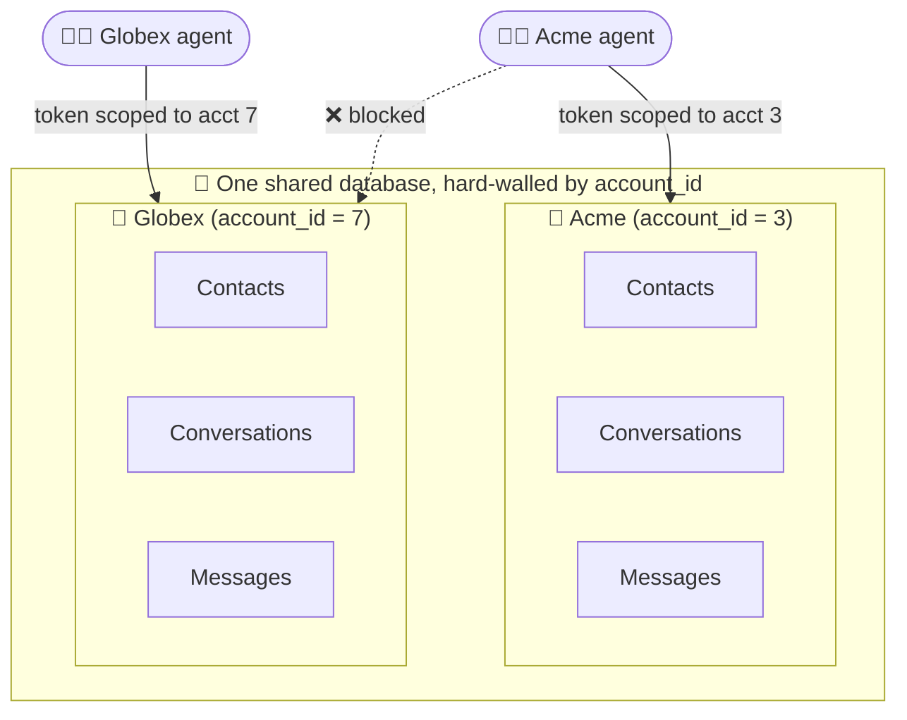
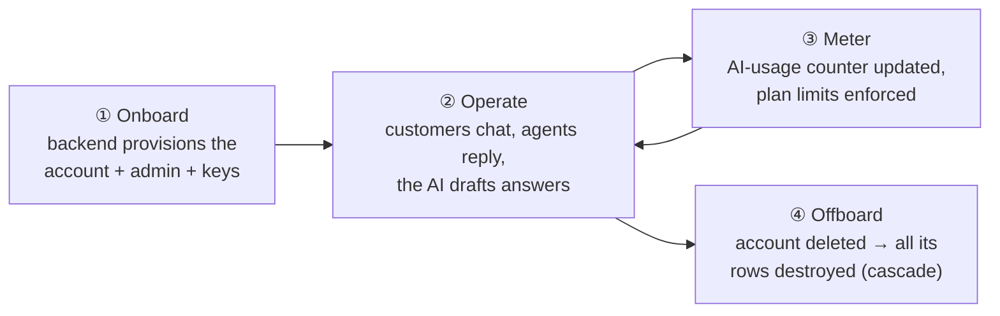
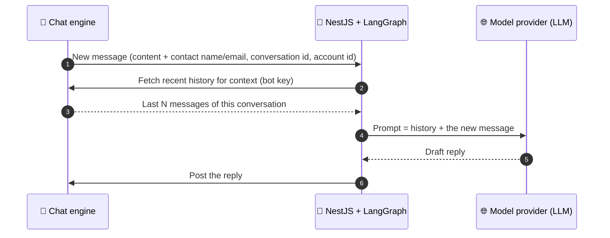
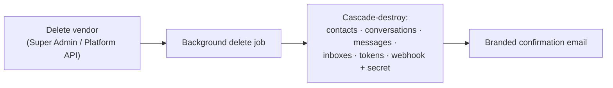
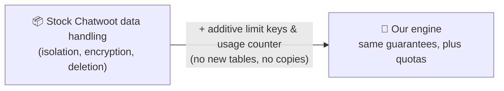

# How a Vendor's Data Is Handled — A Plain-English Guide

Companion to [HOW_IT_WORKS.md](./HOW_IT_WORKS.md). That guide explains *what the
system does*; this one explains *what happens to a vendor's data* as it moves
through it — where it's stored, who can see it, how it's protected, what leaves
to the AI, and what happens when a vendor leaves.

> **"Vendor" = one tenant company** that subscribes to the platform (e.g. "Acme
> Inc") and uses it to talk to *their own* end-customers. "This part" = the **chat
> engine** (this repo). Each vendor is completely walled off from every other one.

> If you only read one thing: every row of a vendor's data is stamped with their
> **account id**, and every query is filtered by it. That single stamp is the wall
> that keeps Acme's conversations invisible to Globex, and vice-versa.

---

## 1. What counts as "a vendor's data"

Inside the chat engine, one vendor's world contains:

**The most sensitive pieces** are the **contacts' personal info** (names, emails,
phone numbers), the **message content**, and the **secrets/tokens**. The rest of
this doc is mostly about protecting those.

---

## 2. The one rule that keeps vendors apart

Every important record — a contact, a conversation, a message, an inbox — carries
an **`account_id`** (the vendor's id). The engine never fetches "all
conversations"; it fetches "conversations **where account_id = this vendor**."

An agent's login key is tied to **one account**. If Acme's agent tries to open a
Globex conversation, the request is rejected — not hidden in the UI, but refused
by the server. On top of that, role rules (Pundit policies) decide what each
person can do *within* their own account (an agent can't do everything an admin
can).

---

## 3. What data each system holds (the whole picture)

The chat engine is not the only place data lives. Here's the honest map of who
holds what across all three systems plus the payment processor:

| System | Holds about a vendor | Notably does **not** hold |
| --- | --- | --- |
| **💬 Chat engine** (this repo) | Contacts (PII), conversations & messages, inboxes, teams, labels, custom fields, automation rules, integrations, bot/agent tokens, webhook secret, plan limits + AI-usage counter | Credit-card numbers; the vendor's billing history |
| **🧠 NestJS backend** (control plane + AI) | account id, the users it provisioned, the authoritative plan/limits, the webhook secret + bot token (to run the AI), the AI-usage tally, billing state | The full conversation history (it fetches only what a reply needs, on demand) |
| **🖥️ Next.js frontend** | Sign-up form data, the current session, what plan is being bought | Long-term data — it's a storefront, it passes things through |
| **💳 Payment processor** (e.g. Stripe) | Card details, invoices | Any conversation or contact data |

**Rule of thumb:** conversation & contact data is the **chat engine's**
responsibility; identity, plan, and billing are the **NestJS backend's**; card
data belongs to the **payment processor** and never touches the chat engine.

---

## 4. Where the chat engine physically keeps it

- **Postgres database (managed, Neon)** — the durable store: every contact,
  conversation, message, setting, token, and limit. This is the vendor's system
  of record.
- **Redis (managed, Upstash)** — short-lived working memory: caches, background
  job queue, live "someone is typing" updates. Not the source of truth; it can be
  rebuilt from Postgres.

Both are **external managed services** reached over encrypted connections. Their
credentials live only in the deployment's private environment settings — never in
the code, the docs, or any log.

---

## 5. The life of a vendor's data (create → use → meter → delete)

1. **Onboard** — the backend creates the vendor's account, first admin, webhook,
   and bot (see HOW_IT_WORKS §4). The vendor's data begins to exist.
2. **Operate** — day-to-day: contacts message in, agents and the AI reply.
   Everything is written under the vendor's `account_id`.
3. **Meter** — the AI-usage number and the plan limits ride along (see §6, §7).
4. **Offboard** — when a vendor is removed, a background job **cascade-deletes**
   the account and everything hanging off it (see §9).

---

## 6. What data reaches the AI (and the honest privacy note)

When a customer messages a vendor, the chat engine sends the AI a **signed
notification** containing that message — and the AI then fetches the recent
**conversation history** to write a good reply.

> **⚠️ Read this if you care about privacy.** To draft a reply, the AI sends the
> **message text and conversation context to an external language-model provider**.
> That means a vendor's customer messages (which can contain personal details)
> leave the chat engine and reach a third-party model. This is inherent to having
> an AI answer — but it is the **NestJS/LangGraph side's** responsibility to:
> handle the model provider's data-processing terms, redact or minimize sensitive
> fields if required, and honor per-vendor "no AI" settings. The **chat engine
> only sends what the AI asks for over authenticated, signed channels**; it does
> not itself call any model provider.

The chat engine gives the AI exactly two things, both scoped to one conversation:
the **new message** (in the notification) and, on request, that **conversation's
history** — never another vendor's data, never the whole database.

---

## 7. Who is allowed to read a vendor's data

Access is gated by **which key** a request carries. There are only three:

| Key | Reaches | Think of it as | Held by |
| --- | --- | --- | --- |
| **Platform key** | the whole installation (all vendors) | the master key | the NestJS backend only (server-to-server; never shipped to browsers) |
| **User key** | **one** vendor account, limited by that user's role | a staff badge | each provisioned agent/admin |
| **Bot key** | **one** vendor's conversations, to read history & post replies | the AI's worker badge | the AI orchestrator |

- The **master key** is powerful and stays locked in the backend. It is used only
  for setup and metering, never handed to a user's browser.
- Inside a vendor account, **role rules** further restrict things: an agent works
  conversations but can't create agents, inboxes, or other "capacity"; an admin
  can. Menu-hiding is never the enforcement — the server checks every time.
- With the optional **locked front door** on (HOW_IT_WORKS §3.3), the *only* way a
  human gets a session is through the backend's SSO handoff — so there's no
  password side-door into a vendor's data.

---

## 8. How the sensitive pieces are protected

| Data | Protection |
| --- | --- |
| **Passwords** | Never stored as text — stored as a one-way **bcrypt hash** (standard Devise). Even we can't read them back. |
| **Webhook secret, bot/channel tokens, 2FA secrets** | **Encrypted at rest** in the database when encryption is enabled on the deploy — a database dump alone doesn't reveal them. |
| **Webhook notifications to the AI** | **Signed** (a tamper-proof HMAC seal) and timestamped, so the AI can prove a "new message" truly came from the engine and isn't a replay. |
| **Data in transit** | All system-to-system traffic runs over encrypted (HTTPS/TLS) connections. |
| **Cross-vendor access** | Blocked by the `account_id` wall + role rules (§2, §7), enforced server-side. |
| **Infrastructure credentials** | Live only in the deploy's private environment; never in code, docs, or logs. |

---

## 9. Offboarding — what happens to a vendor's data when they leave

When a vendor is removed (via Super Admin or the backend's Platform API), the
engine enqueues a background **delete job** that **cascade-destroys** the account
and everything under it — contacts, conversations, messages, inboxes, tokens, the
webhook and its secret. Branded "your account was deleted" emails are sent as part
of this fork's white-label pass.

Two coordination notes for a clean exit:

- The **NestJS backend** also holds a copy of that vendor's account id, bot token,
  and webhook secret — it should discard them when it offboards the vendor, so no
  stale keys linger.
- The **AI orchestrator** should drop any cached context / idempotency records for
  that vendor.

---

## 10. What the fork changed about data handling

**Almost nothing — and that's deliberate.** The way vendor data is stored,
isolated, and deleted is stock Chatwoot behavior, untouched. The fork only:

- **Adds** a few plan-limit keys and an AI-usage counter onto data that already
  existed (the account's limits and custom attributes) — no new tables, no second
  copy of anyone's data.
- **Reads** those numbers to enforce limits and show the usage banner.
- **Optionally locks** the login door so the backend owns identity.

Because there's no parallel data store and no new database tables, there's no new
place for a vendor's data to leak from, and upstream Chatwoot's data-protection
behavior carries over unchanged.

---

## 11. Responsibilities at a glance

| Question | Answer |
| --- | --- |
| Who stores the conversations & contacts? | The **chat engine** (this repo), in managed Postgres. |
| Who keeps vendors from seeing each other? | The **chat engine** — `account_id` walls + role rules, server-enforced. |
| Who holds billing / card data? | The **payment processor** and the **NestJS backend** — *not* the chat engine. |
| Who decides what the AI is allowed to send to a model provider? | The **NestJS + LangGraph backend**. The engine only serves the one conversation it's asked for. |
| Who can wipe a vendor completely? | Super Admin or the backend's Platform key → cascade delete in the engine (+ the backend/AI drop their own copies). |
| What did the fork add to data risk? | Effectively nothing — additive counters only, no new store. |

For the exact API/field-level contract behind all of this, see
[CHATWOOT_ENGINE_INTEGRATION.md](./CHATWOOT_ENGINE_INTEGRATION.md); for the limit
mechanics see [ENTITLEMENTS.md](./ENTITLEMENTS.md).
