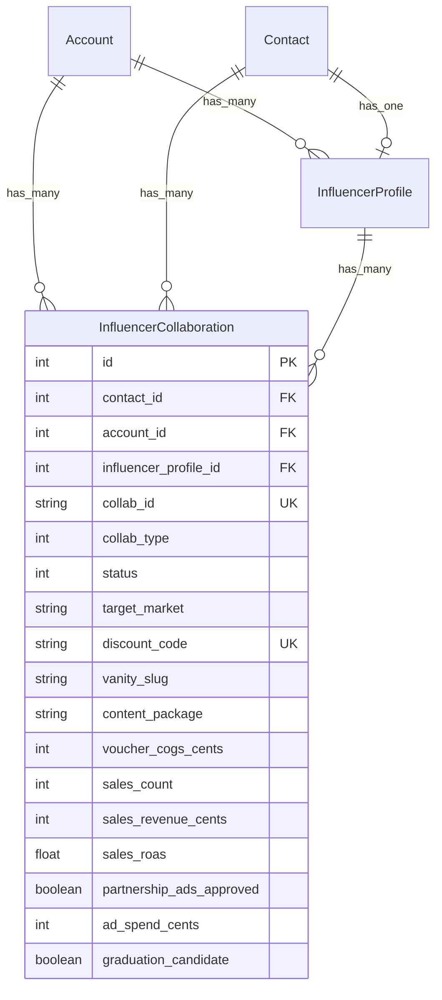

# Influencer Collaboration Management — High-Level Plan

## Overview

Plan wysokopoziomowy implementacji **zarządzania współpracami z influencerami** w Chatwoot — wszystko, co dzieje się PO discovery i approval. Obejmuje: lifecycle współprac, outreach, kody rabatowe, vanity URL, tracking sprzedaży (webhook e-commerce), Partnership Ads, reporting i voucher calculator.

**Zależność:** Ten plan bazuje na infrastrukturze z `docs/plans/2026-02-25-feat-influencer-discovery-final-plan.md` (model `InfluencerProfile`, pipeline z label "influencer", IQFluence integration, FQS scoring). Implementacja po Phase 2 tamtego planu.

**Źródła:** Raport wdrożeniowy (§4 wycena, §6 Partnership Ads, §7 content briefy, §8.3-8.5 tracking/lifecycle/architektura, §10 plan wdrożenia, §11 KPI, Załącznik E-G).

**Kluczowa decyzja:** Korzystamy wyłącznie z IQFluence jako zewnętrzne API (rezygnacja z Influencers.club).

---

## Scope — 8 modułów

| # | Moduł | Priorytet | Zależności |
|---|-------|-----------|------------|
| M1 | Collaboration Lifecycle & Data Model | P0 | Discovery plan Phase 1-2 |
| M2 | Outreach Templates | P0 | M1 |
| M3 | Discount Codes & Vanity URLs | P0 | M1 |
| M4 | E-commerce Webhook & Sales Tracking | P0 | M1, M3 |
| M5 | Content Delivery Tracking | P1 | M1 |
| M6 | Partnership Ads Management | P1 | M4, M5 |
| M7 | Reporting & KPI Dashboard | P1 | M4 |
| M8 | Voucher Calculator Landing Page | P2 | M1 (HMAC signing) |

---

## M1: Collaboration Lifecycle & Data Model

### Problem

Raport definiuje 3 typy współprac z rosnącym zaangażowaniem (§8.4): One-Off → Recurring → Ambassador. Potrzebujemy strukturalnego śledzenia każdej współpracy, nie tylko kontaktu influencera.

### Propozycja: nowa tabela `influencer_collaborations`

Jeden influencer (Contact + InfluencerProfile) może mieć **wiele współprac** w czasie. Każda współpraca to osobny rekord z własnymi metrykami, kodem rabatowym i statusem.

### Migration

```ruby
# db/migrate/YYYYMMDDHHMMSS_create_influencer_collaborations.rb
class CreateInfluencerCollaborations < ActiveRecord::Migration[7.0]
  def change
    create_table :influencer_collaborations do |t|
      t.references :contact, null: false, foreign_key: true
      t.references :account, null: false, foreign_key: true
      t.references :influencer_profile, null: false, foreign_key: true

      # Collaboration identity
      t.string :collab_id, null: false           # format: "DE-2026-003"
      t.integer :collab_type, default: 0          # enum: barter_one_off, barter_recurring, ambassador
      t.integer :status, default: 0               # enum: draft, outreach_sent, negotiating, agreed, product_shipped, content_pending, content_published, partnership_ads, completed, cancelled
      t.string :target_market, null: false         # ISO: DE, PL, FR...

      # Voucher / product
      t.string :voucher_product                   # "Gallery Wall L"
      t.integer :voucher_value_cents              # wartość katalogowa w groszach/centach
      t.integer :voucher_cogs_cents               # COGS barteru
      t.string :voucher_currency, default: 'PLN'
      t.integer :cash_fee_cents, default: 0       # dopłata cash (mid+)
      t.string :content_package                   # light/standard/premium/stories_only
      t.string :content_rights                    # none/limited_60d/extended

      # Discount code & vanity URL
      t.string :discount_code                     # "ANNAHEIM"
      t.string :vanity_slug                       # "annaheim" → framky.com/annaheim
      t.string :utm_source, default: 'instagram'
      t.string :utm_medium, default: 'influencer'

      # Content delivery
      t.datetime :product_shipped_at
      t.datetime :publication_deadline_at          # shipped + 14 days
      t.datetime :content_published_at
      t.string :post_url
      t.string :post_type                         # reel/carousel/story
      t.integer :post_reach
      t.integer :post_engagement
      t.integer :post_saves
      t.integer :post_shares

      # Partnership Ads
      t.boolean :partnership_ads_approved, default: false
      t.integer :ad_spend_cents, default: 0
      t.string :ad_campaign_id                    # Meta campaign ID

      # Sales tracking (updated via webhook)
      t.integer :sales_count, default: 0
      t.integer :sales_revenue_cents, default: 0
      t.float :sales_roas                         # revenue / COGS
      t.float :total_roas                         # revenue / (COGS + ad_spend)
      t.integer :attribution_window_days, default: 60

      # Graduation
      t.boolean :graduation_candidate, default: false
      t.string :graduation_reason                 # "ROAS > 2 → suggest recurring"

      t.timestamps
    end

    add_index :influencer_collaborations, [:account_id, :collab_id], unique: true
    add_index :influencer_collaborations, [:account_id, :status]
    add_index :influencer_collaborations, [:account_id, :discount_code], unique: true
    add_index :influencer_collaborations, [:account_id, :target_market]
    add_index :influencer_collaborations, :contact_id
    add_index :influencer_collaborations, :influencer_profile_id
  end
end
```

### Model

```ruby
# app/models/influencer_collaboration.rb
class InfluencerCollaboration < ApplicationRecord
  belongs_to :contact
  belongs_to :account
  belongs_to :influencer_profile

  enum :collab_type, { barter_one_off: 0, barter_recurring: 1, ambassador: 2 }
  enum :status, {
    draft: 0,
    outreach_sent: 1,
    negotiating: 2,
    agreed: 3,
    product_shipped: 4,
    content_pending: 5,
    content_published: 6,
    partnership_ads: 7,
    completed: 8,
    cancelled: 9
  }

  validates :collab_id, presence: true, uniqueness: { scope: :account_id }
  validates :discount_code, uniqueness: { scope: :account_id }, allow_nil: true
  validates :target_market, presence: true

  before_validation :generate_collab_id, on: :create
  after_update :check_graduation, if: :saved_change_to_sales_count?

  def roas
    return nil if voucher_cogs_cents.to_i.zero?
    sales_revenue_cents.to_f / voucher_cogs_cents
  end

  def total_roas_calculated
    total_cost = voucher_cogs_cents.to_i + ad_spend_cents.to_i
    return nil if total_cost.zero?
    sales_revenue_cents.to_f / total_cost
  end

  private

  def generate_collab_id
    return if collab_id.present?
    seq = account.influencer_collaborations.where(target_market: target_market).count + 1
    self.collab_id = "#{target_market}-#{Date.current.year}-#{seq.to_s.rjust(3, '0')}"
  end

  def check_graduation
    return unless barter_one_off? && roas && roas > 2.0
    update_columns(graduation_candidate: true, graduation_reason: "ROAS #{roas.round(1)} > 2 → suggest recurring")
  end
end
```

### Associations

```ruby
# app/models/contact.rb — dodać:
has_many :influencer_collaborations, dependent: :destroy

# app/models/influencer_profile.rb — dodać:
has_many :influencer_collaborations, dependent: :destroy
```

### Pipeline Stage Mapping

Collaboration `status` odpowiada pipeline stages z Załącznika E raportu:

| Collab Status | Pipeline Stage | Trigger |
|--------------|---------------|---------|
| draft | Qualified | FQS approve |
| outreach_sent | Outreach | Email/DM sent |
| negotiating | Negotiation | Reply received |
| agreed | Negotiation | Agreement confirmed |
| product_shipped | Shipping | Tracking number added |
| content_pending | Content | Product delivered |
| content_published | Partnership Ads | Post URL added |
| partnership_ads | Partnership Ads | PA approved |
| completed | Completed | Campaign ended |

**Implementacja:** Collaboration status zmienia pipeline stage automatycznie (callback na `after_update`). Pipeline stage zmieniony w kanban (drag-and-drop) aktualizuje collaboration status (callback na `ContactPipelineStage#after_update`).

### ERD



---

## M2: Outreach Templates

### Problem

Outreach wymaga spersonalizowanych wiadomości w 5+ językach (DE, PL, FR, NL, UK) z 4 wariantami per kontekst (wnętrza, lifestyle/rodzina, nowy dom, fotografka) — patrz Załącznik C raportu.

### Propozycja: rozszerzyć CannedResponse

Chatwoot ma już `CannedResponse` (short_code + content per account). Wystarczy dodać:

1. **Konwencję nazewnictwa** short_code: `influencer_outreach_de_interior`, `influencer_outreach_pl_family`, etc.
2. **Zmienne placeholderowe** w content: `{{contact.name}}`, `{{contact.custom_attributes.influencer_handle}}` — Chatwoot MessageBuilder już obsługuje variable replacement w templates.
3. **Seed task** z szablonami z raportu (Załącznik C) per rynek/wariant.

### Seed Task

```ruby
# lib/tasks/influencer_outreach_templates.rake
namespace :influencers do
  desc 'Seed outreach canned responses for all accounts'
  task seed_outreach_templates: :environment do
    TEMPLATES = {
      'influencer_dm_de_interior' => 'Hallo {{contact.name}}! Ich verfolge dein Profil...',
      'influencer_dm_de_family' => 'Hallo {{contact.name}}! Ich liebe wie du...',
      'influencer_dm_pl_interior' => 'Cześć {{contact.name}}! Obserwuję Twój profil...',
      'influencer_dm_pl_family' => 'Cześć {{contact.name}}! Uwielbiam jak pokazujesz...',
      'influencer_dm_fr_interior' => 'Bonjour {{contact.name}} ! Je suis ton profil...',
      'influencer_dm_nl_interior' => 'Hoi {{contact.name}}! Ik volg je profiel...',
      'influencer_dm_uk_interior' => "Hi {{contact.name}}! I've been following...",
      'influencer_whitelisting_request' => 'Hey, this post performed great! Can I boost it...',
      'influencer_collaboration_confirmation' => 'Temat: Szczegóły współpracy z Framky...',
    }.freeze
    # ... create per account
  end
end
```

### Zakres prac

- [ ] `lib/tasks/influencer_outreach_templates.rake` — seed task z pełnymi szablonami z Załącznika C
- [ ] Dokumentacja konwencji nazewnictwa w planie
- [ ] Opcjonalnie: dropdown "Outreach template" w InfluencerProfileDetail slide-over → autofill wiadomość z odpowiednim template per `target_market`

**Nie budujemy nowego systemu templatek** — reuse CannedResponse. Agenci wpisują `/influencer_dm_de_interior` w composer i template się rozwija.

---

## M3: Discount Codes & Vanity URLs

### Problem

Każda współpraca wymaga unikalnego kodu rabatowego (PRIMARY attribution) i vanity URL (SECONDARY attribution, §8.3). Kod rabatowy to `[HANDLE]` z rabatem -40%. Vanity URL: `framky.com/[handle]` → 301 redirect z UTM + auto-applied discount.

### Propozycja

#### Discount Code Generation

```ruby
# app/services/influencers/generate_discount_code_service.rb
class Influencers::GenerateDiscountCodeService
  def initialize(collaboration)
    @collaboration = collaboration
    @profile = collaboration.influencer_profile
  end

  def perform
    code = generate_unique_code
    slug = code.downcase

    @collaboration.update!(
      discount_code: code,
      vanity_slug: slug
    )

    # Sync to contact custom_attributes for pipeline card display
    @collaboration.contact.update!(
      custom_attributes: @collaboration.contact.custom_attributes.merge(
        'discount_code' => code,
        'vanity_url' => "framky.com/#{slug}"
      )
    )

    code
  end

  private

  def generate_unique_code
    base = @profile.username.gsub(/[^a-zA-Z0-9]/, '').upcase.first(12)
    return base unless @collaboration.account.influencer_collaborations.exists?(discount_code: base)

    # Append market suffix if collision
    "#{base}#{@collaboration.target_market}"
  end
end
```

#### Vanity URL

Vanity URL nie jest implementowana w Chatwoot — to redirect na poziomie e-commerce (Cloudflare Page Rule / WooCommerce redirect / nginx):

```
framky.com/annaheim → 301 →
  framky.com/?utm_source=instagram&utm_medium=influencer
  &utm_content=annaheim&discount=ANNAHEIM
```

**W Chatwoot:** generujemy tylko `vanity_slug` i `utm_link` (full redirect URL). Konfiguracja redirectu jest po stronie e-commerce — poza scope tego planu.

#### UTM Link Builder

```ruby
# app/services/influencers/utm_link_builder.rb
class Influencers::UtmLinkBuilder
  BASE_URL = 'https://framky.com'.freeze

  def initialize(collaboration)
    @collab = collaboration
  end

  def vanity_url
    "#{BASE_URL}/#{@collab.vanity_slug}"
  end

  def redirect_target
    params = {
      utm_source: @collab.utm_source,
      utm_medium: @collab.utm_medium,
      utm_campaign: @collab.collab_id,
      utm_content: @collab.vanity_slug,
      discount: @collab.discount_code
    }
    "#{BASE_URL}/?#{params.to_query}"
  end

  # Partnership Ads UTM
  def partnership_ad_url
    params = {
      utm_source: 'instagram',
      utm_medium: 'partnership_ad',
      utm_campaign: @collab.collab_id,
      utm_content: @collab.vanity_slug
    }
    "#{BASE_URL}/?#{params.to_query}"
  end

  # Stories link sticker UTM
  def story_url
    params = {
      utm_source: 'instagram',
      utm_medium: 'influencer_story',
      utm_content: @collab.vanity_slug,
      discount: @collab.discount_code
    }
    "#{BASE_URL}/?#{params.to_query}"
  end
end
```

### Zakres prac

- [ ] `app/services/influencers/generate_discount_code_service.rb`
- [ ] `app/services/influencers/utm_link_builder.rb`
- [ ] Kolumny `discount_code`, `vanity_slug` w `influencer_collaborations` (już w migration M1)
- [ ] Custom attribute definitions: `discount_code`, `vanity_url` (dodać do existing rake task)
- [ ] UI: widoczne w InfluencerProfileDetail + kopiowalne (click-to-copy)

---

## M4: E-commerce Webhook & Sales Tracking

### Problem

Główna metryka sukcesu = sprzedaże z kodu rabatowego (§8.3). E-commerce musi powiadomić Chatwoot o każdym użyciu kodu. Webhook flow: e-commerce → Chatwoot API → update sales metrics → check graduation.

### Propozycja: Dedicated Webhook Endpoint

Chatwoot nie ma generycznego "incoming webhook" — każdy kanał ma dedykowany controller. Dla e-commerce dodajemy nowy endpoint.

#### Controller

```ruby
# app/controllers/webhooks/ecommerce_controller.rb
class Webhooks::EcommerceController < ActionController::API
  before_action :verify_signature

  def discount_code_used
    collab = find_collaboration
    return head :not_found unless collab

    Influencers::RecordSaleService.new(collab, sale_params).perform
    head :ok
  end

  private

  def verify_signature
    # HMAC-SHA256 signature verification
    signature = request.headers['X-Webhook-Signature']
    payload = request.raw_post
    expected = OpenSSL::HMAC.hexdigest('SHA256', webhook_secret, payload)
    head :unauthorized unless ActiveSupport::SecurityUtils.secure_compare(signature, expected)
  end

  def webhook_secret
    ENV.fetch('ECOMMERCE_WEBHOOK_SECRET')
  end

  def find_collaboration
    InfluencerCollaboration.find_by(
      discount_code: params[:code],
      account_id: params[:account_id]
    )
  end

  def sale_params
    params.permit(:code, :order_id, :order_value, :currency, :customer_country, :timestamp)
  end
end
```

#### RecordSaleService

```ruby
# app/services/influencers/record_sale_service.rb
class Influencers::RecordSaleService
  def initialize(collaboration, params)
    @collab = collaboration
    @params = params
  end

  def perform
    order_value_cents = (@params[:order_value].to_f * 100).to_i

    @collab.update!(
      sales_count: @collab.sales_count + 1,
      sales_revenue_cents: @collab.sales_revenue_cents + order_value_cents,
      sales_roas: calculate_roas(order_value_cents),
      total_roas: calculate_total_roas(order_value_cents)
    )

    sync_to_contact_attributes
    check_graduation
  end

  private

  def calculate_roas(new_revenue_cents)
    total_revenue = @collab.sales_revenue_cents + new_revenue_cents
    return nil if @collab.voucher_cogs_cents.to_i.zero?
    total_revenue.to_f / @collab.voucher_cogs_cents
  end

  def calculate_total_roas(new_revenue_cents)
    total_revenue = @collab.sales_revenue_cents + new_revenue_cents
    total_cost = @collab.voucher_cogs_cents.to_i + @collab.ad_spend_cents.to_i
    return nil if total_cost.zero?
    total_revenue.to_f / total_cost
  end

  def sync_to_contact_attributes
    @collab.contact.update!(
      custom_attributes: @collab.contact.custom_attributes.merge(
        'sales_count' => @collab.sales_count,
        'sales_revenue' => @collab.sales_revenue_cents / 100.0,
        'sales_roas' => @collab.sales_roas&.round(2)
      )
    )
  end

  def check_graduation
    return unless @collab.barter_one_off? && @collab.sales_count >= 2 && @collab.roas.to_f > 2.0

    @collab.update_columns(
      graduation_candidate: true,
      graduation_reason: "ROAS #{@collab.roas.round(1)} > 2, #{@collab.sales_count} sales → suggest recurring"
    )
    # TODO: notify agent (automation rule or internal notification)
  end
end
```

#### Webhook Payload (Załącznik G)

```json
{
  "event": "discount_code_used",
  "account_id": 1,
  "code": "ANNAHEIM",
  "order_id": "ORD-12345",
  "order_value": 1300.00,
  "currency": "PLN",
  "customer_country": "DE",
  "timestamp": "2026-03-20T14:30:00Z"
}
```

#### Route

```ruby
# config/routes.rb — dodać w głównym scope (nie account-scoped):
namespace :webhooks do
  post 'ecommerce/discount_code_used', to: 'ecommerce#discount_code_used'
end
```

### Zakres prac

- [ ] `app/controllers/webhooks/ecommerce_controller.rb` z HMAC verification
- [ ] `app/services/influencers/record_sale_service.rb`
- [ ] Route: `POST /webhooks/ecommerce/discount_code_used`
- [ ] ENV: `ECOMMERCE_WEBHOOK_SECRET`
- [ ] Custom attribute definitions: `sales_count`, `sales_revenue`, `sales_roas`
- [ ] Graduation check logic

---

## M5: Content Delivery Tracking

### Problem

Po wysyłce produktu influencer ma 14 dni na publikację (§7). Potrzebujemy trackować: czy opublikował, co opublikował, czy zgodnie z briefem.

### Propozycja

Większość danych jest już w `influencer_collaborations` (post_url, post_type, post_reach, etc.). Potrzebujemy:

1. **Publication deadline reminder** — automation rule: jeśli `content_pending` >10 dni → wyślij follow-up message.
2. **Post metrics fetch** — po wpisaniu `post_url`, job pobiera metryki z IQFluence scraping API (reach, engagement, saves).
3. **UI** — w InfluencerProfileDetail slide-over: sekcja "Content Delivery" z polami na post URL, typ, metryki.

### Automation Rule Seed

```ruby
# lib/tasks/influencer_automation_rules.rake
# Automation: reminder 10 days after product shipped, no content published
{
  name: 'Influencer content reminder',
  event_name: 'conversation_created', # trigger via scheduled check
  conditions: [{ attribute_key: 'labels', filter_operator: 'contains', values: ['influencer'] }],
  actions: [{ action_name: 'send_message', action_params: ['Reminder: publication deadline approaching...'] }]
}
```

**Uwaga:** Chatwoot automation rules triggerują na conversation events, nie na contact/collaboration events. Dla deadline reminders potrzebujemy **scheduled job** (cron), nie automation rule:

```ruby
# app/jobs/influencers/content_deadline_check_job.rb
class Influencers::ContentDeadlineCheckJob < ApplicationJob
  queue_as :low

  def perform
    # Find collaborations where product shipped >10 days ago, no publication
    InfluencerCollaboration
      .where(status: :content_pending)
      .where('product_shipped_at < ?', 10.days.ago)
      .where(content_published_at: nil)
      .find_each do |collab|
        # Create internal note on contact's latest conversation
        # or send notification to assigned agent
      end
  end
end
```

### Post Metrics Fetch

```ruby
# app/jobs/influencers/fetch_post_metrics_job.rb
class Influencers::FetchPostMetricsJob < ApplicationJob
  queue_as :low

  def perform(collaboration_id)
    collab = InfluencerCollaboration.find(collaboration_id)
    return unless collab.post_url.present?

    # Extract username from post URL, fetch via IQFluence scraping API
    username = collab.influencer_profile.username
    reels = Iqfluence::ScrapingService.new.fetch_reels(username)

    # Match post URL to reel data
    matching = reels.find { |r| collab.post_url.include?(r[:shortcode]) }
    return unless matching

    collab.update!(
      post_reach: matching[:views],
      post_engagement: matching[:likes].to_i + matching[:comments].to_i,
      post_saves: matching[:saves]
    )
  end
end
```

### Zakres prac

- [ ] `app/jobs/influencers/content_deadline_check_job.rb` + cron (Sidekiq-cron / Clockwork)
- [ ] `app/jobs/influencers/fetch_post_metrics_job.rb`
- [ ] UI: Content Delivery section in InfluencerProfileDetail (post_url input, metrics display)
- [ ] Transition trigger: wpisanie post_url → status `content_published`

---

## M6: Partnership Ads Management

### Problem

Partnership Ads (§6) to reklamy płacone przez Framky ale wyświetlane z konta influencera. Workflow: po publikacji → propozycja whitelisting → influencer approve → Framky uruchamia PA → tracking ad spend + ROAS.

### Propozycja

Nie budujemy integracji z Meta Ads API (zbyt złożone na MVP). Tracking jest **manualny** z pomocą custom attributes:

1. **Collaboration fields** (już w migration M1): `partnership_ads_approved`, `ad_spend_cents`, `ad_campaign_id`
2. **Whitelisting request** — canned response template `influencer_whitelisting_request` (M2)
3. **PA-specific UTM** — generowane przez `UtmLinkBuilder#partnership_ad_url` (M3)
4. **Ad spend tracking** — agent ręcznie wpisuje ad_spend w UI → przeliczenie `total_roas`

### Status Transitions

```
content_published → (agent proposes PA) → (influencer approves) →
  partnership_ads → (campaign ends) → completed
```

### UI

W InfluencerProfileDetail slide-over, sekcja "Partnership Ads":
- Toggle: "PA Approved" (sets `partnership_ads_approved`)
- Input: "Ad Spend" (amount in PLN/EUR)
- Input: "Meta Campaign ID" (optional, for reference)
- Display: "Total ROAS" (recalculated: revenue / (COGS + ad_spend))
- Button: "Copy PA UTM Link" → clipboard

### Zakres prac

- [ ] UI sekcja Partnership Ads w slide-over
- [ ] Recalculate `total_roas` on `ad_spend_cents` change
- [ ] Whitelisting message template (seed w M2)
- [ ] PA UTM link generation (already in M3 UtmLinkBuilder)

---

## M7: Reporting & KPI Dashboard

### Problem

Raport §11 definiuje KPI: ROAS per influencer/typ/rynek/tier, outreach conversion rates, graduation rates. Chatwoot ma `V2::ReportBuilder` dla conversation metrics — ale nie ma aggregacji po collaboration data.

### Propozycja: Influencer Reports Builder

#### Nowy builder

```ruby
# app/builders/influencer_report_builder.rb
class InfluencerReportBuilder
  def initialize(account, params = {})
    @account = account
    @params = params
  end

  # ROAS per influencer
  def roas_per_influencer
    collaborations_scope
      .where.not(sales_revenue_cents: 0)
      .joins(:influencer_profile)
      .select(
        'influencer_profiles.username',
        'SUM(influencer_collaborations.sales_revenue_cents) as total_revenue',
        'SUM(influencer_collaborations.voucher_cogs_cents) as total_cogs',
        'SUM(influencer_collaborations.sales_count) as total_sales'
      )
      .group('influencer_profiles.username')
  end

  # ROAS per market
  def roas_per_market
    collaborations_scope
      .group(:target_market)
      .select(
        'target_market',
        'SUM(sales_revenue_cents) as total_revenue',
        'SUM(voucher_cogs_cents) as total_cogs',
        'COUNT(*) as collab_count',
        'SUM(sales_count) as total_sales'
      )
  end

  # ROAS per collab type
  def roas_per_collab_type
    collaborations_scope
      .group(:collab_type)
      .select(
        'collab_type',
        'SUM(sales_revenue_cents) as total_revenue',
        'SUM(voucher_cogs_cents) as total_cogs',
        'COUNT(*) as collab_count'
      )
  end

  # ROAS per tier (via influencer_profile)
  def roas_per_tier
    collaborations_scope
      .joins(:influencer_profile)
      .select(
        "CASE
           WHEN influencer_profiles.followers_count < 10000 THEN 'nano'
           WHEN influencer_profiles.followers_count < 50000 THEN 'micro'
           WHEN influencer_profiles.followers_count < 500000 THEN 'mid'
           ELSE 'macro'
         END as tier",
        'SUM(influencer_collaborations.sales_revenue_cents) as total_revenue',
        'SUM(influencer_collaborations.voucher_cogs_cents) as total_cogs',
        'COUNT(*) as collab_count'
      )
      .group('tier')
  end

  # Pipeline conversion funnel
  def outreach_funnel
    scope = collaborations_scope
    {
      total: scope.count,
      outreach_sent: scope.where.not(status: :draft).count,
      replied: scope.where(status: [:negotiating, :agreed, :product_shipped,
                                     :content_pending, :content_published,
                                     :partnership_ads, :completed]).count,
      agreed: scope.where(status: [:agreed, :product_shipped, :content_pending,
                                    :content_published, :partnership_ads, :completed]).count,
      published: scope.where(status: [:content_published, :partnership_ads, :completed]).count,
      with_sales: scope.where('sales_count > 0').count
    }
  end

  # Summary metrics
  def summary
    scope = collaborations_scope
    total_revenue = scope.sum(:sales_revenue_cents)
    total_cogs = scope.sum(:voucher_cogs_cents)
    total_ad_spend = scope.sum(:ad_spend_cents)
    total_sales = scope.sum(:sales_count)

    {
      total_collaborations: scope.count,
      total_sales: total_sales,
      total_revenue_cents: total_revenue,
      total_cogs_cents: total_cogs,
      total_ad_spend_cents: total_ad_spend,
      avg_roas: total_cogs.positive? ? (total_revenue.to_f / total_cogs).round(2) : nil,
      avg_total_roas: (total_cogs + total_ad_spend).positive? ? (total_revenue.to_f / (total_cogs + total_ad_spend)).round(2) : nil,
      graduation_candidates: scope.where(graduation_candidate: true).count
    }
  end

  private

  def collaborations_scope
    scope = @account.influencer_collaborations
    scope = scope.where(target_market: @params[:market]) if @params[:market].present?
    scope = scope.where(collab_type: @params[:collab_type]) if @params[:collab_type].present?
    scope = scope.where('created_at >= ?', @params[:since]) if @params[:since].present?
    scope = scope.where('created_at <= ?', @params[:until]) if @params[:until].present?
    scope
  end
end
```

#### Controller

```ruby
# app/controllers/api/v1/accounts/influencer_reports_controller.rb
class Api::V1::Accounts::InfluencerReportsController < Api::V1::Accounts::BaseController
  before_action :check_authorization

  def summary
    render json: builder.summary
  end

  def roas_per_market
    render json: builder.roas_per_market
  end

  def roas_per_collab_type
    render json: builder.roas_per_collab_type
  end

  def roas_per_tier
    render json: builder.roas_per_tier
  end

  def outreach_funnel
    render json: builder.outreach_funnel
  end

  private

  def builder
    @builder ||= InfluencerReportBuilder.new(Current.account, report_params)
  end

  def report_params
    params.permit(:market, :collab_type, :since, :until)
  end

  def check_authorization
    authorize :report, :view?
  end
end
```

### Frontend: Dashboard Tab

Nowy tab w `/influencers` — "Reports":

| Widget | Dane | Typ |
|--------|------|-----|
| Summary cards | Total collabs, Total sales, Avg ROAS, Revenue | Number cards |
| ROAS per market | Bar chart | Recharts/Chart.js |
| ROAS per tier | Bar chart | Recharts/Chart.js |
| Outreach funnel | Funnel/bar | Stacked bars |
| Graduation candidates | List | Table with "Propose recurring" CTA |
| Top performers | Table | Top 10 by ROAS |

### Zakres prac

- [ ] `app/builders/influencer_report_builder.rb`
- [ ] `app/controllers/api/v1/accounts/influencer_reports_controller.rb`
- [ ] Routes: `GET /accounts/:id/influencer_reports/{summary,roas_per_market,...}`
- [ ] Frontend: Reports tab component w InfluencersIndex
- [ ] Frontend: chart components (reuse existing Chart.js patterns z Chatwoot)
- [ ] i18n keys

---

## M8: Voucher Calculator Landing Page

### Problem

Landing page (§4.1 + existing plan Phase 5) z interaktywnym kalkulatorem vouchera dla influencera: `framky.com/partner/[handle]`. Influencer widzi swoją wartość vouchera na podstawie FQS i wybiera content package.

### Propozycja

**Architektura:** Statyczna strona HTML + JS hostowana poza Chatwoot (np. na framky.com). Chatwoot generuje podpisany link (HMAC) z parametrami influencera.

#### HMAC Link Generation (w Chatwoot)

```ruby
# app/services/influencers/voucher_link_service.rb
class Influencers::VoucherLinkService
  LANDING_BASE_URL = 'https://framky.com/partner'.freeze

  def initialize(collaboration)
    @collab = collaboration
    @profile = collaboration.influencer_profile
  end

  def generate_signed_url
    params = {
      handle: @profile.username,
      followers: @profile.followers_count,
      fqs: @profile.fqs_score,
      market: @collab.target_market,
      exp: 7.days.from_now.to_i  # link expires in 7 days
    }
    signature = sign(params)
    "#{LANDING_BASE_URL}/#{@profile.username}?#{params.to_query}&sig=#{signature}"
  end

  private

  def sign(params)
    payload = params.sort.map { |k, v| "#{k}=#{v}" }.join('&')
    OpenSSL::HMAC.hexdigest('SHA256', secret, payload)
  end

  def secret
    ENV.fetch('VOUCHER_LINK_SECRET')
  end
end
```

#### Landing Page (poza Chatwoot)

Statyczny HTML/JS kalkulator:

```
Voucher = Base(followers) × FQS_mult × Content_mult × Rights_mult

Base: 1-5K=100€, 5-15K=175€, 15-30K=250€, 30-75K=375€
FQS:  80+=1.3x, 70-79=1.1x, 60-69=0.9x, 50-59=0.7x
Content: stories_only=0.5x, light=0.7x, standard=1.0x, premium=1.5x
Rights: none=1.0x, limited_60d=1.2x, extended=1.4x
```

Influencer wybiera pakiet → widzi wartość → formularz zgody → webhook POST do Chatwoot API.

#### Webhook: Landing Page → Chatwoot

```json
{
  "handle": "annaheim",
  "content_package": "standard",
  "content_rights": "limited_60d",
  "partnership_ads_consent": true,
  "raw_files_consent": false,
  "data_consent": true,
  "publication_consent": true,
  "calculated_voucher_eur": 275,
  "sig": "..."
}
```

Chatwoot endpoint przetwarza i aktualizuje collaboration.

### Zakres prac

- [ ] `app/services/influencers/voucher_link_service.rb` — HMAC signed URL
- [ ] `app/controllers/webhooks/voucher_calculator_controller.rb` — receive form submission
- [ ] Landing page (osobny repo / statyczny deploy) — HTML + JS kalkulator
- [ ] ENV: `VOUCHER_LINK_SECRET`
- [ ] UI: "Copy Voucher Link" button w collaboration detail

---

## Kolejność implementacji

### Phase A: Foundation (po Discovery Plan Phase 2)

1. **M1** — Migration `influencer_collaborations` + model + associations
2. **M3** — Discount code generation + UTM builder
3. **M2** — Outreach templates seed

### Phase B: Sales Loop

4. **M4** — E-commerce webhook + RecordSaleService + graduation logic
5. **M5** — Content deadline job + post metrics fetch

### Phase C: Optimization

6. **M6** — Partnership Ads UI fields + total ROAS recalculation
7. **M7** — Reports builder + dashboard tab

### Phase D: Landing Page

8. **M8** — Voucher calculator (HMAC links + landing page + webhook receiver)

---

## Pliki do stworzenia

**Backend:**
- `db/migrate/*_create_influencer_collaborations.rb`
- `app/models/influencer_collaboration.rb`
- `app/services/influencers/generate_discount_code_service.rb`
- `app/services/influencers/utm_link_builder.rb`
- `app/services/influencers/record_sale_service.rb`
- `app/services/influencers/voucher_link_service.rb`
- `app/controllers/webhooks/ecommerce_controller.rb`
- `app/controllers/webhooks/voucher_calculator_controller.rb`
- `app/controllers/api/v1/accounts/influencer_reports_controller.rb`
- `app/controllers/api/v1/accounts/influencer_collaborations_controller.rb`
- `app/builders/influencer_report_builder.rb`
- `app/jobs/influencers/content_deadline_check_job.rb`
- `app/jobs/influencers/fetch_post_metrics_job.rb`
- `lib/tasks/influencer_outreach_templates.rake`

**Frontend:**
- `app/javascript/dashboard/api/influencerCollaborations.js`
- `app/javascript/dashboard/api/influencerReports.js`
- `app/javascript/dashboard/store/modules/influencerCollaborations/` (index, actions, getters, mutations)
- `app/javascript/dashboard/components-next/Influencers/CollaborationDetail.vue`
- `app/javascript/dashboard/components-next/Influencers/CollaborationForm.vue`
- `app/javascript/dashboard/components-next/Influencers/ContentDeliverySection.vue`
- `app/javascript/dashboard/components-next/Influencers/PartnershipAdsSection.vue`
- `app/javascript/dashboard/components-next/Influencers/InfluencerReportsDashboard.vue`
- `app/javascript/dashboard/components-next/Influencers/RoasChart.vue`
- `app/javascript/dashboard/components-next/Influencers/OutreachFunnelChart.vue`

**Landing Page (osobny deploy):**
- `voucher-calculator/index.html`
- `voucher-calculator/calculator.js`
- `voucher-calculator/styles.css`

## Pliki do zmodyfikowania

| Plik | Zmiana |
|------|--------|
| `app/models/contact.rb` | Dodać `has_many :influencer_collaborations` |
| `app/models/influencer_profile.rb` | Dodać `has_many :influencer_collaborations` |
| `config/routes.rb` | Dodać routes: `influencer_collaborations`, `influencer_reports`, webhooks |
| `lib/tasks/influencer_attributes.rake` | Dodać nowe custom attribute definitions (discount_code, vanity_url, sales_count, sales_revenue, sales_roas) |
| `app/javascript/dashboard/routes/dashboard/influencers/routes.js` | Dodać Reports tab route |
| Sidebar entry | Dodać "Reports" child pod "Influencers" |
| i18n `en.json` + `en.yml` | Nowe klucze dla collaboration management |

---

## Otwarte pytania

| # | Pytanie | Default | Wpływ |
|---|---------|---------|-------|
| 1 | Czy vanity URL redirect robi Cloudflare czy WooCommerce? | Cloudflare Page Rule (zero-code) | Instrukcja setup per influencer |
| 2 | Jak generować kody rabatowe w e-commerce? | Manual w WooCommerce/Shopify | Możliwa automatyzacja via API |
| 3 | Czy webhook e-commerce jest WooCommerce webhook czy custom? | WooCommerce webhook z custom payload | Format payload |
| 4 | Jaka waluta jest primary: PLN czy EUR? | PLN (przeliczenie per rynek) | Kolumny cents |
| 5 | Czy landing page voucher calculator ma być wielojęzyczna? | Tak, per target_market | Tłumaczenia |
| 6 | Czy potrzebujemy PostHog integration (post-purchase survey)? | Phase 2 — po pilocie | Dodatkowy webhook |

---

## Znane ryzyka i decyzje do podjęcia przy implementacji

Analiza SpecFlow zidentyfikowała krytyczne problemy, które **muszą** być rozwiązane w fazie implementacji:

### CRITICAL — rozwiązać przed merge

1. **Race condition na concurrent webhook calls (M4).** `RecordSaleService` używa non-atomic read-modify-write na `sales_count` i `sales_revenue_cents`. Fix: użyć `update_counters` / raw SQL `SET sales_count = sales_count + 1` wewnątrz `with_lock` bloku. Dodać `lock_version` do migration.

2. **Brak idempotency na webhook (M4).** Brak deduplikacji po `order_id` — retry webhooków z e-commerce zdubluje sprzedaże. Fix: dodać tabelę `influencer_sale_events` z unique constraint na `(account_id, order_id)` i traktować duplikaty jako no-op.

3. **Brak state transition guard na InfluencerCollaboration (M1).** Model ma enum `status` ale nie ma `VALID_TRANSITIONS` — dowolny status jump jest możliwy. Fix: skopiować wzorzec z `InfluencerProfile#transition_to!`.

4. **Bidirectional pipeline sync loop (M1).** Callback collaboration→pipeline i pipeline→collaboration tworzą infinite loop. Fix: guard flag (`skip_pipeline_sync`) lub single orchestrating service.

5. **`generate_collab_id` TOCTOU race (M1).** `count + 1` bez lock = duplicate IDs. Fix: `with_advisory_lock` lub DB sequence.

6. **Discount code collision loop (M3).** Tylko jeden suffix level — drugi collision = exception. Fix: loop z numeric suffix fallback.

7. **Webhook `account_id` nie jest trusted (M4).** Endpoint nie jest account-scoped, `account_id` z body jest attacker-controlled. Fix: encode `account_id` w HMAC payload lub użyć per-account webhook secrets.

8. **Voucher calculator webhook (M8) nie jest zaprojektowany.** Landing page POST z `calculated_voucher_eur` musi być re-walidowany server-side (influencer może sfałszować wartość). Fix: re-calculate voucher server-side, nie trustować client-side value.

### IMPORTANT — rozwiązać przed production

9. **Attribution window nie jest enforcowany (M4).** `attribution_window_days=60` jest stored ale nigdy sprawdzany — sales po roku nadal się liczą. Fix: check `content_published_at + attribution_window_days` w `RecordSaleService`.

10. **Brak currency conversion (M4).** Sales w EUR i PLN sumowane jako te same centy. Fix: albo normalize do jednej waluty, albo dodać `sales_revenue_currency` i konwertować.

11. **`cancelled` status brak flow (M1).** Brak transition rules, brak disable kodu w e-commerce. Fix: zdefiniować allowed transitions do `cancelled`, dodać webhook/callback do e-commerce.

12. **Handoff discovery→collaboration (cross-module).** `InfluencerProfile#contacted` vs `InfluencerCollaboration#draft` — dwa niezależne statusy bez koordynacji. Fix: `ApproveService` tworzy collaboration w `draft` i transition profile do `contacted`.

13. **`InfluencerCollaborationsController` nie jest zaprojektowany.** Wymieniony w plikach ale brak actions, routes, policy. Fix: zaprojektować przy implementacji M1.

14. **Hardcoded `BASE_URL = 'https://framky.com'` (M3).** Narusza white-labeling. Fix: ENV var lub account setting.

15. **`roas_per_tier` GROUP BY alias (M7).** PostgreSQL nie zawsze pozwala na alias w GROUP BY. Fix: powtórzyć pełny CASE w GROUP BY.

16. **Reporting filtruje po `created_at` zamiast `content_published_at` (M7).** Komercyjnie istotna data to data publikacji, nie data utworzenia rekordu. Fix: dodać filtrowanie po `content_published_at`.

---

## Weryfikacja

1. **M1**: `bundle exec rspec spec/models/influencer_collaboration_spec.rb` — CRUD, validations, graduation logic
2. **M3**: Unit test generate_discount_code_service — uniqueness, collision handling
3. **M4**: Integration test webhook endpoint — HMAC verification, sale recording, ROAS calculation
4. **M5**: Job test — deadline check finds correct collaborations
5. **M7**: Builder test — ROAS aggregations return correct numbers
6. **M8**: HMAC verification — signed URL cannot be tampered with
7. **E2E manual**: Create collaboration → generate code → simulate webhook → see sales in dashboard → check graduation

---

## Sources & References

- **Raport wdrożeniowy:** §4 (wycena vouchera), §6 (Partnership Ads), §7 (content briefy), §8.3 (tracking konwersji), §8.4 (typy współprac), §8.5 (architektura integracji), §10 (plan wdrożenia), §11 (KPI), Załącznik C (szablony outreach), Załącznik E (pipeline stages), Załącznik G (webhook spec)
- **Discovery plan:** `docs/plans/2026-02-25-feat-influencer-discovery-final-plan.md` — model InfluencerProfile, pipeline, FQS
- **Codebase patterns:** `CannedResponse` (outreach templates), `V2::ReportBuilder` (reporting), `Webhooks::*Controller` (webhook endpoints), `PipelineKanbanBoard.vue` (kanban), `Contacts::PipelineStageAssignmentService` (pipeline assignment)
