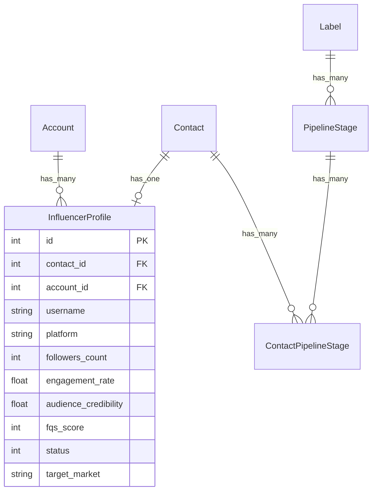

# Influencer Discovery — Final Implementation Plan

## Overview

System automatyzujacy discovery, scoring (FQS) i pipeline management influencerow w Chatwoot, zintegrowany z IQFluence API. Zastepuje manualne workflow (arkusze, reczne przegladanie profili). Cel: ROAS ~3 z barter collaborations z micro-influencerami (5-30K followers) na 10 rynkach EU dla Framky (premium wall photo galleries).

**Zrodla tego planu:**
- `docs/plans/influencer-discovery/implementation-plan.md` — architektura, DB schema, frontend
- `docs/plans/2026-02-25-feat-fqs-scoring-filter-strategy-voucher-calculator-plan.md` — FQS algorytm, filtry discovery, voucher calculator, edge cases
- Codebase research — wzorce Chatwoot (services, jobs, API clients, frontend store)
- SpecFlow analysis — brakujace flowy, race conditions, security gaps

---

## 1. Database: `influencer_profiles`

Osobna tabela (nie `custom_attributes`) bo potrzebujemy indeksow, sortowania i strukturalnych query na FQS/audience.

### Migration

```ruby
# db/migrate/YYYYMMDDHHMMSS_create_influencer_profiles.rb
class CreateInfluencerProfiles < ActiveRecord::Migration[7.0]
  def change
    create_table :influencer_profiles do |t|
      t.references :contact, null: false, foreign_key: true, index: { unique: true }
      t.references :account, null: false, foreign_key: true

      # Identity
      t.string :platform, default: 'instagram', null: false
      t.string :username, null: false
      t.string :profile_url
      t.string :profile_picture_url
      t.string :fullname
      t.text :bio
      t.boolean :is_verified, default: false

      # Basic metrics
      t.integer :followers_count
      t.integer :following_count
      t.integer :posts_count
      t.float :engagement_rate
      t.float :avg_reel_views
      t.float :avg_likes
      t.float :avg_comments
      t.float :avg_saves
      t.float :avg_shares
      t.float :follower_growth_rate          # monthly %
      t.float :hidden_like_posts_rate        # 0.0-1.0, kluczowe dla degraded FQS
      t.float :paid_post_performance         # uwaga: IQFluence API ma typo "perfomance"
      t.datetime :last_post_at

      # Audience data (from IQFluence report — audience_likers)
      t.float :audience_credibility          # 0-1
      t.string :audience_credibility_class   # bad/low/normal/good/excellent
      t.float :audience_reachability         # calculated from reachability array
      t.jsonb :audience_genders, default: {}
      t.jsonb :audience_ages, default: {}
      t.jsonb :audience_geo, default: {}
      t.jsonb :audience_interests, default: {}
      t.jsonb :audience_brand_affinity, default: {}
      t.jsonb :audience_types, default: {}   # mass_followers, suspicious weights

      # Content data
      t.jsonb :top_hashtags, default: []
      t.jsonb :interests, default: []
      t.jsonb :recent_reels, default: []     # [{url, thumbnail_url, views, likes, comments, timestamp}]
      t.jsonb :stat_history, default: []

      # IQFluence references
      t.string :iqfluence_report_id
      t.string :iqfluence_search_result_id

      # FQS scoring
      t.integer :fqs_score                   # 0-100 final
      t.integer :fqs_stage1_score            # 0-65
      t.integer :fqs_stage2_score            # 0-35
      t.jsonb :fqs_breakdown, default: {}    # {niche_fit:, er_quality:, reel_views:, growth:, audience_quality:, audience_fit:}
      t.jsonb :fqs_hard_filter_results, default: {} # {passed: bool, failed_checks: [...]}

      # Workflow
      t.integer :status, default: 0
      t.string :rejection_reason
      t.string :target_market                # ISO country code (DE, PL, FR, etc.)
      t.datetime :report_fetched_at
      t.datetime :last_synced_at
      t.integer :lock_version, default: 0    # optimistic locking vs race conditions

      t.timestamps
    end

    add_index :influencer_profiles, [:account_id, :username, :platform], unique: true, name: 'idx_influencer_profiles_account_username_platform'
    add_index :influencer_profiles, [:account_id, :status]
    add_index :influencer_profiles, [:account_id, :fqs_score]
  end
end
```

### Model

```ruby
# app/models/influencer_profile.rb
class InfluencerProfile < ApplicationRecord
  belongs_to :contact
  belongs_to :account

  enum :status, {
    discovered: 0,
    report_pending: 1,
    report_fetched: 2,
    approved: 3,
    rejected: 4,
    contacted: 5
  }

  validates :username, presence: true, uniqueness: { scope: [:account_id, :platform] }
  validates :contact_id, uniqueness: true

  # State machine guards
  VALID_TRANSITIONS = {
    discovered: %i[report_pending rejected],
    report_pending: %i[report_fetched rejected],
    report_fetched: %i[approved rejected],
    approved: %i[contacted rejected],
    rejected: %i[discovered],    # re-evaluate
    contacted: %i[approved]      # back to approved if needed
  }.freeze

  def transition_to!(new_status)
    allowed = VALID_TRANSITIONS[status.to_sym] || []
    raise InvalidTransitionError, "Cannot transition from #{status} to #{new_status}" unless allowed.include?(new_status.to_sym)

    update!(status: new_status)
  end

  class InvalidTransitionError < StandardError; end

  def tier
    case followers_count.to_i
    when 0...10_000 then :nano
    when 10_000...50_000 then :micro
    when 50_000...500_000 then :mid
    else :macro
    end
  end

  def hidden_likes?
    hidden_like_posts_rate.to_f > 0.9
  end

  def report_available?
    report_fetched? || approved? || contacted?
  end
end
```

**Contact association** — dodac do `app/models/contact.rb`:
```ruby
has_one :influencer_profile, dependent: :destroy_async
```

### ERD



---

## 2. FQS (Framky Quality Score) — 100 punktow

### Kluczowa decyzja: `audience_likers` jako zrodlo danych Stage 2

Uzywamy `audience_likers` (nie `audience_followers`) poniewaz:
- Likers = osoby aktywnie angazujace sie z contentem = realni potencjalni klienci
- Followers moga byc nieaktywni, kupieni, z follow/unfollow
- Engagement-based audience daje dokladniejszy obraz purchase intent

### Hard Filters (polaczona lista z obu dokumentow)

Profile musza przejsc WSZYSTKIE filtry. Failure = natychmiastowy reject bez scoringu.

| # | Filtr | Zrodlo API | Warunek | Etap |
|---|-------|-----------|---------|------|
| HF1 | ER ponizej minimum tieru | `engagement_rate` | Nano <2%, Micro <1.5%, Mid <1% | 1 |
| HF2 | ER > 15% (kupiony engagement) | `engagement_rate` | `> 0.15` | 1 |
| HF3 | Brak postu >60 dni | `last_post_at` | Inactive | 1 |
| HF4 | Following:Followers > 0.8 | `following_count / followers_count` | Follow/unfollow strategy | 1 |
| HF5 | Growth spike >20%/7d | `stat_history` | Kupione followers lub giveaway | 1 |
| HF6 | Poza EU | `user_profile.geo.country` | Framky operuje na 10 rynkach EU | 1 |
| HF7 | Likes > 2x views | `avg_likes`, `avg_reel_views` | Kupione lajki | 1 |
| HF8 | Likes:Comments > 500:1 | `avg_likes`, `avg_comments` | Bot engagement | 1 |
| HF9 | PPP < 1% | `paid_post_performance` | Sponsorowane posty bez efektu | 2 |
| HF10 | Mass + suspicious > 65% | `audience_types[]` | Fake audience | 2 |
| HF11 | Audience credibility "bad" | `audience_credibility` < 0.75 | >25% fake followers | 2 |
| HF12 | Growth > +50% / 3 mies. | `stat_history` | Nienaturalny wzrost | 2 |

**Uwaga: hidden likes handling.** Gdy `hidden_like_posts_rate > 0.9`:
- HF1 (ER min): uzywaj comment-ER (`avg_comments / followers * 100`), threshold /3
- HF2 (ER max): skip — nie mozna zweryfikowac
- HF7 (Likes > 2x views): skip — `avg_likes = 0` jest artefaktem
- HF8 (Likes:Comments): skip — brak danych likes

### Stage 1 (65 pkt) — z IQFluence Discovery + basic profile

| Wymiar | Pkt | Zrodlo | Scoring |
|--------|-----|--------|---------|
| **Niche Fit** | 0-20 | `interests[].name`, `top_hashtags[].tag`, `account_category`, bio | Zlicz trafienia w target categories. 3+ = 20, 2 = 14, 1 = 8, 0 = 0. Fallback: `relevance` score >0.7 = 20, >0.5 = 14, >0.3 = 8 |
| **ER + Quality** | 0-20 | `engagement_rate`, `avg_likes`, `avg_comments` | ER vs mediana tieru: >=2x = 15, >=1.5x = 11, >=1x = 8, >=0.7x = 4, <0.7x = 0. + Quality bonus 0-5 (likes:comments ratio). **Degraded mode (hidden likes):** comment-ER > 0.15% = 10, >0.10% = 8, >0.05% = 5, else = 2. Cap at 10/20 pkt. |
| **Avg Reel Views** | 0-15 | `avg_reels_plays` | Views/followers: >=3x = 15, >=2x = 12, >=1x = 9, >=0.5x = 5, <0.5x = 0 |
| **Growth Trend** | 0-10 | `stat_history` (3-month avg) or `followers_growth` | Monthly %: 2-5% = 10, 1-2% = 7, 0-1% = 4, <0 = 0 |

**ER Tier Medians (static benchmarks):**
```ruby
TIER_MEDIAN_ER = {
  nano: 0.04,   # 4%
  micro: 0.025, # 2.5%
  mid: 0.015,   # 1.5%
  macro: 0.01   # 1%
}.freeze
```

**Niche Categories:**
```ruby
NICHE_CATEGORIES = {
  home: %w[home decor decoration interior house apartment homedecor homedesign],
  interior: %w[interior design furniture livingroom bedroom wohnzimmer einrichtung wnetrza],
  family: %w[family kids children parenting motherhood familienleben rodzina famille gezin],
  photography: %w[photography photo portrait lifestyle],
  diy: %w[diy crafts handmade renovation]
}.freeze

TARGET_INTEREST_IDS = { 1560 => :home, 190 => :family }.freeze
```

### Stage 2 (35 pkt) — z IQFluence Report (tylko dla Stage 1 >= 50)

| Wymiar | Pkt | Zrodlo (audience_likers.data) | Scoring |
|--------|-----|-------------------------------|---------|
| **Audience Quality** | 0-20 | `audience_credibility` + `audience_reachability[]` | Credibility: >=0.9 = 12, >=0.8 = 8, <0.8 = HARD REJECT (HF11). Reachability (sum weights code in ["-500", "500-1000"]): >=30% = 8, >=20% = 5, <20% = 2 |
| **Audience Fit** | 0-15 | `audience_geo.countries[]` + `audience_brand_affinity[]` | Target country weight: >=60% = 10, >=40% = 7, >=25% = 4, <25% = 0. Brand affinity match (Home Decor 1560): full = 5, partial (190 Toys/Children) = 3, none = 0 |

### Decyzje FQS

| FQS | Decyzja | Akcja |
|-----|---------|-------|
| >=70 | Auto-approve | Tag "influencer", pipeline stage "Qualified" |
| 50-69 | Manual review | Widoczny w Review queue |
| <50 | Auto-reject | Status = rejected |

### Znane ograniczenie: Stage 1 gate at 50

Profil z Stage 1 = 48 nigdy nie dostaje raportu, wiec nie moze zdobyc Stage 2 points. Nawet jesli audience bylby idealny (35 pkt, total 83). To jest swiadoma decyzja — oszczednosc kredytow kosztem false negatives. Przy pilocie zrewidowac threshold.

---

## 3. Discovery Filters — optymalna preselekcja

### Warstwy filtracji w IQFluence Discovery API

**Warstwa 1: Profile (eliminuje ~70%):**
```json
{
  "followers": { "left_number": 5000, "right_number": 30000 },
  "engagement_rate": { "value": 0.02, "operator": "gte" },
  "reels_plays": { "left_number": 1000, "right_number": 0 },
  "posts_count": { "left_number": 30, "right_number": 0 },
  "last_posted": 90,
  "is_hidden": false,
  "account_type": [2],
  "with_contact": [{ "type": "email", "action": "should" }]
}
```

**Warstwa 2: Audience (eliminuje kolejne ~50%):**
```json
{
  "audience_geo": [{ "id": 51477, "weight": 0.45 }],
  "audience_lang": { "code": "de", "weight": 0.45 },
  "audience_gender": { "code": "FEMALE", "weight": 0.55 },
  "audience_age": [
    { "code": "25-34", "weight": 0.30 },
    { "code": "35-44", "weight": 0.20 }
  ],
  "audience_credibility": 0.75
}
```

**Warstwa 3: Niche (eliminuje ~30%):**
```json
{
  "relevance": {
    "value": "einrichtung wohnzimmer wanddeko gallerywall zuhause familienleben",
    "weight": 0.5,
    "threshold": 0.45
  },
  "audience_brand_category": [{ "id": 1560, "weight": 0.10 }]
}
```

**Warstwa 4: Growth stability:**
```json
{
  "followers_growth": { "interval": "i3months", "value": -0.05, "operator": "gte" }
}
```

### Hardcoded Search Presets (MVP)

```ruby
SEARCH_PRESETS = {
  'DE micro home decor' => {
    audience_geo: [{ id: 51_477, weight: 0.45 }],
    audience_lang: { code: 'de', weight: 0.45 },
    followers: { left_number: 5_000, right_number: 30_000 },
    relevance: { value: 'einrichtung wohnzimmer wanddeko gallerywall zuhause', weight: 0.5, threshold: 0.45 }
  },
  'PL family photographers' => {
    audience_geo: [{ id: :PL_ID, weight: 0.45 }], # TODO: resolve geo ID via /api/geos/
    audience_lang: { code: 'pl', weight: 0.45 },
    followers: { left_number: 5_000, right_number: 30_000 },
    relevance: { value: 'wnetrza rodzina zdjecia mojdom homeinspo', weight: 0.5, threshold: 0.45 }
  },
  'FR interior micro' => {
    audience_geo: [{ id: :FR_ID, weight: 0.45 }],
    audience_lang: { code: 'fr', weight: 0.45 },
    followers: { left_number: 5_000, right_number: 30_000 },
    relevance: { value: 'decoration interieur cheznous maisondeco', weight: 0.5, threshold: 0.45 }
  },
  'NL home lifestyle' => {
    audience_geo: [{ id: :NL_ID, weight: 0.40 }],
    audience_lang: { code: 'nl', weight: 0.40 },
    followers: { left_number: 5_000, right_number: 30_000 },
    relevance: { value: 'interieur woonkamer binnenkijken woondecoratie', weight: 0.5, threshold: 0.45 }
  },
  'UK home decor' => {
    audience_geo: [{ id: :GB_ID, weight: 0.40 }],
    audience_lang: { code: 'en', weight: 0.40 },
    followers: { left_number: 5_000, right_number: 30_000 },
    relevance: { value: 'homedecor interiordesign gallerywall myhome', weight: 0.5, threshold: 0.45 }
  }
}.freeze
```

### Oczekiwany funnel per rynek

| Etap | Rekordow | Koszt |
|------|----------|-------|
| Discovery search | ~200-400 | 0 (search free) |
| Unhide top 100 | 100 | ~100 credits |
| Hard filters Stage 1 | ~70-80 pass | 0 |
| FQS Stage 1 >= 50 -> Report | ~50 | 50 raportow |
| FQS final >= 70 -> Pipeline | ~25-35 | 0 |

### Adaptacja per rynek

| Rynek | `followers` min | `audience_geo` weight | Uwagi |
|-------|-----------------|----------------------|-------|
| DE, FR, IT, ES, PL | 5000 | 0.45-0.50 | Duze rynki |
| NL, UK | 5000 | 0.40-0.45 | UK: EN globalny |
| AT, BE, DK | **3000** | **0.30** | Male rynki, luzniejsze filtry |

---

## 4. Backend Architecture

### IQFluence API Client — `app/services/iqfluence/`

Wzorowane na `Crm::Leadsquared::Api::BaseClient` (HTTParty, custom ApiError):

| Plik | Odpowiedzialnosc |
|------|-----------------|
| `client.rb` | HTTParty wrapper, Bearer auth (`IQFLUENCE_API_KEY` env), rate limiting, error handling |
| `search_service.rb` | `POST /api/search/newv1/` — buduje filter payload, paginuje, excludes already-imported |
| `unhide_service.rb` | `POST /api/search/unhide/` — odblokowanie ukrytych profili z search results |
| `report_service.rb` | `GET /api/reports/new/` — fetch detailed report, polling jesli async |
| `scraping_service.rb` | `/api/raw/ig/user/reels/` — recent reels data (0.02 credit/req, 5 RPS) |
| `geos_service.rb` | `GET /api/geos/` — resolve geo IDs for EU markets |
| `response_parser.rb` | Mapuje IQFluence JSON -> InfluencerProfile attributes hash |

```ruby
# app/services/iqfluence/client.rb
class Iqfluence::Client
  include HTTParty

  BASE_URI = 'https://iqfluence.com'.freeze

  class ApiError < StandardError
    attr_reader :code, :response

    def initialize(message = nil, code: nil, response: nil)
      @code = code
      @response = response
      super(message)
    end
  end

  def initialize
    @api_key = ENV.fetch('IQFLUENCE_API_KEY')
  end

  def post(path, body = {})
    response = self.class.post("#{BASE_URI}#{path}", body: body.to_json, headers: headers)
    handle_response(response)
  end

  def get(path, params = {})
    response = self.class.get("#{BASE_URI}#{path}", query: params, headers: headers)
    handle_response(response)
  end

  private

  def headers
    { 'Authorization' => "Bearer #{@api_key}", 'Content-Type' => 'application/json' }
  end

  def handle_response(response)
    case response.code
    when 200..299 then response.parsed_response
    when 429 then raise ApiError.new('Rate limited', code: 429, response: response)
    else raise ApiError.new(response['error_message'] || 'API error', code: response.code, response: response)
    end
  end
end
```

### Services — `app/services/influencers/`

| Plik | Odpowiedzialnosc |
|------|-----------------|
| `import_service.rb` | Creates Contact (`identifier: "ig:<username>"`) + InfluencerProfile. Syncs key metrics to `contact.custom_attributes`. Runs Stage 1 FQS. |
| `fqs_calculator.rb` | Orchestrator: hard filters -> Stage 1 -> Stage 2 (if report). Updates profile scores. Returns decision. |
| `fqs/hard_filter.rb` | 12 elimination checks (HF1-HF12) with hidden likes awareness |
| `fqs/stage1_scorer.rb` | 65-point scoring: niche_fit + er_quality + reel_views + growth |
| `fqs/stage2_scorer.rb` | 35-point scoring: audience_quality + audience_fit |
| `fqs/niche_matcher.rb` | Matches interests/hashtags against NICHE_CATEGORIES |
| `approve_service.rb` | Transition to approved, add "influencer" label, assign pipeline stage "Qualified", sync custom_attributes |
| `reject_service.rb` | Transition to rejected with reason |

**Import deduplication strategy:**
```ruby
# app/services/influencers/import_service.rb
def find_or_create_contact
  # 1. Check by identifier (primary match)
  contact = @account.contacts.find_by(identifier: "ig:#{@data[:username]}")
  return contact if contact

  # 2. Check by email if available (avoid duplicates)
  if @data[:email].present?
    contact = @account.contacts.find_by(email: @data[:email])
    if contact
      contact.update!(identifier: "ig:#{@data[:username]}") if contact.identifier.blank?
      return contact
    end
  end

  # 3. Create new
  @account.contacts.create!(
    identifier: "ig:#{@data[:username]}",
    name: @data[:fullname].presence || @data[:username],
    contact_type: :lead,
    custom_attributes: build_custom_attributes
  )
end
```

### Controller — `app/controllers/api/v1/accounts/influencer_profiles_controller.rb`

| Action | Method | Purpose |
|--------|--------|---------|
| `index` | GET | List profiles with status/FQS filters, pagination, sorting |
| `show` | GET | Full profile detail |
| `search` | POST | Proxy to IQFluence search, excludes already-imported |
| `import` | POST | Single import |
| `bulk_import` | POST | Batch import (max 100) |
| `request_report` | POST (member) | Queue report fetch |
| `bulk_request_report` | POST (collection) | Queue multiple (confirmation required >5) |
| `approve` | POST (member) | Approve + pipeline |
| `reject` | POST (member) | Reject with reason |
| `recalculate` | POST (member) | Re-run FQS |

**Authorization:** Restrict to `administrator` role. Agents cannot spend IQFluence credits.

### Routes

Dodac w `config/routes.rb` wewnatrz `namespace :api do ... namespace :v1 do ... resources :accounts` (~line 195, po contacts):

```ruby
resources :influencer_profiles, only: [:index, :show] do
  collection do
    post :search
    post :import
    post :bulk_import
    post :bulk_request_report
  end
  member do
    post :request_report
    post :approve
    post :reject
    post :recalculate
  end
end
```

### Background Jobs — `app/jobs/influencers/`

| Job | Queue | Purpose |
|-----|-------|---------|
| `fetch_report_job.rb` | `:medium` | Calls ReportService, updates profile, sets status=report_fetched, enqueues ScoreProfileJob. Handles async reports with polling (5s, 10s, 20s backoff, max 2 min). |
| `score_profile_job.rb` | `:medium` | Runs FqsCalculator. Auto-approve/reject based on thresholds. Respects optimistic locking — skips if profile was manually reviewed in the meantime. |
| `bulk_fetch_reports_job.rb` | `:low` | Enqueues individual FetchReportJob with 1-second delay between each (respect rate limits). |
| `fetch_reels_job.rb` | `:low` | Calls scraping API for recent reels. Run after report fetch or on-demand. |

**Race condition protection in ScoreProfileJob:**
```ruby
def perform(influencer_profile_id)
  profile = InfluencerProfile.find(influencer_profile_id)
  # Skip if manually reviewed while job was queued
  return if profile.approved? || profile.rejected?

  Influencers::FqsCalculator.new(profile).perform
rescue ActiveRecord::StaleObjectError
  # Another process updated the profile — skip silently
  Rails.logger.info "InfluencerProfile##{influencer_profile_id} was updated concurrently, skipping scoring"
end
```

---

## 5. Frontend Architecture

### Routes — `app/javascript/dashboard/routes/dashboard/influencers/`

```
/influencers              -> InfluencersIndex (search tab)
/influencers/review       -> InfluencersIndex (review tab)
/influencers/pipeline     -> InfluencersIndex (pipeline/kanban tab)
/influencers/rejected     -> InfluencersIndex (rejected tab)
```

Rejestracja w `app/javascript/dashboard/routes/dashboard/dashboard.routes.js`:
```javascript
import { routes as influencerRoutes } from './influencers/routes';
// ...
children: [...contactRoutes, ...influencerRoutes, ...]
```

### Sidebar — dodac do `Sidebar.vue` (po Contacts block, ~line 451):

```javascript
{
  name: 'Influencers',
  label: t('SIDEBAR.INFLUENCERS'),
  icon: 'i-lucide-sparkles',
  children: [
    {
      name: 'Search',
      label: t('SIDEBAR.INFLUENCER_SEARCH'),
      to: accountScopedRoute('influencers_search'),
      activeOn: ['influencers_search'],
    },
    {
      name: 'Review',
      label: t('SIDEBAR.INFLUENCER_REVIEW'),
      to: accountScopedRoute('influencers_review'),
      activeOn: ['influencers_review'],
    },
    {
      name: 'Pipeline',
      label: t('SIDEBAR.INFLUENCER_PIPELINE'),
      to: accountScopedRoute('influencers_pipeline'),
      activeOn: ['influencers_pipeline'],
    },
    {
      name: 'Rejected',
      label: t('SIDEBAR.INFLUENCER_REJECTED'),
      to: accountScopedRoute('influencers_rejected'),
      activeOn: ['influencers_rejected'],
    },
  ],
},
```

### API Module — `app/javascript/dashboard/api/influencerProfiles.js`

```javascript
import ApiClient from './ApiClient';

class InfluencerProfilesAPI extends ApiClient {
  constructor() {
    super('influencer_profiles', { accountScoped: true });
  }

  search(filters) { return axios.post(`${this.url}/search`, filters); }
  import(data) { return axios.post(`${this.url}/import`, data); }
  bulkImport(items) { return axios.post(`${this.url}/bulk_import`, { items }); }
  requestReport(id) { return axios.post(`${this.url}/${id}/request_report`); }
  bulkRequestReport(ids) { return axios.post(`${this.url}/bulk_request_report`, { ids }); }
  approve(id) { return axios.post(`${this.url}/${id}/approve`); }
  reject(id, reason) { return axios.post(`${this.url}/${id}/reject`, { rejection_reason: reason }); }
  recalculate(id) { return axios.post(`${this.url}/${id}/recalculate`); }
}

export default new InfluencerProfilesAPI();
```

### Store — `app/javascript/dashboard/store/modules/influencerProfiles.js`

Wzorowany na `contacts/` (multi-file: index, actions, getters, mutations). Object map state:

```javascript
state: {
  records: {},           // id -> profile
  sortOrder: [],
  searchResults: [],     // IQFluence search results (not yet imported)
  uiFlags: {
    isFetching: false,
    isSearching: false,
    isImporting: false,
    isFetchingReport: false,
  },
  meta: { currentPage: 1, count: 0 },
}
```

### Components — `app/javascript/dashboard/components-next/Influencers/`

| Component | Opis |
|-----------|------|
| `InfluencerSearchPanel.vue` | Formularz filtrow: preset dropdown, follower range, ER range, country, keywords. |
| `InfluencerSearchResults.vue` | Grid kart z checkboxami, bulk import bar, "Imported" badge na juz-zaimportowanych. |
| `InfluencerSearchResultCard.vue` | Avatar, username, followers, ER, avg views, location, niche tags. Jesli ER=0 i hidden_likes, pokazuje "Hidden likes" badge zamiast misleading "0%". |
| `InfluencerReviewList.vue` | Tabela: Profile, Followers, ER, FQS badge, Audience Credibility, Avg Reel Views, Status chip. |
| `InfluencerProfileCard.vue` | Wiersz w tabeli review. |
| `InfluencerProfileDetail.vue` | Slide-over: pelne metryki, FQS breakdown, audience geo chart, reels, approve/reject. |
| `InfluencerReelPreview.vue` | Thumbnail reela + link do IG, views/likes overlay. |
| `FqsScoreBadge.vue` | Color-coded: green >=70, yellow 50-69, red <50. Hover = breakdown tooltip. Stage 2 dims show "--" jesli raport nie pobrany. |
| `InfluencerBulkActions.vue` | Floating bar: "N selected" + Import / Fetch Reports (z cost confirmation >5) / Approve / Reject. |
| `InfluencerPipelineView.vue` | Wrapper na istniejacy `PipelineKanbanBoard.vue` filtrowany do label "influencer". |

---

## 6. Ekrany

### Screen 1: Search (`/influencers`)
- **Top**: Tab bar (Search | Review | Pipeline | Rejected)
- **Left**: Collapsible filters — preset dropdown (5 presetow), follower range, ER range, country multi-select (EU), keywords, hashtags. "Search IQFluence" button.
- **Main**: Grid `InfluencerSearchResultCard`. Already-imported greyed + "Imported" badge. Hidden likes = "Hidden likes" badge zamiast ER. Checkboxes.
- **Bottom bar**: "Import Selected (N)" + "Import & Fetch Reports". Pokazuje estimated credit cost.
- **Empty state**: "Select a preset or configure filters to search IQFluence"

### Screen 2: Review (`/influencers/review`)
- **Top**: Tab bar. Sub-filters: status (Report Pending / Awaiting Review / All), FQS range, sort (FQS desc, date, followers).
- **Main**: `InfluencerReviewList` — tabela z kolumnami. Click wiersza -> `InfluencerProfileDetail` slide-over.
- **Detail slide-over**: Full metrics, FQS breakdown, 3 recent reels z thumbnails/linkami, audience geo chart, approve/reject buttons.
- **Bulk**: Select all + bulk approve/reject/fetch report.

### Screen 3: Pipeline (`/influencers/pipeline`)
- Kanban (reusing `PipelineKanbanBoard.vue`) dla label "influencer".
- Stages: Qualified -> Outreach -> Negotiation -> Contracted -> Active -> Completed.
- Cards: avatar, name, followers, ER, FQS badge (via `PipelineContactCard.vue` custom_attributes).
- Drag-and-drop miedzy stages.

### Screen 4: Rejected (`/influencers/rejected`)
- Tabela: profile, FQS, rejection reason, date.
- "Re-evaluate" action: re-fetch report + re-run FQS, jesli score sie zmienil -> back to Review.

---

## 7. Integracja z istniejacym Chatwoot

| System | Integracja |
|--------|-----------|
| **Contact** | `has_one :influencer_profile`. Influencers = contacts z `contact_type: :lead`, `identifier: "ig:<username>"` |
| **custom_attributes** | ImportService/ApproveService sync followers, engagement_rate, avg_views do `contact.custom_attributes` — pipeline card display |
| **Labels** | ApproveService dodaje label "influencer" via `contact.update_labels` |
| **Pipeline/Kanban** | Label "influencer" z seeded stages. ApproveService tworzy `ContactPipelineStage` dla first stage |
| **Custom Attribute Definitions** | Istniejacy `influencer_attributes.rake` juz seeduje definicje |
| **Sidebar** | Nowy "Influencers" section w `Sidebar.vue` |
| **Conversations** | Status `contacted` triggered gdy tworzymy konwersacje z kontaktem (via model callback) |

---

## 8. Voucher Calculator (Phase 2 — osobny feature)

Landing page (`framky.com/partner/[handle]`) z interaktywnym kalkulatorem:

**Formuła:** `Voucher (EUR) = Base(followers) x FQS_mult x Content_mult x Rights_mult + Extras`

| Tier | Base EUR |
|------|----------|
| 1-5K | 100 |
| 5-15K | 175 |
| 15-30K | 250 |
| 30-75K | 375 |

| FQS | Mult |
|-----|------|
| 80+ | 1.3x |
| 70-79 | 1.1x |
| 60-69 | 0.9x |
| 50-59 | 0.7x |

**Security:** Link musi byc podpisany HMAC z server-side secret + expiry timestamp. Influencer NIE moze modyfikowac parametrow (followers, fqs).

**Detale:** patrz `docs/plans/2026-02-25-feat-fqs-scoring-filter-strategy-voucher-calculator-plan.md` sekcja 3.

---

## 9. Kolejnosc implementacji

### Phase 1: Backend Foundation
1. Migration: create `influencer_profiles` table
2. Model: `InfluencerProfile` + `has_one` na Contact
3. `Iqfluence::Client` — HTTParty wrapper
4. `Iqfluence::SearchService` — search endpoint
5. `Iqfluence::ResponseParser` — mapowanie API -> model
6. `Influencers::ImportService` — create Contact + InfluencerProfile
7. Controller: `index`, `show`, `search`, `import`, `bulk_import`
8. Routes w `config/routes.rb`

### Phase 2: FQS + Reports
9. `Fqs::HardFilter` — 12 elimination checks z hidden likes handling
10. `Fqs::NicheMatcher` — category matching
11. `Fqs::Stage1Scorer` — 65-point scoring
12. `Iqfluence::ReportService` — report fetch z polling
13. `Fqs::Stage2Scorer` — 35-point scoring (audience_likers)
14. `Influencers::FqsCalculator` — orchestrator
15. Background jobs: FetchReportJob, ScoreProfileJob, BulkFetchReportsJob
16. Controller: `request_report`, `bulk_request_report`, `approve`, `reject`, `recalculate`
17. `Influencers::ApproveService` + `RejectService`

### Phase 3: Frontend
18. API module: `influencerProfiles.js`
19. Store module (multi-file): `influencerProfiles/`
20. Routes + rejestracja w dashboard router
21. Sidebar entry w `Sidebar.vue`
22. Search screen: SearchPanel + SearchResults + SearchResultCard
23. Review screen: ReviewList + ProfileCard + ProfileDetail
24. FqsScoreBadge + ReelPreview
25. Bulk actions bar z cost confirmation
26. i18n keys w `en.json`

### Phase 4: Pipeline Integration
27. Seed task: label "influencer" + pipeline stages (Qualified, Outreach, Negotiation, Contracted, Active, Completed)
28. Pipeline kanban view (wrapping PipelineKanbanBoard)
29. Rejected list view
30. FetchReelsJob + ReelPreview integration

### Phase 5: Voucher Calculator (osobna iteracja)
31. Landing page (statyczny HTML + JS)
32. HMAC-signed link generation w Chatwoot
33. Webhook: landing page -> Chatwoot API

---

## 10. Pliki do zmodyfikowania

| Plik | Zmiana |
|------|--------|
| `app/models/contact.rb` | Dodac `has_one :influencer_profile, dependent: :destroy_async` |
| `config/routes.rb` (~line 195) | Dodac `resources :influencer_profiles` |
| `app/javascript/dashboard/components-next/sidebar/Sidebar.vue` (~line 451) | Dodac "Influencers" menu |
| `app/javascript/dashboard/routes/dashboard/dashboard.routes.js` | Import + spread influencer routes |
| `app/javascript/dashboard/store/mutation-types.js` | Dodac influencer mutation types |

## 11. Pliki do stworzenia

**Backend:**
- `db/migrate/*_create_influencer_profiles.rb`
- `app/models/influencer_profile.rb`
- `app/controllers/api/v1/accounts/influencer_profiles_controller.rb`
- `app/services/iqfluence/client.rb`
- `app/services/iqfluence/search_service.rb`
- `app/services/iqfluence/unhide_service.rb`
- `app/services/iqfluence/report_service.rb`
- `app/services/iqfluence/scraping_service.rb`
- `app/services/iqfluence/response_parser.rb`
- `app/services/influencers/import_service.rb`
- `app/services/influencers/fqs_calculator.rb`
- `app/services/influencers/fqs/hard_filter.rb`
- `app/services/influencers/fqs/stage1_scorer.rb`
- `app/services/influencers/fqs/stage2_scorer.rb`
- `app/services/influencers/fqs/niche_matcher.rb`
- `app/services/influencers/approve_service.rb`
- `app/services/influencers/reject_service.rb`
- `app/jobs/influencers/fetch_report_job.rb`
- `app/jobs/influencers/score_profile_job.rb`
- `app/jobs/influencers/bulk_fetch_reports_job.rb`
- `app/jobs/influencers/fetch_reels_job.rb`

**Frontend:**
- `app/javascript/dashboard/routes/dashboard/influencers/routes.js`
- `app/javascript/dashboard/api/influencerProfiles.js`
- `app/javascript/dashboard/store/modules/influencerProfiles/index.js`
- `app/javascript/dashboard/store/modules/influencerProfiles/actions.js`
- `app/javascript/dashboard/store/modules/influencerProfiles/getters.js`
- `app/javascript/dashboard/store/modules/influencerProfiles/mutations.js`
- `app/javascript/dashboard/components-next/Influencers/InfluencerSearchPanel.vue`
- `app/javascript/dashboard/components-next/Influencers/InfluencerSearchResults.vue`
- `app/javascript/dashboard/components-next/Influencers/InfluencerSearchResultCard.vue`
- `app/javascript/dashboard/components-next/Influencers/InfluencerReviewList.vue`
- `app/javascript/dashboard/components-next/Influencers/InfluencerProfileCard.vue`
- `app/javascript/dashboard/components-next/Influencers/InfluencerProfileDetail.vue`
- `app/javascript/dashboard/components-next/Influencers/InfluencerReelPreview.vue`
- `app/javascript/dashboard/components-next/Influencers/FqsScoreBadge.vue`
- `app/javascript/dashboard/components-next/Influencers/InfluencerBulkActions.vue`
- `app/javascript/dashboard/components-next/Influencers/InfluencerPipelineView.vue`
- `app/javascript/dashboard/routes/dashboard/influencers/pages/InfluencersIndex.vue`

---

## 12. Otwarte pytania do rozwiazania przed implementacja

| # | Pytanie | Wplyw | Default |
|---|---------|-------|---------|
| 1 | Brakujace geo IDs (PL, NL, UK, AT, DK) | Filtry audience_geo nie dzialaja | `GET /api/geos/?q=Poland` etc. — resolve w Phase 1 |
| 2 | Czy IQFluence Report API jest synchroniczny? | Jesli async -> polling w FetchReportJob | Assume async, implement polling |
| 3 | Ile kosztuje unhide w IQFluence? | Budget planning | Test call |
| 4 | Czy `audience_brand_category` ID 1560 jest stabilny? | Jesli IDs sie zmieniaja, filtry sie psuja | Assume stable, cache mapping |
| 5 | Ile profili w IQFluence dla DE micro + home decor? | Jesli <100, filtry za ciasne | Test call, gotowsc do luzowania |

---

## 13. Weryfikacja

1. **Backend**: `bundle exec rspec spec/models/influencer_profile_spec.rb` + controller/service specs
2. **FQS**: Unit tests per scorer z known inputs -> expected scores. Osobny test dla hidden likes degraded mode.
3. **Hard filters**: Test na `@domprzyrybakowce` (hidden likes) i `@iam_alissia` (fraud detection)
4. **API integration**: Test z realnym IQFluence API key
5. **Frontend**: `pnpm test` component specs
6. **E2E manual**: Search -> Import -> Fetch Report -> See FQS -> Approve -> See in Kanban
7. **Lint**: `bundle exec rubocop -a` + `pnpm eslint`

---

## Sources & References

- **Implementation plan:** `docs/plans/influencer-discovery/implementation-plan.md` — architektura, DB, frontend, integracja
- **FQS/Filters plan:** `docs/plans/2026-02-25-feat-fqs-scoring-filter-strategy-voucher-calculator-plan.md` — algorytm FQS, hidden likes handling, filtry discovery, voucher calculator, sanity checks HR1-HR7
- **Raport wdrozeniowy:** `Influencer Marketing - Raport wdrozeniowy.md` — strategia, wycena, buyer persona, KPI
- **IQFluence API:** `docs/plans/influencer-discovery/discovery-api.md` — endpointy Search, Unhide, Report
- **IQFluence Report examples:** `docs/plans/influencer-discovery/report.json` (domprzyrybakowce), `report-2.json`, `report-3.json`
- **Instagram Scraping API:** `docs/plans/influencer-discovery/instagram-scraping-api.md`
- **Codebase patterns:** `app/services/crm/leadsquared/api/base_client.rb` (API client), `app/jobs/contacts/bulk_action_job.rb` (jobs), `app/services/contacts/bulk_action_service.rb` (bulk ops)
