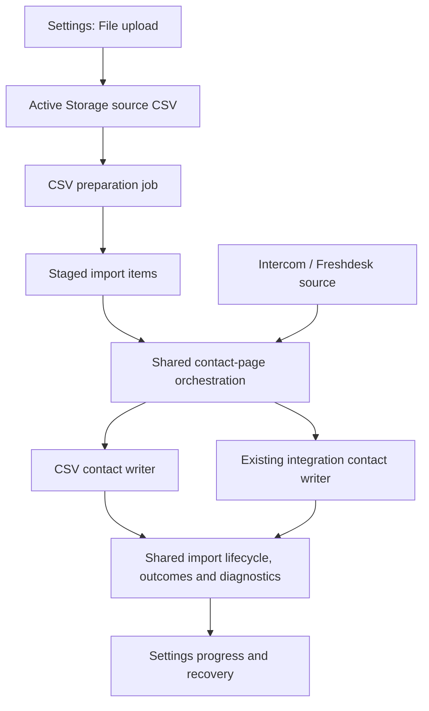

# Implementation plan: Contact import/export parity

Status: Implementation authorized and completed locally on `codex/cw-8215-contact-data-parity`. See the [implementation handoff and validation](contact-import-export-validation.md) for the delivered behavior, checks, and release sequence.

Baseline: `origin/develop` at `5b7038b950b763e230df2d544df9b87b8752fef3`, checked on 2026-09-16. The initial local checkout was one unrelated portal fix behind this revision. All import/export paths inspected are unchanged between those revisions.

## Overview

Make **Settings → Data → Imports / Exports** the home for contact data operations. Keep the existing Contacts actions as shortcuts into the appropriate Settings flow. Add **File upload → Contacts CSV** to the existing new-import dialog and run it through the lifecycle, jobs, item tracking, progress, errors, and recovery infrastructure used by Intercom and Freshdesk.

The approved export scope includes persistent export history, background progress, per-export downloads, and the existing completion email. CSV imports will preserve updates to matching contacts while making contact and label writes silent like integration imports. Both product decisions were confirmed by Sony on 2026-09-17 (UTC); they are required scope for this plan.

## Current understanding

| Area | Verified behavior | Consequence |
| --- | --- | --- |
| CSV upload | `ContactsController#import` creates a `DataImport` and attaches `import_file` through Active Storage. | Storage already exists; use the configured service, including S3, rather than introduce another upload system. |
| Background processing | A model callback schedules `DataImportJob` after a one-minute delay. | Processing is already asynchronous, but upload readiness is approximated by a delay. |
| CSV processing | The job reads the whole file and builds contact/rejection arrays in memory. Some matching-contact updates happen while parsing. | Batch the work; parsing must not mutate contacts. |
| CSV reporting | Legacy records store final totals and a failed-record attachment, then email account administrators. They have no shared item-level lifecycle. | Add honest incremental counts, durable outcomes, and in-app diagnostics. |
| API imports | `DataImports::Source`, creation/restart/retry services, shared job modules, `DataImportItem`, `DataImportError`, and `DataImportMapping` support Intercom/Freshdesk. | Reuse these seams, but remove actual API-only assumptions where CSV needs them. |
| API importer contact rules | The importer fills missing identity/name fields, uses external mappings, writes without normal contact callbacks, and initializes inbox support. | CSV cannot simply pass through this contact writer: its update rules and identity are different. |
| Settings page | Imports list/detail exist; Exports is a placeholder. Polling runs every five seconds while active and visible. | Extend the existing page and polling pattern. No new realtime transport is necessary. |
| Export | `Account::ContactsExportJob` builds CSV in memory, replaces `Account#contacts_export`, and emails the requesting user. | There is no export history or durable job state, and concurrent exports share one attachment slot. |
| Export selection | All eligible contacts, label selection, filters, and saved-segment queries are supported. Default columns are `id,name,email,phone_number,labels`. | Preserve these selections and columns across navigation. |
| Permissions | Contacts import/export allow administrators; Enterprise also allows `contact_manage`. Settings Data currently requires administrator plus `data_import`. | Moving the UI without changing authorization would remove existing access. |
| Billing | Enterprise plan reconciliation manages the `data_import` feature. | CSV import/export must remain available independently of the integration entitlement. |

Primary code evidence:

- [Contact endpoints](../../app/controllers/api/v1/accounts/contacts_controller.rb), [legacy job](../../app/jobs/data_import_job.rb), [CSV contact manager](../../app/services/data_import/contact_manager.rb).
- [Import model](../../app/models/data_import.rb), [source registry](../../app/services/data_imports/source.rb), [shared importer](../../app/services/data_imports/importer.rb), [import API](../../app/controllers/api/v1/accounts/data_imports_controller.rb).
- [Settings page](../../app/javascript/dashboard/routes/dashboard/settings/data/Index.vue), [new-import dialog](../../app/javascript/dashboard/routes/dashboard/settings/data/NewImportDialog.vue), [progress component](../../app/javascript/dashboard/routes/dashboard/settings/data/components/ImportProgress.vue).
- [Export job](../../app/jobs/account/contacts_export_job.rb), [export selection UI at the planning baseline](https://github.com/chatwoot/chatwoot/blob/5b7038b950b763e230df2d544df9b87b8752fef3/app/javascript/dashboard/components-next/Contacts/ContactsForm/ContactExportDialog.vue).
- [Contact policy](../../app/policies/contact_policy.rb), [Enterprise extension](../../enterprise/app/policies/enterprise/contact_policy.rb), [Data policy](../../app/policies/data_import_policy.rb), [billing reconciliation](../../enterprise/app/services/enterprise/billing/reconcile_plan_features_service.rb).
- [Storage configuration](../../config/storage.yml), [Active Storage guards](../../config/initializers/active_storage.rb), [contact attribute synchronization](../../app/services/contacts/sync_attributes.rb), [Enterprise contact callbacks](../../enterprise/app/models/enterprise/concerns/contact.rb).

## Product flow

### Import

1. **Contacts → Import** opens Settings Data on the Imports tab with the new-import dialog open and File upload selected. Opening New import directly from Settings offers the sources the user can actually use.
2. File upload displays Contacts as the only supported data type, a CSV picker, the existing sample download, file requirements, and an optional import name. Conversation options and API credentials are absent.
3. Show uploading progress, then navigate to the newly created import detail. The user can leave or close the browser once the server confirms that the source file is stored and the import is queued.
4. Detail shows Queued → Preparing file → Importing contacts → Finalizing → Completed / Completed with errors. Run failures and abandoned imports have distinct states.
5. Show processed rows, created/updated contacts, rejected rows, skipped rows if applicable, total rows after preparation, timestamps, initiator, file name, and last progress time. A completed import with rejected rows must still show 100% processed.
6. Provide row-level reasons, the existing downloadable diagnostics, and a **Download rejected rows** CSV that can be corrected and uploaded as a new import.
7. A stalled import can resume. A failed/abandoned run can restart from its durable state while its source remains available. Successful rows are not reapplied. Abandon stops future batches; it does not undo contacts already written.

### Export

1. **Contacts → Export** opens Settings Data on the Exports tab with the export dialog open and its selection preserved. Navigation itself never starts an export.
2. Show an explicit scope summary: all eligible contacts, the selected label, saved segment, or current filters. Opening the dialog from Settings defaults explicitly to all eligible contacts.
3. Confirmation creates an export record. List/detail shows queued, processing, completed, or failed, with processed count, initiator, scope, and timestamps.
4. Completion enables a download for that specific export and sends the existing completion email. Two exports must retain separate files.
5. A failed or stalled export can be rerun as a **new export**, copying its selection. CSV generation starts from the beginning and reads current contact data; partial files are never offered as completed downloads.

## Domain and invariants

The [domain glossary](../../CONTEXT.md) separates import source, imported record type, import item, execution attempt, data export, and export scope. The following behavioral contracts are proposed for this feature:

- **One import, many attempts:** retrying preserves the import ID and item identities while rotating execution ownership. Uploading a corrected file creates a new import; the original source is immutable.
- **Rows are the counting unit:** two CSV rows updating one contact are two processed rows, not two distinct contacts. Counters must not imply otherwise.
- **Account ownership is end to end:** source file, items, logs, artifacts, filters, and export records belong to the same account. Permission checks apply to direct API calls and downloads as well as the UI.
- **An outcome follows a commit:** contact changes, label changes, and that row's successful outcome commit together. Invalid rows cannot leave partial changes.
- **Recovery is repeatable:** duplicate jobs, worker replacement, and process death cannot duplicate a contact write or inflate a row counter.
- **Source determines supported operations:** a file import accepts contacts only; an API import retains its provider's current import types and credential requirements.
- **CSV access is preserved:** the integration feature flag never becomes a requirement for existing contact import/export capability.
- **History represents evidence:** old imports without row details remain readable as legacy summaries. Do not invent a requester, row outcomes, or export history that was never recorded.

## Architecture decisions

### 1. Extend the import platform without conflating source and record type

Use `DataImport` for CSV imports. New CSV records use `source_type: "file"`, `source_provider: "csv"`, `import_types: ["contacts"]`, and retain `data_type: "contacts"` for compatibility. Intercom/Freshdesk values remain unchanged. Do not rename existing columns or reinterpret their historical values in this feature.

Extend the source registry with explicit source type, supported import types, source validation/readiness, and construction from a `DataImport`. API providers continue to validate credentials; CSV validates an attached file. Do not require CSV to supply dummy tokens, inboxes, conversation methods, or a remote API client.

Use a narrow shared lifecycle component, provisionally `DataImports::RunState`, from the existing API importer and the CSV importer. It owns execution ownership, status transitions, heartbeat/checkpoint writes, and terminal-state guards. Preserve provider-specific counting and mapping behavior. Keep the existing `ImportJob` and `ContactsPageJob` orchestration where their contract applies; preparation is one CSV-specific stage before contact processing.



Generalize the current integration-only active/restart/retry/abandon predicates to explicitly identify imports managed by this platform. New managed CSV and API imports share the existing account-level creation lock and the **one active managed import per account** rule. Exports do not hold that import lock. Gate this rule at the common creation/restart boundary, including compatibility endpoints.

### 2. Keep Active Storage; enqueue after the file is durable

Retain the existing multipart upload approach for the first release. It already transfers the file into configured object storage, including S3. No AWS-specific client or browser-direct-upload prerequisite is needed. Preserve Disk/GCS/Azure/S3-compatible installations.

The creation path must finish storing and attaching the file before committing a runnable import and enqueueing preparation. Remove the fixed one-minute delay for new managed imports. A queue handoff failure leaves a discoverable pending run that the recovery action can re-enqueue; it must not be reported as a successfully started worker. Clean up unclaimed upload blobs when creation fails.

Validate source/type combinations, upload presence, declared size, and documented file shape at the request boundary; return actionable 422 errors for invalid input. Check CSV syntax and contents in the preparation job. Browser MIME metadata is not proof of a valid CSV. Set explicit file/row/field limits in the contract; recommended starting limits are 50 MiB, 250,000 data rows, and 1 MiB per field, subject to a representative load check. These are proposed new limits, not existing repository limits.

If direct upload is later needed, it requires an account-authorized upload endpoint and account/purpose ownership checks when attaching a blob. The bare Active Storage direct-upload route is intentionally blocked in this repository. Do not accept arbitrary signed blob IDs as a shortcut.

### 3. Prepare once, then process bounded row batches

Stream the stored CSV into bounded batches of `DataImportItem` rows. Reuse `metadata` for the original field values, logical CSV record number, and normalized input needed by the writer. A quoted multiline CSV record is one item; do not use physical line splitting. Use per-import item identity such as `row:1`, `row:2`; a CSV `id` column is never a Chatwoot record authorization or matching key.

Preparation performs no contact writes. Validate the complete CSV structure before marking preparation complete; only then publish its exact row total and start contact batches. A malformed quote near EOF therefore fails preparation without partial contact changes. Empty/header-only files fail with a clear file-level error. Preserve the existing BOM, emoji, CRLF, and invalid-byte fixture behavior through a streaming encoding path; reject blank/duplicate headers rather than silently collapse fields.

Interrupted preparation can re-read the source and idempotently finish staging. After preparation completes, workers read staged items using indexed keyset pagination, never re-download or re-scan the original file for every batch. Suggested initial batch sizes are 1,000 staging rows and 100 contact rows, measured before release rather than treated as fixed performance promises.

On restart, build the worklist from unfinished/failed items, including failed rows before the last saved page checkpoint. A cursor alone is insufficient. Previously successful outcomes remain final; resolved row failures must no longer contribute to the current error count or rejected-file output, following the existing restart convention for clearing attempt errors.

Keep numeric record order in metadata and process by the staged item sequence; never sort string IDs lexicographically. Preparation completion and ownership checks prevent an obsolete preparation worker from changing staged data during contact processing.

Trade-off: staging adds database rows and temporarily duplicates some source data. It provides deterministic resume and exact totals using an existing model. Bound payload size, purge source payloads after their retention window, and measure database write volume. Avoid a new generic ETL system or byte-offset parser in this release.

### 4. Preserve CSV semantics with a dedicated contact writer

Use a CSV-specific writer and normalizer inside `DataImports::Csv`. Share lifecycle infrastructure with integrations; do not reuse the integration writer's fill-missing-only rules or its treatment of invalid email/phone values as absent.

| Case | Proposed CSV behavior |
| --- | --- |
| Matching | Within the account, resolve nonblank identifier, then normalized email, then normalized phone. Reject conflicting identities that point to different contacts; never automatically merge contacts. |
| Existing contact | Apply supplied nonblank standard fields; preserve missing/blank standard fields. Merge supplied custom attributes using the existing CSV contract, including its handling of blank custom values. |
| New contact | Validate and normalize before persistence. Apply the same derived contact type/location rules needed for Contacts and CRM v2 visibility. |
| Extra columns | Preserve current extra-column custom-attribute behavior. Treat generated rejection diagnostics as reserved, so reimporting a corrected rejection file does not create an `errors` custom attribute. Do not silently introduce general column mapping or custom-attribute type coercion. |
| Labels | Split comma-separated values, trim, normalize case, and append existing account labels. Blank values do not remove labels. Unknown labels reject the entire row; do not create labels implicitly. |
| Repeated identity within a file | Process in CSV order. Later valid rows can update the matched contact; report row outcomes accurately. A retry of the same successful item makes no further change. |
| Invalid values | Reject the row with its record number and useful reason. Model validation, persistence failures, and identity collisions must all produce honest outcomes. |
| Retry | Do not reapply imported/skipped items. Resume unfinished work and retry failed items when restarting a failed/abandoned attempt; reconcile counters from durable outcomes. |

Approved side-effect policy: silent contact/label writes, matching the migration pipeline, while preserving updates to matching contacts. Explicitly run required normalization/derived-field logic; do not rely on callbacks that also emit webhooks, Action Cable events, integration hooks, or Enterprise company actions. Retain existing company links; do not implicitly create/link companies as part of a contact CSV upload. This deliberately changes existing update callbacks; the user has approved this behavior.

Keep import completion/failure notifications separate from contact side effects. Preserve the current administrator completion email, point it to the import detail, and make finalization retry-safe so a resumed job does not send it twice. Preserve visibility for an authorized initiating contact manager even if they are not an administrator. Delivery retry must not rerun contact writes.

Use a durable notification-dispatch marker/event to prevent routine finalization replay from scheduling another notification. Email delivery still follows the existing queue/provider guarantees; this plan does not promise exactly-once delivery across an external mail service.

CSV row identities are local to an import. `DataImportItem` already holds the resulting contact reference; CSV does not need account-global `DataImportMapping` entries. API providers retain their mappings. If implementation shares a mapping helper, its CSV key must include import/file identity so row 1 in two different files can never collide.

### 5. Make progress and diagnostics mean the same thing in the API and UI

For CSV, retain `stats.contacts.imported` as successful rows and add explicit created, updated, failed, skipped, processed, and total values. Define `processed = imported + failed + skipped` and `imported = created + updated`. Reconcile from item outcomes after recovery; never infer success from the number of candidates sent to a bulk insert. Keep legacy top-level `processed_records` meaning successful records for existing consumers; expose the new processed-row count distinctly.

Show preparation as an indeterminate stage until the total is known. Processing percentage uses processed rows over total rows. The existing UI uses imported/total, which would leave a finished CSV with rejected rows below 100%; update it only when the new explicit processed metric is available, preserving existing provider payloads.

Use the current `DataImportError` contract: row failures can be `details.kind: "failed"` and appear in the existing skipped/failed-record section; file/run failures appear in the run-error section. Make the CSV-facing labels clear enough that a rejected row is not presented as a harmless skip. Existing five-row previews remain summaries; full downloads include every relevant record. Include logical record number, stable error code, readable reason, and field when available.

Generate rejected-row downloads with the original columns plus diagnostics, using `CSVSafe` for every new user-data CSV download. Do not put complete row contents into application logs. Show `completed_with_errors` for finished row processing with rejections, `failed` for an inability to prepare/continue the run, and `abandoned` for an explicit stop. Final status is written after required artifacts are durable; artifact generation can be retried without rewriting contacts.

Expose allowed actions and file availability in the response, derived from policy, run state, and attachment availability. The frontend should not repeat a growing list of provider-name checks to determine whether an import supports recovery.

### 6. Give exports their own operation record

Add `DataExport`, not an export-shaped `DataImport`. Its minimal schema contains account/requester, contact data type, name, status, immutable selection/options, counters, timestamps/heartbeat, and a safe failure message. Attach the generated file to the export itself. Add account/status/time indexes and account-deletion cleanup.

Add account-scoped create/list/show/download endpoints, plus an explicit rerun operation if needed by the UI. Snapshot the filter definition, label, selected columns, and display summary when the user confirms; do not later look up a changed saved segment as the source of truth. Validate filters through the existing filter service and documented column rules before enqueueing.

Generate output to a temporary file in batches, preload approved labels per batch, preserve current headers, UTF-8 BOM, `CSVSafe`, resolved-contact/CRM v2 selection, and API column selection. Upload once after generation. Avoid `contacts.to_a`, account-wide label arrays, and an in-memory string containing the whole export. Clean temporary files on success and failure.

Export selection is an immutable query definition, **not a historical snapshot of every contact value**. Evaluate it when the worker starts, exclude records created beyond the starting ID boundary, and show any pre-count as an estimate if contacts change during the run. Completion reports actual rows written. Do not add a long database transaction merely to freeze the whole address book.

Workers claim the export and check ownership/status before publishing a file, progress, or completion notification. A stalled/failed export rerun creates a separate record; an old worker cannot publish into the new record. Use the requesting user's current account authorization for execution/download; revoked access must not result in a new emailed artifact.

### 7. Separate access to CSV operations from access to integrations

| User/account | CSV import/export | Intercom/Freshdesk import |
| --- | --- | --- |
| Administrator, `data_import` enabled | Allowed | Allowed |
| Administrator, `data_import` disabled | Allowed | Unavailable |
| Enterprise `contact_manage`, either flag value | Allowed | Unavailable unless also administrator with flag |
| Regular agent without `contact_manage` | Unavailable | Unavailable |
| User from another account | Unavailable | Unavailable |

Apply this matrix to sidebar discovery, route guards, source options, creation, list policy scope, individual record reads, action endpoints, original/rejected-file downloads, and export downloads. Add the Enterprise extension through the normal prepend/include seam; do not hardcode custom-role checks into OSS policy code. A contact manager must not gain access to API-import logs that contain conversation data.

If a hidden integration import holds the account's import slot, return an actionable generic “another import is running” capability/message without exposing that import's details. New email download links should lead through an authenticated operation page/download action; authorize there before issuing any short-lived storage redirect.

Do not globally enable `data_import`, change billing entitlement reconciliation, or remove the feature check from integration creation to make the CSV page reachable. The existing blanket controller/route feature gate must become source-aware. If flag removal occurs during a running integration import, preserve existing worker behavior and gate new user actions consistently; it must not disable contact CSV operations.

### 8. Navigation and compatibility

Keep `/app/accounts/:accountId/settings/data` and existing import detail links working. Use explicit tab state, for example `?tab=import` / `?tab=export`, and a consumed `action=new&source=csv` for shortcuts. Register any static export-detail path before the existing `:dataImportId` route. Back/refresh/tab switching must not reopen a consumed modal or start another job. Account switches must clear selection and modal state.

Before leaving Contacts, snapshot the effective export query using the existing precedence: saved segment, then applied filters, then label/all. Carry ad hoc filters in an account-scoped session draft keyed by an opaque navigation token; do not put customer filter values in the URL. Expire/clear the draft after use. If the token is missing or belongs to another account, show that the selection is unavailable and require an explicit choice; never silently turn a filtered export into an all-contacts export. Persist the confirmed query on `DataExport`.

Keep `POST /contacts/import` and `POST /contacts/export` as compatibility entry points delegating to the new creation services while preserving their accepted payloads and successful response shape. Apply the same authorization and exclusivity checks. The dashboard moves to the new resources. Do not leave a second ongoing processing pipeline behind these older routes.

Existing queued legacy `DataImportJob` and `ContactsExportJob` arguments must remain executable during deployment. Do not backfill `source_provider: csv` on their pending records or enqueue them into both workers. Retain old worker implementations until queues drain. Historical imports keep their known totals/failed-file links; new-only statistics are explicitly unavailable. Previous exports cannot be reconstructed from an account's single latest attachment; optionally show that attachment as “Previous export — details unavailable.”

### 9. Retention and operations

Recommended initial policy, pending approval: retain source CSVs, staged source payloads, rejected CSVs, and export files for 30 days after a terminal state. Keep non-payload history and summary counts until account deletion. Do not purge active imports or artifacts needed by an active attempt. Clearly mark unavailable/expired files and disable restart when required source material is gone.

Use configured retention with a cleanup job; apply it to the new managed records, not retroactively to every Active Storage attachment. Account deletion removes both operations and their owned artifacts. Logs and monitoring should contain account/import/export IDs, stage, duration, counts, and error codes rather than full contact data.

## Dependency-ordered task list

Sizes: S = 1–2 focused files/areas, M = roughly 3–5, L = roughly 5–8 including tests. Split any task that grows past eight files. Validation below describes proposed implementation acceptance; no application tests were run for this planning-only change.

### Phase 1: Shared contracts

#### Task 1 — Define source capabilities

**Description:** Make file/API source construction and supported import types explicit without enabling the CSV option yet.

**Acceptance criteria:** Existing API imports serialize unchanged; CSV's proposed file/contacts contract rejects unsupported combinations; legacy CSV detection remains distinct.

**Verification:** Source/model specs; API provider creation specs; validate omitted, empty, scalar, and unsupported `import_types` inputs at the boundary.

**Dependencies:** Approval of the architecture and product defaults.

**Likely files/areas:** `data_import.rb`, `data_imports/source.rb`, API provider source classes, their specs.

**Estimated scope:** L.

#### Task 2 — Share execution lifecycle

**Description:** Extract the narrow run-state seam and generalize creation/restart/retry guards so CSV can use the same ownership and recovery guarantees.

**Acceptance criteria:** API imports retain status/cursor behavior; stale/duplicate workers cannot change a newer attempt's terminal state; common account locking prevents two new managed imports from claiming the account.

**Verification:** Intercom/Freshdesk job/importer regression specs plus separate-record-instance takeover, simultaneous create/retry, and abandoned-before-finalize probes.

**Dependencies:** Task 1.

**Likely files/areas:** New `data_imports/run_state.rb`, existing importer, creation/restart/retry services, focused lifecycle specs.

**Estimated scope:** L.

#### Task 3 — Establish source-aware authorization

**Description:** Separate CSV permissions from integration entitlement at the backend boundary and in list scope.

**Acceptance criteria:** The access matrix holds for list/show/create/actions/downloads; contact managers cannot read integration imports; the billing feature remains unchanged.

**Verification:** Request/policy specs for both editions, both feature-flag values, wrong-account IDs, and permission revocation.

**Dependencies:** Task 1; coordinate with Task 2 controller contracts.

**Likely files/areas:** `data_import_policy.rb`, Enterprise policy extension, `data_imports_controller.rb`, request/policy specs.

**Estimated scope:** M.

**Checkpoint — Shared contracts:** API imports still work end to end; contracts and role matrix are reviewed; no CSV UI is exposed before its worker exists.

### Phase 2: CSV input and preparation

#### Task 4 — Implement CSV contact semantics

**Description:** Build a silent CSV normalizer/writer with atomic contact, label, and item-outcome persistence, preserving updates to matching contacts.

**Acceptance criteria:** Matching, update, custom-attribute, and label cases follow the agreed table; invalid rows leave no partial mutation; derived contact fields remain correct in both editions and CRM modes.

**Verification:** Existing CSV fixtures and focused writer cases covering conflicting identities, duplicate rows, blank values, labels, callback silence, and Enterprise company behavior.

**Dependencies:** Tasks 1–2. Silent writes with matching-contact updates are approved.

**Likely files/areas:** New `data_imports/csv/contact_writer.rb` and normalizer, reusable pure logic from `DataImport::ContactManager`, writer specs.

**Estimated scope:** M.

#### Task 5 — Accept durable file imports

**Description:** Add multipart CSV creation that stores the file before enqueueing, assigns requester/run ownership, and validates file/type limits.

**Acceptance criteria:** Valid upload returns the import resource; failed upload never starts processing; CSV works without `data_import` while API source rules stay intact.

**Verification:** Request/creation specs for valid, missing, oversized, unsupported-type, storage-failure, and queue-handoff-failure cases; configured-storage smoke check.

**Dependencies:** Tasks 1–3; enqueue is wired to the preparation worker in Task 6 before exposure.

**Likely files/areas:** Creation service, CSV source/validator, controller strong parameters, request/creation specs.

**Estimated scope:** M.

#### Task 6 — Stage the CSV in bounded batches

**Description:** Stream/validate source records into import items and publish an exact total only after complete preparation.

**Acceptance criteria:** No contacts change during preparation; restart neither duplicates nor reorders staged records; memory usage stays bounded at the agreed limits.

**Verification:** BOM/invalid-byte/emoji/quoted-multiline/duplicate-header fixtures; malformed-last-row and interrupted-preparation recovery; representative maximum-size staging run.

**Dependencies:** Tasks 2 and 5.

**Likely files/areas:** CSV preparation job, reader, item metadata contract, preparation/reader specs.

**Estimated scope:** M.

**Checkpoint — File intake:** A real configured-storage upload produces a queued/prepared import through the API. Preparation failure produces visible state and zero contact writes. The old Contacts UI remains usable.

### Phase 3: Complete the CSV import flow

#### Task 7 — Process resumable contact batches

**Description:** Register the CSV source and connect prepared rows to the existing import job orchestration and shared run-state seam.

**Acceptance criteria:** Successful outcomes commit once; recovery resumes unfinished rows with correct counters; abandon/takeover prevents obsolete workers from advancing checkpoints or finalizing.

**Verification:** CSV job/importer specs; crash after contact persistence but before checkpoint, duplicate delivery, stale attempt, and retry after row failure.

**Dependencies:** Tasks 2, 4, and 6.

**Likely files/areas:** CSV source/importer/jobs, shared job entry points, item/outcome specs.

**Estimated scope:** L.

#### Task 8 — Publish CSV diagnostics

**Description:** Add processed-row metrics, allowed actions, rejected-file generation/download, and retry-safe completion notifications.

**Acceptance criteria:** Counts reconcile at every terminal outcome; rejected rows are repairable and downloadable; finalization retry does not reapply contacts or repeat the notification event.

**Verification:** Serializer/log/download/mail specs, safe CSV cell encoding, expired/missing source actions, and artifact-upload-failure recovery.

**Dependencies:** Tasks 3 and 7.

**Likely files/areas:** Import serializers, CSV finalizer/rejection exporter, authorized downloads, notification mailer, focused specs.

**Estimated scope:** L.

#### Task 9A — Add File upload to the import dialog

**Description:** Extend the existing modal with CSV-only inputs and storage-upload progress.

**Acceptance criteria:** Switching sources clears incompatible inputs; file mode cannot request conversations; successful submission opens the new import detail.

**Verification:** `NewImportDialog` and source Vitest suites; keyboard, file rejection, upload failure, and submission walkthrough.

**Dependencies:** Tasks 5–8; use the source-aware permission contract from Task 3.

**Likely files/areas:** `NewImportDialog.vue`, `importSources.js`, import API client, English locale, modal/source specs.

**Estimated scope:** L.

#### Task 9B — Display CSV progress and recovery

**Description:** Render preparation, processed-row counts, CSV diagnostics, and allowed recovery actions in the existing detail page.

**Acceptance criteria:** Preparation does not show a false percentage; finished-with-errors shows 100% processed; actions follow the server contract and disappear when invalid.

**Verification:** Status/progress/action/polling Vitest suites; leave/return, resume, abandon, and rejected-file walkthrough.

**Dependencies:** Tasks 8 and 9A.

**Likely files/areas:** Status/progress/detail components, English locale, focused specs.

**Estimated scope:** L.

**Checkpoint — CSV parity:** Upload, leave, return, inspect partial failures, download rejected rows, resume, and abandon all work. Intercom/Freshdesk remain usable with their original behavior.

### Phase 4: Tracked exports

#### Task 10A — Persist export operations

**Description:** Add the minimal export model, attachment ownership, state transitions, and immutable selection storage.

**Acceptance criteria:** Each operation owns a separate file; selection and requester are retained; terminal records cannot be overwritten by a duplicate worker.

**Verification:** Migration/schema/model specs, terminal-transition checks, and attachment/account-deletion ownership checks.

**Dependencies:** Task 3's capability matrix. Export history, progress, per-export downloads, and completion email are approved scope.

**Likely files/areas:** Migration/schema, `DataExport` model, account association, model specs.

**Estimated scope:** M.

#### Task 10B — Expose authorized export operations

**Description:** Add create/list/show/download/rerun endpoints and validate the confirmed selection before enqueueing.

**Acceptance criteria:** Invalid filters/columns are rejected before work starts; existing contact export permissions are preserved; another account's export or file is inaccessible.

**Verification:** OSS/Enterprise policy and request specs; selection validation, revoked access, and wrong-account IDs.

**Dependencies:** Tasks 3 and 10A; wire enqueue with Task 11 before exposing the UI.

**Likely files/areas:** Export controller/policy, Enterprise policy extension, routes/serializer, request/policy specs.

**Estimated scope:** L.

#### Task 11 — Generate exports in batches

**Description:** Move reusable CSV generation into a tracked export worker, retaining old job compatibility until cutover.

**Acceptance criteria:** Bounded memory with correct filtered output/BOM/labels; failure leaves no downloadable partial file; concurrent jobs cannot replace each other's artifacts or email the wrong file.

**Verification:** Existing export behavior specs plus multi-batch output, Unicode, CSV formula escaping, two simultaneous exports, worker death, and permission loss.

**Dependencies:** Task 10A; coordinate request/worker contract with Task 10B.

**Likely files/areas:** New export worker/writer, extracted selection/CSV logic from `Account::ContactsExportJob`, mail integration, specs.

**Estimated scope:** M.

#### Task 12 — Build the Exports tab

**Description:** Replace the placeholder with history, creation, progress, details/downloads, and explicit rerun behavior.

**Acceptance criteria:** Scope is visible before confirmation; polling stops after terminal state/navigation; completed/failed/expired states have valid actions only.

**Verification:** Export API/UI tests, filtering/rerun fixtures, loading/error/empty states, accessible interaction, direct detail link and refresh.

**Dependencies:** Tasks 10A, 10B, and 11.

**Likely files/areas:** Settings Data index plus export components, export API client, English locale, focused specs.

**Estimated scope:** L.

**Checkpoint — Export parity:** All-contacts, label, filtered, and saved-segment exports produce correct per-operation files; both existing email delivery and in-app downloads work.

### Phase 5: Cutover and retention

#### Task 13 — Converge legacy entry points

**Description:** Delegate old Contacts APIs to the new services while preserving old queued-job execution and historical presentation.

**Acceptance criteria:** New requests use one pipeline; old queued work is not double-enqueued or reclassified; legacy history and failed-file links remain understandable without fabricated metrics.

**Verification:** Old request payload/response regression checks, serialized old job arguments across deployment, callback double-enqueue probe, and legacy history fixtures.

**Dependencies:** Tasks 7–8, 10A, 10B, and 11; deploy before Task 14B exposes shortcuts broadly.

**Likely files/areas:** Contacts controller, import model callback, legacy jobs/compatibility adapters, historical serializer/UI fallback, specs.

**Estimated scope:** L.

#### Task 14A — Open Settings Data to eligible contact managers

**Description:** Make sidebar discovery and route guards follow the source-aware access matrix without granting integration-import access.

**Acceptance criteria:** Eligible CSV users can reach Data without the integration flag; unauthorized source options are absent; integration details remain restricted.

**Verification:** Route/sidebar tests for both flag values and editions, administrator/contact-manager/agent roles, and direct integration-detail navigation.

**Dependencies:** Tasks 3, 9A–9B, and 12.

**Likely files/areas:** Settings routes, sidebar, source options, permission/navigation specs.

**Estimated scope:** M.

#### Task 14B — Redirect Contacts actions with their selection

**Description:** Move action ownership to Settings and carry the effective export selection in an account-scoped draft.

**Acceptance criteria:** Import opens file mode; export preserves the effective query; refresh/back/account changes cannot broaden scope or submit an operation.

**Verification:** Shortcut tests for label, filters, changed saved segment, missing draft, consumed modal action, and account switch; manual browser walkthrough.

**Dependencies:** Task 14A and compatibility deployment from Task 13.

**Likely files/areas:** Contacts header/dialog callers, draft utility, Settings index/dialog, navigation specs.

**Estimated scope:** L.

#### Task 15 — Apply artifact retention

**Description:** Add cleanup and availability reporting for new managed source files, staged payloads, rejection files, and exports.

**Acceptance criteria:** Active work is never purged; expiry disables only actions that need missing material; account deletion removes owned records/artifacts.

**Verification:** Time-based cleanup specs, cleanup-versus-retry race, account deletion, and expired-download UI smoke checks.

**Dependencies:** Tasks 8, 10A, 10B, 11, and 12; retention-window decision.

**Likely files/areas:** Cleanup job/configuration, attachment availability helpers, lifecycle/cleanup specs.

**Estimated scope:** M.

**Checkpoint — Cutover:** A user with current CSV permissions retains access on every supported edition. Legacy work drains; new work consistently uses tracked operations. Artifact lifecycle is visible and tested.

### Phase 6: Release validation

#### Task 16 — Verify the complete workflow

**Description:** Exercise the acceptance matrix against actual storage/background workers and review rollout measurements before enabling the new entry points everywhere.

**Acceptance criteria:** Every product flow and permission case passes; maximum-size inputs remain bounded; existing integration imports and legacy clients regress neither behavior nor access.

**Verification:** Focused suites below, a configured S3/S3-compatible smoke test, Disk test, representative large-file run, failure injection, scoped lint, and build/boot checks after code changes.

**Dependencies:** All preceding tasks selected for the approved scope.

**Likely files/areas:** Focused integration fixtures, acceptance/runbook notes, any concrete fixes discovered; split fixes into focused tasks rather than expanding this into an unbounded cleanup.

**Estimated scope:** M.

**Checkpoint — Complete:** Acceptance criteria checked; required tests/lint/build checks pass; code and Enterprise seams reviewed; rollout/drain/retention instructions documented; ready for review and deployment approval.

## Verification commands and acceptance matrix

Initialize rbenv before all Ruby commands. Run against an isolated worktree/test database. Existing baseline suites:

```sh
eval "$(rbenv init -)"
bundle exec rspec spec/models/data_import_spec.rb spec/requests/api/v1/accounts/data_imports_spec.rb spec/jobs/data_import_job_spec.rb
bundle exec rspec spec/services/data_imports spec/jobs/data_imports
bundle exec rspec spec/jobs/account/contacts_export_job_spec.rb spec/policies/contact_policy_spec.rb spec/enterprise/policies/contact_policy_spec.rb
pnpm test app/javascript/dashboard/routes/dashboard/settings/data/specs
pnpm test app/javascript/dashboard/api/specs/contacts.spec.js
git diff --check
```

Add the new CSV/export, navigation, policy, and cleanup suites named by the tasks. Run `bundle exec rubocop` against changed Ruby files and `pnpm exec eslint` against changed JS/Vue files. Run `bundle exec rails zeitwerk:check` and the repository's applicable dashboard build after wiring new classes/routes/components. Only English source locales change. Use existing components/Tailwind and hide invalid actions; do not add custom CSS or new inline styles.

| Scenario | Required result |
| --- | --- |
| Existing sample, BOM, emoji, CRLF, quoted multiline | Valid records retain their values and logical row numbers. |
| Malformed final CSV record | Preparation fails; no contact was changed. |
| Mixed valid/invalid values or unknown labels | Good rows commit; rejected rows have reasons and a repairable CSV. |
| Conflicting identifier/email/phone | Reject without merging contacts or partially updating one. |
| Repeated row, duplicate job, process death | Correct row outcomes; no repeated successful writes or inflated counts. |
| Old worker after retry/abandon | Cannot advance progress or complete the replacement attempt. |
| Two concurrent import creation requests | One claims the shared import slot; the other receives an actionable response. |
| Intercom/Freshdesk contact-only and conversations | Existing mapping, silence, counters, retry, and credential behavior preserved. |
| Contacts → filtered/label/segment Export | Settings displays and submits the same effective selection. |
| Missing export draft | No silent fallback to all contacts. |
| Two exports | Separate immutable attachments; each email/download resolves to its own result. |
| CRM v2 and Enterprise contact manager | Eligible contact visibility and existing access preserved. |
| Storage/queue failure or browser departure | Visible recoverable state; no partial output presented as completed. |
| Expired artifact or account deletion | Actions reflect availability; owned artifacts are cleaned correctly. |

## Delivery order and parallelization

Suggested reviewable groups: (1) source/lifecycle/access foundations; (2) CSV backend; (3) CSV Settings flow; (4) export backend and UI; (5) compatibility/navigation/retention; (6) final acceptance fixes. Smaller stacked PRs are preferable where a group exceeds a comfortable review size.

- **Safe after contracts are agreed:** CSV normalizer/writer work and the independent export model/writer slice; UI work using reviewed payload fixtures.
- **Sequential:** source contract → lifecycle → CSV preparation/processing → diagnostics → UI exposure; export schema → worker → export UI; compatibility deployment before broad navigation cutover.
- **Needs coordination:** shared import model/controller, Settings index/routes, permission matrix, stats payloads, notification behavior, and English locale files. Avoid simultaneous edits to these seams.

Planning estimate: approximately 12–18 engineering days plus review/deployment time for the approved tracked-export scope, assuming existing test/storage environments are available. The largest uncertainty is lifecycle extraction and preserving CSV update/Enterprise behavior. Re-estimate after the foundation checkpoint.

## Rollout and compatibility

1. Deploy additive schema and workers first. Keep existing UI/client paths available while the new backend is validated.
2. Confirm old CSV/export queues have drained before making new file imports share account exclusivity. Never run the same legacy import through both engines; do not auto-mark old stuck work as failed without operational investigation.
3. Deploy compatibility delegation, then expose File upload and tracked exports, then redirect Contacts actions. If an operational rollout switch is needed, keep it separate from the customer-facing integration entitlement.
4. Watch preparation duration, memory, rows/second, database growth, queue latency, stalled attempts, row-error rate, and artifact-upload failures.
5. Roll back UI exposure before removing any new worker/schema capability. Continue processing already accepted new imports/exports; an old application binary that cannot recognize managed CSV records is not a safe rollback target.
6. Remove the legacy worker implementation only after the drain window and serialized-job compatibility check. Keep the old API routes delegating unless a separate deprecation is approved.

## Risks and mitigations

| Risk | Impact | Mitigation |
| --- | --- | --- |
| CSV silently adopts fill-missing-only integration writes | High | Dedicated writer; existing-contact acceptance fixtures. |
| Existing contact managers/free accounts lose access | High | Source-aware API policy, route/sidebar matrix, no entitlement expansion. |
| Stale worker overwrites new progress or duplicates a write | High | Shared execution ownership, atomic outcomes, duplicate/takeover tests. |
| Whole-file memory use moves into a new class unchanged | High | Stream preparation/output, bounded metadata, measured large-file acceptance. |
| Two CSV files share a global row mapping | High | Import-local row identity; no CSV global mappings. |
| Export filters disappear during navigation | High | Explicit scoped draft and persisted selection; unavailable-draft error. |
| Callback suppression changes company/CRM behavior | Medium | Explicit derived-field handling, Enterprise acceptance, approved side-effect contract. |
| Preparation storage grows quickly | Medium | Bounded input, reuse item storage, terminal payload retention, measurement. |
| Finished imports show misleading percentages | Medium | Processed-row metric separate from successful-contact count. |
| Deployment reprocesses legacy records | High | Preserve old markers/job signatures; drain before cutover; no automatic reclassification. |

## Approved product decisions

Confirmed by Sony on 2026-09-17 (UTC):

1. **Tracked exports:** implement export history, background progress, a separate downloadable file for each export, and the existing completion email. Tasks 10A, 10B, 11, and 12 are included in the delivery scope.
2. **Silent CSV updates:** preserve updates to matching contacts and the current nonblank-field update semantics, while suppressing normal contact webhooks, live events, integration hooks, and company callbacks. Import completion/failure notifications remain separate and are retained. The CSV writer, recovery behavior, and acceptance checks must enforce this contract.

## Implementation defaults and delivery

1. **Limits and retention:** implemented 50 MiB / 250,000-row / 1 MiB-field limits and a 30-day terminal artifact window, independent of billing plans. Local load-check results are recorded in the handoff.
2. **Concurrency:** implemented one managed import at a time per account, shared with integrations. Exports remain independent.
3. **Repair flow:** correct/download rejected rows and create a new import. Selected-row retry is deferred.

The approved tracked-export and silent-update decisions are implemented. The preceding sections preserve the design and acceptance criteria used for implementation. The code and validation notes are ready for review; deployment and remote PR creation remain separate steps.
