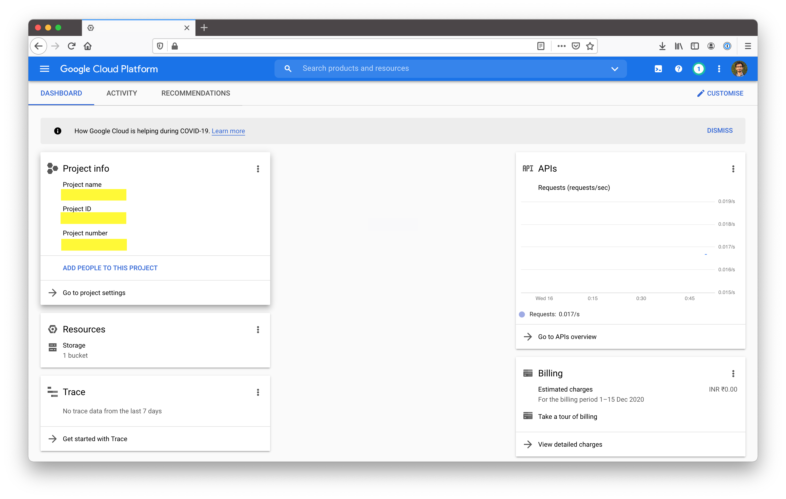
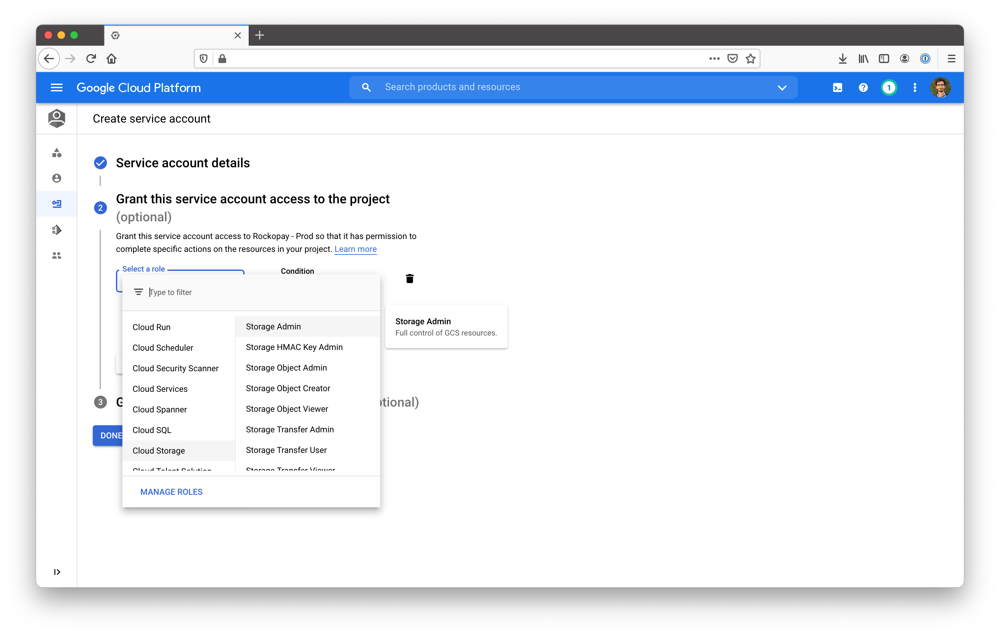
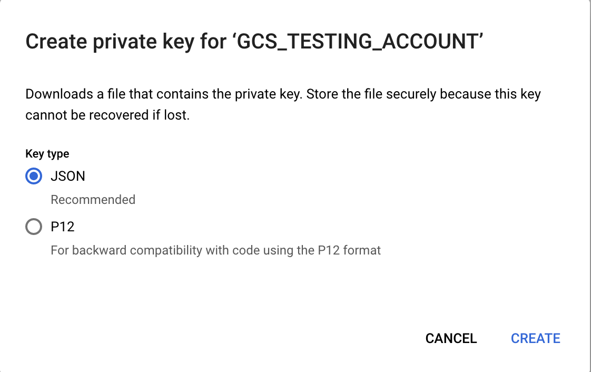

Chatwoot supports Google Cloud storage as the storage provider. To enable GCS in Chatwoot, follow the below mentioned steps.

Set google as the active storage service in the environment variables

```bash
ACTIVE_STORAGE_SERVICE='google'
```

### Get project ID variable

Login to your Google Cloud console. On your home page of your project you will be able to see the project id and project name as follows.



```bash
GCS_PROJECT=your-project-id
```

### Setup GCS Bucket

Go to Storage -> Browser. Click on "Create Bucket". You will be presented with a screen as shown below. Select the default values and continue.


Once this is done you will get the bucket name. Set this as GCS_BUCKET.

```
GCS_BUCKET=your-bucket-name
```

### Setup a service account

Go to `Identity & Services -> Identity -> Service Accounts`. Click on "Create Service Account".

Provice a name and an ID for the service account, click on create. You will be asked to "Grant this service account access to the project" Select Cloud Storage -> Storage Admin as shown below.



### Add service account to the bucket

Go to Storage -> Browser -> Your bucket -> Permissions. Click on add. On "New members" field select the service account you just created.

Select role as `Cloud Storage -> Storage Admin` and save.


### Generate a key for the service account

Go to `Identity & Services -> Identity -> Service Accounts -> Your service account`. There is a section called **Keys**. Click on **Add Key**. You will be presented with an option like the one below. Select JSON from the option.



Copy the json file content and set it as GCS_CREDENTIALS

A sample credential file is of the following format.

```json
{
  "type": "service_account",
  "project_id": "",
  "private_key_id": "",
  "private_key": "",
  "client_email": "",
  "client_id": "",
  "auth_uri": "",
  "token_uri": "",
  "auth_provider_x509_cert_url": "",
  "client_x509_cert_url": ""
}
```
