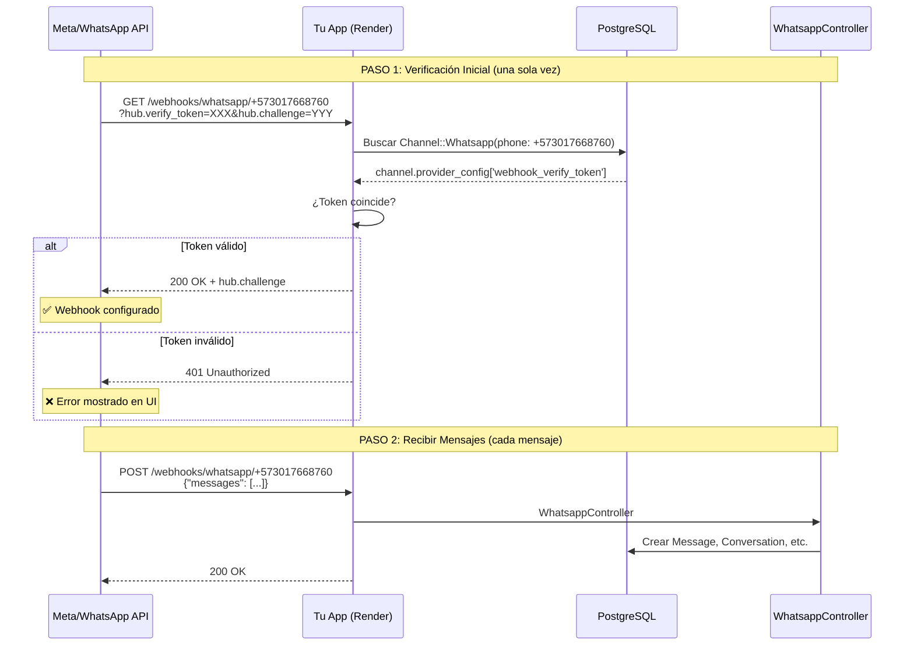

# 🔧 WhatsApp Webhook Setup & Troubleshooting Guide

**Fecha**: Octubre 2025
**Autor**: Sistema GP Bikes
**Propósito**: Guía completa para configurar y resolver problemas con webhooks de WhatsApp Business API

---

## 📋 Tabla de Contenidos

1. [¿Cómo funcionan los webhooks de WhatsApp?](#cómo-funcionan-los-webhooks-de-whatsapp)
2. [Configuración Inicial](#configuración-inicial)
3. [Problemas Comunes y Soluciones](#problemas-comunes-y-soluciones)
4. [Herramientas de Diagnóstico](#herramientas-de-diagnóstico)
5. [Verificación Manual](#verificación-manual)
6. [Checklist de Producción](#checklist-de-producción)

---

## 🎓 ¿Cómo funcionan los webhooks de WhatsApp?

### Arquitectura del Sistema



### Dos Endpoints Críticos

| Método | Endpoint | Propósito | Cuándo se usa |
|--------|----------|-----------|---------------|
| **GET** | `/webhooks/whatsapp/:phone_number` | Verificación del webhook | Una vez, al configurar en Meta |
| **POST** | `/webhooks/whatsapp/:phone_number` | Recibir mensajes entrantes | Cada vez que llega un mensaje |

---

## ⚙️ Configuración Inicial

### 1. Crear Canal WhatsApp en Chatwoot

```ruby
# En Rails console (rails c)
channel = Channel::Whatsapp.create!(
  phone_number: '+573017668760',
  provider: 'whatsapp_cloud',  # o 'default' para 360dialog
  account_id: 1,
  provider_config: {
    webhook_verify_token: SecureRandom.hex(16),  # ← Token auto-generado
    phone_number_id: 'tu_phone_number_id_de_meta',
    business_account_id: 'tu_waba_id',
    api_key: 'tu_access_token'
  }
)
```

### 2. Variables de Entorno Necesarias

**Archivo `.env.production`:**

```bash
# URL pública de tu app
FRONTEND_URL=https://chatwoot-gpbikes-production.onrender.com

# WhatsApp Business API (Meta)
WHATSAPP_PHONE_NUMBER_ID=123456789012345
WHATSAPP_ACCESS_TOKEN=EAAxxxxxxxxxxxxxxxxxxxxx
WHATSAPP_WEBHOOK_VERIFY_TOKEN=28f08d2be4f3ada8f9cc57e4310487d8  # Debe coincidir con DB
WHATSAPP_BUSINESS_ACCOUNT_ID=1234567890
```

**⚠️ IMPORTANTE**: El `WHATSAPP_WEBHOOK_VERIFY_TOKEN` en `.env` es opcional. El sistema usa el token guardado en la base de datos (`channel.provider_config['webhook_verify_token']`).

### 3. Configurar en Meta Developer Console

**Paso a Paso:**

1. **Ir a**: https://developers.facebook.com/apps
2. **Seleccionar tu app** → WhatsApp → Configuration
3. **En sección "Webhook"**, hacer clic en "Edit"
4. **Ingresar Callback URL**:
   ```
   https://chatwoot-gpbikes-production.onrender.com/webhooks/whatsapp/+573017668760
   ```
5. **Ingresar Verify Token** (copiar desde DB):
   ```bash
   # Obtener token desde Rails console:
   Channel::Whatsapp.find_by(phone_number: '+573017668760').provider_config['webhook_verify_token']
   ```
6. **Hacer clic en "Verify and Save"**
7. **Subscribir a campos webhook**:
   - ✅ `messages` (obligatorio)
   - ✅ `message_status` (opcional, para estados de entrega)

---

## 🚨 Problemas Comunes y Soluciones

### ❌ Error: "No se pudo validar la URL de devolución de llamada o el token de verificación"

**Causas posibles:**

1. **Token no coincide entre Meta y DB**

   **Solución:**
   ```bash
   # 1. Ver token actual en DB:
   rails c
   channel = Channel::Whatsapp.find_by(phone_number: '+573017668760')
   puts channel.provider_config['webhook_verify_token']
   # Copiar este token EXACTAMENTE a Meta
   ```

2. **URL de callback incorrecta**

   **Solución:**
   ```bash
   # Verificar FRONTEND_URL:
   rails c
   puts ENV['FRONTEND_URL']
   # Debe ser: https://chatwoot-gpbikes-production.onrender.com

   # URL completa debe ser:
   # https://chatwoot-gpbikes-production.onrender.com/webhooks/whatsapp/+573017668760
   ```

3. **Aplicación no está corriendo**

   **Solución:**
   - Ir a: https://dashboard.render.com/web/[tu-servicio]
   - Verificar que el estado sea "Live" (verde)
   - Revisar logs: https://dashboard.render.com/web/[tu-servicio]/logs

4. **Endpoint no responde correctamente**

   **Solución:**
   ```bash
   # Probar manualmente el endpoint GET:
   curl "https://chatwoot-gpbikes-production.onrender.com/webhooks/whatsapp/+573017668760?hub.mode=subscribe&hub.challenge=test123&hub.verify_token=TU_TOKEN_AQUI"

   # Respuesta esperada: "test123" (con status 200)
   # Si da 401: el token no coincide
   # Si da 404: el canal no existe en DB
   ```

### ❌ Error: Canal existe pero token es `nil` o vacío

**Solución:**

```bash
# Generar nuevo token:
rails c
channel = Channel::Whatsapp.find_by(phone_number: '+573017668760')
channel.provider_config['webhook_verify_token'] = SecureRandom.hex(16)
channel.save!
puts "Nuevo token: #{channel.provider_config['webhook_verify_token']}"

# Copiar este token a Meta
```

O usar el rake task:

```bash
bundle exec rake whatsapp:webhook:update_token['+573017668760']
```

### ❌ Error: "Conversation not found" al recibir mensajes

**Causa**: El canal WhatsApp no tiene un inbox asociado.

**Solución:**

```ruby
# En Rails console:
channel = Channel::Whatsapp.find_by(phone_number: '+573017668760')
account = Account.first  # o el account correcto

inbox = Inbox.create!(
  name: 'WhatsApp GP Bikes',
  account: account,
  channel: channel
)
```

### ❌ Error: SSL/HTTPS requerido

Meta requiere HTTPS para webhooks en producción.

**Solución:**
- Render proporciona SSL automático
- Verificar que `FRONTEND_URL` use `https://` (no `http://`)

---

## 🔍 Herramientas de Diagnóstico

### 1. **Rake Task de Debug** (Recomendado)

```bash
# Ejecutar diagnóstico completo:
bundle exec rake whatsapp:webhook:debug

# Salida esperada:
# ✅ Found 1 WhatsApp channel(s)
# ✅ Token validation: PASSED
# ✅ All checks passed!
```

**Qué hace este comando:**
- Verifica canales WhatsApp en DB
- Valida configuración de `provider_config`
- Simula la verificación de Meta
- Muestra URLs y tokens
- Proporciona diagnóstico detallado

### 2. **Test de Endpoint Manual**

```bash
# Probar endpoint desde línea de comandos:
bundle exec rake whatsapp:webhook:test_endpoint['+573017668760','tu_token']
```

### 3. **Ver Configuración Actual**

```bash
# Mostrar config de todos los canales:
bundle exec rake whatsapp:webhook:show_config
```

### 4. **Logs en Tiempo Real**

**En desarrollo (local):**
```bash
tail -f log/development.log | grep -i whatsapp
```

**En producción (Render):**
1. Ir a: https://dashboard.render.com
2. Seleccionar tu servicio
3. Pestaña "Logs"
4. Filtrar por "whatsapp" o "webhook"

---

## ✅ Verificación Manual Paso a Paso

### Opción 1: Usando cURL

```bash
# 1. Obtener token de DB
PHONE="+573017668760"
TOKEN="28f08d2be4f3ada8f9cc57e4310487d8"  # Reemplazar con token real

# 2. Hacer GET request (simula Meta)
curl -v "https://chatwoot-gpbikes-production.onrender.com/webhooks/whatsapp/${PHONE}?hub.mode=subscribe&hub.challenge=test_challenge&hub.verify_token=${TOKEN}"

# 3. Respuesta esperada:
# HTTP/1.1 200 OK
# "test_challenge"
```

### Opción 2: Usando Postman

1. **Crear GET request**:
   ```
   URL: https://chatwoot-gpbikes-production.onrender.com/webhooks/whatsapp/+573017668760
   ```

2. **Agregar Query Params**:
   | Key | Value |
   |-----|-------|
   | hub.mode | subscribe |
   | hub.challenge | test_123 |
   | hub.verify_token | [tu_token_aqui] |

3. **Enviar request**

4. **Verificar respuesta**:
   - Status: `200 OK`
   - Body: `"test_123"`

### Opción 3: Usando el Script Bash

```bash
# Usar script incluido:
./scripts/test_whatsapp_webhook.sh +573017668760 28f08d2be4f3ada8f9cc57e4310487d8
```

---

## 📊 Checklist de Producción

### Antes de Configurar en Meta

- [ ] Canal WhatsApp creado en DB: `Channel::Whatsapp.find_by(phone_number: '...')`
- [ ] `webhook_verify_token` generado y guardado en `provider_config`
- [ ] `phone_number_id` configurado en `provider_config`
- [ ] `business_account_id` configurado en `provider_config`
- [ ] `api_key` (access_token) configurado en `provider_config`
- [ ] Inbox asociado al canal creado
- [ ] Variable `FRONTEND_URL` configurada con HTTPS
- [ ] Aplicación desplegada y corriendo en Render
- [ ] Endpoint GET accesible: `curl [callback_url]?hub.verify_token=...`

### Durante Configuración en Meta

- [ ] Callback URL ingresada correctamente (sin espacios, con HTTPS)
- [ ] Verify Token copiado EXACTAMENTE desde DB (sin espacios extra)
- [ ] Botón "Verify and Save" presionado
- [ ] Ver confirmación "✓ Webhook configured successfully"
- [ ] Webhook fields suscritos: `messages`, `message_status`

### Después de Configurar

- [ ] Enviar mensaje de prueba al número WhatsApp
- [ ] Verificar que mensaje aparece en Chatwoot inbox
- [ ] Verificar logs de Render: debe aparecer `POST /webhooks/whatsapp/...`
- [ ] Probar respuesta automática (si AI Workers están activos)
- [ ] Verificar que conversación se crea correctamente

---

## 🐛 Debugging Avanzado

### Ver Request Raw de Meta

**Agregar logging temporal en el controller:**

```ruby
# app/controllers/webhooks/whatsapp_controller.rb (TEMPORAL - solo debug)

def verify
  Rails.logger.info "=== WEBHOOK VERIFY REQUEST ==="
  Rails.logger.info "Params: #{params.inspect}"
  Rails.logger.info "Phone: #{params[:phone_number]}"
  Rails.logger.info "Hub Mode: #{params['hub.mode']}"
  Rails.logger.info "Hub Challenge: #{params['hub.challenge']}"
  Rails.logger.info "Hub Token: #{params['hub.verify_token']}"

  # Buscar canal
  channel = Channel::Whatsapp.find_by(phone_number: params[:phone_number])
  Rails.logger.info "Channel found: #{channel.present?}"

  if channel
    stored_token = channel.provider_config['webhook_verify_token']
    Rails.logger.info "Stored token: #{stored_token}"
    Rails.logger.info "Received token: #{params['hub.verify_token']}"
    Rails.logger.info "Tokens match: #{stored_token == params['hub.verify_token']}"
  end

  # Llamar método original
  super
end
```

**⚠️ IMPORTANTE**: Remover estos logs después de debuggear (pueden mostrar info sensible).

### Verificar Flujo Completo

```ruby
# En Rails console (producción):

# 1. Verificar canal
channel = Channel::Whatsapp.find_by(phone_number: '+573017668760')
puts "Canal: #{channel.inspect}"

# 2. Verificar inbox
inbox = channel.inbox
puts "Inbox: #{inbox.inspect}"

# 3. Verificar account
account = inbox.account
puts "Account: #{account.inspect}"

# 4. Simular verificación
controller = Webhooks::WhatsappController.new
params = ActionController::Parameters.new({
  'hub.verify_token' => channel.provider_config['webhook_verify_token'],
  'phone_number' => channel.phone_number
})
controller.params = params
result = controller.send(:valid_token?, params['hub.verify_token'])
puts "Token válido: #{result}"
```

---

## 📝 Notas Importantes

### Diferencias entre Providers

**`whatsapp_cloud` (Meta Cloud API)**:
- Requiere `webhook_verify_token` en `provider_config`
- Token se genera automáticamente con `SecureRandom.hex(16)`
- Verificación vía método `valid_token?` en controller

**`default` (360dialog)**:
- Puede tener diferentes requisitos de token
- Verificar documentación de 360dialog

### Seguridad del Token

- El `webhook_verify_token` NO es el mismo que el `access_token`
- El token de verificación puede ser cualquier string aleatorio
- Se recomienda usar tokens largos (32 caracteres) para seguridad
- NUNCA commitear tokens al repositorio Git
- Usar variables de entorno o configuración en DB

### Múltiples Números WhatsApp

Si tienes varios números WhatsApp:
- Cada número tiene su propio `webhook_verify_token`
- Cada número necesita configuración separada en Meta
- Usar el mismo callback URL pattern: `/webhooks/whatsapp/:phone_number`

---

## 🆘 Obtener Ayuda

### Canales de Soporte

1. **Documentación Chatwoot**: https://www.chatwoot.com/docs/product/channels/whatsapp/
2. **Meta Developers**: https://developers.facebook.com/docs/whatsapp/
3. **Logs de Render**: https://dashboard.render.com
4. **Stack Overflow**: Tag `chatwoot` + `whatsapp-business-api`

### Información a Incluir al Reportar Problemas

```
- Phone number: +573017668760
- Provider: whatsapp_cloud
- Callback URL: [tu_url]
- Error exacto de Meta: [screenshot]
- Logs de Rails: [últimas 50 líneas con grep whatsapp]
- Output de: bundle exec rake whatsapp:webhook:debug
```

---

## 🎉 ¡Webhook Configurado Exitosamente!

**Señales de éxito:**

✅ Meta muestra "✓ Webhook configured successfully"
✅ Mensajes de prueba aparecen en Chatwoot inbox
✅ Logs muestran `POST /webhooks/whatsapp/... 200 OK`
✅ Conversaciones se crean automáticamente
✅ AI Workers responden (si están activos)

**Próximos pasos:**

1. Configurar AI Workers (si no están activos)
2. Personalizar mensajes automáticos
3. Configurar automation rules
4. Entrenar equipo en uso de Chatwoot

---

**Última actualización**: Octubre 2025
**Versión**: 1.0
**Mantenedor**: Equipo GP Bikes
