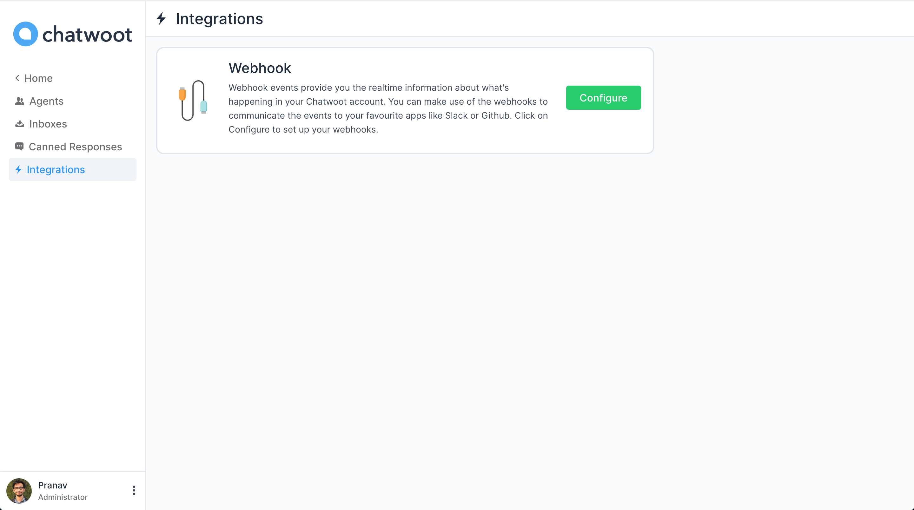
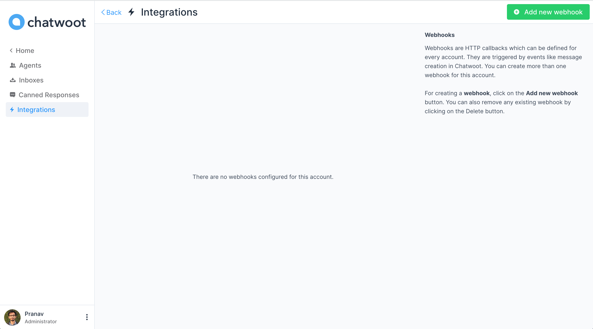

Webhooks are HTTP callbacks which can be defined for every account. They are triggered by events like message creation in Chatwoot. You can create more than one webhook for an account. Currently webhooks support only `message_created` event

**Step 1**. Click on Integrations link is settings sidebar. Click on "Configure" button.



**Step 2**. You will see the list of webhooks you have already added to the account.



**Step 3**. Click on the "Add new webhook", it will display a modal where you can input the URL to which the POST request should be sent.


Chatwoot currently supports webhooks for message creation only. Once a new message is created in the any of the inboxes of the account, it will send a POST request with the following payload to the configured URLs.

### A sample webhook payload

```json
{

  "event": "message_created", // The name of the event
  "id": "1", // Message ID
  "content": "Hi", // Content of the message
  "created_at": "2020-03-03 13:05:57 UTC", // Time at which the message was sent
  "message_type": "incoming", // This will have a type incoming, outgoing or template. Incoming messages are sent by the user from the widget, Outgoing messages are sent by the agent to the user.
  "content_type": "enum", // This is an enum, it can be input_select, cards, form or text. The message_type will be template if content_type is one og these. Default value is text
  "content_attributes": {} // This will an object, different values are defined below
  "source_id": "", // This would the external id if the inbox is a Twitter or Facebook integration.
  "sender": { // This would provide the details of the agent who sent this message
    "id": "1",
    "name": "Agent",
    "email": "agent@example.com"
  },
  "contact": { // This would provide the details of the user who sent this message
    "id": "1",
    "name": "contact-name"
  },
  "conversation": { // This would provide the details of the conversation
    "display_id": "1", // This is the ID of the conversation which you can see in the dashboard.
    "additional_attributes": {
      "browser": {
        "device_name": "Macbook",
        "browser_name": "Chrome",
        "platform_name": "Macintosh",
        "browser_version": "80.0.3987.122",
        "platform_version": "10.15.2"
      },
      "referer": "http://www.chatwoot.com",
      "initiated_at": "Tue Mar 03 2020 18:37:38 GMT-0700 (Mountain Standard Time)"
    }
  },
  "account": { // This would provide the details of the account
    "id": "1",
    "name": "Chatwoot",
  }
}
```

### Content Attributes

#### 1. Options

```json
{
  "items": [
    {
      "title": "Option 1",
      "value": "option_1"
    },
    {
      "title": "Option 2",
      "value": "option_2"
    }
  ],
  "submitted_values": [
    {
      "title": "Option 1",
      "value": "option_1"
    }
  ]
}
```

#### 2. Form

```json
{
  "items": [
    {
      "type": "text/text_area/email",
      "placeholder": "Placeholder",
      "name": "unique_name_of_the_field",
      "label": "Label"
    },
  ],
  "submitted_values": [
    {
      "name": "unique_name_of_the_field 1",
      "value": "sample_value"
    }
  ]
}
```

#### 3. Cards

```json
{
  "items": [
    {
      "media_url": "", // Url of the image to be displayed
      "title": "", // Title of the card
      "description": "", // Description of the card
      "actions": [
        {
          "type": "link",
          "text": "View More",
          "uri": "" // Link to the website
        }
      ]
    },
  ],
}
```
