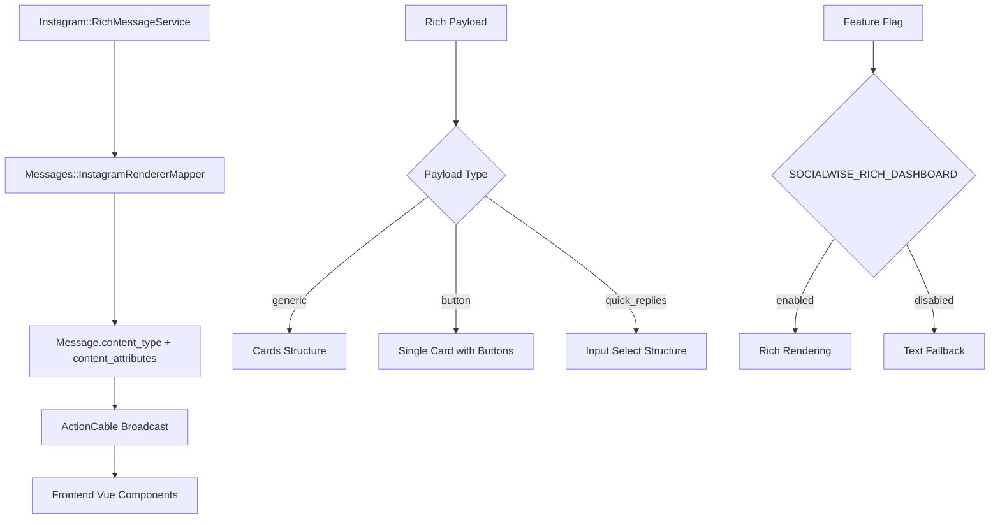
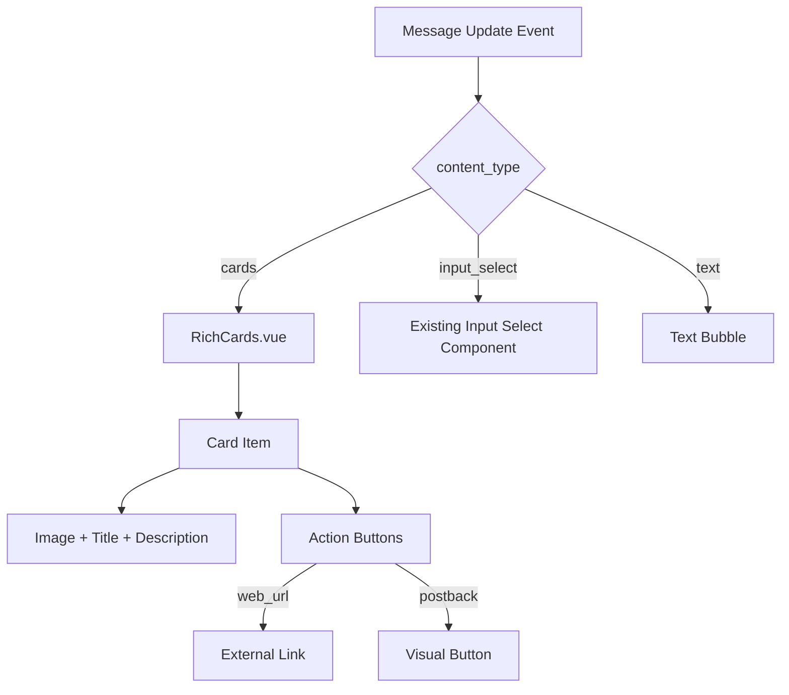

# Design Document

## Overview

Esta funcionalidade implementa a renderização rica de mensagens do Instagram no dashboard do Chatwoot, espelhando visualmente o que é enviado através do `Instagram::RichMessageService`. O sistema converte payloads ricos (Generic Template, Button Template, Quick Replies) em estruturas nativas do Chatwoot (`content_type` e `content_attributes`) e renderiza componentes Vue correspondentes no frontend.

A solução mantém compatibilidade total com o fluxo existente, não requer mudanças de schema e permite rollback simples através de feature flag.

## Architecture

### Backend Architecture



### Frontend Architecture



## Components and Interfaces

### 1. Messages::InstagramRendererMapper

**Responsabilidade:** Converter payloads ricos do Instagram para estruturas nativas do Chatwoot.

```ruby
class Messages::InstagramRendererMapper
  MAX_CARDS = 10
  MAX_BTNS = 3
  MAX_PAYLOAD_SIZE = 25.kilobytes
  TITLE_LIMIT = 120
  DESCRIPTION_LIMIT = 200
  
  Mapped = Struct.new(:content_type, :content_attributes, :fallback_text)
  
  def self.map(rich_payload)
    # Validar tamanho do payload
    return default_text_mapping(rich_payload) if payload_too_large?(rich_payload)
    
    # Cache baseado no hash do payload
    cache_key = Digest::MD5.hexdigest(rich_payload.to_json)
    Rails.cache.fetch("instagram_mapper:#{cache_key}", expires_in: 1.hour) do
      map_payload(rich_payload)
    end
  end
  
  private
  
  def self.map_payload(rich_payload)
    case rich_payload['template_type']
    when 'generic'
      to_cards_from_generic(rich_payload)
    when 'button'
      to_cards_from_button(rich_payload)
    else
      if rich_payload['quick_replies'].is_a?(Array)
        to_input_select_from_quick_replies(rich_payload)
      else
        # Default para tipos desconhecidos
        default_text_mapping(rich_payload)
      end
    end
  end
  
  def self.to_cards_from_generic(payload)
    items = Array(payload['elements']).first(MAX_CARDS).map do |el|
      {
        'media_url' => safe_url(el['image_url']),
        'title' => el['title'].to_s.strip.truncate(TITLE_LIMIT).presence,
        'description' => el['subtitle'].to_s.strip.truncate(DESCRIPTION_LIMIT).presence,
        'actions' => map_buttons(el['buttons'])
      }.compact
    end
    
    first = items.first || {}
    fallback = [first['title'], first['description']].compact.join(' — ')
    
    Mapped.new('cards', { 'items' => items }, fallback)
  end
  
  def self.payload_too_large?(payload)
    payload.to_json.bytesize > MAX_PAYLOAD_SIZE
  end
  
  def self.default_text_mapping(payload)
    text = payload['text'].to_s.presence || 'Mensagem rica'
    Mapped.new('text', {}, text)
  end
end
```

**Interface de Entrada:**
```ruby
{
  'template_type' => 'generic|button',
  'elements' => [...],  # para generic
  'text' => '...',      # para button/quick_replies
  'buttons' => [...],   # para button
  'quick_replies' => [...] # para quick_replies
}
```

**Interface de Saída:**
```ruby
Mapped.new(
  :cards,  # content_type
  {        # content_attributes
    'items' => [
      {
        'media_url' => 'https://...',
        'title' => 'Título',
        'description' => 'Descrição',
        'actions' => [
          { 'type' => 'link', 'text' => 'Abrir', 'uri' => 'https://...' },
          { 'type' => 'postback', 'text' => 'Clique', 'payload' => 'PAYLOAD' }
        ]
      }
    ]
  },
  'Texto de fallback'  # fallback_text
)
```

### 2. Instagram::RichMessageService (Modificado)

**Modificação:** Adicionar método `mirror_rich_payload_to_dashboard` antes do envio.

```ruby
def perform
  validate_target_channel
  return unless outgoing_message?
  return if invalid_message?
  
  # NOVO: Espelhar payload para dashboard
  mirror_rich_payload_to_dashboard
  
  perform_reply
end

private

def mirror_rich_payload_to_dashboard
  mapped = Messages::InstagramRendererMapper.map(rich_payload)
  
  attrs = (message.content_attributes || {}).merge(mapped.content_attributes)
  
  # Use update_columns para evitar callbacks desnecessários
  message.update_columns(
    content_type: Message.content_types[mapped.content_type], # Garantir que seja inteiro do enum
    content: mapped.fallback_text.presence || message.content,
    content_attributes: attrs,
    updated_at: Time.current
  )
  
  message.send_update_event
  
  Rails.logger.info "[SOCIALWISE-INSTAGRAM-RICH] Mirrored #{mapped.content_type} with #{attrs.dig('items')&.length || 0} items"
rescue => e
  Rails.logger.error "[SOCIALWISE-INSTAGRAM-RICH] Mirror failed: #{e.class}: #{e.message}"
end
```

### 3. RichCards.vue (Novo Componente)

**Responsabilidade:** Renderizar cards com imagens, títulos, descrições e botões.

```vue
<template>
  <div class="rich-cards-container">
    <div 
      v-for="(item, index) in items" 
      :key="index"
      class="rich-card"
      role="group"
      :aria-label="item.title"
    >
      <div v-if="item.media_url" class="card-image">
        
      </div>
      
      <div class="card-content">
        <h3 v-if="item.title" class="card-title">
          {{ item.title }}
        </h3>
        <p v-if="item.description" class="card-description">
          {{ item.description }}
        </p>
        
        <div v-if="item.actions && item.actions.length" class="card-actions">
          <template v-for="(action, actionIndex) in item.actions" :key="actionIndex">
            <a 
              v-if="action.type === 'link'"
              :href="action.uri"
              target="_blank"
              rel="noopener noreferrer"
              class="card-button card-button--link"
            >
              {{ action.text }}
            </a>
            <button
              v-else-if="action.type === 'postback'"
              class="card-button card-button--postback"
              @click="handlePostback(action)"
            >
              {{ action.text }}
            </button>
          </template>
        </div>
      </div>
    </div>
  </div>
</template>

<script>
export default {
  name: 'RichCards',
  props: {
    items: {
      type: Array,
      required: true,
      default: () => []
    }
  },
  methods: {
    handleImageError(event) {
      event.target.style.display = 'none';
      this.trackMetric('cw_rich_cards_render_total', { error: 'true', type: 'image_error' });
    },
    handlePostback(action) {
      this.$emit('postback', action.payload);
      this.trackMetric('cw_rich_cards_render_total', { error: 'false', type: 'postback_click' });
    },
    escapeHtml(text) {
      const div = document.createElement('div');
      div.textContent = text;
      return div.innerHTML;
    },
    trackMetric(name, labels) {
      // Implementar tracking de métricas
      if (window.analytics) {
        window.analytics.track(name, labels);
      }
    }
  },
  mounted() {
    this.trackMetric('cw_rich_cards_render_total', { error: 'false', type: 'render_success' });
  },
  errorCaptured(err, instance, info) {
    console.error('RichCards error:', err);
    this.trackMetric('cw_rich_cards_render_total', { error: 'true', type: 'component_error' });
    this.$emit('fallback-to-text');
    return false;
  }
}
</script>
```

### 4. Message Bubble Integration

**Modificação:** Integrar RichCards no componente de mensagem existente.

```vue
<!-- Em AgentMessageBubble.vue ou componente similar -->
<template>
  <div class="message-bubble">
    <!-- Renderização rica baseada em content_type -->
    <RichCards 
      v-if="isCards && isRichDashboardEnabled"
      :items="messageContentAttributes.items"
      @postback="handlePostback"
      @fallback-to-text="showTextFallback = true"
    />
    
    <!-- Quick Replies como input select -->
    <QuickRepliesWrapper
      v-else-if="isQuickReplies && isRichDashboardEnabled"
      :items="messageContentAttributes.items"
    />
    
    <!-- Fallback para texto simples -->
    <div v-else class="message-text">
      {{ messageContent }}
    </div>
  </div>
</template>

<script>
import RichCards from './RichCards.vue';
import QuickRepliesWrapper from './QuickRepliesWrapper.vue';

export default {
  components: {
    RichCards,
    QuickRepliesWrapper
  },
  data() {
    return {
      showTextFallback: false
    };
  },
  computed: {
    isCards() {
      return !this.showTextFallback &&
             this.message.content_type === 'cards' && 
             this.messageContentAttributes.items?.length > 0;
    },
    isQuickReplies() {
      return !this.showTextFallback &&
             this.message.content_type === 'input_select' &&
             this.messageContentAttributes.items?.length > 0;
    },
    isRichDashboardEnabled() {
      // Ler da configuração global ou feature flag
      return this.$store.getters.getGlobalConfig?.SOCIALWISE_RICH_DASHBOARD || false;
    },
    messageContentAttributes() {
      return this.message.content_attributes || {};
    }
  },
  methods: {
    handlePostback(payload) {
      // Emitir evento para nível da conversa
      this.$emit('postback-received', {
        messageId: this.message.id,
        payload: payload,
        timestamp: new Date().toISOString()
      });
    }
  }
}
</script>
```

## Data Models

### Message Model (Existente - Sem Modificações)

O modelo `Message` já possui os campos necessários:
- `content_type`: Enum que suporta `:cards`, `:input_select`, etc.
- `content_attributes`: JSONB para dados estruturados
- `content`: Texto de fallback

### Content Attributes Structure

**Para Cards (Generic/Button Templates):**
```json
{
  "items": [
    {
      "media_url": "https://example.com/image.jpg",
      "title": "Título do Card",
      "description": "Descrição do card",
      "actions": [
        {
          "type": "link",
          "text": "Abrir Link",
          "uri": "https://example.com"
        },
        {
          "type": "postback", 
          "text": "Clique Aqui",
          "payload": "BUTTON_PAYLOAD"
        }
      ]
    }
  ]
}
```

**Para Input Select (Quick Replies):**
```json
{
  "items": [
    {
      "title": "Opção 1",
      "value": "OPTION_1_PAYLOAD"
    },
    {
      "title": "Opção 2", 
      "value": "OPTION_2_PAYLOAD"
    }
  ]
}
```

## Error Handling

### Backend Error Handling

1. **Mapper Errors:**
   - Payload inválido → Log error + fallback para texto
   - URL inválida → Sanitizar + continuar processamento
   - Limites excedidos → Truncar + log warning

2. **Service Errors:**
   - Falha no espelhamento → Log error + continuar envio normal
   - Falha na atualização da mensagem → Log error + não bloquear envio

```ruby
def mirror_rich_payload_to_dashboard
  mapped = Messages::InstagramRendererMapper.map(rich_payload)
  # ... processamento ...
rescue => e
  Rails.logger.error "[SOCIALWISE-INSTAGRAM-RICH] Mirror failed: #{e.class}: #{e.message}"
  # Não re-raise - continua com envio normal
end
```

### Frontend Error Handling

1. **Component Errors:**
   - Imagem não carrega → Ocultar imagem + mostrar conteúdo
   - Dados inválidos → Fallback para texto simples
   - Feature flag desabilitada → Renderização de texto

```vue
<script>
export default {
  errorCaptured(err, instance, info) {
    console.error('RichCards error:', err);
    // Fallback para texto simples
    this.$emit('fallback-to-text');
    return false;
  }
}
</script>
```

## Testing Strategy

### Backend Tests

1. **Unit Tests - Messages::InstagramRendererMapper:**
   - Conversão de Generic Template para cards
   - Conversão de Button Template para card único
   - Conversão de Quick Replies para input_select
   - Sanitização de URLs
   - Limites de cards e botões
   - Fallback para payloads inválidos
   - Cache de resultados baseado em hash
   - Truncamento de títulos e descrições
   - Validação de tamanho de payload

2. **Integration Tests - Instagram::RichMessageService:**
   - Espelhamento de payload antes do envio
   - Atualização correta de content_type e content_attributes
   - Broadcast de evento de atualização
   - Comportamento com feature flag desabilitada
   - Uso de update_columns vs save!
   - Skip_send_reply aplicado na criação da mensagem

3. **Request Tests:**
   - Serialização JSON inclui content_type como string
   - Estrutura correta dos dados para frontend
   - Confirmação que jbuilder exporta content_type corretamente

### Frontend Tests

1. **Component Tests - RichCards.vue:**
   - Renderização de cards com imagens
   - Renderização de cards sem imagens
   - Renderização de botões de link e postback
   - Tratamento de erro de imagem
   - Comportamento com dados inválidos
   - Acessibilidade (role, aria-label)
   - Lazy loading de imagens
   - Tracking de métricas

2. **Storybook Stories:**
   - RichCards / Generic Template (3 cards)
   - RichCards / Button Template
   - RichCards / Error states
   - QuickRepliesWrapper / Multiple options

3. **Integration Tests:**
   - Integração com message bubble
   - Feature flag habilitada/desabilitada
   - Fallback para texto simples
   - Evento de postback emitido corretamente

4. **E2E Tests (Cypress):**
   - Cenário "flag off" → renderização de texto
   - Cenário "flag on" → renderização de card
   - Clique em postback dispara evento
   - Clique em link abre nova aba

### Test Data Examples

```ruby
# spec/fixtures/instagram_rich_payloads.rb
GENERIC_TEMPLATE_PAYLOAD = {
  'template_type' => 'generic',
  'elements' => [
    {
      'title' => 'Produto 1',
      'subtitle' => 'Descrição do produto',
      'image_url' => 'https://example.com/image1.jpg',
      'buttons' => [
        {
          'type' => 'web_url',
          'title' => 'Ver Mais',
          'url' => 'https://example.com/produto1'
        },
        {
          'type' => 'postback',
          'title' => 'Comprar',
          'payload' => 'BUY_PRODUCT_1'
        }
      ]
    }
  ]
}.freeze

BUTTON_TEMPLATE_PAYLOAD = {
  'template_type' => 'button',
  'text' => 'Escolha uma opção:',
  'buttons' => [
    {
      'type' => 'postback',
      'title' => 'Sim',
      'payload' => 'YES'
    },
    {
      'type' => 'postback',
      'title' => 'Não',
      'payload' => 'NO'
    }
  ]
}.freeze
```

## Security Considerations

### URL Sanitization

```ruby
def self.safe_url(url)
  return if url.blank?
  
  uri = URI.parse(url) rescue nil
  return unless uri&.is_a?(URI::HTTP) || uri&.is_a?(URI::HTTPS)
  
  uri.to_s
end
```

### Content Sanitization

- **Títulos e descrições:** Escape HTML, limite de caracteres
- **URLs:** Validação de protocolo (HTTP/HTTPS apenas)
- **Payloads:** Sanitização de caracteres especiais

### Frontend Security

- **Sem v-html:** Apenas text nodes para prevenir XSS
- **Links externos:** `target="_blank"` + `rel="noopener noreferrer"`
- **Validação de dados:** Verificação de estrutura antes da renderização

## Performance Considerations

### Backend Performance

- **Mapper caching:** Cache Redis baseado em hash MD5 do payload (1 hora TTL)
- **Payload size limit:** Máximo 25KB para prevenir DoS
- **update_columns:** Evitar callbacks desnecessários na atualização
- **Lazy loading:** Processamento apenas quando necessário
- **Log optimization:** Truncar logs grandes, evitar payload.inspect

### Frontend Performance

- **Component lazy loading:** Carregar RichCards apenas quando necessário
- **Image lazy loading:** `loading="lazy"` + `decoding="async"`
- **Virtual scrolling:** Para conversas com muitas mensagens ricas
- **Metrics tracking:** Monitorar `cw_rich_cards_render_total` com labels de erro

### Observabilidade

```ruby
# Métricas backend
Rails.logger.info "[SOCIALWISE-INSTAGRAM-RICH] Mirrored #{mapped.content_type} with #{attrs.dig('items')&.length || 0} items"

# Métricas frontend
this.trackMetric('cw_rich_cards_render_total', { 
  error: 'false', 
  type: 'render_success',
  cards_count: this.items.length 
});
```

## Feature Flag Implementation

### Backend Configuration

```ruby
# config/features.yml
SOCIALWISE_RICH_DASHBOARD:
  enabled: false
  description: "Enable rich message rendering in dashboard"
```

### Frontend Usage

```javascript
// store/modules/globalConfig.js
const isRichDashboardEnabled = () => {
  return store.getters.getGlobalConfig.SOCIALWISE_RICH_DASHBOARD;
};
```

### Rollback Strategy

1. **Immediate rollback:** Desabilitar feature flag
2. **Gradual rollback:** Rollback por conta/inbox
3. **Data integrity:** Fallback text sempre disponível
4. **No schema changes:** Sem impacto em rollback de código
##
# 5. QuickRepliesWrapper.vue (Novo Componente)

**Responsabilidade:** Wrapper para renderizar Quick Replies como opções visuais.

```vue
<template>
  <div class="quick-replies-wrapper">
    <div class="quick-replies-list">
      <div 
        v-for="(item, index) in items" 
        :key="index"
        class="quick-reply-option"
      >
        <span class="quick-reply-title">{{ item.title }}</span>
        <span class="quick-reply-value">{{ item.value }}</span>
      </div>
    </div>
  </div>
</template>

<script>
export default {
  name: 'QuickRepliesWrapper',
  props: {
    items: {
      type: Array,
      required: true,
      default: () => []
    }
  }
}
</script>
```

## Additional Implementation Notes

### Serializer Considerations

**Importante:** Confirmar que o jbuilder/serializer exporta `content_type` como string ('cards') e não como inteiro do enum. O dashboard espera string; se vier como inteiro (ex: 5), quebra a renderização.

```ruby
# Em message_serializer.rb ou similar
json.content_type message.content_type # String, não inteiro
json.content_attributes message.content_attributes
```

### Skip Send Reply Flag

A flag `skip_send_reply: true` deve ser aplicada **na criação da mensagem**, antes do `after_create_commit`. Se aplicada depois, o `SendReplyJob` já terá sido enfileirado.

```ruby
# Correto - na criação
conversation.messages.create!(
  content: fallback_text,
  message_type: :outgoing,
  additional_attributes: { skip_send_reply: true }
)

# Incorreto - depois da criação
message = conversation.messages.create!(...)
message.additional_attributes['skip_send_reply'] = true # Muito tarde
```

### Feature Flag Integration

**Backend:** Usar configuração global existente
```ruby
def rich_dashboard_enabled?
  GlobalConfig.get('SOCIALWISE_RICH_DASHBOARD')['SOCIALWISE_RICH_DASHBOARD']
end
```

**Frontend:** Injetar via build process ou endpoint
```javascript
// Via definePlugin no build
const isRichDashboardEnabled = process.env.SOCIALWISE_RICH_DASHBOARD;

// Via API endpoint
const config = await this.$http.get('/api/v1/accounts/:id/global_config');
const isEnabled = config.data.SOCIALWISE_RICH_DASHBOARD;
```