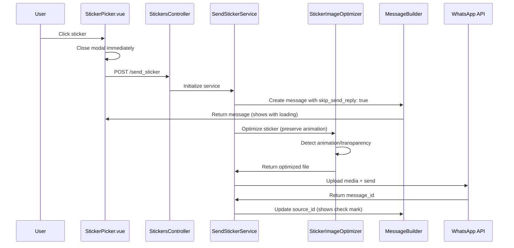

# Design Document

## Overview

Este documento detalha o design técnico para melhorar o sistema de figurinhas do Chatwoot, focando em dois problemas principais: (1) preservação de animação e transparência durante otimização, e (2) implementação de fluxo de envio imediato seguindo padrões nativos do Chatwoot.

A solução envolve modificações no `StickerImageOptimizerService`, melhorias no fluxo frontend-backend, e implementação de feedback visual imediato usando o padrão MessageBuilder existente.

## Architecture

### Current Flow vs Improved Flow

**Current Flow (Problemático):**

```
User clicks sticker → API call → Wait for response → Show in chat
```

**Improved Flow (Padrão Nativo Chatwoot):**

```
User clicks sticker → Create message immediately (status: sent) → Show with loading → Update to delivered/read
```

**Status Flow usando Enums Nativos:**

- `sent` - Mensagem criada imediatamente (mostra relógio)
- `delivered` - WhatsApp confirmou recebimento (mostra check simples)
- `read` - Destinatário visualizou (mostra check duplo)
- `failed` - Erro no envio (mostra ícone de erro)

### Component Interaction Diagram



## Components and Interfaces

### 1. StickerImageOptimizerService Enhancements

**New Methods:**

```ruby
class StickerImageOptimizerService
  # Detect if image is animated
  def animated?(image)
    image.frames.count > 1
  rescue
    false
  end

  # Detect if image has transparency
  def has_transparency?(image)
    image.alpha?
  rescue
    false
  end

  # Optimize preserving animation and transparency
  def optimize_with_preservation(image, is_animated, has_transparency)
    # Implementation details in tasks
  end
end
```

**Configuration Updates:**

- Animated stickers: Max 500KB (WhatsApp limit)
- Static stickers: Max 100KB (WhatsApp limit)
- Preserve WebP animation when detected
- Maintain alpha channel for transparency

### 2. Frontend Flow Improvements

**StickerPicker.vue Changes:**

```javascript
async selectSticker(sticker) {
  // Close modal immediately (UX improvement)
  this.closeModal();

  // Show optimistic message
  this.$emit('stickerSelected', sticker);

  try {
    const response = await this.sendStickerAPI(sticker);
    // Success handled by backend message update
  } catch (error) {
    // Error handling with user feedback
    this.handleSendError(error);
  }
}
```

### 3. Backend Message Flow

**SendStickerService Pattern (Usando Padrões Nativos):**

```ruby
def perform
  # 1. Create message immediately using MessageBuilder (padrão Chatwoot)
  message = create_sticker_message # status: 'sent' por padrão

  # 2. Process sticker preserving animation/transparency
  media_id = fetch_or_upload_media_with_preservation

  # 3. Send to WhatsApp API
  response = send_to_whatsapp(media_id)

  # 4. Update message status using enums nativos
  if response[:success]
    message.update!(
      source_id: response[:message_id], # Para status tracking
      status: 'delivered' # Enum nativo: mostra check
    )
  else
    message.update!(status: 'failed') # Enum nativo: mostra erro
  end
end
```

## Data Models

### Message Content Structure (Usando Padrões Nativos)

```ruby
# Message attributes for sticker usando enums existentes
{
  content: "Sticker: #{sticker_data[:alt]}",
  content_type: 'sticker', # Enum existente: sticker = 11
  status: 'sent', # Enum nativo: sent = 0 (inicial, mostra loading)
  message_type: 'outgoing', # Enum nativo: outgoing = 1
  content_attributes: {
    sticker_data: {
      id: sticker.id,
      url: sticker.url,
      alt: sticker.alt,
      provider: sticker.provider,
      is_animated: boolean,
      has_transparency: boolean
    }
  },
  additional_attributes: {
    skip_send_reply: true, # CRITICAL: Prevents duplicate sending (padrão Chatwoot)
  }
}

# Após sucesso no WhatsApp API:
message.update!(
  source_id: whatsapp_message_id, # Para tracking de status
  status: 'delivered' # Enum nativo: delivered = 1 (mostra check)
)
```

### Cache Structure

```ruby
# Redis cache keys (using existing patterns)
WHATSAPP_MEDIA_CACHE = "whatsapp:media:channel:%{channel_id}:url:%{url_hash}"
STICKER_OPTIMIZATION_CACHE = "sticker:optimized:%{url_hash}:%{settings_hash}"
```

## Error Handling

### Error Classification

1. **Validation Errors** - Invalid sticker data, unsupported format
2. **Processing Errors** - Optimization failures, file corruption
3. **Network Errors** - WhatsApp API failures, timeout issues
4. **System Errors** - Cache failures, storage issues

### Error Recovery Strategy

```ruby
# Retry pattern for media upload
def upload_with_retry(media_data, max_attempts: 3)
  attempts = 0

  begin
    attempts += 1
    upload_media_to_whatsapp(media_data)
  rescue WhatsAppApiError => e
    if attempts < max_attempts && retryable_error?(e)
      sleep(2 ** attempts) # Exponential backoff
      retry
    else
      raise
    end
  end
end
```

### Frontend Error Handling

```javascript
// Error states in StickerPicker
const errorStates = {
  NETWORK_ERROR: 'Check your connection and try again',
  WHATSAPP_RATE_LIMIT: 'Too many messages. Please wait.',
  INVALID_STICKER: 'This sticker format is not supported',
  UPLOAD_FAILED: 'Failed to upload sticker. Try again.',
};
```

## Testing Strategy

### Unit Tests

1. **StickerImageOptimizerService**

   - Test animation detection
   - Test transparency preservation
   - Test size optimization within limits
   - Test error handling for corrupted files

2. **SendStickerService**
   - Test immediate message creation
   - Test status updates
   - Test error scenarios
   - Test cache behavior

### Integration Tests

1. **End-to-End Sticker Flow**

   - Test complete flow from selection to delivery
   - Test animated sticker preservation
   - Test transparent sticker handling
   - Test error recovery

2. **Frontend Integration**
   - Test modal behavior
   - Test loading states
   - Test error feedback
   - Test message status updates

### Performance Tests

1. **Optimization Performance**

   - Benchmark processing times for different file sizes
   - Test memory usage during optimization
   - Test concurrent processing

2. **Cache Effectiveness**
   - Test cache hit rates
   - Test cache invalidation
   - Test performance with/without cache

## Security Considerations

### Input Validation

```ruby
# Validate sticker data
def validate_sticker_input!(sticker_data)
  # URL validation
  raise InvalidStickerDataError unless valid_url?(sticker_data[:url])

  # Size limits
  raise InvalidStickerDataError if file_too_large?(sticker_data)

  # Format validation
  raise InvalidStickerDataError unless supported_format?(sticker_data)
end
```

### File Processing Security

- Sanitize file metadata during optimization
- Validate image dimensions and format
- Prevent path traversal in temporary files
- Limit processing time to prevent DoS

## Performance Optimizations

### Caching Strategy

1. **Media ID Cache** - 30 days (existing pattern)
2. **Optimization Cache** - Cache optimized files by URL + settings hash
3. **Recent Stickers Cache** - User-specific recent selections

### Background Processing

```ruby
# For heavy optimization tasks
class StickerOptimizationJob < ApplicationJob
  queue_as :default

  def perform(message_id, sticker_data)
    # Process sticker optimization in background
    # Update message when complete
  end
end
```

### Memory Management

- Use streaming for large file processing
- Clean up temporary files immediately
- Limit concurrent optimization processes

## Monitoring and Metrics

### Key Metrics to Track

1. **Processing Metrics**

   - Optimization time by file size
   - Success/failure rates
   - Cache hit rates

2. **User Experience Metrics**

   - Time from click to message appearance
   - Error rates by error type
   - User retry behavior

3. **System Performance**
   - Memory usage during processing
   - API response times
   - Queue processing times

### Logging Strategy

```ruby
# Structured logging for debugging
Rails.logger.info "StickerFlow: Processing sticker", {
  sticker_id: sticker.id,
  provider: sticker.provider,
  is_animated: animated?,
  file_size: file_size,
  processing_time: time_ms
}
```

## Migration Strategy

### Phase 1: Backend Improvements

- Update StickerImageOptimizerService
- Enhance SendStickerService
- Add new error handling

### Phase 2: Frontend Updates

- Update StickerPicker component
- Improve loading states
- Add error feedback

### Phase 3: Testing & Rollout

- Comprehensive testing
- Gradual rollout with monitoring
- Performance optimization

## Compatibility Considerations

- Maintain backward compatibility with existing sticker messages
- Support both animated and static stickers
- Graceful degradation for unsupported formats
- Consistent behavior across different WhatsApp API versions
