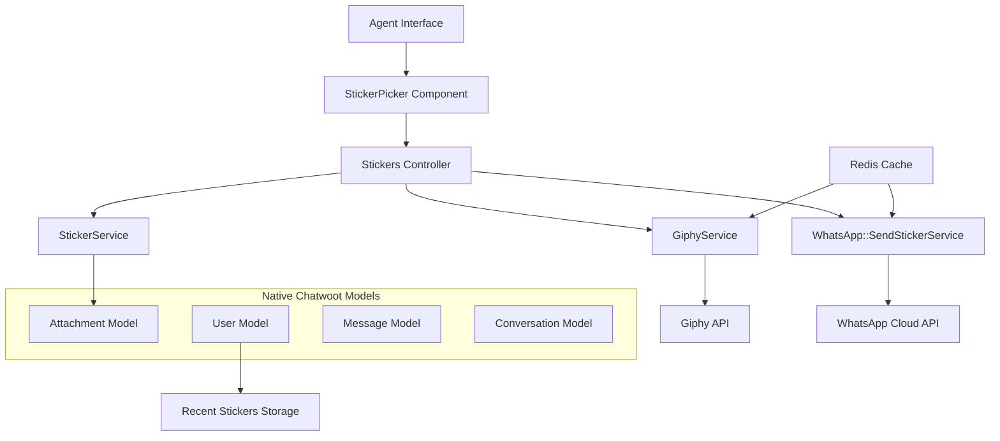

# Design Document

## Overview

Este documento detalha o design técnico para implementar uma biblioteca completa de stickers no WhatsApp, replicando a experiência do WhatsApp mobile. A solução aproveita ao máximo as estruturas nativas existentes do Chatwoot, evitando migrações de banco de dados e mantendo total compatibilidade com o sistema atual.

## Architecture

### High-Level Architecture



### Component Responsibilities

**Frontend (Vue.js)**
- `StickerPicker.vue`: Interface principal de seleção de stickers
- `StickerButton.vue`: Botão integrado na barra de ferramentas do chat
- `StickerMessage.vue`: Renderização de mensagens de sticker (reutiliza componentes existentes)

**Backend (Ruby on Rails)**
- `StickersController`: API endpoints para busca e envio
- `StickerService`: Gerenciamento de stickers personalizados
- `GiphyService`: Integração com API do Giphy
- `WhatsApp::SendStickerService`: Envio otimizado via WhatsApp Cloud API
- `StickerUploader`: Processamento de imagens (CarrierWave/ActiveStorage)

## Components and Interfaces

### 1. Frontend Components

#### StickerPicker.vue
```vue
<template>
  <div class="sticker-picker-modal">
    <!-- Tabs: Populares, Pesquisar, Recentes, Pacotes Personalizados -->
    <div class="sticker-tabs">
      <button @click="switchTab('trending')">Populares</button>
      <button @click="switchTab('search')">Pesquisar</button>
      <button @click="switchTab('recent')">Recentes</button>
      <button v-for="pack in customPacks" @click="switchTab(pack.id)">
        {{ pack.name }}
      </button>
    </div>
    
    <!-- Search Input (apenas na aba pesquisar) -->
    <div v-if="activeTab === 'search'" class="search-input">
      <input v-model="searchTerm" @keyup.enter="performSearch" 
             placeholder="Pesquisar stickers..." />
    </div>
    
    <!-- Grid de Stickers -->
    <div class="stickers-grid">
      
    </div>
  </div>
</template>
```

**Props & Events:**
- Props: `conversationId` (para contexto de envio)
- Events: `sticker-selected` (emitido quando sticker é escolhido)

#### StickerButton.vue
```vue
<template>
  <button v-if="isWhatsAppConversation" 
          @click="openStickerPicker" 
          class="sticker-button">
    <i class="icon-sticker"></i>
  </button>
</template>
```

### 2. Backend Services

#### StickersController
```ruby
class Api::V1::StickersController < Api::V1::BaseController
  # GET /api/v1/stickers
  def index
    case params[:provider]
    when 'giphy'
      stickers = GiphyService.new.search_or_trending(params[:search_term])
    when 'custom'
      stickers = StickerService.new(current_account).custom_stickers(params[:pack_name])
    when 'recent'
      stickers = recent_stickers_for_user(current_user)
    end
    
    render json: { stickers: stickers }
  end
  
  # POST /api/v1/conversations/:id/send_sticker
  def send_sticker
    conversation = current_account.conversations.find(params[:conversation_id])
    
    result = WhatsApp::SendStickerService.new(
      conversation: conversation,
      sticker_data: sticker_params,
      user: current_user
    ).perform
    
    if result[:success]
      render json: { success: true, message_id: result[:message_id] }
    else
      render json: { error: result[:error] }, status: :unprocessable_entity
    end
  end
end
```

#### StickerService
```ruby
class StickerService
  def initialize(account)
    @account = account
  end
  
  # Aproveita o modelo Attachment existente
  def custom_stickers(pack_name = nil)
    query = Attachment.where(
      account: @account, 
      file_type: :image
    ).where("meta->>'sticker_type' = ?", 'custom')
    
    query = query.where("meta->>'sticker_pack' = ?", pack_name) if pack_name
    
    query.map do |attachment|
      {
        id: attachment.id,
        url: attachment.download_url,
        alt: attachment.meta&.dig('sticker_pack') || 'Custom Sticker',
        provider: 'custom',
        meta: attachment.meta
      }
    end
  end
  
  def create_custom_sticker(pack_name, file, tags = [])
    attachment = Attachment.new(
      account: @account,
      file_type: :image,
      meta: {
        sticker_pack: pack_name,
        tags: tags,
        sticker_type: 'custom'
      }
    )
    
    attachment.file.attach(file)
    attachment.save!
    
    {
      id: attachment.id,
      url: attachment.download_url,
      alt: pack_name,
      provider: 'custom',
      meta: attachment.meta
    }
  end
end
```

#### GiphyService
```ruby
class GiphyService
  include HTTParty
  base_uri 'https://api.giphy.com/v1/stickers'
  
  def initialize
    @api_key = ENV.fetch('GIPHY_API_KEY')
  end
  
  def search_or_trending(query = nil)
    cache_key = "giphy_stickers:#{query || 'trending'}"
    
    Rails.cache.fetch(cache_key, expires_in: 10.minutes) do
      if query.present?
        search(query)
      else
        trending
      end
    end
  end
  
  private
  
  def search(query)
    response = self.class.get('/search', {
      query: { 
        api_key: @api_key, 
        q: query, 
        limit: 25, 
        rating: 'g' # Apenas conteúdo seguro
      }
    })
    
    parse_giphy_response(response)
  end
  
  def trending
    response = self.class.get('/trending', {
      query: { 
        api_key: @api_key, 
        limit: 25, 
        rating: 'g'
      }
    })
    
    parse_giphy_response(response)
  end
  
  def parse_giphy_response(response)
    return [] unless response.success?
    
    parsed_body = JSON.parse(response.body)
    parsed_body['data'].map do |sticker_data|
      webp_url = sticker_data.dig('images', 'fixed_height', 'webp')
      next unless webp_url
      
      {
        id: sticker_data['id'],
        url: webp_url,
        alt: sticker_data['title'],
        provider: 'giphy'
      }
    end.compact
  end
end
```

#### WhatsApp::SendStickerService
```ruby
class WhatsApp::SendStickerService
  def initialize(conversation:, sticker_data:, user:)
    @conversation = conversation
    @sticker_data = sticker_data
    @user = user
    @channel = conversation.inbox.channel
  end
  
  def perform
    # 1. Obter media_id (com cache de 30 dias)
    media_id = fetch_or_upload_media
    return { success: false, error: 'Failed to get media ID' } unless media_id
    
    # 2. Criar mensagem usando enum existente
    message = create_sticker_message
    
    # 3. Enviar via WhatsApp
    response = send_to_whatsapp(media_id)
    
    if response[:success]
      # 4. Registrar como sticker recente do usuário
      record_recent_sticker
      { success: true, message_id: message.id }
    else
      message.destroy # Remove mensagem se envio falhou
      { success: false, error: response[:error] }
    end
  end
  
  private
  
  def fetch_or_upload_media
    cache_key = "whatsapp_media_id:#{Digest::MD5.hexdigest(@sticker_data[:url])}"
    
    Rails.cache.fetch(cache_key, expires_in: 30.days) do
      upload_media_to_whatsapp
    end
  end
  
  def create_sticker_message
    @conversation.messages.create!(
      content: "Sticker: #{@sticker_data[:alt]}",
      content_type: 'sticker', # Usa enum existente
      content_attributes: {
        sticker_data: @sticker_data
      },
      message_type: :outgoing,
      account_id: @conversation.account_id,
      inbox_id: @conversation.inbox_id,
      additional_attributes: { 
        skip_send_reply: true # Evita envio duplo
      }
    )
  end
  
  def send_to_whatsapp(media_id)
    @channel.provider_service.send_sticker_message(
      @conversation.contact_inbox.source_id,
      media_id
    )
  end
  
  def record_recent_sticker
    # Usa ui_settings do modelo User existente
    # NOTA: Para alta concorrência, considerar mover para background job
    recent_stickers = @user.ui_settings&.dig('recent_stickers') || []
    
    # Remove se já existe e adiciona no início
    recent_stickers.reject! { |s| s['url'] == @sticker_data[:url] }
    recent_stickers.unshift({
      url: @sticker_data[:url],
      alt: @sticker_data[:alt],
      provider: @sticker_data[:provider],
      used_at: Time.current.iso8601
    })
    
    # Mantém apenas os 20 mais recentes
    recent_stickers = recent_stickers.first(20)
    
    # Atualiza ui_settings (usa update_column para performance)
    ui_settings = @user.ui_settings || {}
    ui_settings['recent_stickers'] = recent_stickers
    @user.update_column(:ui_settings, ui_settings)
  end
  
  def upload_media_to_whatsapp
    # Download do sticker (síncrono para simplicidade inicial)
    # NOTA: Para otimização futura, considerar background job para downloads lentos
    media_data = HTTParty.get(@sticker_data[:url]).body
    
    # Upload para WhatsApp
    @channel.provider_service.upload_media(media_data, 'image/webp')
  end
end
```

### 3. WhatsApp Provider Service Extension

Extensão do serviço existente `WhatsappCloudService`:

```ruby
# Adicionar ao app/services/whatsapp/providers/whatsapp_cloud_service.rb

def send_sticker_message(phone_number, media_id)
  payload = {
    messaging_product: 'whatsapp',
    recipient_type: 'individual',
    to: phone_number,
    type: 'sticker',
    sticker: {
      id: media_id # Usa media_id para melhor performance
    }
  }
  
  response = HTTParty.post(
    "#{phone_id_path}/messages",
    headers: api_headers,
    body: payload.to_json
  )
  
  process_response(response)
end

def upload_media(media_data, content_type = 'image/webp')
  response = HTTParty.post(
    "#{api_base_path}/v13.0/#{whatsapp_channel.provider_config['phone_number_id']}/media",
    headers: {
      'Authorization' => "Bearer #{whatsapp_channel.provider_config['api_key']}",
      'Content-Type' => content_type
    },
    body: media_data
  )
  
  response.success? ? response.parsed_response['id'] : nil
end
```

## Data Models

### Leveraging Existing Models

**Message Model (Existing)**
- `content_type: 'sticker'` - Usa enum existente (linha 94 do código)
- `content_attributes` - Armazena dados do sticker (campo JSONB existente)
- `additional_attributes` - Para flags como `skip_send_reply`

**Attachment Model (Existing)**
- Para stickers personalizados
- `file_type: :image` - Usa enum existente
- `meta` - Campo JSONB para metadados do sticker:
  ```json
  {
    "sticker_type": "custom",
    "sticker_pack": "Empresa",
    "tags": ["logo", "marca"]
  }
  ```

**User Model (Existing)**
- `ui_settings` - Campo JSONB para stickers recentes:
  ```json
  {
    "recent_stickers": [
      {
        "url": "https://...",
        "alt": "Sticker name",
        "provider": "giphy",
        "used_at": "2024-01-01T10:00:00Z"
      }
    ]
  }
  ```

## Error Handling

### API Error Scenarios

1. **Giphy API Unavailable**
   - Catch HTTParty exceptions
   - Return empty array with error flag
   - Frontend shows "Stickers temporariamente indisponíveis"

2. **WhatsApp API Rejection**
   - Parse WhatsApp error response
   - Map to user-friendly messages
   - Log detailed error for debugging

3. **Invalid Sticker Format**
   - Validate file before processing
   - Return specific error messages
   - Guide user on correct format

4. **Upload Failures**
   - Retry mechanism for transient failures
   - Fallback to link method if upload fails
   - Clear error messaging

### Error Response Format
```json
{
  "success": false,
  "error": "user_friendly_message",
  "error_code": "STICKER_UPLOAD_FAILED",
  "details": "technical_details_for_debugging"
}
```

## Testing Strategy

### Unit Tests
- `StickerService` - Custom sticker management
- `GiphyService` - API integration and caching
- `WhatsApp::SendStickerService` - End-to-end sending flow
- Image processing and validation

### Integration Tests
- Complete sticker sending flow
- Cache behavior validation
- Error handling scenarios
- WhatsApp API integration

### Frontend Tests
- Component rendering and interaction
- Event emission and handling
- Loading states and error display
- Responsive design validation

### Performance Tests
- Cache effectiveness
- API rate limiting behavior
- Large sticker library handling
- Concurrent user scenarios

## Security Considerations

1. **API Key Management**
   - Store Giphy API key in environment variables
   - Rotate keys regularly
   - Monitor usage quotas

2. **Content Moderation**
   - Enforce Giphy rating filter ('g' only)
   - Validate custom sticker uploads
   - Audit trail for sticker usage

3. **File Upload Security**
   - Validate file types and sizes
   - Scan for malicious content
   - Secure storage configuration

4. **Rate Limiting**
   - Implement client-side throttling
   - Cache responses aggressively
   - Monitor API usage patterns

## Performance Optimizations

1. **Caching Strategy**
   - Redis cache for Giphy responses (10 minutes)
   - WhatsApp media_id cache (30 days)
   - CDN for custom stickers

2. **Image Processing**
   - Background job for custom sticker processing
   - Optimized WebP conversion
   - Thumbnail generation for grid display

3. **Frontend Optimizations**
   - Lazy loading for sticker grids
   - Virtual scrolling for large lists
   - Image preloading for popular stickers

4. **Database Optimizations**
   - Indexed queries on Attachment.meta
   - Efficient JSONB queries for filtering
   - Connection pooling for high concurrency

## Future Optimizations

### High Concurrency Considerations
1. **Race Condition Prevention**
   - Move recent stickers update to background job for serial processing
   - Implement user-specific job queues to prevent conflicts

2. **Async Media Processing**
   - Background jobs for slow media downloads
   - WebSocket updates for real-time status
   - Timeout handling for external API calls

3. **Advanced Caching**
   - Distributed cache for multi-server deployments
   - Cache warming strategies for popular stickers
   - Intelligent cache invalidation