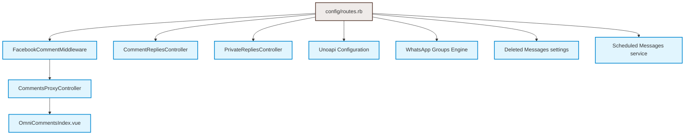

# Software Design Document & Implementation Plan: Decoupled Fork Integration

Integrating custom features from community forks into **official Chatwoot v4.14.1** using a highly decoupled, modular architecture. 

---

## 1. Architectural Philosophy & Upgrade Guardrails

To prevent future merge conflicts during upstream updates (e.g. upgrading to v4.15.0 or v5.x), the integration must adhere to these design guidelines:
1.  **Zero Modification of Core Schemas**: Avoid altering core tables (like `inboxes`, `accounts`, `conversations`). Use existing JSONB columns like `additional_attributes` or `content_attributes` to store custom settings, signatures, and metadata.
2.  **Stand-Alone Namespaces**: Keep custom controllers, models, and jobs inside the `OmniAi` or `Plus` namespaces (`app/controllers/omni_ai/`, `app/models/plus/`).
3.  **Hook-Driven Interception**: Intercept incoming webhooks via Rack Middleware (`FacebookCommentMiddleware`) or webhook controller pre-hooks, rather than modifying core parsing classes.
4.  **API-Driven Extensibility**: Fire outgoing events (like sending scheduled messages) through standard internal service classes (e.g. `Messages::MessageBuilder`) or API endpoints, rather than injecting logic deep into the message pipeline.

---

## 2. Remote Configurations

All community fork remotes are configured and fetched in the local repository:
*   `upstream`: `https://github.com/chatwoot/chatwoot.git` (baseline: `v4.14.1`)
*   `omnisett`: `https://github.com/omnisett/chatwoot-custom.git` (tracked branch: `omnisett/develop`)
*   `vipertec`: `https://github.com/ViperTecCorporation/chatwoot.git` (tracked branch: `vipertec/4.13.0`)
*   `clairton`: `https://github.com/clairton/chatwoot.git` (tracked branch: `clairton/uno`)

All custom implementations should be developed on a dedicated integration branch:
```bash
git checkout develop
git checkout -b feature/plus-integration
```

---

## 3. Module Design Specifications



---

### Module 1: Facebook & Instagram Comments Handling
**Source**: `omnisett/develop`  
**Purpose**: Forward Facebook and Instagram comments to an external AI/reply handler (Omni-AI) and mount a comments sidebar page in the dashboard.

#### Backend Architecture
1.  **Rack Middleware Interceptor**:
    *   **Source File**: `omnisett/develop` -> [facebook_comment_middleware.rb](file:///d:/Development/laragon/cwt/chatwoot-plus/app/middleware/omni_ai/facebook_comment_middleware.rb)
    *   **Target File**: [facebook_comment_middleware.rb](file:///d:/Development/laragon/cwt/chatwoot-plus/app/middleware/omni_ai/facebook_comment_middleware.rb) (NEW)
    *   **Registration**: [omni_ai_middleware.rb](file:///d:/Development/laragon/cwt/chatwoot-plus/config/initializers/omni_ai_middleware.rb) (NEW)
    *   **Logic**: Intercepts `POST /bot` requests. If the payload has `changes` with `field == 'feed'` and `item == 'comment'`, it parses the JSON and passes the entries to the forwarder job. The request then passes through to the normal Facebook Messenger gem handler.
2.  **Instagram Webhook Hook**:
    *   **Source File**: `omnisett/develop` -> `app/controllers/webhooks/instagram_controller.rb`
    *   **Target File**: [instagram_controller.rb](file:///d:/Development/laragon/cwt/chatwoot-plus/app/controllers/webhooks/instagram_controller.rb) (MODIFY)
    *   **Logic**: Add a block inside the `events` action to detect `comments` events using `OmniAi::CommentForwarder.contains_ig_comments?(entry_params)` and forward them before executing the standard DM routing.
3.  **Forwarding Initializer**:
    *   **Source File**: `omnisett/develop` -> `config/initializers/omni_ai_comments.rb`
    *   **Target File**: [omni_ai_comments.rb](file:///d:/Development/laragon/cwt/chatwoot-plus/config/initializers/omni_ai_comments.rb) (NEW)
    *   **Logic**: Defines the `OmniAi::CommentForwarder` module to calculate payload signatures and queue `OmniAi::CommentForwardJob`.
4.  **Forwarding Job**:
    *   **Source File**: `omnisett/develop` -> `app/jobs/omni_ai/comment_forward_job.rb`
    *   **Target File**: [comment_forward_job.rb](file:///d:/Development/laragon/cwt/chatwoot-plus/app/jobs/omni_ai/comment_forward_job.rb) (NEW)
    *   **Logic**: Calls `OMNI_AI_COMMENTS_URL` via `Net::HTTP` carrying the signed payload (`X-Omni-Signature`). On success, broadcasts an `omni_comments.updated` ActionCable event.
5.  **Proxy and Replies Controllers**:
    *   **Source Files**: `omnisett/develop` -> `app/controllers/omni_ai/...`
    *   **Target Files**:
        *   [comments_proxy_controller.rb](file:///d:/Development/laragon/cwt/chatwoot-plus/app/controllers/omni_ai/comments_proxy_controller.rb) (NEW) - Proxies comments list, stats, and manual replies from the dashboard to the Omni-AI backend.
        *   [comment_replies_controller.rb](file:///d:/Development/laragon/cwt/chatwoot-plus/app/controllers/omni_ai/comment_replies_controller.rb) (NEW) - Receives replies from Omni-AI and posts them to Graph API (`/{comment-id}/replies` or `/comments`).
        *   [private_replies_controller.rb](file:///d:/Development/laragon/cwt/chatwoot-plus/app/controllers/omni_ai/private_replies_controller.rb) (NEW) - Sends DMs via Graph API `/{page-id}/messages` with `recipient: { comment_id }` and creates Chatwoot database entries (`Contact`, `Conversation`, `Message`) to show DMs in the inbox.
6.  **Routes Setup**:
    *   **Target File**: [routes.rb](file:///d:/Development/laragon/cwt/chatwoot-plus/config/routes.rb) (MODIFY)
    *   **Logic**: Mount comments page routes inside accounts resource block, and replies endpoints globally:
        ```ruby
        # Namespace API V1 Accounts
        scope module: :omni_ai do
          get 'omni_ai/comments_page/stats', to: 'comments_proxy#stats'
          get 'omni_ai/comments_page/by-post', to: 'comments_proxy#by_post'
          get 'omni_ai/comments_page/post/:post_id', to: 'comments_proxy#post_comments'
          get 'omni_ai/comments_page/post-info/:post_id', to: 'comments_proxy#post_info'
          get 'omni_ai/comments_page/commenter/:commenter_id', to: 'comments_proxy#commenter_history'
          put 'omni_ai/comments_page/:id/reply', to: 'comments_proxy#reply'
          post 'omni_ai/comments_page/:comment_id/dm', to: 'comments_proxy#send_dm'
          get 'omni_ai/comments_page', to: 'comments_proxy#index'
        end
        # Global API V1 block
        post 'omni_ai/comment_reply', to: 'omni_ai/comment_replies#create'
        post 'omni_ai/private_reply', to: 'omni_ai/private_replies#create'
        ```

#### Frontend Architecture
1.  **Comments Dashboard Index**:
    *   **Source Folder**: `omnisett/develop` -> `app/javascript/dashboard/routes/dashboard/omniComments/...`
    *   **Target Folder**: [omniComments](file:///d:/Development/laragon/cwt/chatwoot-plus/app/javascript/dashboard/routes/dashboard/omniComments) (NEW)
    *   **Logic**: Implements `OmniCommentsIndex.vue` and its routes to render the comments stream, filter dropdowns, and manual reply textareas.
2.  **Navigation Mount**:
    *   **Target File**: [dashboard.routes.js](file:///d:/Development/laragon/cwt/chatwoot-plus/app/javascript/dashboard/routes/dashboard/dashboard.routes.js) (MODIFY)
    *   **Logic**: Mount the Comments route and include it in the sidebar template:
        ```javascript
        import omniCommentsRoutes from './omniComments/routes';
        // Add to children array:
        ...omniCommentsRoutes,
        ```

---

### Module 2: Inline Click-to-WhatsApp (CTWA) Ad Referral Card
**Source**: `omnisett/develop`  
**Purpose**: Surface Click-to-WhatsApp ad information (creatives, headline, bodies, ad ID) inline directly inside the first incoming message bubble of the conversation.

#### Ingestion & Persistence
1.  **Message Context Processing**:
    *   **Source File**: `omnisett/develop` -> `app/services/whatsapp/incoming_message_base_service.rb`
    *   **Target File**: [incoming_message_base_service.rb](file:///d:/Development/laragon/cwt/chatwoot-plus/app/services/whatsapp/incoming_message_base_service.rb) (MODIFY)
    *   **Logic**: Capture Meta's incoming webhook payload `referral` and assign it to the created message:
        ```ruby
        # Extract referral object and save it on the message content_attributes
        message.content_attributes['referral'] = processed_referral_payload
        ```
2.  **Attribution Persistence**:
    *   **Source File**: `omnisett/develop` -> `app/services/whatsapp/incoming_message_service_helpers.rb`
    *   **Target File**: [incoming_message_service_helpers.rb](file:///d:/Development/laragon/cwt/chatwoot-plus/app/services/whatsapp/incoming_message_service_helpers.rb) (MODIFY)
    *   **Logic**: Capture and persist `ctwa_clid` and first-touch referral on the conversation's `additional_attributes` so it is not overwritten on thread reuse.

#### UI Bubble Rendering
1.  **Referral Card Component**:
    *   **Source File**: `omnisett/develop` -> `app/javascript/dashboard/components-next/message/AdReferralCard.vue`
    *   **Target File**: [AdReferralCard.vue](file:///d:/Development/laragon/cwt/chatwoot-plus/app/javascript/dashboard/components-next/message/AdReferralCard.vue) (NEW)
    *   **Logic**: Decodes the referral object keys (headline, body, source_url, source_id, image_url), validates that links contain safe `http/https` protocols, and outputs an inline template with image thumbnail, title, description, and link.
2.  **Bubble Mount**:
    *   **Source File**: `omnisett/develop` -> `app/javascript/dashboard/components-next/message/bubbles/Base.vue`
    *   **Target File**: [Base.vue](file:///d:/Development/laragon/cwt/chatwoot-plus/app/javascript/dashboard/components-next/message/bubbles/Base.vue) (MODIFY)
    *   **Logic**: Import `AdReferralCard.vue` and mount it inline:
        ```vue
        <AdReferralCard
          v-if="message.content_attributes && message.content_attributes.referral"
          :referral="message.content_attributes.referral"
        />
        ```

---

### Module 3: WhatsApp Group Conversations & Groups Tab
**Source**: `vipertec/4.13.0`  
**Purpose**: Parse, sync, and display WhatsApp group messages natively in a dedicated Groups tab.

#### Data Schema Updates
1.  **Migrations**:
    *   **Target File**: `db/migrate/..._create_whatsapp_group_conversations.rb` (NEW)
    *   **Logic**: Add fields to `conversations` and build a separate table:
        ```ruby
        add_column :conversations, :group, :boolean, default: false
        add_column :conversations, :group_source_id, :string
        add_column :conversations, :group_title, :string
        add_index :conversations, [:inbox_id, :group_source_id], unique: true, where: "group = true"

        create_table :group_contacts do |t|
          t.references :conversation, null: false, foreign_key: true
          t.references :contact, null: false, foreign_key: true
          t.references :account, null: false, foreign_key: true
          t.string :role
          t.timestamps
        end
        add_index :group_contacts, [:conversation_id, :contact_id], unique: true
        ```

#### Payload Normalization & Ingestion
1.  **Group Inbound Handlers**:
    *   **Source Files**: `vipertec/4.13.0` -> `app/services/whatsapp/...`
    *   **Target Files**: WhatsApp incoming payload normalizers.
    *   **Logic**: Detect if `messages[0].group_id` exists in the payload. If so, find or create the conversation using `inbox_id + group_source_id` with `group: true` and `group_title`.
2.  **Sender Normalization**:
    *   Identify the real participant phone number from the payload, match/create a `Contact` record, and assign them as the `message.sender`.
    *   **Do NOT** prefix the message text with `*Name*:`. The message bubble will render the sender's name natively using `message.sender.name`.
3.  **Group Sync Job**:
    *   Call Uno API `GET /groups/{groupId}/participants` on first group message to create `Contact` records for all participants and link them to `group_contacts`.

#### UI Integrations
1.  **Groups Tab**:
    *   **Source File**: `vipertec/4.13.0` -> `app/javascript/dashboard/components/ChatList.vue`
    *   **Target File**: [ChatList.vue](file:///d:/Development/laragon/cwt/chatwoot-plus/app/javascript/dashboard/components/ChatList.vue) (MODIFY)
    *   **Logic**: Add a "Groups" tab/filter to display only group conversations (where `conversation.group === true`).
2.  **Sender Display**:
    *   **Target File**: message bubble bubble rendering view.
    *   **Logic**: Display the sender name above the text when `conversation.group` is active.

---

### Module 4: Preserved Deleted Messages & Sync
**Source**: `vipertec/4.13.0`  
**Purpose**: Allow agents to read original texts of deleted messages and propagate deletions back to WhatsApp/UnoAPI.

#### Inbound Interception
1.  **Capture Deletion Webhooks**:
    *   **Target File**: WhatsApp/Uno webhook controllers/services.
    *   **Logic**: When a deletion payload is received:
        *   Read the account's setting `preserve_deleted_message_content` (stored in the account's `settings` hash).
        *   If `true`, instead of deleting the message record or changing the content to "Message deleted", preserve the original `content` string, but set a flag in `message.content_attributes['deleted_by_sender'] = true`.
2.  **Frontend Render**:
    *   **Source File**: `vipertec/4.13.0` -> `app/javascript/dashboard/components-next/message/bubbles/Text/Index.vue`
    *   **Target File**: [Index.vue](file:///d:/Development/laragon/cwt/chatwoot-plus/app/javascript/dashboard/components-next/message/bubbles/Text/Index.vue) (MODIFY)
    *   **Logic**: If `message.content_attributes.deleted_by_sender` is true, render a warning label "This message was deleted by the sender" above the text.

#### Outbound Sync
1.  **Message Destroy Callback**:
    *   **Logic**: When an agent deletes a message in the Chatwoot dashboard, trigger a callback that makes a `DELETE` request containing the message's `source_id` to the provider (WhatsApp Cloud or UnoAPI) so it deletes it for the customer.

---

### Module 5: Decoupled Scheduled Messages
**Architecture**: Fully decoupled. Runs on a standalone table and schedules messages via Chatwoot's core messaging services.

#### Data Schema Setup
1.  **Scheduled Message Table**:
    *   **Target File**: `db/migrate/..._create_plus_scheduled_messages.rb` (NEW)
    *   **Logic**:
        ```ruby
        create_table :plus_scheduled_messages do |t|
          t.references :conversation, null: false, foreign_key: true
          t.references :account, null: false, foreign_key: true
          t.references :user, null: false, foreign_key: true  # The agent who scheduled it
          t.text :content, null: false
          t.datetime :send_at, null: false
          t.string :status, default: 'pending' # pending, sent, failed
          t.jsonb :content_attributes, default: {}
          t.timestamps
        end
        add_index :plus_scheduled_messages, :send_at, where: "status = 'pending'"
        ```

#### Backend Scheduled Runner
1.  **Poller Job**:
    *   **Target File**: `app/jobs/plus/scheduled_message_runner_job.rb` (NEW)
    *   **Logic**: A periodic Sidekiq job (configured in `config/schedule.yml` to run every 1 minute):
        ```ruby
        module Plus
          class ScheduledMessageRunnerJob < ApplicationJob
            queue_as :scheduled_jobs

            def perform
              Plus::ScheduledMessage.where(status: 'pending').where('send_at <= ?', Time.current).find_each do |sm|
                # Trigger the native Chatwoot message builder acting as the agent
                result = Messages::MessageBuilder.new(
                  sm.user,
                  sm.conversation,
                  { content: sm.content, message_type: :outgoing, private: false }
                ).perform

                if result.persisted?
                  sm.update!(status: 'sent')
                else
                  sm.update!(status: 'failed')
                end
              end
            end
          end
        end
        ```

#### Frontend UI Mount
1.  **Scheduler Input**:
    *   **Target File**: [Editor.vue](file:///d:/Development/laragon/cwt/chatwoot-plus/app/javascript/dashboard/components-next/Editor/Editor.vue) (MODIFY)
    *   **Logic**: Add a clock icon button next to the Send button. Clicking it displays a datetime dropdown to schedule the message. If a date is selected, instead of calling the standard message send API, call `POST /api/v1/accounts/{account_id}/conversations/{conversation_id}/scheduled_messages` with the date.

---

### Module 6: Schema-less Per-Inbox Signatures
**Architecture**: Fully schema-less. Stored in `inbox.additional_attributes['signature']` to avoid migration conflicts.

#### Ingestion & Append Logic
1.  **Builder Injection**:
    *   **Target File**: `app/builders/messages/message_builder.rb` (MODIFY)
    *   **Logic**: Intercept message construction before saving:
        ```ruby
        def perform
          # Append signature if message is outgoing, public, and inbox signature is configured
          if @message_type == :outgoing && !@private
            signature = @conversation.inbox.additional_attributes&.dig('signature')
            if signature.present?
              @content = "#{@content}\n\n#{signature}"
            end
          end
          # Proceed with standard builders
          ...
        end
        ```

#### Frontend Settings View
1.  **Signature Textarea**:
    *   **Target File**: [ConfigurationPage.vue](file:///d:/Development/laragon/cwt/chatwoot-plus/app/javascript/dashboard/routes/dashboard/settings/inbox/settingsPage/ConfigurationPage.vue) (MODIFY)
    *   **Logic**: Under the general settings panel, add a textarea form for "Agent Signature". Save the input value to the `inbox.additional_attributes['signature']` hash during updates.

---

### Module 7: Uno Premium Health Check
**Source**: `vipertec/4.13.0`  
**Purpose**: Run a daily Sidekiq cron check to prevent self-hosted licensing limits from resetting.

1.  **Health Check Job**:
    *   **Target File**: `app/jobs/internal/check_uno_premium_features_job.rb` (NEW)
    *   **Logic**: 
        ```ruby
        class Internal::CheckUnoPremiumFeaturesJob < ApplicationJob
          queue_as :scheduled_jobs
          def perform
            # Enforce premium configurations
            InstallationConfig.find_by(name: 'INSTALLATION_PRICING_PLAN')&.update!(value: 'premium')
            InstallationConfig.find_by(name: 'INSTALLATION_PRICING_PLAN_QUANTITY')&.update!(value: '1000000')
            InstallationConfig.find_by(name: 'CAPTAIN_CLOUD_PLAN_LIMITS')&.update!(value: '')
          end
        end
        ```
2.  **Sidekiq Cron Registration**:
    *   **Target File**: `config/schedule.yml` (MODIFY)
    *   **Logic**: Run daily at `02:00 UTC`:
        ```yaml
        check_uno_premium_features_job:
          cron: '0 2 * * *'
          class: 'Internal::CheckUnoPremiumFeaturesJob'
          queue: scheduled_jobs
        ```

---

## 4. Docker & Environment Configuration

### [docker-compose.production.yaml](file:///d:/Development/laragon/cwt/chatwoot-plus/docker-compose.production.yaml) Updates
Add the UnoAPI container running strictly in `amd64` architecture:

```yaml
version: '3'

services:
  # Standard Chatwoot services: web, worker, db, redis...

  unoapi:
    image: clairton/unoapi-cloud:latest
    restart: always
    environment:
      - PORT=9876
      - WEBHOOK_URL=http://web:3000/api/v1/webhooks/unoapi
    ports:
      - "127.0.0.1:9876:9876"
    volumes:
      - unoapi_data:/app/data
    networks:
      - chatwoot_network

volumes:
  unoapi_data:
```

### Required Environment Settings (`.env` / `.env.example`)
Ensure the following keys are populated:

```bash
# UnoAPI Configurations
UNOAPI_URL=http://unoapi:9876
UNOAPI_API_KEY=your_unoapi_secret_key_here

# Meta Comments Forwarding (Omni-AI)
OMNI_AI_COMMENTS_ENABLED=true
OMNI_AI_COMMENTS_URL=https://your-ai-backend.com/webhooks/meta-comments
OMNI_AI_COMMENTS_SECRET=your_hmac_shared_secret_key_here
OMNI_AI_WEBHOOK_TOKEN=your_secure_bearer_token_for_replies_here

# Comments Panel Access Control
OMNI_COMMENTS_PAGE_ENABLED=true
OMNI_COMMENTS_PAGE_USER_IDS=ALL
```

---

## 5. Branch Setup & Verification Checklist

1.  **Database Integration**: Run `bundle exec rails db:migrate` and verify new tables are created without errors.
2.  **Module Verification**: Run `bundle exec rspec` to ensure standard tests pass.
3.  **UI Verification**: Boot the web client with `pnpm run dev` and verify that the dashboard sidebar successfully mounts the "Comments" index and the message bubble components load without exceptions.
