# Architecture Diagrams

## Current Rails Architecture

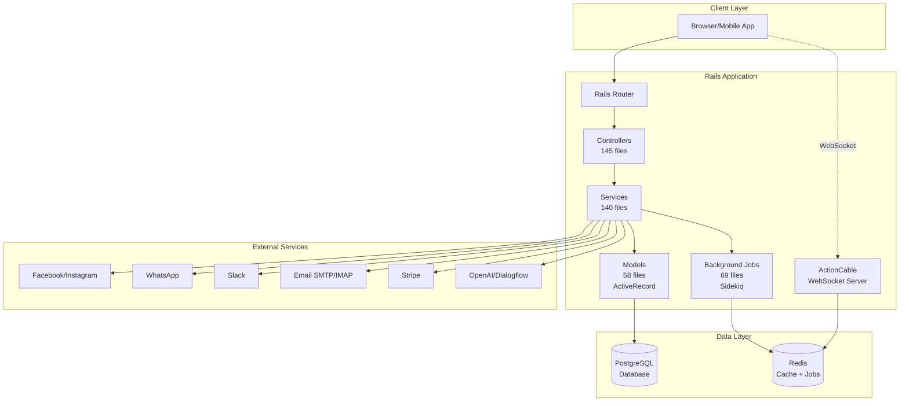

---

## Target TypeScript/NestJS Architecture

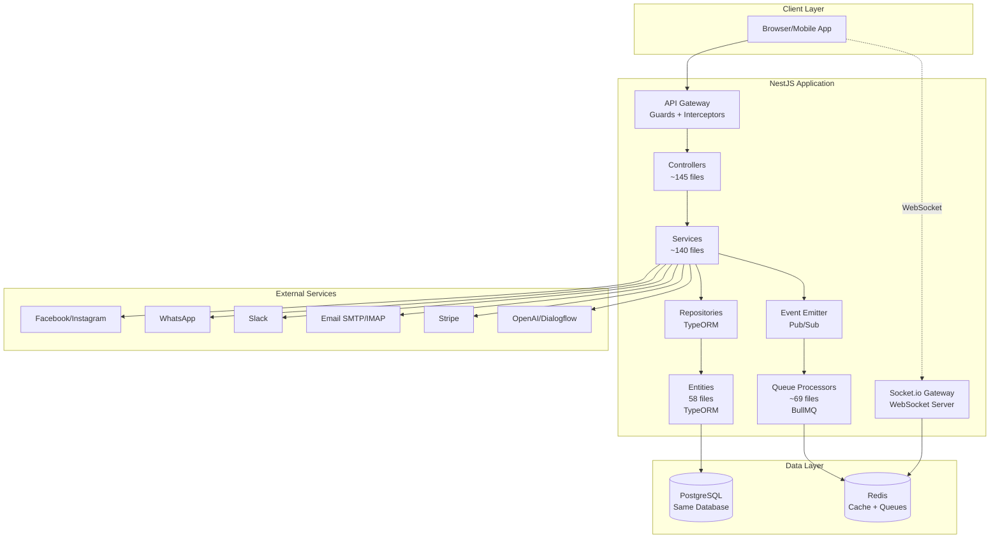

---

## Migration Transition State (Dual-Running)

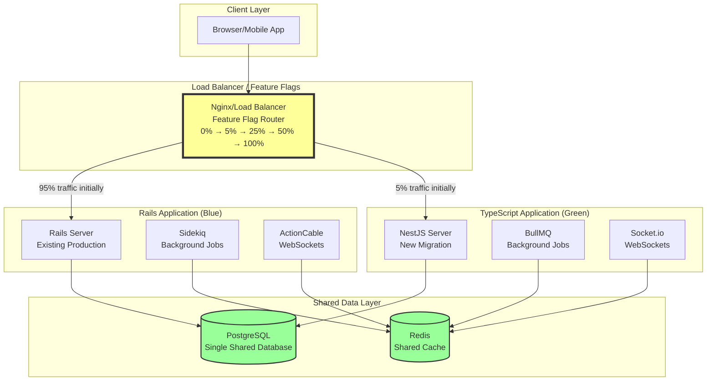

---

## Layered Architecture (NestJS)

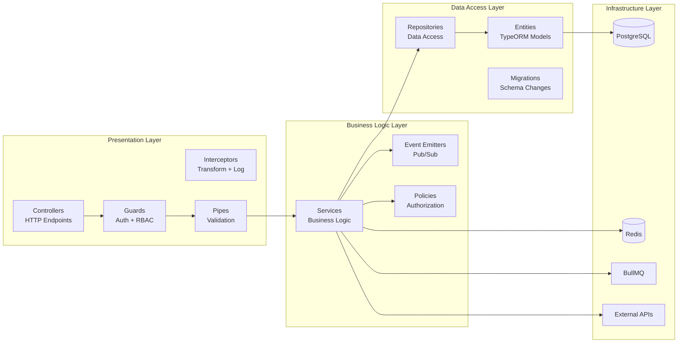

---

## Module Architecture

```mermaid
graph TB
    subgraph "Core Modules"
        AppModule[App Module<br/>Root]
        ConfigModule[Config Module<br/>Environment]
        DatabaseModule[Database Module<br/>TypeORM]
        CacheModule[Cache Module<br/>Redis]
    end

    subgraph "Feature Modules"
        AuthModule[Auth Module<br/>JWT + OAuth]
        UsersModule[Users Module]
        ConversationsModule[Conversations Module]
        MessagesModule[Messages Module]
        ContactsModule[Contacts Module]
        InboxesModule[Inboxes Module]
        TeamsModule[Teams Module]
    end

    subgraph "Integration Modules"
        FacebookModule[Facebook Module]
        WhatsAppModule[WhatsApp Module]
        SlackModule[Slack Module]
        EmailModule[Email Module]
        StripeModule[Stripe Module]
        AIModule[AI/ML Module]
    end

    subgraph "Infrastructure Modules"
        QueueModule[Queue Module<br/>BullMQ]
        WebSocketModule[WebSocket Module<br/>Socket.io]
        LoggingModule[Logging Module<br/>Winston]
        MonitoringModule[Monitoring Module<br/>Prometheus]
    end

    AppModule --> ConfigModule
    AppModule --> DatabaseModule
    AppModule --> CacheModule
    AppModule --> AuthModule
    AppModule --> UsersModule
    AppModule --> ConversationsModule
    AppModule --> MessagesModule
    AppModule --> ContactsModule
    AppModule --> InboxesModule
    AppModule --> TeamsModule
    AppModule --> QueueModule
    AppModule --> WebSocketModule

    ConversationsModule --> FacebookModule
    ConversationsModule --> WhatsAppModule
    ConversationsModule --> SlackModule
    ConversationsModule --> EmailModule

    UsersModule --> StripeModule
    MessagesModule --> AIModule
```

---

## Request Flow Comparison

### Rails Request Flow
```
HTTP Request
    ↓
Rack Middleware (Auth, CORS, etc.)
    ↓
Rails Router (routes.rb)
    ↓
Controller Action (before_action filters)
    ↓
Service Object (business logic)
    ↓
ActiveRecord Model (validations, callbacks)
    ↓
PostgreSQL Database
    ↓
View Serializer (JSON response)
    ↓
HTTP Response
```

### NestJS Request Flow
```
HTTP Request
    ↓
NestJS Middleware (CORS, etc.)
    ↓
Guards (JWT Auth, RBAC)
    ↓
Interceptors (Logging, Timing)
    ↓
Pipes (Validation, Transformation)
    ↓
Controller Method (route handler)
    ↓
Service Method (business logic)
    ↓
Repository (data access)
    ↓
TypeORM Entity (validations, hooks)
    ↓
PostgreSQL Database
    ↓
Interceptor (Response transformation)
    ↓
HTTP Response
```

---

## WebSocket Architecture

### Rails ActionCable
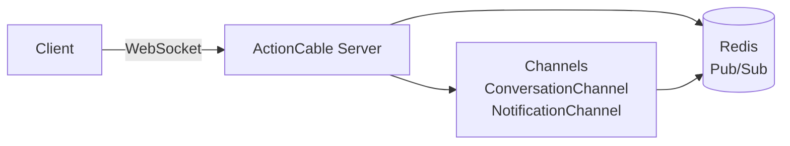

### NestJS Socket.io
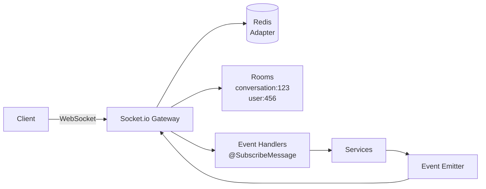

---

## Background Jobs Architecture

### Rails Sidekiq
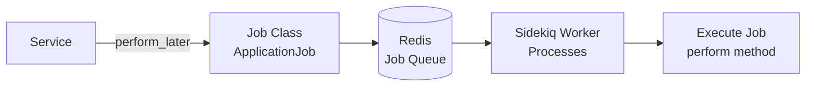

### NestJS BullMQ
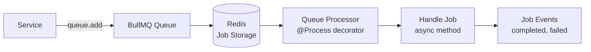

---

## Authentication Flow

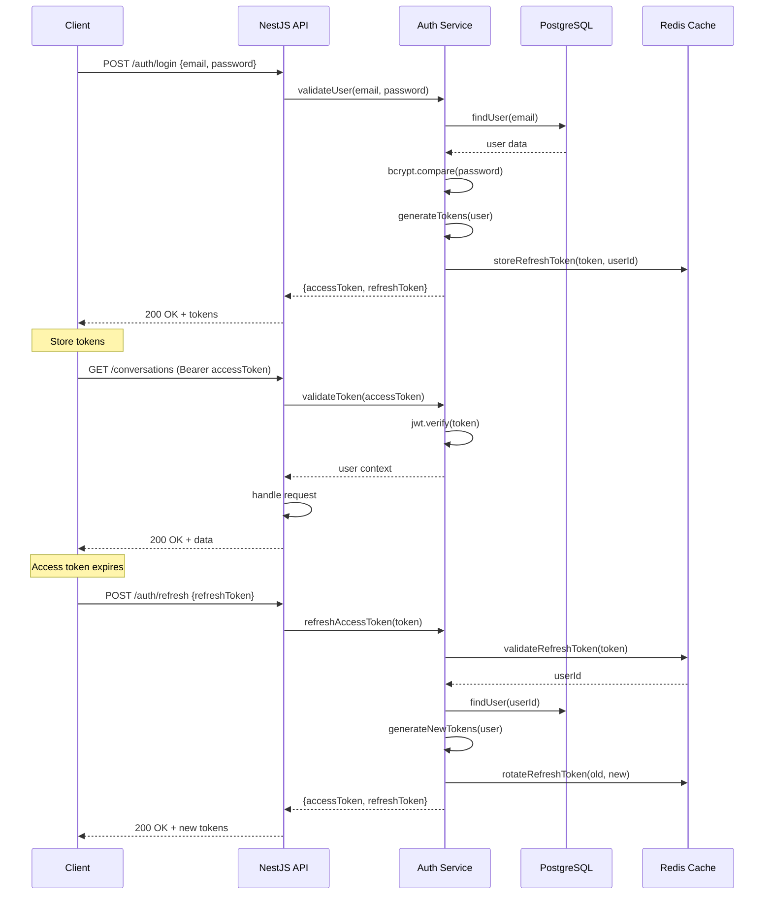

---

## Deployment Architecture

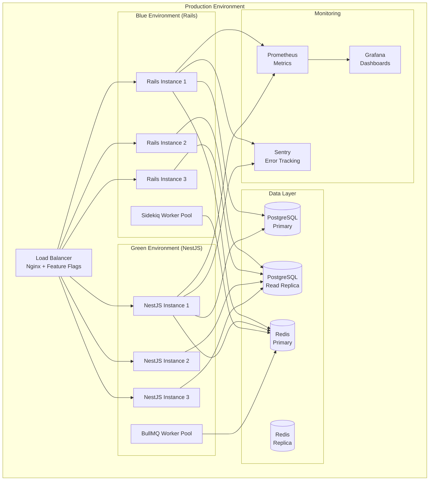

---

## Data Migration Strategy

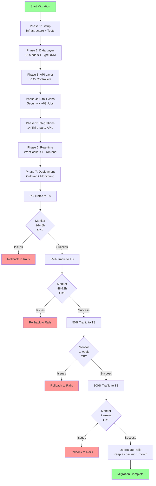

---

## Legend

- **Solid lines**: Synchronous calls
- **Dashed lines**: Asynchronous/WebSocket connections
- **Blue boxes**: Current Rails components
- **Green boxes**: Target TypeScript components
- **Yellow boxes**: Transition/routing components
- **Cylinders**: Data stores (databases, caches)
- **Rectangles**: Services, modules, components

