# Data Flow Diagrams

## Overview

These diagrams show how data flows through the Rails (current) and TypeScript (target) architectures for different scenarios.

---

## 1. HTTP Request Flow

### Rails (Current)

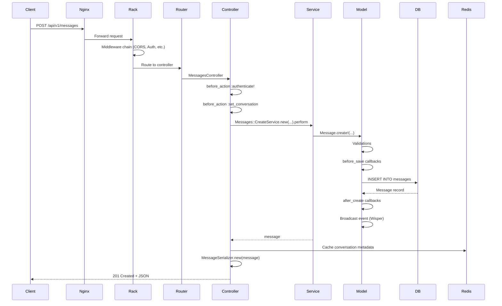

### TypeScript/NestJS (Target)

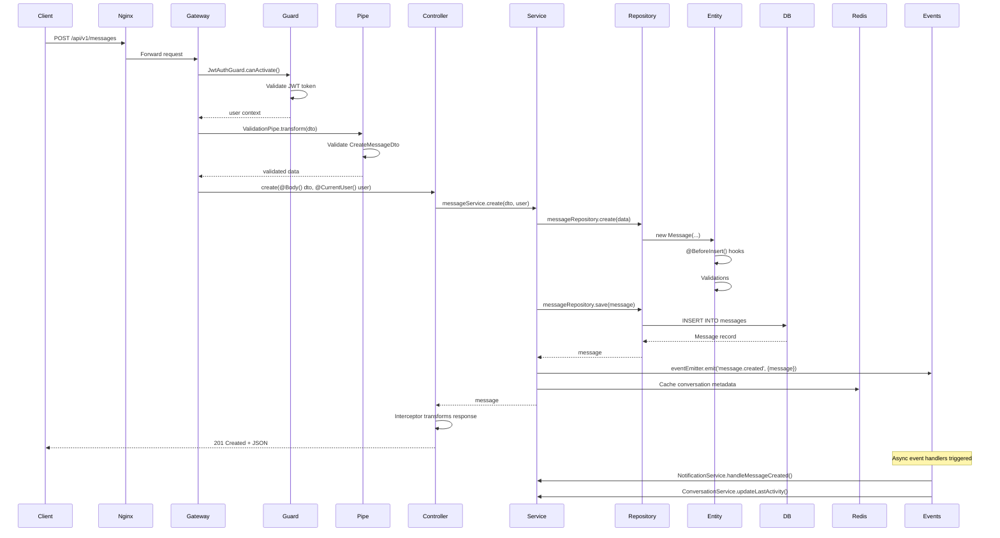

**Key Differences**:
- NestJS uses Guards instead of before_action filters
- Pipes handle validation (not ActiveRecord)
- EventEmitter replaces Wisper pub/sub
- Interceptors handle response transformation

---

## 2. WebSocket Flow

### Rails ActionCable (Current)

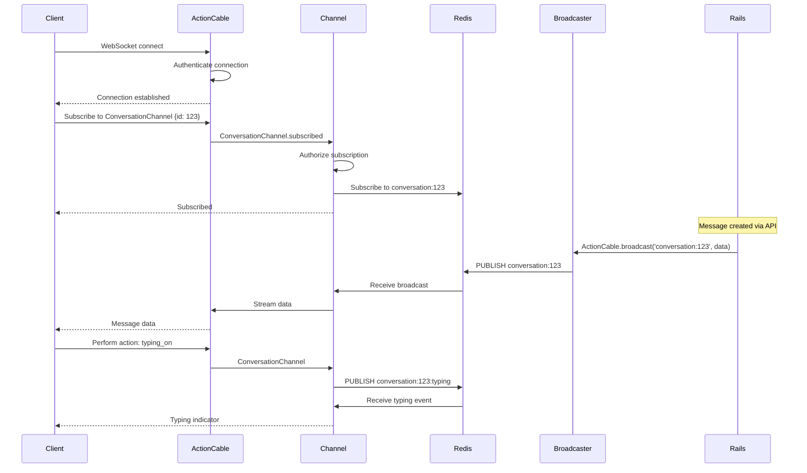

### TypeScript Socket.io (Target)

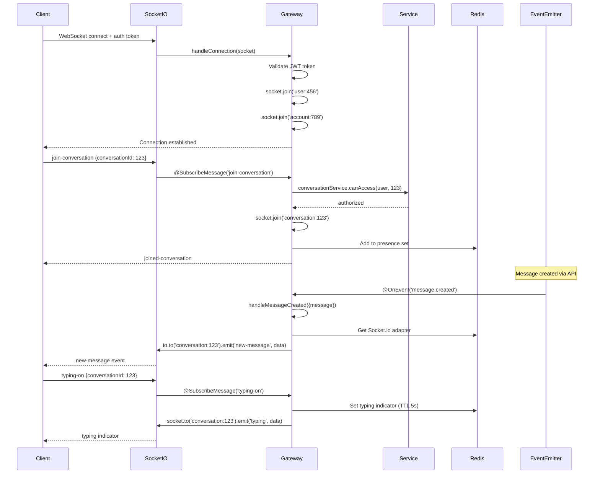

**Key Differences**:
- Socket.io uses rooms (not channels)
- Authentication happens at connection time
- Events are more granular (@SubscribeMessage)
- Redis adapter for horizontal scaling
- Built-in presence tracking

---

## 3. Background Job Flow

### Rails Sidekiq (Current)

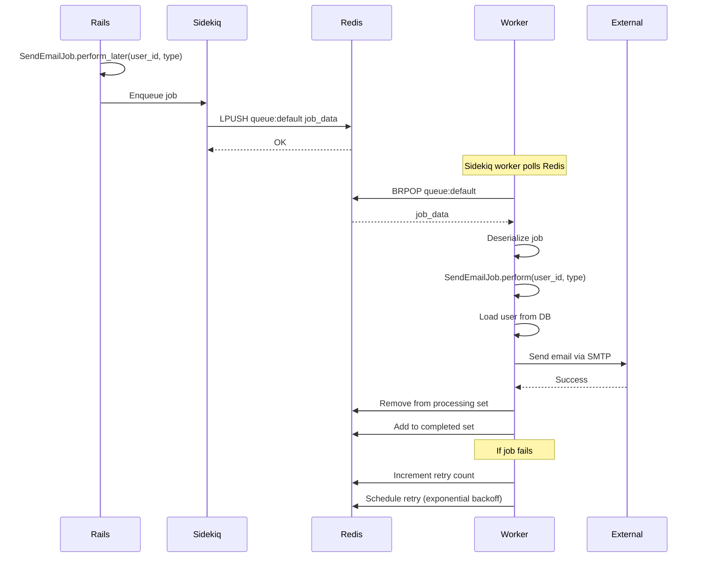

### TypeScript BullMQ (Target)

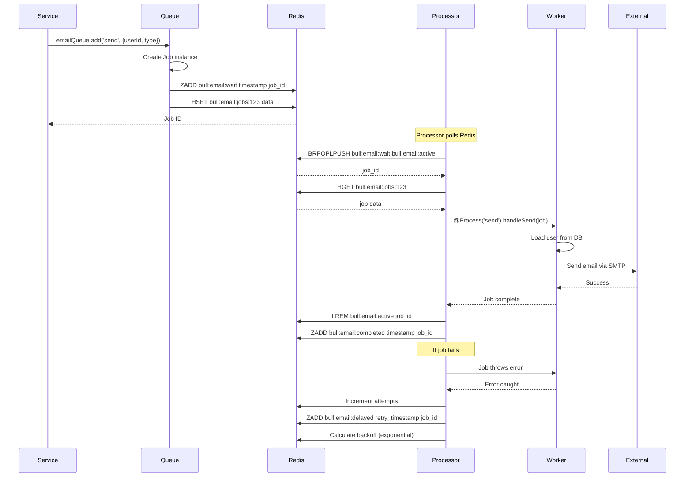

**Key Differences**:
- BullMQ uses sorted sets for priorities
- Better job scheduling (delays, repeatable)
- Built-in job events (progress, completed, failed)
- Better concurrency control
- TypeScript decorators (@Process)

---

## 4. Authentication Flow (Detailed)

### Login Flow

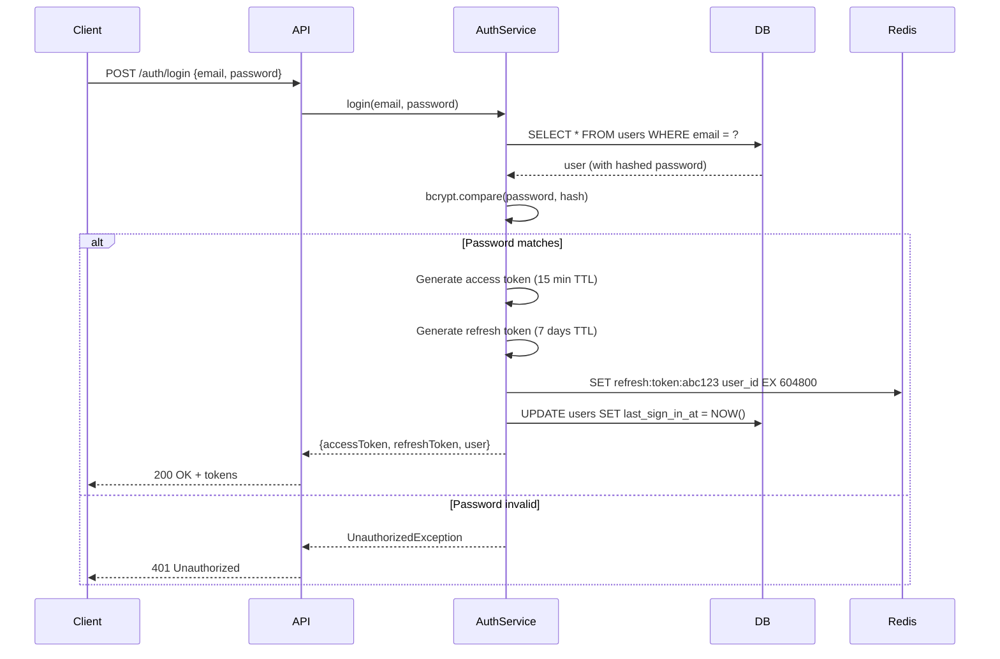

### Token Refresh Flow

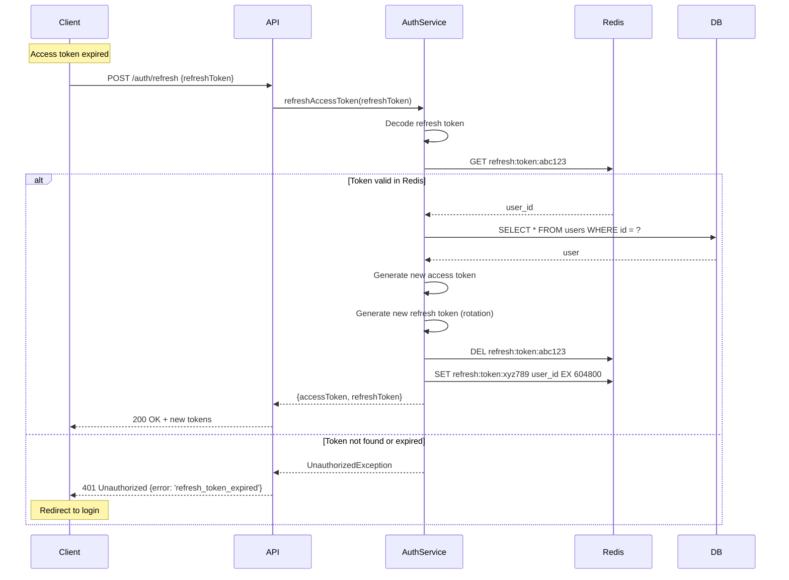

### Logout Flow

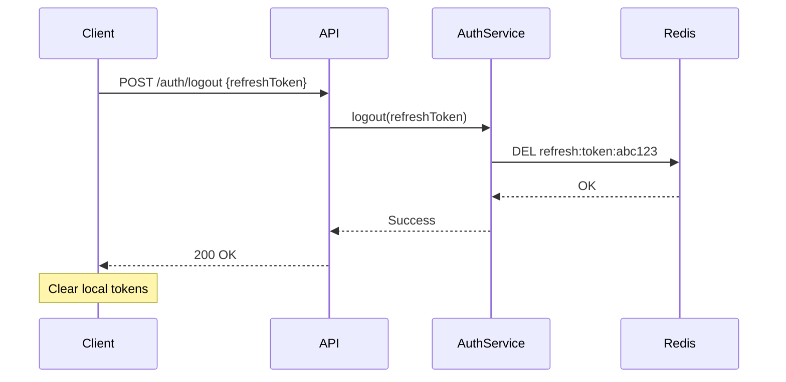

---

## 5. Integration Flow (Example: Facebook Messenger)

### Receiving Message from Facebook

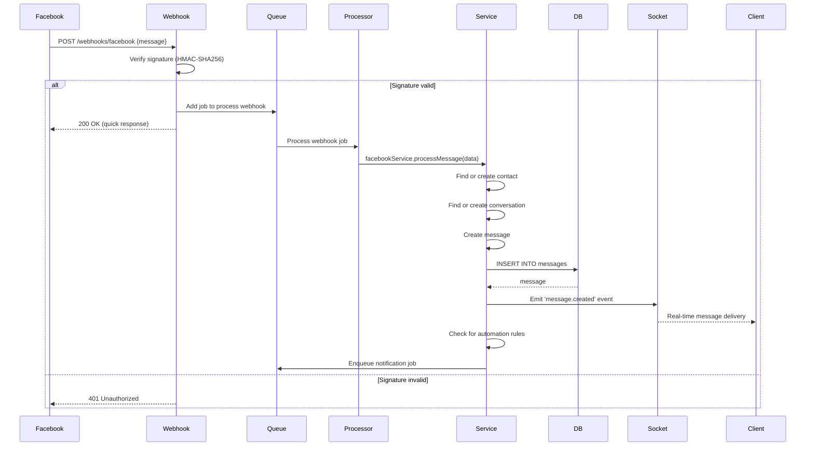

### Sending Message to Facebook

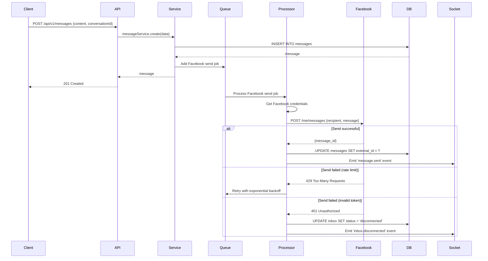

---

## 6. Real-time Conversation Flow

### Complete Flow: User Sends Message

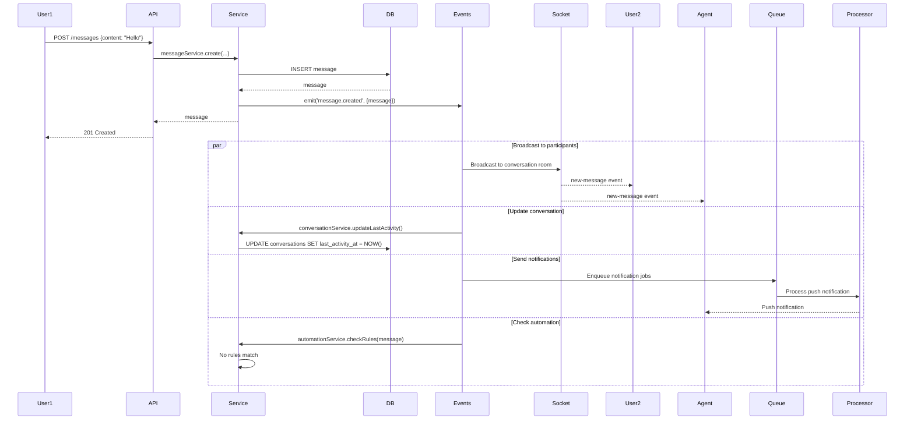

### Complete Flow: Agent Replies

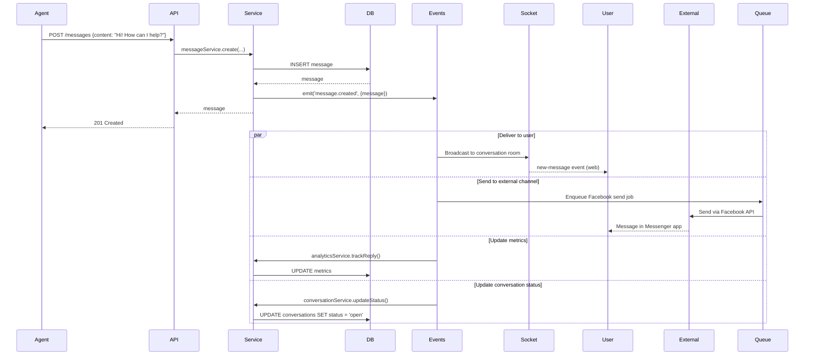

---

## 7. Caching Strategy Flow

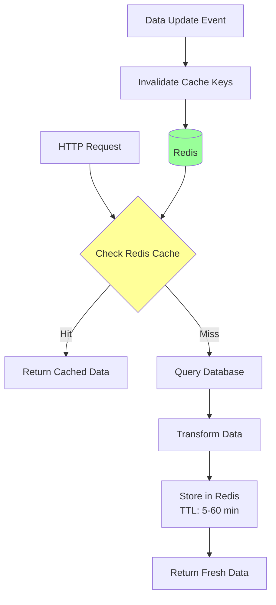

**Cache Keys**:
```
user:{id}                    → TTL: 15 minutes
conversation:{id}            → TTL: 5 minutes
conversation:{id}:messages   → TTL: 2 minutes
account:{id}:settings        → TTL: 30 minutes
inbox:{id}:config            → TTL: 10 minutes
```

**Invalidation Strategy**:
- On user update → DEL user:{id}
- On message create → DEL conversation:{id}:messages
- On settings change → DEL account:{id}:settings

---

## 8. Error Handling Flow

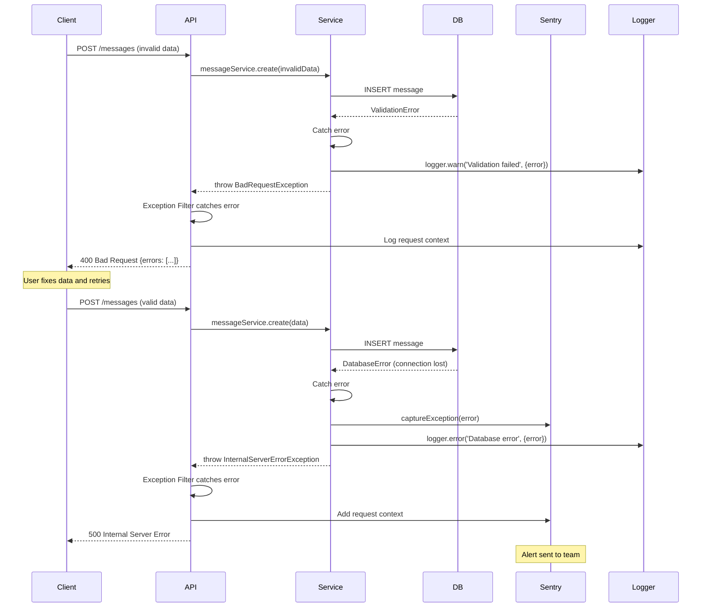

---

## 9. Database Query Optimization

### N+1 Query Problem (Rails)

```ruby
# BAD: N+1 queries
conversations = Conversation.all  # 1 query
conversations.each do |conv|
  puts conv.messages.count        # N queries!
end

# GOOD: Eager loading
conversations = Conversation.includes(:messages)  # 2 queries
conversations.each do |conv|
  puts conv.messages.count
end
```

### N+1 Query Solution (TypeScript)

```typescript
// BAD: N+1 queries
const conversations = await this.conversationRepository.find();
for (const conv of conversations) {
  const count = await this.messageRepository.count({
    where: { conversationId: conv.id }
  });  // N queries!
}

// GOOD: Eager loading
const conversations = await this.conversationRepository.find({
  relations: ['messages']  // 2 queries (with join)
});
for (const conv of conversations) {
  const count = conv.messages.length;
}

// BETTER: Aggregation query
const conversations = await this.conversationRepository
  .createQueryBuilder('conversation')
  .leftJoinAndSelect('conversation.messages', 'message')
  .loadRelationCountAndMap('conversation.messageCount', 'conversation.messages')
  .getMany();  // Single optimized query
```

---

## 10. Migration Dual-Running Architecture

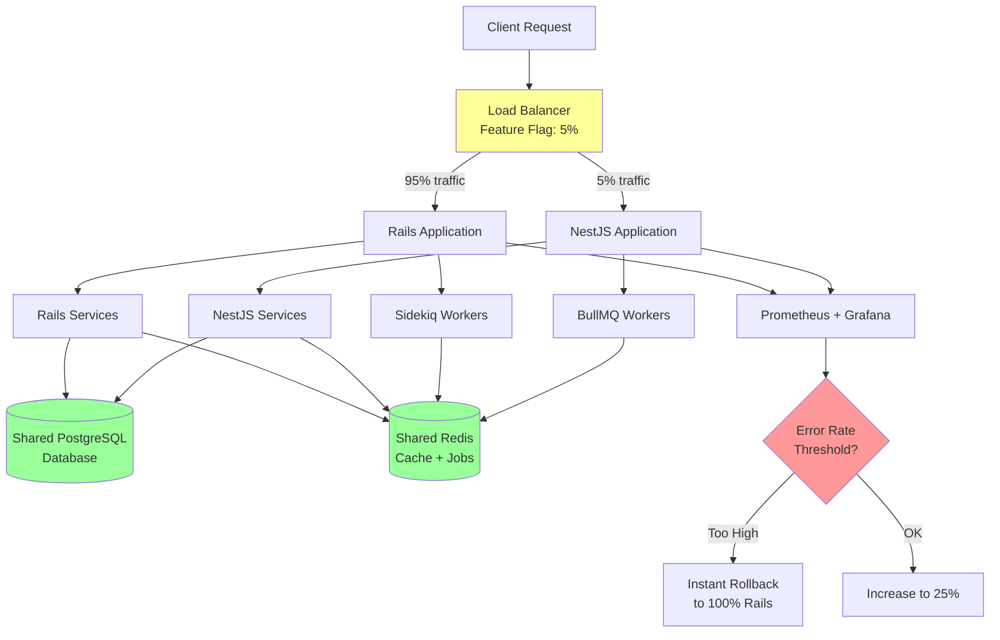

**Key Points**:
- Single shared database (no data sync needed)
- Single Redis instance (job coordination)
- Both stacks can write to database
- Feature flags control traffic split
- Instant rollback capability

---

## Summary

These data flow diagrams show:
1. **HTTP Request Flow**: Guards → Pipes → Controllers → Services → Repositories
2. **WebSocket Flow**: Socket.io rooms, Redis adapter, event-driven
3. **Background Jobs**: BullMQ processors, job events, retry logic
4. **Authentication**: JWT tokens, refresh token rotation, Redis session store
5. **Integrations**: Webhook processing, external API calls, error handling
6. **Real-time**: Event-driven architecture with EventEmitter2
7. **Caching**: Redis caching strategy with invalidation
8. **Error Handling**: Structured logging, Sentry integration
9. **Query Optimization**: Avoid N+1 queries with eager loading
10. **Dual-Running**: Blue-green deployment with feature flags

All flows maintain compatibility with Rails during migration phase.

