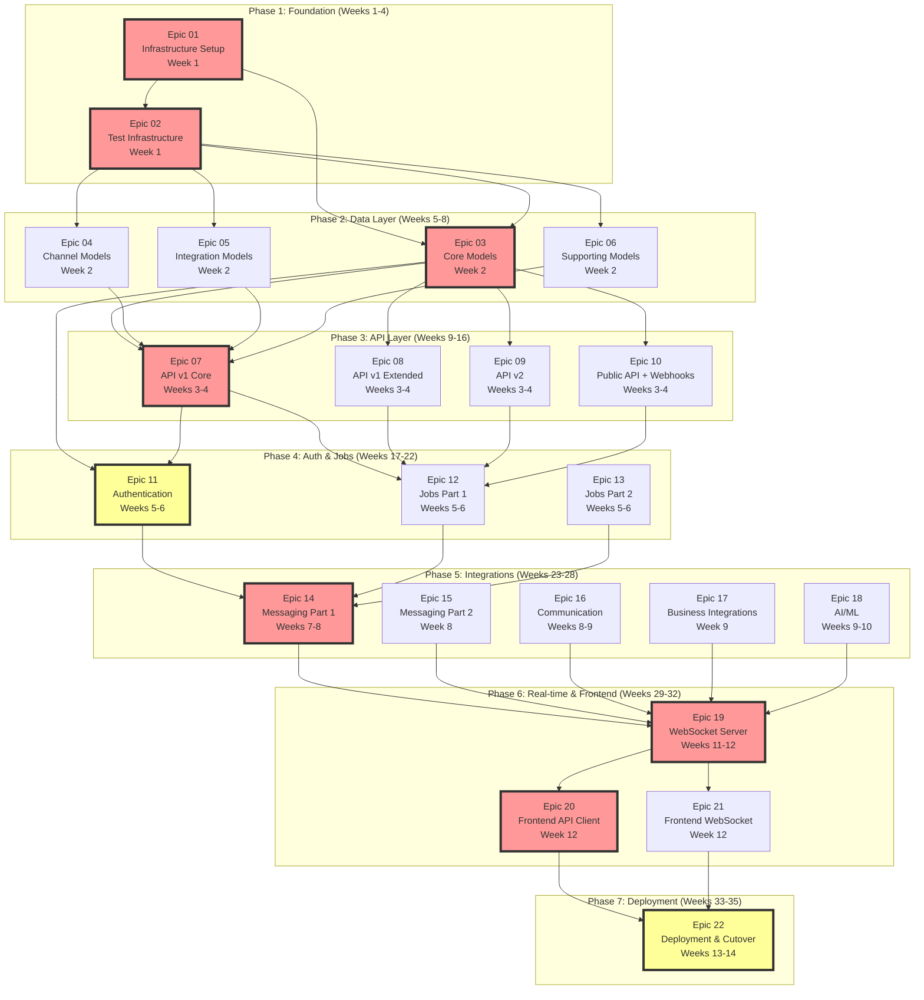
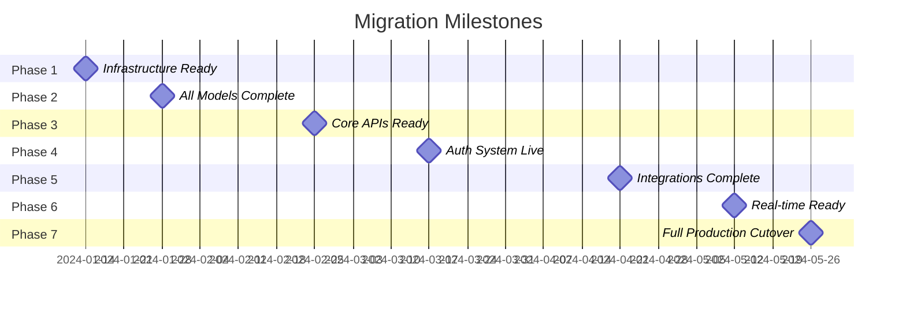

# Epic Dependency Graph

## Overview

This diagram shows the dependencies between all 22 epics and identifies which can run in parallel.

---

## Full Dependency Graph



---

## Critical Path

The **critical path** (red boxes) represents the minimum sequence that must be completed:

```
E01 → E02 → E03 → E07 → E11 → E14 → E19 → E20 → E22
```

**Duration**: 27 weeks (minimum with single-threaded work)

---

## Parallelization Opportunities

### Phase 1 (Week 1)
**Cannot Parallelize**: Infrastructure must be done before tests can run.
```
E01 → E02 (Sequential)
```

### Phase 2 (Week 2)
**CAN Parallelize**: All 4 model epics after test infrastructure is ready.
```
        ┌─→ E03 (Core Models)
        ├─→ E04 (Channel Models)
E02 ────┼─→ E05 (Integration Models)
        └─→ E06 (Supporting Models)
```
**Teams**: 4 teams working in parallel = 1 week total

### Phase 3 (Weeks 3-4)
**CAN Parallelize**: All 4 API epics after models are complete.
```
        ┌─→ E07 (API v1 Core)
        ├─→ E08 (API v1 Extended)
E03-06 ─┼─→ E09 (API v2)
        └─→ E10 (Public API + Webhooks)
```
**Teams**: 4 teams working in parallel = 2 weeks total

### Phase 4 (Weeks 5-6)
**Partial Parallelization**: Auth must start first, then jobs can parallelize.
```
        ┌─→ E11 (Authentication) → Week 5-6
E07 ────┼─→ E12 (Jobs Part 1) → Week 6
        └─→ E13 (Jobs Part 2) → Week 6
```
**Teams**: 1 team on E11 (week 5-6), then 2 teams on E12/E13 (week 6)

### Phase 5 (Weeks 7-10)
**CAN Parallelize**: All 5 integration epics after auth/jobs complete.
```
        ┌─→ E14 (Messaging Part 1) → Weeks 7-8
        ├─→ E15 (Messaging Part 2) → Week 8
E11-13 ─┼─→ E16 (Communication) → Weeks 8-9
        ├─→ E17 (Business) → Week 9
        └─→ E18 (AI/ML) → Weeks 9-10
```
**Teams**: 3-4 teams working in parallel = 4 weeks total

### Phase 6 (Weeks 11-12)
**Partial Parallelization**: WebSocket server first, then frontend updates.
```
E14-18 → E19 (WebSocket Server) → Weeks 11-12
              ↓
         ┌────┴────┐
         ↓         ↓
    E20 (API)  E21 (WS) → Week 12
```
**Teams**: 1 team on E19, then 2 teams on E20/E21

### Phase 7 (Weeks 13-14)
**Cannot Parallelize**: Deployment requires all prior work complete.
```
E19-21 → E22 (Deployment) → Weeks 13-14
```

---

## Dependency Matrix

| Epic | Depends On | Blocks | Can Start After | Risk |
|------|-----------|--------|----------------|------|
| E01 | None | E02, E03 | Week 1 | Low |
| E02 | E01 | E03-E06 | Week 1 | Low |
| E03 | E01, E02 | E07-E11 | Week 2 | Medium |
| E04 | E02 | E07 | Week 2 | Medium |
| E05 | E02 | E07 | Week 2 | Medium |
| E06 | E02 | E07 | Week 2 | Low |
| E07 | E03-E06 | E11-E12 | Week 3 | High |
| E08 | E03 | E12 | Week 3 | Medium |
| E09 | E03 | E12 | Week 3 | Medium |
| E10 | E03 | E12 | Week 3 | Medium |
| E11 | E03, E07 | E14 | Week 5 | **VERY HIGH** |
| E12 | E07-E10 | E14 | Week 6 | Medium |
| E13 | E07-E10 | E14 | Week 6 | Low |
| E14 | E11-E13 | E19 | Week 7 | **VERY HIGH** |
| E15 | E11-E13 | E19 | Week 8 | High |
| E16 | E11-E13 | E19 | Week 8 | High |
| E17 | E11-E13 | E19 | Week 9 | Medium |
| E18 | E11-E13 | E19 | Week 9 | Medium |
| E19 | E14-E18 | E20-E21 | Week 11 | High |
| E20 | E19 | E22 | Week 12 | Medium |
| E21 | E19 | E22 | Week 12 | Medium |
| E22 | ALL | None | Week 13 | **VERY HIGH** |

---

## Team Allocation Recommendations

### Optimal Team Size: 3-4 Engineers

#### Scenario A: 3 Engineers
```
Phase 1 (Weeks 1-4):
- Engineer 1: E01 → E03 → E07
- Engineer 2: E02 → E04 → E08
- Engineer 3: E05 → E06 → E09

Phase 2 (Weeks 5-10):
- Engineer 1: E11 (critical!)
- Engineer 2: E12 → E14
- Engineer 3: E13 → E15

Phase 3 (Weeks 11-14):
- Engineer 1: E19 → E20
- Engineer 2: E16 → E21
- Engineer 3: E17 → E18 → E22
```
**Total Duration**: ~31 weeks

#### Scenario B: 4 Engineers
```
Phase 1 (Weeks 1-4):
- Engineer 1: E01 → E03 → E07
- Engineer 2: E02 → E04 → E08
- Engineer 3: E05 → E09
- Engineer 4: E06 → E10

Phase 2 (Weeks 5-10):
- Engineer 1: E11 (critical!)
- Engineer 2: E12 → E14
- Engineer 3: E13 → E15
- Engineer 4: E16 → E17

Phase 3 (Weeks 11-14):
- Engineer 1: E19 → E22
- Engineer 2: E20
- Engineer 3: E21
- Engineer 4: E18
```
**Total Duration**: ~27 weeks

---

## Risk Mitigation by Phase

### Phase 1-2: Low Risk
- Standard infrastructure setup
- Clear model migration patterns
- Can parallelize heavily

### Phase 3: Medium Risk
- API contract matching crucial
- Request/response format must be identical
- Mitigation: Extensive integration tests

### Phase 4: HIGH RISK
- **Epic 11 (Authentication)** is critical path + security-critical
- Any auth bugs = production incident
- Mitigation:
  - 100% test coverage
  - Security audit
  - Gradual rollout with monitoring

### Phase 5: Medium-High Risk
- Third-party API integrations
- Rate limits, API changes
- Mitigation: Extensive error handling, retry logic

### Phase 6: Medium Risk
- WebSocket compatibility
- Real-time message delivery
- Mitigation: Load testing, failover testing

### Phase 7: VERY HIGH RISK
- **Epic 22 (Deployment)** is production cutover
- Zero-downtime requirement
- Mitigation:
  - Blue-green deployment
  - Feature flags for instant rollback
  - 24/7 monitoring during rollout

---

## Blockers to Watch For

### Known Blockers

1. **E03 (Core Models)** blocks 8 epics
   - Priority: Get this done FAST and RIGHT
   - Risk: Delays cascade to everything

2. **E07 (API v1 Core)** blocks auth and jobs
   - Priority: Critical path
   - Risk: API contract mismatch breaks frontend

3. **E11 (Authentication)** blocks all integrations
   - Priority: HIGHEST security risk
   - Risk: Security vulnerability = project failure

4. **E19 (WebSocket)** blocks frontend updates
   - Priority: Real-time functionality critical
   - Risk: Message delivery issues

### Unknown Risks

- Third-party API changes during migration
- Rails gem dependencies with no TypeScript equivalent
- Database performance differences (ActiveRecord vs TypeORM)
- Frontend breaking changes (if API contract drift)

---

## Milestone Checkpoints



**Key Milestones**:
- ✅ Week 2: Can start API development
- ✅ Week 4: Can start authentication
- ✅ Week 6: Can start integrations
- ✅ Week 12: Can update frontend
- ✅ Week 14: Production ready

---

## Epic Complexity vs Risk Matrix

```
High Complexity, High Risk:
┌─────────────────────────┐
│ E11 (Authentication)    │ ← CRITICAL: Must be perfect
│ E22 (Deployment)        │ ← CRITICAL: Production cutover
│ E14 (Messaging Part 1)  │ ← Meta APIs are complex
└─────────────────────────┘

High Complexity, Medium Risk:
┌─────────────────────────┐
│ E07 (API v1 Core)       │
│ E19 (WebSocket)         │
│ E18 (AI/ML)             │
└─────────────────────────┘

Medium Complexity, Medium Risk:
┌─────────────────────────┐
│ E03-E06 (Models)        │
│ E08-E10 (APIs)          │
│ E12-E13 (Jobs)          │
│ E15-E17 (Integrations)  │
└─────────────────────────┘

Low Complexity, Low Risk:
┌─────────────────────────┐
│ E01 (Infrastructure)    │
│ E02 (Test Infra)        │
│ E20-E21 (Frontend)      │
└─────────────────────────┘
```

---

## Summary

- **Total Epics**: 22
- **Critical Path Length**: 9 epics (E01→E02→E03→E07→E11→E14→E19→E20→E22)
- **Minimum Duration**: 27 weeks (with optimal parallelization)
- **Maximum Duration**: 35 weeks (if fully sequential)
- **Recommended Duration**: 31 weeks (realistic with 3-4 engineers)
- **High Risk Epics**: 3 (E11, E14, E22)
- **Parallelization Phases**: 4 phases (Phase 2-3-5-6)
- **Sequential Phases**: 3 phases (Phase 1-4-7)

