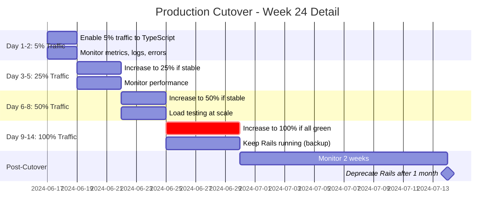

# Migration Timeline - Gantt Chart

## Overview

This Gantt chart shows the complete 27-31 week migration timeline with all 22 epics, dependencies, and parallel work.

---

## Full Timeline (3-4 Engineers)

```mermaid
gantt
    title Chatwoot Rails → TypeScript Migration Timeline
    dateFormat  YYYY-MM-DD

    section Phase 1: Foundation
    Epic 01: Infrastructure Setup       :e01, 2024-01-01, 1w
    Epic 02: Test Infrastructure        :e02, after e01, 1w

    section Phase 2: Data Layer
    Epic 03: Core Models                :e03, after e02, 1w
    Epic 04: Channel Models             :e04, after e02, 1w
    Epic 05: Integration Models         :e05, after e02, 1w
    Epic 06: Supporting Models          :e06, after e02, 1w

    section Phase 3: API Layer
    Epic 07: API v1 Core                :e07, after e03 e04 e05 e06, 2w
    Epic 08: API v1 Extended            :e08, after e03, 2w
    Epic 09: API v2                     :e09, after e03, 2w
    Epic 10: Public API + Webhooks      :e10, after e03, 2w

    section Phase 4: Auth & Jobs
    Epic 11: Authentication             :crit, e11, after e07, 2w
    Epic 12: Jobs Part 1                :e12, after e07 e08 e09 e10, 1w
    Epic 13: Jobs Part 2                :e13, after e07 e08 e09 e10, 1w

    section Phase 5: Integrations
    Epic 14: Messaging Part 1 (Meta)    :crit, e14, after e11 e12 e13, 2w
    Epic 15: Messaging Part 2           :e15, after e11 e12 e13, 1w
    Epic 16: Communication (Email/SMS)  :e16, after e11 e12 e13, 1.5w
    Epic 17: Business (Stripe/Shopify)  :e17, after e11 e12 e13, 1w
    Epic 18: AI/ML                      :e18, after e11 e12 e13, 1.5w

    section Phase 6: Real-time
    Epic 19: WebSocket Server           :e19, after e14 e15 e16 e17 e18, 2w
    Epic 20: Frontend API Client        :e20, after e19, 1w
    Epic 21: Frontend WebSocket         :e21, after e19, 1w

    section Phase 7: Deployment
    Epic 22: Deployment & Cutover       :crit, e22, after e20 e21, 2w

    section Milestones
    Infrastructure Complete             :milestone, m1, after e02, 0d
    Models Complete                     :milestone, m2, after e03 e04 e05 e06, 0d
    Core APIs Complete                  :milestone, m3, after e07, 0d
    Auth System Ready                   :milestone, m4, after e11, 0d
    All Integrations Done               :milestone, m5, after e14 e15 e16 e17 e18, 0d
    Real-time Ready                     :milestone, m6, after e19 e20 e21, 0d
    Production Cutover                  :milestone, m7, after e22, 0d
```

---

## Optimistic Timeline (4 Engineers, 27 weeks)

```mermaid
gantt
    title Optimistic Timeline - 4 Engineers, Aggressive Parallelization
    dateFormat  YYYY-MM-DD

    section Week 1-2: Foundation
    E01: Infrastructure          :e01, 2024-01-01, 1w
    E02: Tests                   :e02, after e01, 1w

    section Week 3: Models (4 parallel)
    E03: Core Models             :e03, after e02, 1w
    E04: Channel Models          :e04, after e02, 1w
    E05: Integration Models      :e05, after e02, 1w
    E06: Supporting Models       :e06, after e02, 1w

    section Week 4-5: APIs (4 parallel)
    E07: API v1 Core             :e07, after e03, 2w
    E08: API v1 Extended         :e08, after e03, 2w
    E09: API v2                  :e09, after e03, 2w
    E10: Public API              :e10, after e03, 2w

    section Week 6-7: Auth & Jobs
    E11: Authentication          :crit, e11, after e07, 2w
    E12: Jobs Part 1             :e12, after e07, 1w
    E13: Jobs Part 2             :e13, after e07, 1w

    section Week 8-11: Integrations (5 parallel)
    E14: Messaging Part 1        :crit, e14, after e11, 2w
    E15: Messaging Part 2        :e15, after e11, 1w
    E16: Communication           :e16, after e11, 1.5w
    E17: Business                :e17, after e11, 1w
    E18: AI/ML                   :e18, after e11, 1.5w

    section Week 12-13: Real-time
    E19: WebSocket Server        :e19, after e14, 2w
    E20: Frontend API            :e20, after e19, 1w
    E21: Frontend WebSocket      :e21, after e19, 1w

    section Week 14-15: Deployment
    E22: Deployment              :crit, e22, after e20 e21, 2w
```

**Duration**: 27 weeks (~6.5 months)

---

## Realistic Timeline (3 Engineers, 31 weeks)

```mermaid
gantt
    title Realistic Timeline - 3 Engineers, Moderate Parallelization
    dateFormat  YYYY-MM-DD

    section Week 1-2
    E01: Infrastructure          :e01, 2024-01-01, 1w
    E02: Tests                   :e02, after e01, 1w

    section Week 3-4: Models
    E03: Core Models             :e03, after e02, 1w
    E04: Channel Models          :e04, after e02, 1w
    E05: Integration Models      :e05, after e03, 1w
    E06: Supporting Models       :e06, after e04, 1w

    section Week 5-8: APIs
    E07: API v1 Core             :e07, after e05 e06, 2w
    E08: API v1 Extended         :e08, after e05 e06, 2w
    E09: API v2                  :e09, after e07, 2w
    E10: Public API              :e10, after e08, 2w

    section Week 9-12: Auth & Jobs
    E11: Authentication          :crit, e11, after e07, 2w
    E12: Jobs Part 1             :e12, after e09 e10, 1w
    E13: Jobs Part 2             :e13, after e12, 1w

    section Week 13-18: Integrations
    E14: Messaging Part 1        :crit, e14, after e11 e13, 2w
    E15: Messaging Part 2        :e15, after e14, 1w
    E16: Communication           :e16, after e14, 1.5w
    E17: Business                :e17, after e15, 1w
    E18: AI/ML                   :e18, after e16, 1.5w

    section Week 19-22: Real-time
    E19: WebSocket Server        :e19, after e18, 2w
    E20: Frontend API            :e20, after e19, 1w
    E21: Frontend WebSocket      :e21, after e19, 1w

    section Week 23-24: Deployment
    E22: Deployment              :crit, e22, after e20 e21, 2w
```

**Duration**: 31 weeks (~7.5 months)

---

## Pessimistic Timeline (2-3 Engineers, 35 weeks)

```mermaid
gantt
    title Pessimistic Timeline - 2-3 Engineers, Buffer for Issues
    dateFormat  YYYY-MM-DD

    section Foundation
    E01: Infrastructure          :e01, 2024-01-01, 1w
    E02: Tests                   :e02, after e01, 1w

    section Models
    E03: Core Models             :e03, after e02, 1.5w
    E04: Channel Models          :e04, after e03, 1w
    E05: Integration Models      :e05, after e04, 1w
    E06: Supporting Models       :e06, after e05, 1w

    section APIs
    E07: API v1 Core             :e07, after e06, 3w
    E08: API v1 Extended         :e08, after e07, 3w
    E09: API v2                  :e09, after e08, 2.5w
    E10: Public API              :e10, after e09, 2.5w

    section Auth & Jobs
    E11: Authentication          :crit, e11, after e07, 2.5w
    E12: Jobs Part 1             :e12, after e11, 1.5w
    E13: Jobs Part 2             :e13, after e12, 1.5w

    section Integrations
    E14: Messaging Part 1        :crit, e14, after e13, 2.5w
    E15: Messaging Part 2        :e15, after e14, 1.5w
    E16: Communication           :e16, after e15, 2w
    E17: Business                :e17, after e16, 1.5w
    E18: AI/ML                   :e18, after e17, 2w

    section Real-time
    E19: WebSocket Server        :e19, after e18, 2.5w
    E20: Frontend API            :e20, after e19, 1.5w
    E21: Frontend WebSocket      :e21, after e20, 1.5w

    section Deployment
    E22: Deployment              :crit, e22, after e21, 2.5w
```

**Duration**: 35 weeks (~8.5 months)

---

## Phase-by-Phase Breakdown

### Phase 1: Foundation (Weeks 1-2)
| Epic | Duration | Team Size | Start | End |
|------|----------|-----------|-------|-----|
| E01  | 1 week   | 1-2       | Week 1 | Week 1 |
| E02  | 1 week   | 1-2       | Week 2 | Week 2 |

**Deliverables**:
- NestJS project setup
- TypeScript configuration
- Test infrastructure with Vitest
- Database + Redis connections
- CI/CD pipeline

---

### Phase 2: Data Layer (Weeks 3-4)
| Epic | Duration | Team Size | Start | End | Parallel? |
|------|----------|-----------|-------|-----|-----------|
| E03  | 1 week   | 1         | Week 3 | Week 3 | ✅ Yes |
| E04  | 1 week   | 1         | Week 3 | Week 3 | ✅ Yes |
| E05  | 1 week   | 1         | Week 3 | Week 3 | ✅ Yes |
| E06  | 1 week   | 1         | Week 3 | Week 3 | ✅ Yes |

**Deliverables**:
- 58 TypeORM entities
- Model tests (>90% coverage)
- Associations and validations
- Database migrations

**Parallelization**: 4 teams = 1 week total (or 2 teams = 2 weeks)

---

### Phase 3: API Layer (Weeks 5-8)
| Epic | Duration | Team Size | Start | End | Parallel? |
|------|----------|-----------|-------|-----|-----------|
| E07  | 2 weeks  | 1         | Week 5 | Week 6 | ✅ Yes |
| E08  | 2 weeks  | 1         | Week 5 | Week 6 | ✅ Yes |
| E09  | 2 weeks  | 1         | Week 5 | Week 6 | ✅ Yes |
| E10  | 2 weeks  | 1         | Week 5 | Week 6 | ✅ Yes |

**Deliverables**:
- ~145 controllers migrated
- API contract matches Rails exactly
- Request/response tests
- Integration tests

**Parallelization**: 4 teams = 2 weeks total (or 3 teams = 3 weeks)

---

### Phase 4: Auth & Jobs (Weeks 9-12)
| Epic | Duration | Team Size | Start | End | Parallel? |
|------|----------|-----------|-------|-----|-----------|
| E11  | 2 weeks  | 1-2 ⚠️    | Week 9 | Week 10 | ❌ No (start first) |
| E12  | 1 week   | 1         | Week 11 | Week 11 | ✅ Yes |
| E13  | 1 week   | 1         | Week 11 | Week 11 | ✅ Yes |

**Deliverables**:
- JWT authentication system
- Password reset, 2FA, OAuth
- RBAC authorization
- ~69 background jobs migrated

**Note**: E11 is **CRITICAL** and should have 100% test coverage + security audit.

---

### Phase 5: Integrations (Weeks 13-18)
| Epic | Duration | Team Size | Start | End | Parallel? |
|------|----------|-----------|-------|-----|-----------|
| E14  | 2 weeks  | 1 ⚠️      | Week 13 | Week 14 | ✅ Yes |
| E15  | 1 week   | 1         | Week 13 | Week 13 | ✅ Yes |
| E16  | 1.5 weeks| 1         | Week 13 | Week 14 | ✅ Yes |
| E17  | 1 week   | 1         | Week 15 | Week 15 | ✅ Yes |
| E18  | 1.5 weeks| 1         | Week 15 | Week 16 | ✅ Yes |

**Deliverables**:
- 14 third-party integrations
- Facebook, Instagram, WhatsApp, Slack, Telegram
- Email, SMS, Stripe, Shopify
- OpenAI, Dialogflow, Vector Search

**Parallelization**: 3-4 teams = 4 weeks total

---

### Phase 6: Real-time & Frontend (Weeks 19-22)
| Epic | Duration | Team Size | Start | End | Parallel? |
|------|----------|-----------|-------|-----|-----------|
| E19  | 2 weeks  | 1-2       | Week 19 | Week 20 | ❌ No (must complete first) |
| E20  | 1 week   | 1         | Week 21 | Week 21 | ✅ Yes |
| E21  | 1 week   | 1         | Week 21 | Week 21 | ✅ Yes |

**Deliverables**:
- Socket.io server
- WebSocket rooms and presence
- Frontend API client updates
- Frontend WebSocket client updates

---

### Phase 7: Deployment (Weeks 23-24)
| Epic | Duration | Team Size | Start | End | Parallel? |
|------|----------|-----------|-------|-----|-----------|
| E22  | 2 weeks  | ALL ⚠️    | Week 23 | Week 24 | ❌ No |

**Deliverables**:
- Production infrastructure
- Blue-green deployment
- Feature flags
- Monitoring dashboards
- Gradual traffic migration (5% → 25% → 50% → 100%)

**Note**: All team members involved. 24/7 on-call during rollout.

---

## Cutover Timeline (Week 24 Detailed)



**Rollback Plan**: At ANY stage, if errors exceed threshold → instant rollback to Rails via feature flags.

---

## Resource Loading Chart

```mermaid
gantt
    title Engineer Resource Loading (3 Engineers)
    dateFormat  YYYY-MM-DD

    section Engineer 1 (Critical Path)
    E01: Infrastructure          :2024-01-01, 1w
    E03: Core Models             :2024-01-15, 1w
    E07: API v1 Core             :2024-01-29, 2w
    E11: Authentication          :2024-02-19, 2w
    E14: Messaging Part 1        :2024-03-11, 2w
    E19: WebSocket Server        :2024-04-08, 2w
    E22: Deployment              :2024-04-29, 2w

    section Engineer 2
    E02: Tests                   :2024-01-08, 1w
    E04: Channel Models          :2024-01-15, 1w
    E08: API v1 Extended         :2024-01-29, 2w
    E12: Jobs Part 1             :2024-02-19, 1w
    E15: Messaging Part 2        :2024-03-11, 1w
    E16: Communication           :2024-03-18, 1.5w
    E20: Frontend API            :2024-04-22, 1w
    E22: Deployment (assist)     :2024-04-29, 2w

    section Engineer 3
    E05: Integration Models      :2024-01-15, 1w
    E06: Supporting Models       :2024-01-22, 1w
    E09: API v2                  :2024-01-29, 2w
    E10: Public API              :2024-02-12, 2w
    E13: Jobs Part 2             :2024-02-26, 1w
    E17: Business                :2024-03-25, 1w
    E18: AI/ML                   :2024-04-01, 1.5w
    E21: Frontend WebSocket      :2024-04-22, 1w
    E22: Deployment (assist)     :2024-04-29, 2w
```

---

## Key Dates (Starting Jan 1, 2024)

| Date | Week | Milestone | Description |
|------|------|-----------|-------------|
| Jan 1, 2024 | 1 | Kickoff | Start Epic 01 |
| Jan 14, 2024 | 2 | ✅ Foundation Ready | Infrastructure + Tests complete |
| Jan 28, 2024 | 4 | ✅ Models Complete | All 58 models migrated |
| Feb 25, 2024 | 8 | ✅ APIs Complete | ~145 controllers ready |
| Mar 17, 2024 | 12 | ⚠️ Auth System Live | Critical: Security audit required |
| Apr 21, 2024 | 18 | ✅ Integrations Done | All 14 integrations working |
| May 12, 2024 | 22 | ✅ Real-time Ready | WebSocket + Frontend updated |
| May 26, 2024 | 24 | 🚀 Production Cutover | Gradual rollout begins |
| Jun 9, 2024 | 26 | 🎉 100% Traffic | Rails deprecated (kept as backup) |
| Jul 7, 2024 | 30 | ✅ Migration Complete | Rails decommissioned |

---

## Summary

- **Optimistic**: 27 weeks (4 engineers, aggressive parallelization)
- **Realistic**: 31 weeks (3 engineers, moderate parallelization)
- **Pessimistic**: 35 weeks (2-3 engineers, buffers for issues)
- **Recommended**: **31 weeks** with 3 experienced engineers
- **Critical Path**: 9 epics, cannot be shortened
- **Parallelization**: Can save 4-8 weeks with proper team allocation
- **High-Risk Phases**: Phase 4 (Auth) and Phase 7 (Deployment)

