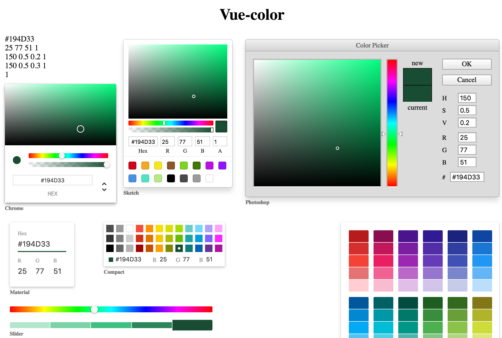

# vue-color 

[](https://www.npmjs.com/package/vue-color)

Color Pickers for Sketch, Photoshop, Chrome & more with Vue.js(vue2.0).  

## [Live demo](http://xiaokaike.github.io/vue-color/)



## Installation

### NPM
```bash
$ npm install vue-color
```

### CommonJS
```js
var Photoshop = require('vue-color/src/Photoshop.vue');

new Vue({
  components: {
    'Photoshop': Photoshop
  }
})
```

### ES6
```js
import { Photoshop } from 'vue-color'

new Vue({
  components: {
    'photoshop-picker': Photoshop
  }
})
```

### Browser globals
The `dist` folder contains `vue-color.js` and `vue-color.min.js` with all components exported in the <code>window.VueColor</code> object. These bundles are also available on NPM packages.

```html
<script src="path/to/vue.js"></script>
<script src="path/to/vue-color.min.js"></script>
<script>
  var Photoshop = VueColor.Photoshop
</script>
```

## Local setup

```
npm install
npm run dev
```

## Usage

```js

var colors = {
  hex: '#194d33',
  hex8: '#194D33A8',
  hsl: { h: 150, s: 0.5, l: 0.2, a: 1 },
  hsv: { h: 150, s: 0.66, v: 0.30, a: 1 },
  rgba: { r: 25, g: 77, b: 51, a: 1 },
  a: 1
}
// or
var colors = '#194d33'
// or
var colors = '#194D33A8'
// or 
var colors = { h: 150, s: 0.66, v: 0.30 }
// or 
var colors = { r: 255, g: 0, b: 0 }
// etc...

new Vue({
  el: '#app',
  components: {
    'material-picker': material,
    'compact-picker': compact,
    'swatches-picker': swatches,
    'slider-picker': slider,
    'sketch-picker': sketch,
    'chrome-picker': chrome,
    'photoshop-picker': photoshop
  },
  data () {
    return {
      colors
    }
  }
})

```

`colors` accepts either a string of a hex color '#333' or a object of rgb or hsl values `{ r: 51, g: 51, b: 51 }` or `{ h: 0, s: 0, l: .10 }`, whatever [tinycolor2](https://www.npmjs.com/package/tinycolor2) accepts as an input.

```html
<!-- suppose you have the data 'colors' in your component -->
<material-picker v-model="colors" />
<compact-picker v-model="colors" />
<swatches-picker v-model="colors" />
<slider-picker v-model="colors" />
<sketch-picker v-model="colors" />
<chrome-picker v-model="colors" />
<photoshop-picker v-model="colors" />
```

OR

```html
<chrome-picker :value="colors" @input="updateValue"></chrome-picker>
```

In some cases you can give the component a predefined set of colors with the property `presetColors` (for `Sketch` only) or `palette` (for `Compact` and `Grayscale`), by simply passing it an array with the color values as strings in any css compatible format.

```html
<sketch-picker 
  @input="updateValue"
  :value="colors"
  :preset-colors="[ 
    '#f00', '#00ff00', '#00ff0055', 'rgb(201, 76, 76)', 'rgba(0,0,255,1)', 'hsl(89, 43%, 51%)', 'hsla(89, 43%, 51%, 0.6)'
  ]"
></sketch-picker>

<compact-picker 
  @input="updateValue"
  :value="colors"
  :palette="[ 
    '#f00', '#00ff00', '#00ff0055', 'rgb(201, 76, 76)', 'rgba(0,0,255,1)', 'hsl(89, 43%, 51%)', 'hsla(89, 43%, 51%, 0.6)'
  ]"
></compact-picker>
```

## License

vue-color is licensed under [The MIT License](LICENSE).
