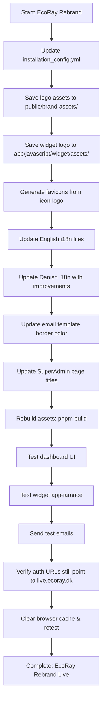

# EcoRay Rebrand - Final Implementation Specification

**Status:** Ready for Implementation  
**Date:** 2026-01-17  
**Approved by:** Client  

---

## ✅ Confirmed Decisions

- **Branding approach:** Rebrand to "Powered by EcoRay" (keep footer branding)
- **Logo assets:** Provided (full horizontal logo + icon)
- **Brand color:** `#287754` (forest green)
- **Target URL:** https://live.ecoray.dk (already configured, no changes needed)

---

## 🎨 Brand Assets

### Logos Provided

1. **Full horizontal logo** - Green sun/flower icon + "EcoRay" text
   - Use for: Dashboard header, email templates (if needed)
   - Save as: `public/brand-assets/logo.svg` and `logo_dark.svg`

2. **Icon only (square)** - Green sun/flower symbol
   - Use for: Favicon, widget thumbnail, small icons
   - Save as: `public/brand-assets/logo_thumbnail.svg`
   - Also save to: `app/javascript/widget/assets/images/logo.svg`

### Brand Colors

- **Primary green:** `#287754`
- **Use in:** Email template border, accent elements

---

## 📋 Implementation Checklist

### Phase 1: Configuration & Assets

#### 1. Update Central Configuration
**File:** `config/installation_config.yml`

```yaml
- name: INSTALLATION_NAME
  value: 'EcoRay'  # was: 'Chatwoot'

- name: BRAND_NAME
  value: 'EcoRay'  # was: 'Chatwoot'

- name: BRAND_URL
  value: 'https://www.ecoray.dk'  # was: 'https://www.chatwoot.com'

- name: WIDGET_BRAND_URL
  value: 'https://www.ecoray.dk'  # was: 'https://www.chatwoot.com'
```

#### 2. Save Logo Assets
Save the provided logos to:

- `public/brand-assets/logo.svg` (full horizontal logo)
- `public/brand-assets/logo_dark.svg` (same as logo.svg - for dark mode)
- `public/brand-assets/logo_thumbnail.svg` (icon only)
- `app/javascript/widget/assets/images/logo.svg` (icon only - for widget)

**Note:** Config already points to these paths, no path changes needed.

#### 3. Generate Favicons
From the icon-only logo, generate favicons at multiple sizes:

- `public/favicon-16x16.png`
- `public/favicon-32x32.png`
- `public/favicon-96x96.png`
- `public/android-icon-192x192.png`
- `public/apple-icon-*.png` (57x57, 60x60, 72x72, 76x76, 114x114, 120x120, 144x144, 152x152, 180x180)
- `public/ms-icon-144x144.png`

**Tool suggestion:** Use ImageMagick or online favicon generator

---

### Phase 2: I18n Updates (English Only per AGENTS.md)

#### 4. Widget I18n (English)
**File:** `app/javascript/widget/i18n/locale/en.json`

**Line 60:**
```json
"POWERED_BY": "Powered by EcoRay"
```
Was: `"POWERED_BY": "Powered by Chatwoot"`

#### 5. Survey I18n (English)
**File:** `app/javascript/survey/i18n/locale/en.json`

**Line 18:**
```json
"POWERED_BY": "Powered by EcoRay"
```
Was: `"POWERED_BY": "Powered by Chatwoot"`

#### 6. Dashboard I18n (English)
**File:** `app/javascript/dashboard/i18n/locale/en/inboxMgmt.json`

**Line 1024:**
```json
"BRANDING_TEXT": "Powered by EcoRay"
```
Was: `"BRANDING_TEXT": "Powered by Chatwoot"`

---

### Phase 3: Danish Widget Improvements

#### 7. Widget I18n (Danish)
**File:** `app/javascript/widget/i18n/locale/da.json`

**Update line 60 and improve English fallbacks:**

```json
{
  "THUMBNAIL": {
    "AUTHOR": {
      "NOT_AVAILABLE": "Ikke tilgængelig"
    }
  },
  "TEAM_AVAILABILITY": {
    "ONLINE": "Vi er online",
    "OFFLINE": "Vi er ikke tilgængelige i øjeblikket",
    "BACK_AS_SOON_AS_POSSIBLE": "Vi vender tilbage hurtigst muligt"
  },
  "REPLY_TIME": {
    "IN_A_FEW_MINUTES": "Svarer typisk på et par minutter",
    "IN_A_FEW_HOURS": "Svarer typisk på et par timer",
    "IN_A_DAY": "Svarer typisk på en dag",
    "BACK_IN_HOURS": "Vi er tilbage om {n} time | Vi er tilbage om {n} timer",
    "BACK_IN_MINUTES": "Vi er tilbage om {time} minutter",
    "BACK_AT_TIME": "Vi er tilbage kl. {time}",
    "BACK_ON_DAY": "Vi er tilbage {day}",
    "BACK_TOMORROW": "Vi er tilbage i morgen",
    "BACK_IN_SOME_TIME": "Vi er tilbage om et øjeblik"
  },
  "POWERED_BY": "Leveret af EcoRay"
}
```

**Changes:**
- Line 17: "Not available" → "Ikke tilgængelig"
- Line 23: English → "Vi vender tilbage hurtigst muligt"
- Lines 29-34: All REPLY_TIME strings translated to Danish
- Line 60: "Drevet af Chatwoot" → "Leveret af EcoRay"

---

### Phase 4: Email Template Updates

#### 8. Base Email Template
**File:** `app/views/layouts/mailer/base.liquid`

**Line 66 - Update border color:**
```html
<table class="main" width="100%" cellpadding="0" cellspacing="0" itemprop="action" itemscope itemtype="http://schema.org/ConfirmAction" style="border-radius: 6px; background-color: #fff; text-align:left; margin: 0; border: 1px solid #e9e9e9; border-top:3px solid #287754;" bgcolor="#fff">
```

**Change:** `border-top:3px solid #0080f8` → `border-top:3px solid #287754`

**Lines 79-86:** Footer already uses `global_config['BRAND_NAME']` - will auto-update ✅

---

### Phase 5: Static Page Titles

#### 9. Super Admin Login Page
**File:** `app/views/super_admin/devise/sessions/new.html.erb`

**Line 4:**
```html
<title>SuperAdmin | EcoRay</title>
```
Was: `<title>SuperAdmin | Chatwoot</title>`

#### 10. Onboarding Page
**File:** `app/views/installation/onboarding/index.html.erb`

**Line 4:**
```html
<title>SuperAdmin | EcoRay</title>
```
Was: `<title>SuperAdmin | Chatwoot</title>`

---

## 📊 Implementation Workflow



---

## 🧪 Testing Plan

### After Implementation

1. **Dashboard Testing**
   - [ ] Browser tab title shows "EcoRay"
   - [ ] Favicon displays EcoRay icon
   - [ ] Logo in header is EcoRay logo
   - [ ] Dark mode logo works correctly
   - [ ] No "Chatwoot" visible in UI

2. **Widget Testing**
   - [ ] Widget footer shows "Powered by EcoRay" (or "Leveret af EcoRay" in Danish)
   - [ ] Widget icon/logo is EcoRay
   - [ ] All Danish strings properly translated
   - [ ] Widget functionality unchanged

3. **Email Testing**
   - [ ] Send test password reset email
     - [ ] Top border is green (#287754)
     - [ ] Footer shows "Powered by EcoRay"
     - [ ] "Change password" link points to https://live.ecoray.dk ✅
   - [ ] Send test agent invite email
     - [ ] Same branding checks
     - [ ] Invite link points to https://live.ecoray.dk ✅
   - [ ] Send test conversation notification
     - [ ] EcoRay branding present

4. **Auth Flow Verification**
   - [ ] Password reset → lands on live.ecoray.dk ✅
   - [ ] Account confirmation → lands on live.ecoray.dk ✅
   - [ ] Agent invite → lands on live.ecoray.dk ✅

---

## 📁 Complete File List

### Files to Modify (10 files)

1. `config/installation_config.yml` - Update 4 values
2. `app/javascript/widget/i18n/locale/en.json` - Line 60
3. `app/javascript/survey/i18n/locale/en.json` - Line 18
4. `app/javascript/dashboard/i18n/locale/en/inboxMgmt.json` - Line 1024
5. `app/javascript/widget/i18n/locale/da.json` - Lines 17, 23, 29-34, 60
6. `app/views/layouts/mailer/base.liquid` - Line 66
7. `app/views/super_admin/devise/sessions/new.html.erb` - Line 4
8. `app/views/installation/onboarding/index.html.erb` - Line 4

### Assets to Create/Replace (4 core + ~15 favicons)

**Core logos:**
9. `public/brand-assets/logo.svg` - Full horizontal logo
10. `public/brand-assets/logo_dark.svg` - Full horizontal logo (same)
11. `public/brand-assets/logo_thumbnail.svg` - Icon only
12. `app/javascript/widget/assets/images/logo.svg` - Icon only

**Favicons (generate from icon):**
13-27. All favicon sizes listed in section 3 above

### Total: 10 modified files + 19 asset files = 29 files

---

## ⚠️ Critical Notes

1. **Authentication URLs are SAFE** ✅
   - All auth emails use `frontend_url()` helper
   - This reads from `ENV['FRONTEND_URL']` = https://live.ecoray.dk
   - No changes needed to auth flow

2. **Only Update English & Danish**
   - Per AGENTS.md guidelines
   - Community handles other language translations

3. **Asset Rebuild Required**
   - After changes: `pnpm build` or restart `pnpm dev`
   - This recompiles JavaScript with new i18n strings

4. **Browser Cache**
   - Clear cache to see favicon changes
   - Hard refresh (Cmd+Shift+R / Ctrl+Shift+F5)

5. **Email Sending**
   - Current Resend integration unchanged
   - Only templates/branding modified

---

## 🚀 Ready to Implement

All specifications finalized. Ready to switch to **Code mode** for implementation.

**Next step:** Switch to Code mode and execute this plan systematically.

---

**Specification prepared by:** Architect Mode  
**Last updated:** 2026-01-17
