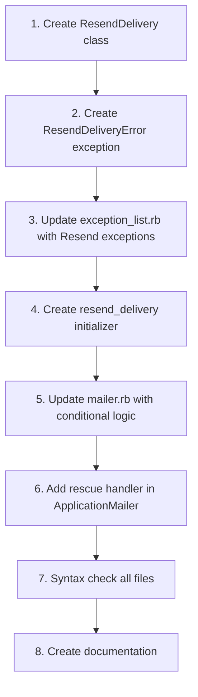

# SMTP to Resend HTTPS API Migration Plan

## Context
Railway blocks outbound SMTP connections (ports 465/587), causing `Net::OpenTimeout` errors when trying to send emails via Gmail or Resend SMTP. This plan migrates ALL outbound email delivery to use Resend's HTTPS API instead.

**Scope:** Outbound email only (agent invites, password resets, conversation notifications). No UI/branding/translation changes.

## Current State Analysis

### Email Configuration Location
- **Primary config:** [`config/initializers/mailer.rb`](config/initializers/mailer.rb)
  - Sets `delivery_method = :smtp` (unless test)
  - Builds SMTP settings from ENV variables
  - Falls back to `:sendmail` if `SMTP_ADDRESS` is blank
  - Uses `:letter_opener` in dev if enabled

- **Mailer base class:** [`app/mailers/application_mailer.rb`](app/mailers/application_mailer.rb)
  - Handles SMTP exceptions via `ExceptionList::SMTP_EXCEPTIONS`
  - Default from: `ENV['MAILER_SENDER_EMAIL']`

- **Exception handling:** [`lib/exception_list.rb`](lib/exception_list.rb)
  - Currently only handles `Net::SMTPSyntaxError`

### ENV Variables (already in Railway)
- `RESEND_API_KEY` - API key for Resend (currently same as SMTP_PASSWORD)
- `RESEND_FROM` - Optional sender (e.g., "EcoRay <no-reply@support.ecoray.dk>")
- `MAILER_SENDER_EMAIL` - Fallback sender email

## Implementation Architecture

### 1. ResendDelivery Class Design

**File:** `lib/resend_delivery.rb`

```ruby
# Handles email delivery via Resend's HTTPS API
# Compatible with ActionMailer delivery method interface
class ResendDelivery
  def initialize(settings = {})
    @settings = settings
  end

  def deliver!(mail)
    # Main delivery method called by ActionMailer
    # 1. Extract mail data (from, to, cc, bcc, subject, body)
    # 2. Build JSON payload for Resend API
    # 3. Send HTTP POST to https://api.resend.com/emails
    # 4. Handle response and errors
  end

  private

  def http_client
    # Create Net::HTTP client with timeouts
    # - URI: https://api.resend.com/emails
    # - open_timeout: ENV['RESEND_OPEN_TIMEOUT'] || 10 seconds
    # - read_timeout: ENV['RESEND_READ_TIMEOUT'] || 20 seconds
    # - use_ssl: true
  end

  def build_payload(mail)
    # Build Resend API payload:
    # {
    #   from: ENV['RESEND_FROM'] || ENV['MAILER_SENDER_EMAIL'] || mail.from.first,
    #   to: mail.to (array),
    #   cc: mail.cc (if present),
    #   bcc: mail.bcc (if present),
    #   subject: mail.subject,
    #   html: mail.html_part.decoded (if multipart),
    #   text: mail.text_part.decoded (if multipart)
    # }
    #
    # If not multipart, detect content type:
    # - If body contains HTML tags -> send as 'html'
    # - Otherwise -> send as 'text'
  end

  def detect_html?(body)
    # Check if body contains HTML tags
    # Look for: <html, <body, <div, <p, <br, <!DOCTYPE
  end

  def send_request(payload)
    # POST to Resend API with Authorization header
    # headers:
    #   - Authorization: Bearer #{ENV['RESEND_API_KEY']}
    #   - Content-Type: application/json
    #
    # Handle response:
    #   - 2xx: success
    #   - non-2xx: raise ResendDeliveryError with status + body (truncated to 2KB)
  end
end
```

**Key Design Decisions:**
- Use `Net::HTTP` directly (no external gems)
- Implement `deliver!(mail)` method (ActionMailer interface)
- Support multipart emails (HTML + text)
- Smart content-type detection for non-multipart emails
- Configurable timeouts via ENV variables
- Descriptive error messages without exposing API key

### 2. Error Handling Architecture

**New Custom Exception:** `ResendDeliveryError`

**File:** `lib/custom_exceptions/resend_delivery_error.rb`

```ruby
module CustomExceptions
  class ResendDeliveryError < StandardError
    attr_reader :http_status, :response_body

    def initialize(message, http_status: nil, response_body: nil)
      @http_status = http_status
      @response_body = response_body
      super(message)
    end
  end
end
```

**Update Exception List:** [`lib/exception_list.rb`](lib/exception_list.rb)

Add new constant:
```ruby
RESEND_EXCEPTIONS = [
  CustomExceptions::ResendDeliveryError,
  Net::OpenTimeout,
  Net::ReadTimeout,
  SocketError,
  Errno::ECONNREFUSED,
  Errno::ECONNRESET,
  OpenSSL::SSL::SSLError
].freeze
```

**Update ApplicationMailer:** [`app/mailers/application_mailer.rb`](app/mailers/application_mailer.rb)

Add rescue for Resend exceptions:
```ruby
rescue_from(*ExceptionList::RESEND_EXCEPTIONS, with: :handle_resend_exceptions)

private

def handle_resend_exceptions(exception)
  Rails.logger.warn "Failed to send email via Resend API"
  Rails.logger.error "Exception: #{exception.class.name} - #{exception.message}"
  Rails.logger.error "HTTP Status: #{exception.http_status}" if exception.respond_to?(:http_status)
end
```

### 3. Delivery Method Registration

**File:** `config/initializers/resend_delivery.rb`

```ruby
# Register Resend API as a custom ActionMailer delivery method
require 'resend_delivery'

ActionMailer::Base.add_delivery_method(:resend_api, ResendDelivery)

Rails.logger.info "Resend API delivery method registered"
```

### 4. Configuration Updates

**File:** `config/initializers/mailer.rb`

**Strategy:** Add Resend API configuration AFTER existing SMTP setup, with conditional logic:

```ruby
# After line 31 (existing SMTP setup)...

# Resend API delivery method (fallback from SMTP when blocked)
if ENV['RESEND_API_KEY'].present? && !Rails.env.test?
  config.action_mailer.delivery_method = :resend_api
  Rails.logger.info "✓ Email delivery: Resend HTTPS API (SMTP blocked workaround)"
else
  # Keep existing SMTP/sendmail configuration
  if ENV['SMTP_ADDRESS'].present?
    Rails.logger.info "✓ Email delivery: SMTP (#{ENV['SMTP_ADDRESS']}:#{ENV['SMTP_PORT']})"
  else
    Rails.logger.info "✓ Email delivery: sendmail"
  end
end
```

**Priority order:**
1. If `RESEND_API_KEY` is present → use `:resend_api`
2. Else if `SMTP_ADDRESS` is present → use `:smtp`
3. Else → use `:sendmail`
4. Test environment → ignore (uses `:test`)
5. Dev with `LETTER_OPENER` → use `:letter_opener`

### 5. Boot Logging

Add informative log messages during Rails initialization showing which delivery method is active:
- "✓ Email delivery: Resend HTTPS API (SMTP blocked workaround)"
- "✓ Email delivery: SMTP (smtp.example.com:587)"
- "✓ Email delivery: sendmail"

**Critical:** Never log API keys or sensitive credentials.

## Implementation Steps (Sequential)



## Files to Create

1. **`lib/resend_delivery.rb`** - Main delivery class (NEW)
2. **`lib/custom_exceptions/resend_delivery_error.rb`** - Custom exception (NEW)
3. **`config/initializers/resend_delivery.rb`** - Registration initializer (NEW)

## Files to Modify

1. **`lib/exception_list.rb`** - Add `RESEND_EXCEPTIONS` constant
2. **`config/initializers/mailer.rb`** - Add conditional Resend API logic
3. **`app/mailers/application_mailer.rb`** - Add Resend exception handler

## Resend API Specification

### Endpoint
```
POST https://api.resend.com/emails
```

### Headers
```
Authorization: Bearer {RESEND_API_KEY}
Content-Type: application/json
```

### Request Body Example (Multipart)
```json
{
  "from": "EcoRay <no-reply@support.ecoray.dk>",
  "to": ["user@example.com"],
  "cc": ["cc@example.com"],
  "subject": "Welcome to Chatwoot",
  "html": "<html><body><h1>Welcome!</h1></body></html>",
  "text": "Welcome!"
}
```

### Response
- **Success:** HTTP 200/201 with JSON body containing email ID
- **Error:** HTTP 4xx/5xx with JSON error details

### Timeouts
- **open_timeout:** 10 seconds (configurable via `RESEND_OPEN_TIMEOUT`)
- **read_timeout:** 20 seconds (configurable via `RESEND_READ_TIMEOUT`)

## Testing Strategy

### Syntax Validation
```bash
bundle exec ruby -c lib/resend_delivery.rb
bundle exec ruby -c lib/custom_exceptions/resend_delivery_error.rb
bundle exec ruby -c config/initializers/resend_delivery.rb
```

### Manual Testing (on Railway)
1. Deploy with `RESEND_API_KEY` set
2. Check boot logs for "✓ Email delivery: Resend HTTPS API"
3. Trigger email actions:
   - Invite agent → checks agent invitation emails
   - Reset password → checks password reset emails
   - Conversation notification → checks notification emails
4. Monitor Sidekiq for errors
5. Check Resend dashboard for sent emails

### Rollback Plan
If issues occur, simply remove or unset `RESEND_API_KEY` from Railway ENV variables. The system will fall back to SMTP/sendmail automatically.

## Content Type Detection Logic

For non-multipart emails, detect if body is HTML:

```ruby
def detect_html?(body)
  body_str = body.to_s.strip
  # Check for common HTML patterns
  html_patterns = [
    /<html/i,
    /<body/i,
    /<div/i,
    /<p>/i,
    /<br>/i,
    /<!DOCTYPE/i
  ]
  html_patterns.any? { |pattern| body_str.match?(pattern) }
end
```

## Error Handling Examples

### Scenario 1: Invalid API Key
```
HTTP 401 Unauthorized
→ ResendDeliveryError raised
→ Logged: "Failed to send email via Resend API"
→ Logged: "Exception: CustomExceptions::ResendDeliveryError - HTTP 401: Invalid API key"
```

### Scenario 2: Network Timeout
```
Net::OpenTimeout
→ Rescued by RESEND_EXCEPTIONS
→ Logged: "Failed to send email via Resend API"
→ Logged: "Exception: Net::OpenTimeout - execution expired"
```

### Scenario 3: Rate Limit
```
HTTP 429 Too Many Requests
→ ResendDeliveryError raised
→ Logged: "Failed to send email via Resend API"
→ Logged: "Exception: CustomExceptions::ResendDeliveryError - HTTP 429: Rate limit exceeded"
→ Response body (truncated): {"error": "Rate limit exceeded, retry after..."}
```

## Security Considerations

1. **Never log API keys** - All logging must exclude sensitive credentials
2. **Truncate response bodies** - Limit to 2KB in error messages to avoid log bloat
3. **Use ENV variables** - All configuration via environment, no hardcoded values
4. **HTTPS only** - Always use SSL for API connections
5. **Secure timeouts** - Prevent hanging connections with reasonable timeout values

## Benefits of This Approach

1. **Minimal changes** - No modification to existing mailer code
2. **Reversible** - Simple ENV variable toggle to switch between methods
3. **No new gems** - Uses standard library Net::HTTP
4. **Compatible** - Follows ActionMailer delivery method interface
5. **Maintainable** - Clear separation of concerns
6. **Observable** - Comprehensive logging without exposing secrets
7. **Resilient** - Proper error handling and timeouts

## ENV Variables Summary

### Required for Resend API
- `RESEND_API_KEY` - Resend API authentication token

### Optional
- `RESEND_FROM` - Default sender (falls back to `MAILER_SENDER_EMAIL`)
- `RESEND_OPEN_TIMEOUT` - Connection timeout in seconds (default: 10)
- `RESEND_READ_TIMEOUT` - Read timeout in seconds (default: 20)

### Existing (preserved)
- `MAILER_SENDER_EMAIL` - Used as fallback sender
- `SMTP_*` - All SMTP variables remain for fallback capability

## Success Criteria

- [x] All outbound emails use Resend HTTPS API when `RESEND_API_KEY` is set
- [x] Multipart emails (HTML + text) are properly handled
- [x] Non-multipart emails detect content type correctly
- [x] Network errors are caught and logged without crashing
- [x] API errors include HTTP status and response details
- [x] Boot logs clearly indicate which delivery method is active
- [x] No API keys or secrets appear in logs
- [x] System falls back to SMTP if Resend API key is unset
- [x] All Ruby syntax is valid
- [x] Zero breaking changes to existing mailer code

## Implementation Checklist

- [ ] Create `lib/resend_delivery.rb`
- [ ] Create `lib/custom_exceptions/resend_delivery_error.rb`
- [ ] Update `config/initializers/resend_delivery.rb`
- [ ] Update `lib/exception_list.rb`
- [ ] Update `config/initializers/mailer.rb`
- [ ] Update `app/mailers/application_mailer.rb`
- [ ] Run syntax checks on all modified files
- [ ] Document changes in commit message
- [ ] Test on Railway environment
- [ ] Monitor Sidekiq and Resend dashboard

## Commit Message Template

```
feat(mailer): migrate from SMTP to Resend HTTPS API

Railway blocks outbound SMTP connections (ports 465/587), causing
Net::OpenTimeout when sending emails. This commit migrates all
outbound email delivery to use Resend's HTTPS API instead.

Changes:
- Add ResendDelivery class using Net::HTTP (lib/resend_delivery.rb)
- Add ResendDeliveryError exception handling
- Register :resend_api delivery method in initializer
- Update mailer config to use Resend when RESEND_API_KEY is present
- Add comprehensive error handling and logging
- Support multipart emails and automatic content-type detection

The system falls back to SMTP/sendmail if RESEND_API_KEY is unset,
making this change fully reversible.

Env variables:
- RESEND_API_KEY (required for Resend API)
- RESEND_FROM (optional, falls back to MAILER_SENDER_EMAIL)
- RESEND_OPEN_TIMEOUT (optional, default 10s)
- RESEND_READ_TIMEOUT (optional, default 20s)
```
