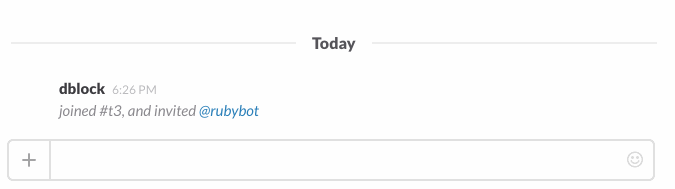
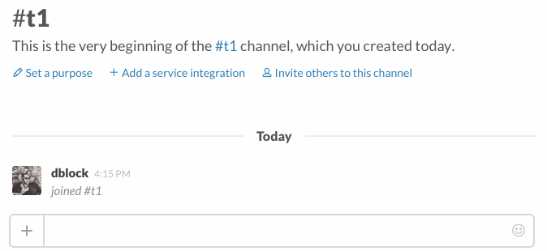

Slack Ruby Client
=================

[](http://badge.fury.io/rb/slack-ruby-client)
[](https://github.com/slack-ruby/slack-ruby-client/actions/workflows/integration_test.yml)
[](https://github.com/slack-ruby/slack-ruby-client/actions/workflows/test.yml)
[](https://coveralls.io/github/slack-ruby/slack-ruby-client?branch=master)

A Ruby client for the Slack [Web](https://api.slack.com/web), [RealTime Messaging](https://api.slack.com/rtm) and [Events](https://api.slack.com/events-api) APIs. Comes with a handy command-line client, too. If you are not familiar with these concepts, you might want to watch [this video](http://code.dblock.org/2016/03/11/your-first-slack-bot-service-video.html).


# Table of Contents

- [Useful to Me?](#useful-to-me)
- [Stable Release](#stable-release)
- [Installation](#installation)
- [Usage](#usage)
  - [Create a New Bot Integration](#create-a-new-bot-integration)
  - [OAuth Code Grant](#oauth-code-grant)
  - [Using an API Token](#using-an-api-token)
  - [Global Settings](#global-settings)
  - [Web Client](#web-client)
    - [Web Client Examples](#web-client-examples)
      - [Test Auth](#test-auth)
      - [Send Messages](#send-messages)
      - [List Channels](#list-channels)
      - [Upload a File](#upload-a-file)
      - [Get Channel Info](#get-channel-info)
      - [Get User Info](#get-user-info)
      - [Search for a User](#search-for-a-user)
      - [Other](#other)
    - [JSON Arguments](#json-arguments)
    - [Web Client Options](#web-client-options)
    - [Pagination Support](#pagination-support)
    - [Character Encoding](#character-encoding)
    - [Error Handling](#error-handling)
      - [Slack Errors](#slack-errors)
      - [Rate Limiting](#rate-limiting)
      - [Other Errors](#other-errors)
  - [RealTime Client](#realtime-client)
    - [Configuring Slack::RealTime::Client](#configuring-slackrealtimeclient)
      - [Caveats](#caveats)
        - [websocket_ping](#websocket_ping)
    - [RealTime Store](#realtime-store)
      - [Slack::RealTime::Stores::Starter](#slackrealtimestoresstarter)
      - [Slack::RealTime::Stores::Store](#slackrealtimestoresstore)
  - [Combining RealTime and Web Clients](#combining-realtime-and-web-clients)
    - [Concurrency](#concurrency)
      - [Async](#async)
  - [Events API](#events-api)
    - [Configuring Slack::Events](#configuring-slackevents)
    - [Verifying the Request Signature](#verifying-the-request-signature)
  - [Message Handling](#message-handling)
    - [Formatting Messages](#formatting-messages)
      - [Date and Time Formatting](#date-and-time-formatting)
      - [Channel ID Formatting](#channel-id-formatting)
      - [User ID Formatting](#user-id-formatting)
      - [Group ID Formatting](#group-id-formatting)
      - [URL Formatting](#url-formatting)
      - [Markdown Formatting](#markdown-formatting)
    - [Parsing Messages](#parsing-messages)
      - [Unescaping Message Content](#unescaping-message-content)
      - [Escaping Message Content](#escaping-message-content)
  - [Command-Line Client](#command-line-client)
    - [Authenticate with Slack](#authenticate-with-slack)
    - [Send a Message](#send-a-message)
    - [Get Channel Info](#get-channel-info-1)
    - [List Users](#list-users)
- [Enterprise Support](#enterprise-support)
- [History](#history)
- [Security](#security)
- [Contributing](#contributing)
- [Copyright and License](#copyright-and-license)

## Useful to Me?

* This library lets you send messages to Slack via the Web API, send and receive messages via the Real Time Messaging API, and facilitates integration with the Events API.
* To write a complete bot for Slack you need more than this library, and it's much easier to start with [slack-ruby-bot-server-events](https://github.com/slack-ruby/slack-ruby-bot-server-events).
* To respond to slash commands, interactive components, or events at the lowest level, implement a web application using your favorite web framework, and use this library to call the Slack Web API, and to verify that events are coming from Slack.

## Stable Release

You're reading the documentation for the **stable** release of slack-ruby-client 2.7.0. See [UPGRADING](UPGRADING.md) when upgrading from an older version.

## Installation

Add to Gemfile.

```
gem 'slack-ruby-client'
```

If you're going to be using the RealTime client, add `async-websocket`. See below for more information about concurrency.

```
gem 'async-websocket', '~> 0.8.0'
```

Run `bundle install`.

## Usage

### Create a New Bot Integration

To integrate your bot with Slack, you must first create a new [Slack App](https://api.slack.com/apps).

### OAuth Code Grant

Once created, go to the app's Basic Info tab and grab the Client ID and Client Secret. You'll need these in order complete an [OAuth Workflow](https://api.slack.com/authentication/oauth-v2). A working sample that starts a local web server and obtains a bot or a user token for your app using OAuth v2 is available in [examples/oauth_v2](examples/oauth_v2).

### Using an API Token

Although OAuth is recommended, you can also [generate an API token](https://api.slack.com/tutorials/tracks/getting-a-token) for your app and use it for some interactions.

```ruby
Slack.configure do |config|
  config.token = ENV['SLACK_API_TOKEN']
end
```

This sets a global default token. You can also pass a token into the initializer of both `Slack::Web::Client` and `Slack::RealTime::Client` or configure those separately via `Slack::Web::Config.configure` and `Slack::RealTime::Config.configure`. The instance token will be used over the client type token over the global default.

### Global Settings

The following global settings are supported via `Slack.configure`.

setting      | description
-------------|-------------------------------------------------------------------------------------------------
token        | Slack API token.
logger       | An optional logger, defaults to `::Logger.new(STDOUT)` at `Logger::WARN` level.

### Web Client

The Slack Web API allows you to build applications that interact with Slack.

#### Web Client Examples

Here are some examples of how to use the web client with the Web API.

##### Test Auth

```ruby
client = Slack::Web::Client.new
client.auth_test
```

##### Send Messages

Send messages with [chat_PostMessage](https://api.slack.com/methods/chat.postMessage).

```ruby
client.chat_postMessage(channel: '#general', text: 'Hello World', as_user: true)
```

See a fully working example in [examples/hi_web](examples/hi_web/hi.rb).



##### List Channels

List channels with [conversations_list](https://api.slack.com/methods/conversations.list).

```ruby
channels = client.conversations_list.channels

general_channel = channels.detect { |c| c.name == 'general' }
```

##### Upload a File

Upload files with [sequenced API calls](https://api.slack.com/messaging/files#uploading_files).

This library provides a helper method `files_upload_v2` that wraps the three separate API calls.

Upload a single file.

```ruby
client.files_upload_v2(
  # required options
  filename: 'results.pdf', # this is used for the file title, unless a :title option is provided
  content: File.read('/users/me/results.pdf'), # the string contents of the file

  # optional options
  channels: ['C000000', 'C000001'], # channel IDs to share the file in (:channel_id, :channel, or :channels are all supported)
  initial_comment: 'Sharing the Q1 results :tada:', # the message that is included with the file share thread
  snippet_type: 'text', # the type of snippet
  title: 'Q1 Results', # sets the title of the file, overriding the filename
  thread_ts: '1738331487.481469' # specifies a thread to add this file to
)
```

Upload multiple files.

```ruby
client.files_upload_v2(
  files: [
    { filename: 'report.pdf', content: File.read('/users/me/report.pdf'), title: 'Monthly Report' },
    { filename: 'data.csv', content: File.read('/users/me/data.csv'), title: 'Raw Data' }
  ],
  channels: ['#general'],
  initial_comment: 'Here are the monthly results!'
)
```

You can use a channel ID passed as `channel_id`, a single channel as `channel`, an array of channel IDs as `channels`, or a channel name or names (prefixed with `#`) in `files_upload_v2`. Lookup by name is not supported by the Slack API and this method called invokes `conversations_list` in order to locate the channel ID. This invocation can have a cost if you have many Slack channels and is only recommended when you intend to list channels anyway.

Note: This library includes a `files_upload` method that uses a deprecated endpoint `files.upload` that will [no longer be supported on 3/11/2025](https://api.slack.com/methods/files.upload#markdown).

```ruby
client.files_upload(
  channels: '#general',
  as_user: true,
  file: Faraday::Multipart::FilePart.new('/path/to/avatar.jpg', 'image/jpeg'),
  title: 'My Avatar',
  filename: 'avatar.jpg',
  initial_comment: 'Attached a selfie.'
)
```

##### Get Channel Info

You can use a channel ID or name (prefixed with `#`) in all functions that take a `:channel` argument. Lookup by name is not supported by the Slack API and the `channels_id` method called invokes `conversations_list` in order to locate the channel ID. This invocation can have a cost if you have many Slack channels. In this scenario, we encourage you to use channel id.

```ruby
client.conversations_info(channel: 'C04KB5X4D') # calls conversations_info
```

```ruby
client.conversations_info(channel: '#general') # calls conversations_list followed by conversations_info
```

##### Get User Info

You can use a user ID or name (prefixed with `@`) in all functions that take a `:user` argument. Lookup by name is not supported by the Slack API and the `users_id` method called invokes `users_list` in order to locate the user ID.

```ruby
client.users_info(user: 'U092BDCLV') # calls users_info
```

```ruby
client.users_info(user: '@dblock') # calls users_list followed by users_info
```

##### Search for a User

Constructs an in-memory index of users and searches it. If you want to use this functionality, add the [picky](https://github.com/floere/picky) gem to your project's Gemfile.

```ruby
client.users_search(user: 'dblock')
```

##### Other

Refer to the [Slack Web API Method Reference](https://api.slack.com/methods) for the list of all available functions.

#### JSON Arguments

The Web API expects certain arguments to be sent as JSON-encoded strings. With the client you can pass these args as ruby hashes or arrays and they will be converted automatically to JSON, or you can provide the JSON directly.

```ruby
# As ruby objects
client.chat_postMessage(
  channel: 'C123456',
  text: 'Hello World',
  blocks: [{type: 'section', text: {type: 'mrkdwn', text: 'Hello World'}}]
)

# As a JSON string
client.chat_postMessage(
  channel: 'C123456',
  text: 'Hello World',
  blocks: JSON.dump([{type: 'section', text: {type: 'mrkdwn', text: 'Hello World'}}])
)
client.chat_postMessage(
  channel: 'C123456',
  text: 'Hello World',
  blocks: '[{"type":"section","text":{"type":"mrkdwn","text":"Hello World"}}]'
)
```

#### Web Client Options

You can configure the Web client either globally or via the initializer.

```ruby
Slack::Web::Client.configure do |config|
  config.user_agent = 'Slack Ruby Client/1.0'
end
```

```ruby
client = Slack::Web::Client.new(user_agent: 'Slack Ruby Client/1.0')
```

The following settings are supported.

setting                      | description
-----------------------------|-------------------------------------------------------------------------------------------------
token                        | Slack API token.
user_agent                   | User-agent, defaults to _Slack Ruby Client/version_.
proxy                        | Optional HTTP proxy.
ca_path                      | Optional SSL certificates path.
ca_file                      | Optional SSL certificates file.
endpoint                     | Slack endpoint, default is _https://slack.com/api_.
logger                       | Optional `Logger` instance that logs HTTP requests.
timeout                      | Optional open/read timeout in seconds.
open_timeout                 | Optional connection open timeout in seconds.
default_page_size            | Optional page size for paginated requests, default is _100_.
conversations_id_page_size   | Optional page size for conversations_list requests made when calculating conversation id from a conversation name, default is _nil_, which will use the default_page_size.
users_id_page_size           | Optional page size for users_list requests made when calculating user id from a user name, default is _nil_, which will use the default_page_size.
default_max_retries          | Optional number of retries for paginated requests, default is _100_.
adapter                      | Optional HTTP adapter to use, defaults to `Faraday.default_adapter`.

You can also pass request options, including `timeout` and `open_timeout` into individual calls.

```ruby
client.conversations_list(request: { timeout: 180 })
```

You can also control what proxy options are used by modifying the `http_proxy` environment variable per [Net::HTTP's documentation](https://docs.ruby-lang.org/en/2.0.0/Net/HTTP.html#class-Net::HTTP-label-Proxies).

Note that Docker on OSX seems to incorrectly set the proxy, causing `Faraday::ConnectionFailed, ERROR -- : Failed to open TCP connection to : (getaddrinfo: Name or service not known)`. You might need to manually unset `http_proxy` in that case, eg. `http_proxy="" bundle exec ruby ./my_bot.rb`.

#### Pagination Support

The Web client natively supports [cursor pagination](https://api.slack.com/docs/pagination#cursors) for methods that allow it, such as `users_list`. Supply a block and the client will make repeated requests adjusting the value of `cursor` with every response. The default limit is set to 100 and can be adjusted via `Slack::Web::Client.config.default_page_size` or by passing it directly into the API call.

```ruby
all_members = []
client.users_list(presence: true, limit: 10) do |response|
  all_members.concat(response.members)
end
all_members # many thousands of team members retrieved 10 at a time
```

When using cursor pagination the client will automatically pause and then retry the request if it runs into Slack rate limiting. (It will pause according to the `Retry-After` header in the 429 response before retrying the request.) If it receives too many rate-limited responses in a row it will give up and raise an error. The default number of retries is 100 and can be adjusted via `Slack::Web::Client.config.default_max_retries` or by passing it directly into the method as `max_retries`.

You can also proactively avoid rate limiting by adding a pause between every paginated request with the `sleep_interval` parameter, which is given in seconds.

```ruby
all_members = []
client.users_list(presence: true, limit: 10, sleep_interval: 5, max_retries: 20) do |response|
  # pauses for 5 seconds between each request
  # gives up after 20 consecutive rate-limited responses
  all_members.concat(response.members)
end
all_members # many thousands of team members retrieved 10 at a time
```

#### Character Encoding

Note that Slack expects `text` to be UTF-8 encoded. If your messages appear with text such as `BAD+11` in Slack, check `text.encoding` and `.encode(Encoding::UTF_8)` your messages before sending them to Slack.

```ruby
text = 'characters such as "Ñ", "Á", "É"'
text.encoding
=> #<Encoding:UTF-8>
client.chat_postMessage(channel: '#general', text: text, as_user: true)
# renders 'characters such as "Ñ", "Á", "É"' in Slack

text = text.encode(Encoding::ISO_8859_1)
text.encoding
# => #<Encoding:ISO-8859-1>
client.chat_postMessage(channel: '#general', text: text, as_user: true)
# renders 'characters such as "BAD+11", "", "BAD+9"' in Slack
```

#### Error Handling

##### Slack Errors

If Slack returns an error for the request, then an error will be raised. The error class is specific to the type of error that Slack returns. For instance if Slack returns `account_inactive` then the error will be `Slack::Web::Api::Errors::AccountInactive`. This allows you to handle certain types of errors as needed:

```ruby
rescue Slack::Web::Api::Errors::AccountInactive => e
  # deal with inactive account
end
```

All of these errors inherit from `Slack::Web::Api::Errors::SlackError`, so you can handle or silence all errors if necessary:

```ruby
rescue Slack::Web::Api::Errors::SlackError => e
  # capture all Slack errors
end
```

If there's a new error type that is not yet known by this library, then it will raise `Slack::Web::Api::Errors::SlackError`. (Update the Web API if you find that errors are missing — see [CONTRIBUTING](CONTRIBUTING.md).)

In all of these cases the error message contains the error code, which is also accessible with `slack_error.error`. In case of multiple errors, the error message contains the error codes separated by commas, or they are accessible as an array with `slack_error.errors`. The original response is also accessible using the `response` attribute. The `response_metadata` is accessible with `slack_error.response_metadata`.

##### Rate Limiting

If you exceed [Slack’s rate limits](https://api.slack.com/docs/rate-limits), a `Slack::Web::Api::Errors::TooManyRequestsError` will be raised instead. (This does not inherit from `Slack::Web::Api::Errors::SlackError`.)

##### Other Errors

When Slack is temporarily unavailable a subclass of `Slack::Web::Api::Errors::ServerError` will be raised and the original `Faraday::Error` will be accesible via `exception.cause`. (Starting with 0.18.0 this is no longer a subclass of `Slack::Web::Api::Errors::SlackError`.)

Specifically `Slack::Web::Api::Errors::ParsingError` will be raised on non-json response (i.e. 200 OK with `Slack unavailable` HTML page) and `Slack::Web::Api::Errors::HttpRequestError` subclasses for connection failures (`Slack::Web::Api::Errors::TimeoutError` for read/open timeouts & `Slack::Web::Api::Errors::UnavailableError` for 5xx HTTP responses).

In any other case, a `Faraday::ClientError` will be raised.

### RealTime Client

The Real Time Messaging API is a WebSocket-based API that allows you to receive events from Slack in real time and send messages as user.

```ruby
client = Slack::RealTime::Client.new

client.on :hello do
  puts "Successfully connected, welcome '#{client.self.name}' to the '#{client.team.name}' team at https://#{client.team.domain}.slack.com."
end

client.on :message do |data|
  case data.text
  when 'bot hi' then
    client.message(channel: data.channel, text: "Hi <@#{data.user}>!")
  when /^bot/ then
    client.message(channel: data.channel, text: "Sorry <@#{data.user}>, what?")
  end
end

client.on :close do |_data|
  puts "Client is about to disconnect"
end

client.on :closed do |_data|
  puts "Client has disconnected successfully!"
end

client.start!
```

You can send typing indicators with `typing`.

```ruby
client.typing channel: data.channel
```

You can send a ping with `ping`.

```ruby
client.ping
```

#### Configuring Slack::RealTime::Client

You can configure the RealTime client either globally or via the initializer.

```ruby
Slack::RealTime::Client.configure do |config|
  config.websocket_ping = 42
end
```

```ruby
client = Slack::RealTime::Client.new(websocket_ping: 42)
```

The following settings are supported.

setting         | description
----------------|-----------------------------------------------------------------------------------------------------
token           | Slack API token.
websocket_ping  | How long the socket can be idle before sending a ping message to confirm it's still connected, default is 30.
websocket_proxy | Connect via proxy, include `:origin` and `:headers`.
start_options   | Options to pass to `rtm.connect`, default is `{ request: { timeout: 180 } }`.
store_class     | Local store class, default is an in-memory `Slack::RealTime::Stores::Starter`.
store_options   | Options to initialize the store, default is `{}`.
async_handlers  | Option to run handlers asynchronously. Valid options are `:all` or `:none`, default is `:none`.
logger          | Optional `Logger` instance that logs RealTime requests and socket data.

Note that the RealTime client uses a Web client to obtain the WebSocket URL via [rtm.connect](https://api.slack.com/methods/rtm.connect). While `token` and `logger` options are passed down from the RealTime client, you may also configure Web client options via `Slack::Web::Client.configure` as described above.

See a fully working example in [examples/hi_real_time_and_web](examples/hi_real_time_and_web/hi.rb).



##### Caveats

###### `websocket_ping`

This setting determines how long the socket can be idle before sending a ping message to confirm it's still connected.

It's important to note that if a ping message was sent and no response was received within the amount of time specified in `websocket_ping` the client will attempt to reestablish it's connection to the message server.

Note that the ping may take between `websocket_ping` and `websocket_ping * 3/2` seconds to actually trigger when there is no activity on the socket. This is because the timer that checks whether to ping is triggered at every `websocket_ping / 2` interval.

To disable this feature set `websocket_ping` to 0.

#### RealTime Store

The RealTime client exposes and maintains a local store upon successful connection.
Event hooks keep the store's cached data up-to-date.

Tracking with a local store can be disabled with `Slack::RealTime::Client.new(store_class: nil)`.

##### `Slack::RealTime::Stores::Starter`

A small store that only caches and tracks data returned in the [rtm.connect](https://api.slack.com/methods/rtm.connect#examples) response.
This store provides `self` and `team` for accessing the limited data about the authenticated user and its workspace, but does not cache other users or bots, channels, or direct messages.

##### `Slack::RealTime::Stores::Store`

A more complete store that tracks most changes visible to the authenticated user.

You can see all of the cache types in the table below (each is a hash indexed by its objects' `id`).

Cache              | Description
-------------------|-------------------------------------------------------------------------------------------------
`teams`            | Workspaces (teams). Will likely contain only one `team`.
`users`            | All [user](https://api.slack.com/types/user) objects, including `self`.
`bots`             | All [bot users](https://api.slack.com/bot-users) (from Slack Apps and legacy custom integrations).
`public_channels`  | Public [conversation](https://api.slack.com/types/conversation) objects.
`private_channels` | Private [conversation](https://api.slack.com/types/conversation) and [group](https://api.slack.com/types/group) objects with the authenticated user as a member.
`ims`              | Visible [im](https://api.slack.com/types/im) objects, direct message channels with the authenticated user.
`mpims`            | Visible [mpim](https://api.slack.com/types/mpim) objects, multiparty direct message channels that include the authenticated user.

By default, none of these caches are initialized with data beyond what is returned from [rtm.connect](https://api.slack.com/methods/rtm.connect#examples), same as [Slack::RealTime::Stores::Starter](#slackrealtimestoresstarter).
When configured, this store initializes its caches by making additional calls to Web API methods upon successful connection to the RTM API (i.e. "hello" message).

Configure by specifying which caches to fetch:
```ruby
Slack::RealTime::Client.configure do |config|
  config.store_class = Slack::RealTime::Stores::Store
  config.store_options = { caches: %i[teams users public_channels private_channels ims] }
end
```
or with the `:all` option:
```ruby
Slack::RealTime::Client.configure do |config|
  config.store_class = Slack::RealTime::Stores::Store
  config.store_options = { caches: :all }
end
```

Note: For `teams`, this makes a single call to `team.info`, while for `users` and all conversation-like types, this makes paginated calls to `users.list` and `conversations.list` respectively.
Only `bots` requires a separate call for every bot user, so may be slow if your workplace has a lot of bot users.

### Combining RealTime and Web Clients

Since the Web client is used to obtain the RealTime client's WebSocket URL, you can continue using the Web client in combination with the RealTime client.

```ruby
client = Slack::RealTime::Client.new

client.on :message do |data|
  case data.text
  when 'bot hi' then
    client.web_client.chat_postMessage(channel: data.channel, text: "Hi <@#{data.user}>!")
  when /^bot/ then
    client.web_client.chat_postMessage(channel: data.channel, text: "Sorry <@#{data.user}>, what?")
  end
end

client.start!
```

See a fully working example in [examples/hi_real_time_and_web](examples/hi_real_time_and_web/hi.rb).


#### Concurrency

`Slack::RealTime::Client` needs help from a concurrency library and supports [Async](https://github.com/socketry/async).

```ruby
Slack::RealTime.configure do |config|
  config.concurrency = Slack::RealTime::Concurrency::Async
end
```

Use `client.start_async` instead of `client.start!`. A good example of such application is [slack-ruby-bot-server](https://github.com/slack-ruby/slack-ruby-bot-server).

```ruby
client = Slack::RealTime::Client.new

client.start_async
```

##### Async

Add `async-websocket` to your Gemfile.

```
gem 'async-websocket'
```

See a fully working example in [examples/hi_real_time_async_async](examples/hi_real_time_async_async/hi.rb).

### Events API

This library provides limited support for the [Slack Events API](https://api.slack.com/events-api).

#### Configuring Slack::Events

You can configure Events support globally.

```ruby
Slack::Events.configure do |config|
  config.signing_secret = 'secret'
end
```

The following settings are supported.

setting               | description
----------------------|---------------------------------------------------------------------------------------------------
signing_secret        | Slack signing secret, defaults is `ENV['SLACK_SIGNING_SECRET']`.
signature_expires_in  | Signature expiration window in seconds, default is `300`.

#### Verifying the Request Signature

Slack signs its requests using a secret that's unique to your app. Verify incoming HTTP requests as follows.

```ruby
slack_request = Slack::Events::Request.new(http_request)
slack_request.verify!
```

To specify secrets on a per-request basis:
```ruby
Slack::Events::Request.new(http_request,
                           signing_secret: signing_secret,
                           signature_expires_in: signature_expires_in)
```

The `verify!` call may raise `Slack::Events::Request::MissingSigningSecret`, `Slack::Events::Request::InvalidSignature` or `Slack::Events::Request::TimestampExpired` errors.

### Message Handling

All text in Slack uses the same [system of formatting and escaping](https://api.slack.com/docs/formatting): chat messages, direct messages, file comments, etc. [Slack::Messages::Formatting](lib/slack/messages/formatting.rb) provides convenience methods to format and parse messages.

#### Formatting Messages

`Slack::Messages::Formatting` provides a number of methods for formatting objects that you can then embed in outgoing messages.

##### Date and Time Formatting

You can embed a pre-formatted date in a message as a string like any other text, but using Slack's date formatting allows you to display dates based on user preferences for dates and times, incorporating users' local time zones, and optionally using relative values like "yesterday", "today", or "tomorrow" when appropriate.

```ruby
date = Time.now

# Display date as `YYYY-MM-DD HH:MM:SS`
Slack::Messages::Formatting.date(date)
  # => "<!date^1688150386^{date_num} {time_secs}|2023-06-30 18:39:46 +0000>"

# Specify a different format
# See https://api.slack.com/reference/surfaces/formatting#date-formatting for supported formats
Slack::Messages::Formatting.date(date, format: 'date_long_pretty')
  # => "<!date^1688150386^date_long_pretty|2023-06-30 18:39:46 +0000>"

# Link your timestamp to a fully qualified URL
Slack::Messages::Formatting.date(date, link: 'https://media.giphy.com/media/AcfTF7tyikWyroP0x7/giphy.gif')
  # => "<!date^1688150386^{date_num} {time_secs}^https://media.giphy.com/media/AcfTF7tyikWyroP0x7/giphy.gif|2023-06-30 18:39:46 +0000>"

# Specify custom fallback text to use if the client is unable to process the date
Slack::Messages::Formatting.date(date, text: 'party time!')
  # => "<!date^1688150386^{date_num} {time_secs}|party time!>"
```

##### Channel ID Formatting

If you already know the channel name you can just embed it in the message as `#some-channel`, but if you only have the ID you can embed it using special syntax which Slack will display as the channel name (while respecting channel visibility).

```ruby
channel_id = 'C0000000001'
Slack::Messages::Formatting.channel_link(channel_id)
  # => "<#C0000000001>"
```

##### User ID Formatting

If you already know the user name you can just embed it in the message as `@some_username`, but if you only have the ID you can embed it using special syntax which Slack will display as the user name.

```ruby
user_id = 'U0000000001'
Slack::Messages::Formatting.user_link(user_id)
  # => "<@U0000000001>"
```

##### Group ID Formatting

If you already know the group name you can just embed it in the message as `@some_group`, but if you only have the ID you can embed it using special syntax which Slack will display as the group name.

```ruby
group_id = 'S0000000001'
Slack::Messages::Formatting.group_link(group_id)
  # => "<!subteam^S0000000001>"
```

##### URL Formatting

Slack will automatically parse fully qualified URLs in messages, but you need special formatting to embed a link with different text.

```ruby
text = 'party time'
url = 'https://media.giphy.com/media/AcfTF7tyikWyroP0x7/giphy.gif'
Slack::Messages::Formatting.url_link(text, url)
  # => "<https://media.giphy.com/media/AcfTF7tyikWyroP0x7/giphy.gif|party time>"
```

##### Markdown Formatting

Slack uses a mishmash of regular markdown formatting with its own syntax. Some features like headings aren't supported and will be left as-is, but others like bold, strikethrough, and links are converted.

```ruby
text = """
## A heading
**Bold text**
~~Strikethrough text~~
_Italic text_
[A link](https://example.com)
`code`
"""
Slack::Messages::Formatting.markdown(text)
  # => """
  # ## A heading
  # *Bold text*
  # ~Strikethrough text~
  # _Italic text_
  # <https://example.com|A link>
  # `code`
  # """
```

#### Parsing Messages

`Slack::Messages::Formatting` also provides ways to escape or unescape messages. This comes handy, for example, you want to treat all input to a real time bot as plain text.

##### Unescaping Message Content

```ruby
Slack::Messages::Formatting.unescape('Hello &amp; &lt;world&gt;')
  # => 'Hello & <world>'
Slack::Messages::Formatting.unescape('Hey <@U024BE7LH|bob>, did you see my file?')
  # => 'Hey @bob, did you see my file?'
Slack::Messages::Formatting.unescape('Hey <@U02BEFY4U>')
  # => 'Hey @U02BEFY4U'
Slack::Messages::Formatting.unescape('This message contains a URL <http://foo.com/>')
  # => 'This message contains a URL http://foo.com/'
Slack::Messages::Formatting.unescape('So does this one: <http://www.foo.com|www.foo.com>')
  # => 'So does this one: www.foo.com'
Slack::Messages::Formatting.unescape('<mailto:bob@example.com|Bob>')
  # => 'Bob'
Slack::Messages::Formatting.unescape('Hello <@U123|bob>, say hi to <!everyone> in <#C1234|general>')
  # => 'Hello @bob, say hi to @everyone in #general'
Slack::Messages::Formatting.unescape('Hello <@U123|bob> &gt; file.txt')
  # => 'Hello @bob > file.txt'
Slack::Messages::Formatting.unescape('“hello”')
  # => '"hello"'
Slack::Messages::Formatting.unescape('‘hello’')
  # => "'hello'"
```

##### Escaping Message Content

```ruby
Slack::Messages::Formatting.escape('Hello & <world>')
  # => 'Hello &amp; &lt;world&gt;'
```

### Command-Line Client

The slack command-line client returns JSON data from the Slack API.

#### Authenticate with Slack

```
$ slack --slack-api-token=[token] auth test
{"ok":true,"url":"...","team":"...","user":"...","team_id":"...","user_id":"..."}
```

#### Send a Message

```
export SLACK_API_TOKEN=...
$ slack chat postMessage --text="hello world" --channel="#general"
{"ok":true,"channel":"...","ts":"...","message":{"text":"hello world","username":"bot","type":"message","subtype":"bot_message","ts":"..."}}
```

#### Get Channel Info

```
$ slack conversations info --channel=#general
{"ok":true,"channel":{"id":"C04KB5X4D","name":"general", ...}}
```

#### List Users

Combine with [jq](http://stedolan.github.io/jq), a command-line JSON parser.

```
$ slack users list | jq '.members | map({(.id): .name})'
[
  {
    "U04KB5WQR": "dblock"
  },
  {
    "U07518DTL": "rubybot"
  }
]
```

See `slack help` for a complete command-line reference.

## Enterprise Support

Available as part of the Tidelift Subscription.

The maintainers of slack-ruby-client are working with Tidelift to deliver commercial support and maintenance. Save time, reduce risk, and improve code health, while paying the maintainers of slack-ruby-client. Click [here](https://tidelift.com/subscription/request-a-demo?utm_source=rubygems-slack-ruby-client&utm_medium=referral&utm_campaign=enterprise) for more details.

## History

This gem is based on [slack-ruby-gem](https://github.com/aki017/slack-ruby-gem), but it more clearly separates the Web and RTM APIs, is more thoroughly tested and is in active development.

## Security

See [SECURITY](SECURITY.md).

## Contributing

See [CONTRIBUTING](CONTRIBUTING.md).

## Copyright and License

Copyright (c) 2015-2021, [Daniel Doubrovkine](https://twitter.com/dblockdotorg), [Artsy](https://www.artsy.net) and [Contributors](CHANGELOG.md).

This project is licensed under the [MIT License](LICENSE.md).
